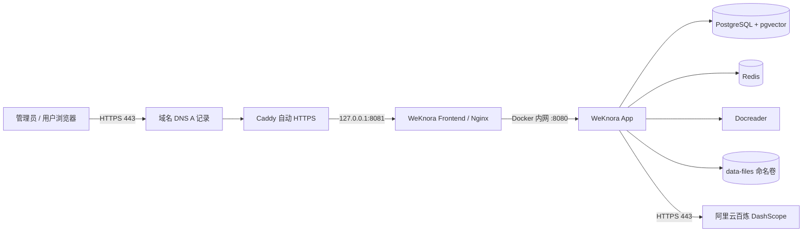

# WeKnora 阿里云 ECS + 通义千问部署全流程指南

> 文档类型：面向新手的生产部署操作手册  
> 部署基线：Tencent/WeKnora `v0.7.1`  
> 云服务器：阿里云 ECS，中国香港地域，Ubuntu 22.04 LTS，x86_64  
> AI 服务：阿里云百炼（DashScope）通义千问  
> 最后核验：2026-07-29（Asia/Shanghai）

本指南从阿里云账号注册开始，一直完成 ECS 创建、Linux 加固、Docker 安装、WeKnora 部署、域名 HTTPS、千问模型接入、知识库问答验收、备份恢复和升级回滚。照做后，公网只暴露 `80/443`，SSH `22` 仅允许管理员 IP；数据库、Redis、Docreader 和 WeKnora 后端端口不直接暴露到公网。

> **重要边界**：本指南不会要求你把账号密码、API Key、私钥或支付信息发送给任何人。价格、库存、控制台文案和模型配额会变化；付费前必须在订单页再次确认地域、规格、带宽和金额。

---

## 目录

- [0. 完成标准与使用方式](#0-完成标准与使用方式)
- [1. 架构、规格与材料清单](#1-架构规格与材料清单)
- [2. 注册并加固阿里云账号](#2-注册并加固阿里云账号)
- [3. 开通百炼并取得 API Key](#3-开通百炼并取得-api-key)
- [4. 创建阿里云 ECS 虚拟机](#4-创建阿里云-ecs-虚拟机)
- [5. SSH 登录与 Linux 安全初始化](#5-ssh-登录与-linux-安全初始化)
- [6. 安装 Docker Engine 与 Compose](#6-安装-docker-engine-与-compose)
- [7. 部署 WeKnora v0.7.1](#7-部署-weknora-v071)
- [8. 配置域名与 Caddy HTTPS](#8-配置域名与-caddy-https)
- [9. 在 WeKnora 接入通义千问](#9-在-weknora-接入通义千问)
- [10. 创建知识库并完成端到端验收](#10-创建知识库并完成端到端验收)
- [11. 日常运维与安全检查](#11-日常运维与安全检查)
- [12. 备份与恢复](#12-备份与恢复)
- [13. 升级与回滚](#13-升级与回滚)
- [14. 常见故障排查](#14-常见故障排查)
- [15. 最终验收清单](#15-最终验收清单)
- [附录 A：大陆地域与 ICP 备案](#附录-a大陆地域与-icp-备案)
- [附录 B：关键命令速查](#附录-b关键命令速查)
- [参考资料](#参考资料)

---

## 0. 完成标准与使用方式

### 0.1 最终完成标准

全部完成时，应同时满足：

- 浏览器访问 `https://kb.example.com` 能看到 WeKnora 登录页，HTTP 会自动跳转 HTTPS。
- `docker compose ps` 中核心容器处于 `running`/`healthy` 状态。
- 服务器执行 `curl -fsS http://127.0.0.1:8080/health` 返回成功。
- WeKnora 中的 `qwen-plus`、`text-embedding-v3`、Rerank 模型分别通过连接测试。
- 测试文档能完成解析、切片、向量化，提问后能得到正确答案和引用来源。
- 公网只开放 `80/443`；`22` 仅允许你的固定公网 IP；`8080/8081/5432/6379/50051` 未开放公网。
- 已生成至少一份数据库和文件卷备份，并把 `.env`、`SYSTEM_AES_KEY` 做了加密异地保存。

### 0.2 文中的占位符

看到以下内容时，要替换为自己的实际值，不要连尖括号一起复制：

| 占位符 | 示例 | 含义 |
|---|---|---|
| `<ECS_PUBLIC_IP>` | `47.88.10.20` | ECS 公网 IPv4 |
| `<ADMIN_PUBLIC_IP>` | `203.0.113.10` | 你当前电脑出口公网 IP |
| `<DOMAIN>` | `kb.example.com` | WeKnora 使用的完整域名 |
| `<KEY_PATH>` | `~/Downloads/weknora-hk-prod.pem` | 本机保存的 SSH 私钥路径 |
| `<NEW_VERSION>` | `v0.7.2` | 准备升级到的稳定 Tag |

> **安全提示**：文中的 `example.com`、`203.0.113.0/24` 均是示例地址，不可用于实际部署。

### 0.3 操作顺序

不要跳过验收点。尤其不要在密钥登录尚未验证时禁用 root/密码登录，也不要在首个 WeKnora 账号尚未注册时设置 `DISABLE_REGISTRATION=true`。

---

## 1. 架构、规格与材料清单

### 1.1 部署架构



数据流说明：

- 用户只访问 Caddy 的 `80/443`。
- Caddy 只把请求转发到本机回环地址 `127.0.0.1:8081`。
- Frontend 容器再通过 Docker 内部网络访问 App。
- PostgreSQL、Redis、Docreader 没有公网映射端口。
- 文档原文件默认存放在 Docker 命名卷 `weknora_data-files`，向量和业务数据存放在 PostgreSQL。
- 模型推理由阿里云百炼完成，ECS 不需要 GPU，也不运行 Ollama。

### 1.2 推荐规格

| 项目 | 本指南填写值 | 说明 |
|---|---|---|
| 地域 | 中国（香港） | 无需中国大陆 ICP 备案即可使用域名上线；跨境网络质量需实测 |
| 架构 | x86_64 / amd64 | 兼容性最稳妥；官方镜像同时支持 amd64 与 arm64 |
| 操作系统 | Ubuntu 22.04 LTS 64 位 | Docker 官方支持，生命周期稳定 |
| CPU / 内存 | 4 vCPU / 8 GiB | 个人或少量用户的起步规格 |
| 推荐升级 | 4 vCPU / 16 GiB | 大 PDF、并发解析、多人使用时更稳 |
| 系统盘 | 80 GiB ESSD | 不建议低于 50 GiB；文档多时应扩容或使用对象存储 |
| 公网带宽 | 按流量计费，峰值 5 Mbps 起 | 上传大文档时可临时提高；确认跨境流量费用 |
| GPU | 不需要 | 使用百炼远程 API |
| Swap | 4 GiB | 只用于缓冲峰值，不能代替内存 |

> 不建议选择 1 核 1 GB、2 核 2 GB 或共享突发型低配实例。文档解析、PostgreSQL 和容器并发容易触发 OOM。

### 1.3 开始前准备

- 可接收短信和邮件的手机号、邮箱。
- 用于实名认证的个人身份证或企业资料。
- 可用于云资源付款的支付方式。
- 一个域名；若暂时没有，可先用 SSH 隧道完成内网验收。
- 密码管理器，用于保存云账号、SSH 私钥说明和恢复信息。
- Windows 11 PowerShell/WSL，或 macOS Terminal。
- 当前电脑的公网出口 IP。可在搜索引擎搜索“我的 IP”获得；企业网络如会变化，应先确认固定出口。
- 一个不会包含生产秘密的本地备份目录。

### 1.4 成本控制原则

1. 初次验证可选按量付费，跑通后再决定是否转包年包月。
2. 创建 ECS 前在订单确认页检查实例费、磁盘费、公网流量费和快照费。
3. 设置月度预算与阈值提醒；按量 ECS 停机不一定停止系统盘和公网 IP 费用。
4. 百炼按模型和 Token 计费，创建 API Key 后仍需监控余额与调用量。
5. 不要为了排障反复创建未释放的 ECS、磁盘、快照或 EIP。

---

## 2. 注册并加固阿里云账号

### 2.1 注册账号

**目的**：获得可购买 ECS、开通百炼的阿里云主账号。

**控制台路径**：打开 [阿里云官网](https://www.aliyun.com/) → 右上角“注册”。

**操作**：

1. 选择手机号或邮箱注册。
2. 填写验证码并设置高强度密码；不要与其他网站复用。
3. 登录后打开“账号中心”，确认手机和邮箱均已绑定。
4. 将账号 UID、注册邮箱和紧急联系人记录到密码管理器，不记录登录密码明文。

**预期结果**：能进入阿里云控制台首页，右上角能看到账号信息。

**验收**：退出后重新登录一次，确认短信/邮箱验证通畅。

**常见错误**：

- 收不到验证码：检查拦截、国家区号、发送频率；等待后再试，不要连续点击。
- 邮箱已注册：使用“找回密码”，不要重复创建主账号。
- 企业后续需要统一开票：优先用企业主体实名认证，避免资源迁移。

### 2.2 完成实名认证

**目的**：满足中国云服务的合规和购买要求。

**控制台路径**：头像 → 账号中心 → 实名认证。

**填写值**：

- 个人使用：选择个人实名认证，按页面完成身份验证。
- 企业使用：选择企业实名认证，准备营业执照、法定代表人/管理员信息和企业付款资料。

**预期结果**：账号中心显示“已实名认证”。

**验收**：进入 ECS 购买页，地域和实例规格可正常选择。

**常见错误**：证件姓名、证件号、银行卡/企业资料必须一致；审核中不要重复提交不同资料。

### 2.3 开启 MFA

**目的**：即使密码泄露，也降低主账号被接管的风险。

**控制台路径**：账号中心 → 安全设置 → 虚拟 MFA/多因素认证。

**操作**：

1. 使用可信的身份验证器扫描二维码。
2. 连续输入页面要求的动态验证码完成绑定。
3. 把恢复方式保存在密码管理器或离线安全介质中。
4. 退出后重新登录，确认会要求第二因素。

**验收**：登录事件中显示 MFA 验证成功。

**常见错误**：验证码总是错误时，先将手机时间设为自动同步。

### 2.4 设置安全联系人和费用预警

**目的**：及时收到资源异常、欠费、攻击和预算超限通知。

**控制台路径**：

- 账号中心 → 安全设置/安全联系人。
- 费用与成本 → 预算管理或费用预警。

**建议设置**：

- 安全、故障、欠费通知同时发送到手机和邮箱。
- 月度预算设为你可接受的上限。
- 50%、80%、100% 三档预算提醒。
- 余额不足提醒和按量资源异常增长提醒。

**验收**：联系人状态已验证，预算规则显示“启用”。

> 控制台菜单会调整。若找不到，使用控制台顶部搜索框搜索“安全设置”“预算管理”“余额预警”。

### 2.5 推荐：创建日常管理 RAM 用户

主账号只用于实名、付款和账号级安全。日常管理可创建 RAM 用户并启用 MFA，只授予 ECS、云监控、百炼等必要权限。个人试用可暂时使用主账号，但不要在不可信设备保存登录状态。

---

## 3. 开通百炼并取得 API Key

### 3.1 开通百炼 Model Studio

**目的**：让 WeKnora 调用千问对话、向量化和重排模型。

**控制台路径**：控制台顶部搜索“百炼”或“Model Studio” → 进入百炼控制台 → 按页面开通服务并同意协议。

**操作**：

1. 确认当前登录的是准备付费的正确账号。
2. 选择中国大陆百炼业务空间。本指南使用中国站 API 地址。
3. 在模型列表确认至少可使用 `qwen-plus` 和 `text-embedding-v3`。
4. 搜索 `qwen3-rerank`；若当前业务空间未开放，记录 `gte-rerank` 作为回退。
5. 查看免费额度、计费单价、并发限制和欠费策略。

**预期结果**：能进入模型广场/模型体验页面并发起一次测试对话。

**常见错误**：国际站、美国、新加坡和中国站的 API Key、模型可用性和端点不完全相同，不要混用。

### 3.2 创建 API Key

**控制台路径**：百炼控制台 → API Key 管理 → 创建 API Key。

**填写值**：

- 名称：`weknora-prod`
- 业务空间：选择刚才确认的中国站业务空间。
- 权限：仅选择 WeKnora 要使用的模型/业务空间；若控制台不支持细分，至少单独为 WeKnora 建 Key。

**操作**：

1. 点击创建。
2. 只复制一次完整 API Key，存入密码管理器。
3. 不要把 Key 写入本指南、聊天记录、Git 仓库或截图。
4. 记录创建日期和用途，便于轮换。

**预期结果**：API Key 列表出现 `weknora-prod`，页面只显示掩码。

### 3.3 从 ECS 外先测试对话接口

在可信的 macOS/Linux Terminal 或 Windows WSL 中执行。`read -s` 可避免 Key 出现在屏幕和 shell 历史中：

```bash
read -rsp "请输入 DashScope API Key: " WEKNORA_DASHSCOPE_API_KEY
echo

curl -sS https://dashscope.aliyuncs.com/compatible-mode/v1/chat/completions \
  -H "Authorization: Bearer ${WEKNORA_DASHSCOPE_API_KEY}" \
  -H "Content-Type: application/json" \
  -d '{
    "model": "qwen-plus",
    "messages": [
      {"role": "user", "content": "只回复：WeKnora 模型连通成功"}
    ]
  }'

unset WEKNORA_DASHSCOPE_API_KEY
```

**预期结果**：JSON 中包含 `choices`，回复文本为“WeKnora 模型连通成功”或等价内容。

**验收**：HTTP 状态为 200，响应中没有 `InvalidApiKey`、`Arrearage`、`ModelNotFound`。

**错误解释**：

| 现象 | 常见原因 | 处理 |
|---|---|---|
| HTTP 401 / InvalidApiKey | Key 错误、已删除、业务空间不一致 | 重新复制正确 Key，确认所属业务空间 |
| Arrearage / 欠费 | 余额不足或服务停用 | 充值并等待服务恢复 |
| ModelNotFound | 模型名错误或地域未开通 | 在百炼模型列表确认精确模型 ID |
| HTTP 429 | 并发或速率超限 | 降低并发、等待重试或申请更高配额 |
| 连接超时 | 本地网络/DNS/代理问题 | 换网络或稍后在 ECS 上重试 |

### 3.4 设置模型费用提醒

在百炼用量/账单页面确认 Token 用量可见，并在费用中心设置余额和预算提醒。生产环境不要依赖“免费额度一直存在”。

---

## 4. 创建阿里云 ECS 虚拟机

### 4.1 进入创建页面

**控制台路径**：阿里云控制台 → 云服务器 ECS → 实例 → 创建实例 → 自定义购买。

先把页面切换到“自定义购买”，不要使用不了解参数的一键套餐。

### 4.2 基础配置逐字段填写

| 控制台字段 | 本指南填写值 | 注意事项 |
|---|---|---|
| 付费类型 | 按量付费 | 先验证；长期运行可比较包年包月价格 |
| 地域 | 中国（香港） | 创建后不能直接更换地域 |
| 可用区 | 库存充足的任一区 | 单机部署无需跨可用区 |
| 实例规格 | x86，4 vCPU，8 GiB | 避免共享突发低配；重负载选 4 vCPU/16 GiB |
| 镜像 | Ubuntu 22.04 64 位 | 不选 Windows，不选桌面镜像 |
| 系统盘 | ESSD 80 GiB | 文档多时预留扩容空间 |
| 实例名称 | `weknora-hk-01` | 便于识别环境与地域 |
| 主机名 | `weknora-hk-01` | 只用字母、数字、短横线 |

**验收**：订单概要显示 Linux、Ubuntu 22.04、x86、4 核 8 GB、80 GB、中国香港。

### 4.3 网络与公网配置

**VPC/VSwitch**：

1. 没有现成网络时，使用控制台创建默认 VPC 和同地域交换机。
2. 网段可保持控制台建议值，例如 VPC `172.16.0.0/16`、交换机 `172.16.0.0/24`。
3. 不要与将来需要打通的公司内网网段冲突。

**公网 IP**：

- 勾选“分配公网 IPv4 地址”。
- 初期可选按使用流量计费，带宽峰值 5 Mbps。
- 明确查看香港地域公网流量单价。
- 若业务要求固定、可迁移的地址，可改用 EIP；本指南默认使用实例公网 IP。

**验收**：订单概要明确写出“分配公网 IPv4”。

### 4.4 创建 SSH 密钥对

**控制台路径**：ECS 控制台 → 网络与安全/密钥对 → 创建密钥对；也可在实例购买页创建。

**填写值**：密钥对名称 `weknora-hk-prod`。

**操作**：

1. 选择自动新建密钥对并下载私钥。
2. 将私钥保存到密码管理器附件或本地加密磁盘；不要通过微信、邮件明文发送。
3. 私钥只应由管理员持有，不上传 GitHub。
4. 在订单中把该密钥对绑定到新实例。

**预期结果**：本地获得 `.pem` 文件，控制台只保留公钥。

**常见错误**：私钥丢失不能从云端重新下载；可以绑定新密钥或通过控制台救援，但会增加恢复复杂度。

### 4.5 创建最小权限安全组

安全组相当于云端第一层防火墙。先查到 `<ADMIN_PUBLIC_IP>`，然后添加：

| 方向 | 协议 | 端口 | 授权对象 | 用途 |
|---|---|---|---|---|
| 入方向 | TCP | 22 | `<ADMIN_PUBLIC_IP>/32` | SSH，仅管理员 IP |
| 入方向 | TCP | 80 | `0.0.0.0/0` | HTTP 和证书签发 |
| 入方向 | TCP | 443 | `0.0.0.0/0` | HTTPS |
| 出方向 | 全部或 TCP 443 + DNS/NTP | 按实际 | `0.0.0.0/0` | 拉镜像、系统更新、百炼 API |

**明确不要添加的公网入方向端口**：`8080`、`8081`、`5432`、`6379`、`50051`、`9000`、`9001`。

如果启用了 IPv6，再按相同原则单独配置 IPv6 规则；不使用 IPv6 就不要开放 `::/0`。

**验收**：安全组入方向列表只有预期规则，22 的来源不是 `0.0.0.0/0`。

### 4.6 下单前复核与创建

下单前逐项确认：

- [ ] 地域是中国（香港），不是华东、华北或新加坡。
- [ ] Ubuntu 22.04 64 位，x86 架构。
- [ ] 4 核 8 GB，80 GB ESSD。
- [ ] 已分配公网 IPv4。
- [ ] 已绑定 `weknora-hk-prod` 密钥对。
- [ ] 安全组未开放数据库和应用内部端口。
- [ ] 已理解实例、磁盘、公网流量和快照费用。

创建后等待实例状态变为“运行中”，记录公网 IP，但不要把私钥和 IP 一起公开发布。

---

## 5. SSH 登录与 Linux 安全初始化

### 5.1 本地修正私钥权限

macOS/Linux/WSL：

```bash
chmod 600 <KEY_PATH>
```

Windows PowerShell 使用 OpenSSH 时，如果提示私钥权限过宽，可把私钥移动到当前用户 `.ssh` 目录，并在文件属性 → 安全中只保留当前用户读取权限。

### 5.2 首次 SSH 登录

阿里云 Ubuntu 镜像通常可使用 `root` 作为初始用户；若购买页给出其他用户名，以实例“远程连接”页面提示为准。

macOS/Linux/WSL/PowerShell：

```bash
ssh -i <KEY_PATH> root@<ECS_PUBLIC_IP>
```

首次连接会询问主机指纹：

1. 在 ECS 控制台核对目标公网 IP。
2. 确认无误后输入 `yes`。
3. 登录后执行：

```bash
hostnamectl
cat /etc/os-release
uname -m
```

**预期结果**：系统为 Ubuntu 22.04，架构输出 `x86_64`。

**常见错误**：

- `Permission denied (publickey)`：用户名、私钥或密钥绑定错误。
- `Connection timed out`：安全组 22 来源 IP 不对，或本地网络禁止 SSH。
- `REMOTE HOST IDENTIFICATION HAS CHANGED`：先确认实例是否重建；不要直接忽略中间人风险。

### 5.3 创建非 root 管理用户

在 root 会话执行：

```bash
adduser --disabled-password --gecos "" weknora-admin
usermod -aG sudo weknora-admin

install -d -m 700 -o weknora-admin -g weknora-admin /home/weknora-admin/.ssh
cp /root/.ssh/authorized_keys /home/weknora-admin/.ssh/authorized_keys
chown weknora-admin:weknora-admin /home/weknora-admin/.ssh/authorized_keys
chmod 600 /home/weknora-admin/.ssh/authorized_keys
```

保持 root 窗口不要关闭，在本机另开一个终端测试：

```bash
ssh -i <KEY_PATH> weknora-admin@<ECS_PUBLIC_IP>
sudo -v
```

**验收**：新用户能登录，`sudo -v` 成功。只有此项成功后才能继续禁用 root 登录。

### 5.4 禁用 root 和密码 SSH 登录

在 `weknora-admin` 会话执行：

```bash
sudo nano /etc/ssh/sshd_config.d/99-weknora-hardening.conf
```

填入：

```text
PermitRootLogin no
PasswordAuthentication no
KbdInteractiveAuthentication no
PubkeyAuthentication yes
```

先检查语法，再平滑重载：

```bash
sudo sshd -t
sudo systemctl reload ssh
```

再开第三个终端重新登录验证。确认成功前，不要关闭已有可用会话。

### 5.5 更新系统和安装基础工具

```bash
sudo apt update
sudo DEBIAN_FRONTEND=noninteractive apt full-upgrade -y
sudo apt install -y ca-certificates curl git jq vim nano htop ufw fail2ban \
  unzip gnupg debian-keyring debian-archive-keyring apt-transport-https dnsutils

sudo timedatectl set-timezone Asia/Shanghai
timedatectl
```

如升级提示需要重启：

```bash
sudo reboot
```

等待约 1 分钟后重新 SSH 登录。

### 5.6 配置 UFW 系统防火墙

UFW 是实例内部第二层防火墙。先替换管理员 IP：

```bash
sudo ufw default deny incoming
sudo ufw default allow outgoing
sudo ufw allow from <ADMIN_PUBLIC_IP>/32 to any port 22 proto tcp
sudo ufw allow 80/tcp
sudo ufw allow 443/tcp
sudo ufw --force enable
sudo ufw status verbose
```

**预期结果**：22 只允许 `<ADMIN_PUBLIC_IP>/32`，80/443 对公网开放。

> 如果管理员公网 IP 经常变化，先更新阿里云安全组和 UFW，再断开当前 SSH。不要为了省事把 22 永久开放到 `0.0.0.0/0`。

### 5.7 配置 Fail2ban

```bash
sudo nano /etc/fail2ban/jail.d/sshd.local
```

填入：

```ini
[sshd]
enabled = true
port = ssh
maxretry = 5
findtime = 10m
bantime = 1h
```

启用并检查：

```bash
sudo systemctl enable --now fail2ban
sudo fail2ban-client status sshd
```

### 5.8 创建 4 GB Swap

先确认当前没有 Swap：

```bash
swapon --show
free -h
```

创建并持久化：

```bash
sudo fallocate -l 4G /swapfile
sudo chmod 600 /swapfile
sudo mkswap /swapfile
sudo swapon /swapfile
grep -q '^/swapfile ' /etc/fstab || echo '/swapfile none swap sw 0 0' | sudo tee -a /etc/fstab

echo 'vm.swappiness=10' | sudo tee /etc/sysctl.d/99-weknora.conf
sudo sysctl --system

swapon --show
free -h
```

**预期结果**：Swap 显示约 4 GiB。Swap 频繁增长说明内存不足，应升级实例，而不是继续扩大 Swap。

### 5.9 检查磁盘

```bash
lsblk
df -hT
```

根文件系统应接近 80 GB；如果系统盘已扩容但文件系统未变大，请使用阿里云控制台给出的扩容指引，不要盲目执行分区命令。

---

## 6. 安装 Docker Engine 与 Compose

### 6.1 使用 Docker 官方仓库安装

移除可能冲突的旧包：

```bash
for WEKNORA_DOCKER_PKG in docker.io docker-doc docker-compose podman-docker containerd runc; do
  sudo apt remove -y "${WEKNORA_DOCKER_PKG}" 2>/dev/null || true
done
```

添加 Docker 官方 APT 仓库：

```bash
sudo install -m 0755 -d /etc/apt/keyrings
sudo curl -fsSL https://download.docker.com/linux/ubuntu/gpg \
  -o /etc/apt/keyrings/docker.asc
sudo chmod a+r /etc/apt/keyrings/docker.asc

. /etc/os-release
echo "deb [arch=$(dpkg --print-architecture) signed-by=/etc/apt/keyrings/docker.asc] https://download.docker.com/linux/ubuntu ${VERSION_CODENAME} stable" \
  | sudo tee /etc/apt/sources.list.d/docker.list >/dev/null

sudo apt update
sudo apt install -y docker-ce docker-ce-cli containerd.io \
  docker-buildx-plugin docker-compose-plugin
```

启用服务：

```bash
sudo systemctl enable --now docker
sudo systemctl status docker --no-pager
```

### 6.2 配置 Docker 日志轮转

在部署容器前创建配置：

```bash
sudo nano /etc/docker/daemon.json
```

填入：

```json
{
  "log-driver": "json-file",
  "log-opts": {
    "max-size": "10m",
    "max-file": "5"
  }
}
```

检查 JSON 并重启：

```bash
jq . /etc/docker/daemon.json
sudo systemctl restart docker
```

### 6.3 允许管理用户运行 Docker

```bash
sudo usermod -aG docker weknora-admin
```

退出 SSH 并重新登录，然后验证：

```bash
docker version
docker compose version
docker run --rm hello-world
```

**预期结果**：客户端和服务端版本均能显示，Compose 为 v2，`hello-world` 正常退出。

> `docker` 组近似 root 权限。只把可信管理员加入该组。

---

## 7. 部署 WeKnora v0.7.1

### 7.1 创建部署目录并克隆稳定 Tag

```bash
sudo install -d -m 750 -o weknora-admin -g weknora-admin /opt/weknora
cd /opt/weknora

git clone --branch v0.7.1 --depth 1 https://github.com/Tencent/WeKnora.git
cd /opt/weknora/WeKnora

git describe --tags --always
git status --short
```

**预期结果**：版本输出 `v0.7.1`，工作区没有异常修改。

### 7.2 创建生产密钥文件

先把终端默认权限收紧，再生成随机值：

```bash
umask 077
WEKNORA_SECRET_FILE=/opt/weknora/weknora-secrets.txt

{
  echo "DB_PASSWORD=$(openssl rand -hex 24)"
  echo "REDIS_PASSWORD=$(openssl rand -hex 24)"
  echo "JWT_SECRET=$(openssl rand -hex 32)"
  echo "SYSTEM_AES_KEY=$(openssl rand -hex 16)"
} > "${WEKNORA_SECRET_FILE}"

chmod 600 "${WEKNORA_SECRET_FILE}"
ls -l "${WEKNORA_SECRET_FILE}"
awk -F= '{print $1 "=<已生成，长度=" length($2) ">"}' "${WEKNORA_SECRET_FILE}"
```

**预期结果**：前三项为足够长的随机值，`SYSTEM_AES_KEY` 的值长度严格为 32 个 ASCII 字符。

**安全要求**：

- 不要把 `weknora-secrets.txt` 上传 Git。
- `SYSTEM_AES_KEY` 丢失后，数据库中已加密的模型 API Key 等凭据无法解密。
- 把该文件和 `.env` 加密备份到独立位置。

### 7.3 创建并编辑 `.env`

```bash
cd /opt/weknora/WeKnora
cp .env.example .env
chmod 600 .env
nano .env
```

把下面配置写入或覆盖同名项。密码值从 `/opt/weknora/weknora-secrets.txt` 逐项复制；不要复制 `<从安全文件复制>` 文字。

```dotenv
# 固定部署版本和 Compose 项目名
COMPOSE_PROJECT_NAME=weknora
WEKNORA_VERSION=v0.7.1

# 生产运行时
GIN_MODE=release
LOG_LEVEL=info
TZ=Asia/Shanghai
WEKNORA_LANGUAGE=zh-CN
AUTO_MIGRATE=true

# 只绑定本机回环地址；公网由 Caddy 统一代理
APP_PORT=127.0.0.1:8080
FRONTEND_PORT=127.0.0.1:8081
APP_HOST=app
APP_BACKEND_PORT=8080
APP_SCHEME=http
FRONTEND_BASE_URL=https://<DOMAIN>
APP_EXTERNAL_URL=https://<DOMAIN>

# PostgreSQL
DB_DRIVER=postgres
DB_HOST=postgres
DB_PORT=5432
DB_USER=postgres
DB_PASSWORD=<从安全文件复制>
DB_NAME=WeKnora

# Redis
STREAM_MANAGER_TYPE=redis
REDIS_ADDR=redis:6379
REDIS_PASSWORD=<从安全文件复制>
REDIS_DB=0
REDIS_PREFIX=stream:

# 默认本地文件卷 + PostgreSQL/pgvector 检索
STORAGE_TYPE=local
LOCAL_STORAGE_BASE_DIR=/data/files
RETRIEVE_DRIVER=postgres
MAX_FILE_SIZE_MB=50

# 认证和敏感字段加密
JWT_SECRET=<从安全文件复制>
SYSTEM_AES_KEY=<从安全文件复制，必须恰好 32 个 ASCII 字符>

# 首次注册前保持 false；注册首个账号后改 true
DISABLE_REGISTRATION=false
WEKNORA_AUTH_DEFAULT_TENANT_MODE=create_personal
WEKNORA_TENANT_SELF_SERVICE_CREATION_ENABLED=false

# 不运行本地 Ollama；不阻断启动
OLLAMA_OPTIONAL=true
```

**检查重点**：

- 同一个变量只保留一个有效值；注释行不算有效值。
- `<DOMAIN>` 已替换为实际完整域名，例如 `kb.example.com`。
- 密码没有空格、引号或占位符。
- `SYSTEM_AES_KEY` 是 32 个字符，不是 32 字节二进制文件。
- 不把 DashScope API Key 写入 `.env`；稍后在模型管理界面录入。

执行安全检查，命令只显示键名和长度，不显示值：

```bash
cd /opt/weknora/WeKnora

grep -E '^(COMPOSE_PROJECT_NAME|WEKNORA_VERSION|GIN_MODE|APP_PORT|FRONTEND_PORT|STORAGE_TYPE|RETRIEVE_DRIVER|DISABLE_REGISTRATION)=' .env

awk -F= '/^SYSTEM_AES_KEY=/{print "SYSTEM_AES_KEY length=" length($2)}' .env

if grep -En '<DOMAIN>|<从安全文件复制>|your_|change-me' .env; then
  echo '发现未替换占位符，请修正后再继续'
else
  echo '未发现常见占位符'
fi
```

### 7.4 校验 Compose 配置

```bash
cd /opt/weknora/WeKnora
docker compose config --quiet
docker compose config --services
```

**预期结果**：第一条无输出且退出码为 0；服务列表包含核心服务。默认主线不启用 `minio`、`neo4j`、`langfuse` Profile。

若出现 `invalid port`，检查：

```dotenv
APP_PORT=127.0.0.1:8080
FRONTEND_PORT=127.0.0.1:8081
```

Compose 展开后应分别形成 `127.0.0.1:8080:8080` 和 `127.0.0.1:8081:80` 的端口映射。

### 7.5 拉取镜像并启动

```bash
cd /opt/weknora/WeKnora
docker compose pull
docker compose up -d
docker compose ps
```

首次启动需要拉取多个镜像并初始化数据库，耗时取决于网络和磁盘。不要在拉取过程中重复执行 `down -v`。

查看启动日志：

```bash
docker compose logs --tail=200 app
docker compose logs --tail=100 postgres
docker compose logs --tail=100 docreader
```

### 7.6 健康检查

等待约 60-120 秒后执行：

```bash
docker compose ps
curl -fsS http://127.0.0.1:8080/health
curl -I http://127.0.0.1:8081
```

**预期结果**：

- App 健康检查通过。
- `/health` 返回成功；本版本不要使用旧地址 `/api/health`。
- Frontend 返回 `HTTP/1.1 200` 或合理的重定向。

确认端口只绑定本地：

```bash
sudo ss -lntp | grep -E ':(80|443|8080|8081|5432|6379|50051)\b' || true
```

此时 Caddy 尚未安装，`8080/8081` 应显示 `127.0.0.1`；PostgreSQL、Redis、Docreader 不应出现在宿主机公网监听列表。

### 7.7 无域名时的安全临时访问

在本机执行 SSH 隧道，不需要开放 8081：

```bash
ssh -i <KEY_PATH> -L 8081:127.0.0.1:8081 weknora-admin@<ECS_PUBLIC_IP>
```

保持窗口运行，浏览器访问 `http://127.0.0.1:8081`。

> 该方式只用于初始化和排障。不要把 `FRONTEND_PORT` 改成公网 `8081` 并对所有 IP 开放。

---

## 8. 配置域名与 Caddy HTTPS

### 8.1 创建 DNS A 记录

**目的**：让 `<DOMAIN>` 指向 ECS 公网 IP。

**控制台路径**：域名 DNS 服务商 → DNS 解析 → 添加记录。

假设域名是 `example.com`，使用 `kb.example.com`：

| 字段 | 填写值 |
|---|---|
| 记录类型 | A |
| 主机记录 | `kb` |
| 记录值 | `<ECS_PUBLIC_IP>` |
| TTL | 600 秒或默认值 |

保存后在服务器或本机检查：

```bash
dig +short <DOMAIN>
```

**预期结果**：输出 ECS 公网 IPv4。若输出旧 IP，等待 TTL 或检查是否存在冲突记录。

### 8.2 安装 Caddy

在 ECS 执行：

```bash
sudo apt install -y debian-keyring debian-archive-keyring apt-transport-https curl gnupg

curl -1sLf 'https://dl.cloudsmith.io/public/caddy/stable/gpg.key' \
  | sudo gpg --dearmor -o /usr/share/keyrings/caddy-stable-archive-keyring.gpg

curl -1sLf 'https://dl.cloudsmith.io/public/caddy/stable/debian.deb.txt' \
  | sudo tee /etc/apt/sources.list.d/caddy-stable.list

sudo chmod o+r /usr/share/keyrings/caddy-stable-archive-keyring.gpg
sudo chmod o+r /etc/apt/sources.list.d/caddy-stable.list
sudo apt update
sudo apt install -y caddy
```

### 8.3 配置反向代理

```bash
sudo nano /etc/caddy/Caddyfile
```

填入并替换域名：

```caddyfile
<DOMAIN> {
    encode zstd gzip
    reverse_proxy 127.0.0.1:8081
}
```

检查并加载：

```bash
sudo caddy fmt --overwrite /etc/caddy/Caddyfile
sudo caddy validate --config /etc/caddy/Caddyfile
sudo systemctl enable --now caddy
sudo systemctl reload caddy
sudo systemctl status caddy --no-pager
```

### 8.4 验证 HTTPS

```bash
curl -I http://<DOMAIN>
curl -I https://<DOMAIN>
sudo journalctl -u caddy --since '10 minutes ago' --no-pager
```

**预期结果**：

- HTTP 返回 301/308 并跳转 HTTPS。
- HTTPS 返回 200 或应用正常重定向。
- 浏览器证书有效，域名匹配。
- Caddy 日志没有持续的证书申请失败。

**证书失败检查顺序**：

1. `dig +short <DOMAIN>` 是否等于 ECS 公网 IP。
2. 阿里云安全组和 UFW 是否都开放 80/443。
3. `sudo ss -lntp | grep -E ':(80|443)\b'` 是否由 Caddy 监听。
4. 是否存在 AAAA 记录指向错误 IPv6。
5. 域名是否被 CAA 记录限制了证书机构。

### 8.5 验证流式回答和上传

登录后上传一个小文件并发起对话，观察回答是否逐步输出。若普通页面正常但流式回答中断：

```bash
sudo journalctl -u caddy -f
docker compose -f /opt/weknora/WeKnora/docker-compose.yml logs -f frontend app
```

Caddy `reverse_proxy` 默认支持 WebSocket 和流式响应，通常不需要额外 Header 配置。上传上限由 `.env` 的 `MAX_FILE_SIZE_MB` 同步给应用、前端和 Docreader；修改后应重建相关容器。

---

## 9. 在 WeKnora 接入通义千问

### 9.1 首次注册工作区所有者

1. 浏览器打开 `https://<DOMAIN>`。
2. 点击注册，使用管理员邮箱创建第一个账号。
3. 创建个人空间/工作区，记录工作区名称。
4. 登录并确认能进入设置页面。

注册成功后立即关闭公开注册：

```bash
cd /opt/weknora/WeKnora
nano .env
```

将：

```dotenv
DISABLE_REGISTRATION=false
```

改为：

```dotenv
DISABLE_REGISTRATION=true
```

应用变更：

```bash
docker compose up -d --force-recreate app frontend
docker compose ps
```

在无痕浏览器打开注册页，确认新用户注册已被禁止；现有管理员仍可登录。

### 9.2 模型配置总表

| 用途 | WeKnora 类型 | Provider | 模型名 | Base URL | 关键参数 |
|---|---|---|---|---|---|
| 问答/Agent | KnowledgeQA | 阿里云 DashScope | `qwen-plus` | `https://dashscope.aliyuncs.com/compatible-mode/v1` | 远程模型 |
| 向量化 | Embedding | 阿里云 DashScope | `text-embedding-v3` | `https://dashscope.aliyuncs.com/compatible-mode/v1` | 维度 1024 |
| 重排 | Rerank | 阿里云 DashScope | `qwen3-rerank` | `https://dashscope.aliyuncs.com/api/v1/services/rerank/text-rerank/text-rerank` | 不可用时换 `gte-rerank` |
| 图片理解（可选） | VLLM | 阿里云 DashScope | `qwen-vl-plus` | `https://dashscope.aliyuncs.com/compatible-mode/v1` | 仅图片/多模态需要 |

> 不要把 Provider 选成 Generic。WeKnora v0.7.1 已内置“阿里云 DashScope”Provider，会为对话、文本 Embedding 和 Rerank 选择正确协议。

### 9.3 添加 `qwen-plus` 对话模型

**界面路径**：右上角头像/侧边栏设置 → 模型管理 → 新增模型。

**填写值**：

- 模型类型：知识问答/KnowledgeQA。
- 模型来源：远程/Remote。
- 服务商：阿里云 DashScope。
- 模型名称：`qwen-plus`。
- Base URL：`https://dashscope.aliyuncs.com/compatible-mode/v1`。
- API Key：粘贴百炼 `weknora-prod` Key。
- 描述：`千问生产对话模型`。

点击“测试连接/调试”。

**预期结果**：测试返回正常文本，无 401、404、429。

保存后将它设为默认问答模型，或在 Agent/知识库对话设置中明确选择。

### 9.4 添加 `text-embedding-v3`

**界面路径**：模型管理 → 新增模型。

**填写值**：

- 模型类型：Embedding。
- 模型来源：远程/Remote。
- 服务商：阿里云 DashScope。
- 模型名称：`text-embedding-v3`。
- Base URL：`https://dashscope.aliyuncs.com/compatible-mode/v1`。
- API Key：同一个百炼 Key。
- 向量维度：`1024`。
- 截断 Token：保持 `0` 或界面默认值，除非你清楚模型限制。

点击测试，输入一段中文文本。

**预期结果**：返回向量，维度检查为 1024。

> **不可变更规则**：知识库写入向量后，不要把同一知识库的 Embedding 模型或维度直接从 1024 改为其他值。需要变更时，新建知识库或清空并重建全部索引，否则会出现维度冲突、检索失败或结果异常。

### 9.5 添加 Rerank 模型

优先填写：

- 模型类型：Rerank。
- 模型来源：远程/Remote。
- 服务商：阿里云 DashScope。
- 模型名称：`qwen3-rerank`。
- Base URL：`https://dashscope.aliyuncs.com/api/v1/services/rerank/text-rerank/text-rerank`。
- API Key：百炼 Key。

点击测试。如果返回 `ModelNotFound` 或业务空间未开通，**只把模型名称**改为官方 API 示例兼容的：

```text
gte-rerank
```

Base URL 和 Provider 保持不变，再次测试。

### 9.6 可选：添加 `qwen-vl-plus`

只有需要识别图片内容、扫描件图像或多模态问答时才添加：

- 类型：VLLM/视觉模型。
- Provider：阿里云 DashScope。
- 模型名：`qwen-vl-plus`。
- Base URL：`https://dashscope.aliyuncs.com/compatible-mode/v1`。

视觉模型会增加费用和处理时间。纯文本 PDF/Word 的基本 RAG 验收不依赖它。

### 9.7 地域与端点规则

- 本指南假设 API Key 来自中国站百炼业务空间，因此使用 `dashscope.aliyuncs.com`。
- ECS 位于香港不代表必须用国际站端点；决定端点的是 API Key 和业务空间所属地域。
- 国际站 API Key 不要直接套用中国站地址；应按百炼官方“地域与 Base URL”表配置。
- Chat/文本 Embedding 使用 OpenAI 兼容 Base URL；Rerank 使用 DashScope 专用完整接口，两者不要互换。

---

## 10. 创建知识库并完成端到端验收

### 10.1 创建测试知识库

在 WeKnora 中进入“知识库” → 新建知识库：

| 字段 | 建议值 |
|---|---|
| 名称 | `部署验收知识库` |
| 类型 | 文档知识库 |
| Embedding | `text-embedding-v3` |
| 向量维度 | 1024 |
| 检索 | Dense + 关键词/系统默认混合检索 |
| Rerank | `qwen3-rerank` 或已通过测试的 `gte-rerank` |

创建后不要再修改 Embedding 维度。

### 10.2 制作一份答案唯一的测试文档

把以下内容保存为 Word 或 PDF，例如 `weknora-acceptance-test.docx`：

```text
WeKnora 部署验收说明

项目代号：蓝鲸-729。
验收负责人：林舟。
计划上线日期：2026 年 8 月 15 日。
故障升级邮箱：ops-example@example.com。

只有本文件中的信息用于本次检索验收。
```

上传到“部署验收知识库”。

**预期处理链路**：上传完成 → Docreader 解析 → 文本切片 → Embedding → 向量写入 → 状态变为已完成。

### 10.3 检查解析状态

在文档详情中确认：

- 能预览解析文本。
- “蓝鲸-729”“林舟”“2026 年 8 月 15 日”没有乱码。
- 切片数量大于 0。
- 没有停留在等待/处理中超过合理时间。

服务器侧排查命令：

```bash
cd /opt/weknora/WeKnora
docker compose logs --tail=200 docreader
docker compose logs --tail=200 app
docker compose ps
```

### 10.4 发起验收提问

在快速问答/知识库对话中只选择该测试知识库，依次询问：

1. `项目代号是什么？`
2. `验收负责人是谁，计划哪天上线？`
3. `故障升级邮箱是什么？请给出引用来源。`

**通过标准**：

- 回答分别包含“蓝鲸-729”“林舟”“2026 年 8 月 15 日”“ops-example@example.com”。
- 引用指向刚上传的测试文档和相关片段。
- Rerank 启用时没有模型错误。
- 百炼控制台用量统计出现对应调用。

**失败判断**：答案正确但无引用，也不算完整通过。先检查会话是否选中正确知识库、检索结果是否为空、对话策略是否关闭引用。

### 10.5 HTTPS 与重启验收

```bash
sudo systemctl restart caddy
cd /opt/weknora/WeKnora
docker compose restart

sleep 90
curl -fsS http://127.0.0.1:8080/health
curl -I https://<DOMAIN>
docker compose ps
```

重启后再次登录和提问，确认数据、用户、模型配置和知识库仍存在。

---

## 11. 日常运维与安全检查

### 11.1 每日/每周检查命令

```bash
cd /opt/weknora/WeKnora

docker compose ps
docker compose logs --since=24h --tail=300 app
docker stats --no-stream
df -hT
free -h
sudo ss -lntp
sudo ufw status verbose
sudo systemctl status caddy docker --no-pager
```

关注：

- 磁盘使用率超过 70% 时开始清理/扩容规划，超过 85% 视为紧急。
- 内存长期接近满且 Swap 持续使用时升级内存。
- App、PostgreSQL、Docreader 反复重启时先看日志，不要只执行重启。
- 百炼 401/429、余额不足和调用量突增。

### 11.2 端口基线

宿主机预期：

| 端口 | 绑定地址 | 是否公网 |
|---|---|---|
| 22 | `0.0.0.0:22` 或实例地址 | 仅安全组/UFW允许管理员 IP |
| 80 | Caddy | 是 |
| 443 | Caddy | 是 |
| 8080 | `127.0.0.1:8080` | 否 |
| 8081 | `127.0.0.1:8081` | 否 |
| 5432/6379/50051 | Docker 内网 | 否 |

如果 `ss` 显示 8080/8081 监听在 `0.0.0.0`，立即检查 `.env` 并重建容器。

### 11.3 日志与隐私

- 不在工单、群聊中粘贴完整 `.env`、API Key、JWT、数据库连接串。
- 提交日志前先搜索并遮盖 `Authorization`、`api_key`、邮箱和业务文档内容。
- 默认保持 `LLM_DEBUG_LOG=false`；生产排障临时开启后要及时关闭并清理敏感日志。
- Docker 日志轮转不能替代应用监控；至少配置阿里云主机 CPU、内存、磁盘告警。

### 11.4 账号和密钥轮换

- SSH 密钥：人员变更或怀疑泄露时立即替换 authorized_keys 和阿里云密钥对。
- DashScope API Key：新建 Key → 在 WeKnora 更新并测试 → 删除旧 Key。
- `JWT_SECRET`：轮换会使现有登录状态失效，应安排维护窗口。
- `SYSTEM_AES_KEY`：不能直接随意更换；必须按照应用支持的密钥迁移方式执行，否则已加密凭据无法解密。

---

## 12. 备份与恢复

### 12.1 必须备份的内容

| 内容 | 位置/方式 | 丢失影响 |
|---|---|---|
| PostgreSQL | `pg_dump` | 用户、工作区、知识库、向量、模型配置等丢失 |
| 原始文件 | `weknora_data-files` 卷 | 上传文档和本地存储文件丢失 |
| `.env` | `/opt/weknora/WeKnora/.env` | 部署参数和连接凭据丢失 |
| 安全文件 | `/opt/weknora/weknora-secrets.txt` | 无法完整重建同一部署 |
| `SYSTEM_AES_KEY` | `.env` 和安全文件 | 已加密 API Key 无法解密 |
| Caddy 配置 | `/etc/caddy/Caddyfile` | 域名代理需重建 |

> 备份中含高敏感凭据。异地保存前必须加密，且不要与解密密码放在同一位置。

### 12.2 创建一次完整备份

创建目录：

```bash
sudo install -d -m 700 -o weknora-admin -g weknora-admin /opt/weknora/backups
WEKNORA_BACKUP_STAMP=$(date +%Y%m%d-%H%M%S)
WEKNORA_BACKUP_DIR="/opt/weknora/backups/${WEKNORA_BACKUP_STAMP}"
install -d -m 700 "${WEKNORA_BACKUP_DIR}"
```

加载 `.env` 并备份 PostgreSQL：

```bash
cd /opt/weknora/WeKnora
set -a
. ./.env
set +a

docker compose exec -T postgres \
  pg_dump -U "${DB_USER}" -d "${DB_NAME}" --format=custom \
  > "${WEKNORA_BACKUP_DIR}/postgres.dump"
```

备份本地文件卷：

```bash
docker run --rm \
  -v weknora_data-files:/source:ro \
  -v "${WEKNORA_BACKUP_DIR}":/backup \
  alpine:3.20 \
  sh -c 'tar -czf /backup/data-files.tar.gz -C /source .'
```

备份配置并生成校验值：

```bash
install -m 600 /opt/weknora/WeKnora/.env "${WEKNORA_BACKUP_DIR}/.env"
install -m 600 /opt/weknora/weknora-secrets.txt "${WEKNORA_BACKUP_DIR}/weknora-secrets.txt"
sudo cat /etc/caddy/Caddyfile > "${WEKNORA_BACKUP_DIR}/Caddyfile"
chmod 600 "${WEKNORA_BACKUP_DIR}/Caddyfile"

cd "${WEKNORA_BACKUP_DIR}"
sha256sum postgres.dump data-files.tar.gz .env weknora-secrets.txt Caddyfile \
  > SHA256SUMS
sha256sum -c SHA256SUMS
ls -lh
```

**通过标准**：`postgres.dump` 和 `data-files.tar.gz` 非空，`sha256sum -c` 全部显示 `OK`。

### 12.3 异地备份

至少保留：

- ECS 本机最近一份，便于快速恢复。
- 另一个云/本地加密盘一份，防止 ECS 和磁盘同时丢失。
- 关键变更前一份，例如升级、换模型维度、批量删除知识库之前。

不要把包含 `.env`、API Key 和 `SYSTEM_AES_KEY` 的目录直接同步到公开网盘或 Git 仓库。可使用组织批准的加密备份工具。

### 12.4 恢复前的强制检查

恢复会覆盖当前数据。先完成：

1. 为当前状态再做一份备份。
2. 确认恢复目录和时间戳。
3. 执行 `sha256sum -c SHA256SUMS`。
4. 确认 `.env` 中的 `SYSTEM_AES_KEY` 与备份数据库匹配。
5. 确认目标 Docker 卷确实是 `weknora_data-files`，不是其他项目卷。

设置恢复目录：

```bash
WEKNORA_RESTORE_DIR=/opt/weknora/backups/<BACKUP_TIMESTAMP>
cd "${WEKNORA_RESTORE_DIR}"
sha256sum -c SHA256SUMS
```

### 12.5 恢复 PostgreSQL

停止会访问数据库的应用容器：

```bash
cd /opt/weknora/WeKnora
docker compose stop frontend app docreader
docker compose up -d postgres redis
```

加载当前连接参数并恢复：

```bash
set -a
. ./.env
set +a

docker compose exec -T postgres \
  pg_restore -U "${DB_USER}" -d "${DB_NAME}" --clean --if-exists \
  < "${WEKNORA_RESTORE_DIR}/postgres.dump"
```

`--clean` 会删除备份中对应的现有数据库对象。这是恢复操作，执行前必须已经备份当前状态。

### 12.6 恢复 `data-files` 卷

先核对卷：

```bash
docker volume inspect weknora_data-files
```

确认无误后清空该卷并解压备份：

```bash
docker run --rm \
  -v weknora_data-files:/target \
  -v "${WEKNORA_RESTORE_DIR}":/backup:ro \
  alpine:3.20 \
  sh -c 'find /target -mindepth 1 -maxdepth 1 -exec rm -rf -- {} + && tar -xzf /backup/data-files.tar.gz -C /target'
```

该命令会删除目标卷当前内容，只能在卷名和备份均已核对后执行。

### 12.7 恢复后验收

```bash
cd /opt/weknora/WeKnora
docker compose up -d
sleep 90
docker compose ps
curl -fsS http://127.0.0.1:8080/health
```

登录 WeKnora，检查用户、模型、知识库、原文件、检索和引用。若模型 API Key 显示为空或无法解密，优先检查 `SYSTEM_AES_KEY` 是否与备份一致。

---

## 13. 升级与回滚

### 13.1 升级原则

- 只升级到官方稳定 Tag，不在生产使用 `main`。
- 先读目标版本 CHANGELOG 和升级说明。
- 先备份数据库、文件卷、`.env`、`SYSTEM_AES_KEY`。
- 数据库迁移可能不可逆；Git 回退不等于数据库已回退。
- 预留维护窗口，升级后完整执行第 10 节验收。

### 13.2 升级步骤

```bash
cd /opt/weknora/WeKnora
git status --short
git fetch --tags
git tag --list 'v*' --sort=-version:refname | head
```

工作区有未知修改时先审查，不要使用 `git reset --hard`。完成备份后：

```bash
git checkout <NEW_VERSION>
nano .env
```

把 `WEKNORA_VERSION` 改为同一个 `<NEW_VERSION>`，然后：

```bash
docker compose config --quiet
docker compose pull
docker compose up -d
docker compose ps
docker compose logs --tail=200 app
curl -fsS http://127.0.0.1:8080/health
```

对比新版本 `.env.example`，只按发布说明补充必要变量，不要覆盖原 `.env` 和密钥。

### 13.3 回滚步骤

如果只是镜像启动错误且数据库未发生不兼容迁移，可切回旧 Tag 和旧 `WEKNORA_VERSION` 再启动。

如果已经执行数据库迁移或出现数据异常：

1. 停止应用。
2. 切回旧 Git Tag 与镜像 Tag。
3. 按第 12 节恢复升级前数据库和文件卷备份。
4. 恢复与该备份匹配的 `.env` 和 `SYSTEM_AES_KEY`。
5. 重新执行端到端验收。

---

## 14. 常见故障排查

### 14.1 快速诊断顺序

先执行以下只读检查，不要一上来删除容器或卷：

```bash
cd /opt/weknora/WeKnora
docker compose ps
docker compose logs --tail=200 app
docker compose logs --tail=100 postgres
docker compose logs --tail=100 redis
docker compose logs --tail=100 docreader
docker stats --no-stream
df -hT
free -h
sudo ss -lntp
sudo ufw status verbose
sudo journalctl -u caddy --since '30 minutes ago' --no-pager
```

### 14.2 故障矩阵

| 现象 | 优先检查 | 常见原因 | 处理 |
|---|---|---|---|
| SSH 超时 | 安全组、UFW、管理员公网 IP | 22 来源 IP 已变化 | 先在控制台更新安全组，再通过控制台连接修正 UFW |
| SSH 拒绝公钥 | 用户名、密钥绑定、文件权限 | 使用了错误私钥/用户名 | 通过 ECS 控制台核对密钥对和登录用户 |
| 镜像拉取失败 | DNS、出站 443、磁盘 | Docker Hub 网络波动或磁盘满 | 检查 `curl`、`df -h`，稍后重试 `docker compose pull` |
| App 不健康 | `docker compose logs app` | `.env` 缺值、数据库未就绪、AES 长度错误 | 修正明确报错后 `docker compose up -d` |
| 502 Bad Gateway | Caddy、Frontend、App | 8081 未监听或 App 未健康 | 检查三层状态和回环端口 |
| `/api/health` 404 | 健康检查地址 | 使用旧文档地址 | v0.7.1 使用 `/health` |
| 容器被 OOMKill | `docker inspect`、`free -h` | 内存不足/大文档并发 | 降低并发、分批上传或升级到 16 GB |
| 磁盘满 | `df -hT`、Docker 占用 | 文档、镜像、日志积累 | 先备份和定位；不要误删命名卷 |
| HTTPS 证书失败 | DNS、80/443、Caddy 日志 | DNS 未生效、AAAA 错误、防火墙 | 按 8.4 顺序检查 |
| 千问 HTTP 401 | 模型调试器 | API Key 错误/空间不一致 | 更新正确 Key 并重新测试 |
| 千问 HTTP 429 | 百炼用量和限额 | 并发/速率超限 | 降并发、等待重试或提升配额 |
| ModelNotFound | 模型名和地域 | 当前空间未开放该模型 | 使用模型列表中的精确 ID；Rerank 回退 `gte-rerank` |
| Embedding 维度冲突 | 知识库配置、日志 | 已有索引维度与新模型不同 | 新建知识库或完整重建索引，不混用维度 |
| 文档长期处理中 | Docreader/App/Redis 日志 | 解析失败、队列异常、文件过大 | 用小测试文档隔离，检查格式和资源 |
| 回答无引用 | 会话知识库、检索结果 | 未选择知识库、阈值过高、引用关闭 | 检查检索命中和会话策略 |
| 模型 Key 重启后为空 | `SYSTEM_AES_KEY` | AES Key 改变或丢失 | 恢复原 Key；无法恢复时重新录入凭据 |

### 14.3 禁止使用的“排障捷径”

- 不要执行 `docker compose down -v`，它会删除数据库和文件卷。
- 不要执行 `docker system prune --volumes`，可能删除尚未挂载但仍重要的数据卷。
- 不要用 `chmod 777` 解决权限问题。
- 不要把 PostgreSQL、Redis、8080 暴露公网验证连接。
- 不要把真实 `.env` 和 API Key 粘贴到公开 Issue。
- 不要在没有备份时重建知识库索引或切换 Embedding 维度。

---

## 15. 最终验收清单

### 云账号与费用

- [ ] 阿里云已实名，MFA 已启用。
- [ ] 安全联系人、余额提醒、月度预算已配置。
- [ ] 百炼 API Key 单独用于 WeKnora，已保存到密码管理器。

### ECS 与安全

- [ ] 中国香港、Ubuntu 22.04、x86_64、4 核 8 GB、80 GB。
- [ ] SSH 使用密钥，非 root 管理用户可用。
- [ ] root SSH 和密码登录已禁用。
- [ ] 安全组和 UFW 的 22 只允许管理员 IP。
- [ ] 公网仅开放 80/443；内部端口未开放。
- [ ] Swap、Fail2ban、Docker 日志轮转已启用。

### WeKnora

- [ ] Git Tag 和镜像 Tag 均为 `v0.7.1`。
- [ ] `.env` 中无默认密码和占位符。
- [ ] `SYSTEM_AES_KEY` 恰好 32 字符并已安全备份。
- [ ] `APP_PORT`/`FRONTEND_PORT` 只绑定 `127.0.0.1`。
- [ ] `docker compose ps` 核心服务正常。
- [ ] `GET /health` 成功。
- [ ] 首个账号已创建，公开注册已关闭。

### 域名与模型

- [ ] DNS A 记录指向 ECS 公网 IP。
- [ ] HTTP 自动跳转 HTTPS，证书有效且可自动续期。
- [ ] `qwen-plus` 连接测试通过。
- [ ] `text-embedding-v3` 测试通过，维度为 1024。
- [ ] `qwen3-rerank` 或 `gte-rerank` 测试通过。
- [ ] 中国站 API Key 未混用国际站 Base URL。

### 端到端与恢复

- [ ] 测试 Word/PDF 解析完成且文本无乱码。
- [ ] 三个验收问题回答正确并带引用。
- [ ] PostgreSQL 和 `data-files` 备份非空且校验通过。
- [ ] `.env`、安全文件和 Caddyfile 已加密异地备份。
- [ ] 已记录升级和数据库级回滚步骤。

---

## 附录 A：大陆地域与 ICP 备案

如果 ECS 选择中国大陆地域，技术配置基本相同，但公网域名提供服务前通常需要完成 ICP 备案，并按业务情况处理公安联网备案等要求。

推荐顺序：

1. 完成阿里云账号和主体实名认证。
2. 购买符合备案要求的大陆 ECS 和域名。
3. 在阿里云备案系统提交主体、网站/应用、负责人和真实性核验资料。
4. 等待管局审核通过。
5. 按阿里云要求在页面底部展示备案号并链接备案系统。
6. 再配置正式域名、Caddy 和公网访问。

备案等待期间，可以使用 SSH 隧道验证 WeKnora，不要为了绕过备案要求把生产服务长期暴露在非标准端口。

> 备案和内容合规要求会变化，应以工信部、公安机关和阿里云最新规则为准。本指南不构成法律意见。

---

## 附录 B：关键命令速查

```bash
# 进入目录
cd /opt/weknora/WeKnora

# 状态与健康
docker compose ps
curl -fsS http://127.0.0.1:8080/health
curl -I https://<DOMAIN>

# 日志
docker compose logs -f app
docker compose logs -f docreader
sudo journalctl -u caddy -f

# 启停
docker compose up -d
docker compose restart
docker compose stop

# 资源
docker stats --no-stream
df -hT
free -h
sudo ss -lntp

# 配置检查
docker compose config --quiet
sudo caddy validate --config /etc/caddy/Caddyfile
sudo ufw status verbose

# 版本
git describe --tags --always
docker compose version
docker version
```

---

## 参考资料

以下链接已于 2026-07-29 检查可访问：

1. [Tencent/WeKnora v0.7.1 中文 README](https://github.com/Tencent/WeKnora/blob/v0.7.1/README_CN.md)
2. [WeKnora v0.7.1 `.env.example`](https://github.com/Tencent/WeKnora/blob/v0.7.1/.env.example)
3. [WeKnora v0.7.1 `docker-compose.yml`](https://github.com/Tencent/WeKnora/blob/v0.7.1/docker-compose.yml)
4. [WeKnora 模型管理 API](https://github.com/Tencent/WeKnora/blob/v0.7.1/docs/api/model.md)
5. [阿里云：注册阿里云账号](https://help.aliyun.com/zh/account/user-guide/register-an-alibaba-cloud-account)
6. [阿里云 ECS：自定义购买实例](https://help.aliyun.com/zh/ecs/user-guide/create-an-instance-on-the-custom-launch-tab)
7. [阿里云 ECS：安全组入门](https://help.aliyun.com/zh/ecs/user-guide/start-using-security-groups)
8. [阿里云百炼：获取 API Key](https://help.aliyun.com/zh/model-studio/get-api-key)
9. [阿里云百炼：OpenAI 兼容接口](https://help.aliyun.com/zh/model-studio/compatibility-of-openai-with-dashscope)
10. [阿里云百炼：文本向量 API](https://help.aliyun.com/zh/model-studio/text-embedding-synchronous-api)
11. [阿里云百炼：Rerank API](https://help.aliyun.com/zh/model-studio/rerank-api)
12. [Docker Engine：Ubuntu 安装](https://docs.docker.com/engine/install/ubuntu/)
13. [Caddy：Debian/Ubuntu 安装](https://caddyserver.com/docs/install#debian-ubuntu-raspbian)

---

**维护建议**：每次升级 WeKnora 前，先更新文档顶部的版本和核验日期，并重新核对 `.env.example`、Compose 服务、健康检查、模型 Provider 与阿里云 API 文档。
