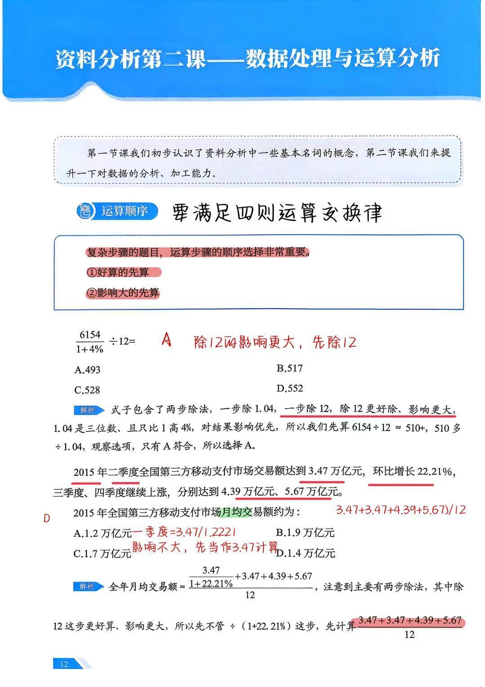
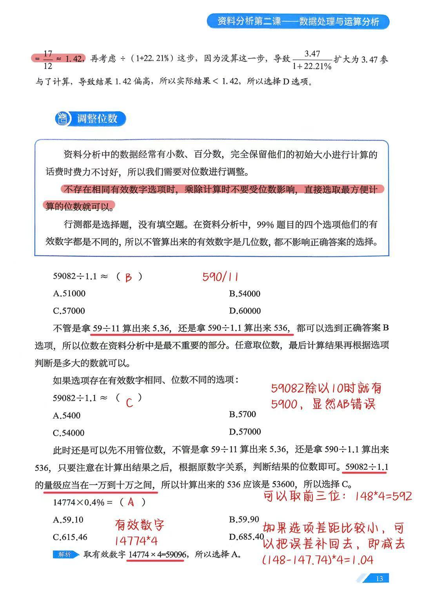
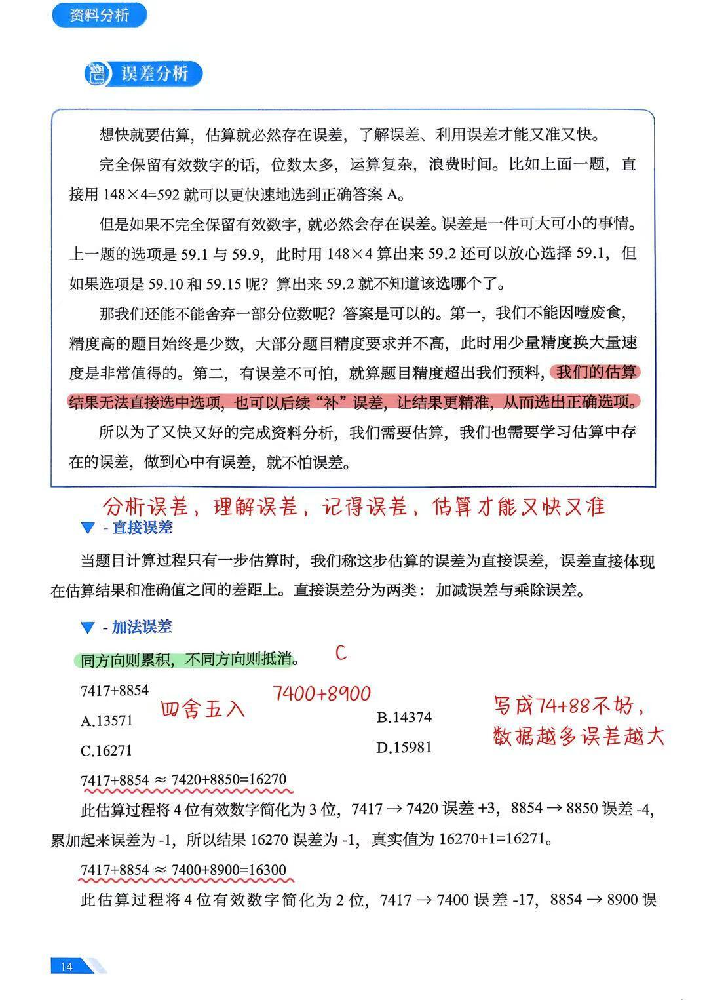
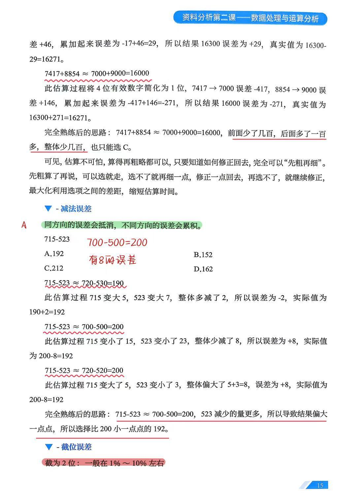
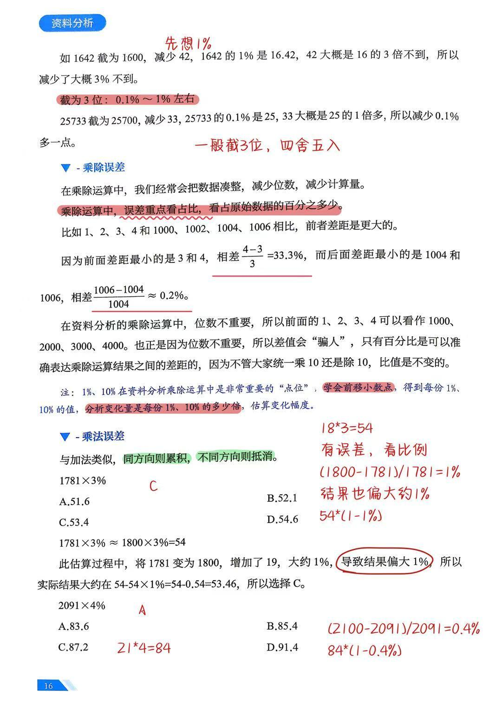
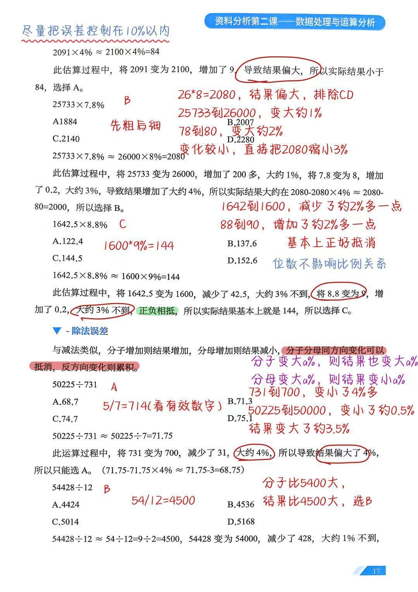

# 第二节 数据处理与运算分析

> 💡 **本节定位**：数据处理是小 P 资料分析第二课（对应 27 版课程第 2 节）。第一课认识了基本名词，本课提升对数据的**分析、加工能力**，回答一个问题——**怎样算才能又快又准**。核心链条三步走：
> ① **运算顺序**：多步运算不必按书写顺序算，**好算的先算、影响大的先算**；
> ② **调整位数**：行测 99% 的题目选项有效数字互不相同，**位数是最不重要的部分**，只管有效数字；
> ③ **误差分析**：想快就要估算，估算必有误差。**分析误差、理解误差、记得误差，估算才能又快又准**——算得再粗都不要紧，知道怎么修正回去即可。
>
> 📎 素材：小红书笔记 @，（作者昵称即为逗号）《小p资料分析第二课数据处理笔记》（课件第 12~17 页，含手写批注）。

---

## 一、运算顺序：要满足四则运算交换律

### 1. 核心原则

> 📌 复杂步骤的题目，**运算步骤的顺序选择非常重要**：
> ① **好算的先算**；② **影响大的先算**。
>
> 乘除满足交换律，先算哪一步结果都一样——但先算"好算且影响大"的那步，能快速逼近选项、判断方向；把"不好算且影响小"的那步留到最后，往往定性即可收尾。

**例 1（两步除法，先除影响大的）** $\dfrac{6154}{1+4\%}\div 12\approx$（　）
A. 493　B. 517　C. 528　D. 552

> ✅ **解答**：式子包含两步除法——÷1.04 和 ÷12。
> - **÷12 更好除、影响更大**；1.04 只比 1 高 4%，对结果影响小；
> - 先算 $6154\div 12\approx 510^{+}$，再让 510 多 ÷1.04，结果必然比 510 小一截；
> - 观察选项，只有 A（493）比 510 小且小得合理 → **选 A**。
>
> 💡 若先 ÷1.04 再 ÷12 也能算出 493，但要多写一步三位数除法；顺序调换，省时省力。

**例 2（2015 移动支付 · 先算好算的，方向修正收尾）** 2015 年二季度全国第三方移动支付市场交易额达 3.47 万亿元，环比增长 22.21%，三季度、四季度继续上涨，分别达 4.39 万亿元、5.67 万亿元。2015 年全国第三方移动支付市场**月均**交易额约为（　）
A. 1.2 万亿元　B. 1.9 万亿元　C. 1.7 万亿元　D. 1.4 万亿元

> ✅ **解答**：全年月均交易额
> $$=\frac{\dfrac{3.47}{1+22.21\%}+3.47+4.39+5.67}{12}$$
> 式中有两步除法：÷(1+22.21%) 与 ÷12。**÷12 这步更好算、影响更大**，所以先不管 ÷(1+22.21%)，先把一季度也当 3.47 算：
> $$\frac{3.47+3.47+4.39+5.67}{12}=\frac{17}{12}\approx 1.42$$
> 再回头补方向：一季度的真实值 $\frac{3.47}{1.2221}<3.47$，刚才**把一季度放大了**参与计算 ⇒ 结果 1.42 **偏高**，实际结果 < 1.42 → **选 D（1.4）**。
>
> ⚠️ 一季度增速 22.21% 不算小，这里敢"先当作 3.47"，是因为它被 ÷12 摊薄后影响有限（约 0.05）；修正方向时必须心里有数。



---

## 二、调整位数：位数最不重要，有效数字才重要

### 1. 核心原则

> 📌 资料分析的数据常带小数、百分数，完全保留初始大小计算费时费力不讨好，需要**对位数进行调整**：
>
> **不存在相同有效数字的选项时，乘除计算不要受位数影响，直接选取最方便计算的位数即可。**
>
> 行测都是选择题，没有填空题。**99% 的题目四个选项有效数字都不同**，所以不管算出来的有效数字是几位数，都不影响正确答案的选择。

**例 3（位数自由取）** $59082\div 1.1\approx$（　）
A. 51000　B. 54000　C. 57000　D. 60000

> ✅ **解答**：不管拿 $59\div 11$ 算出 **5.36**，还是拿 $590\div 1.1$ 算出 **536**，有效数字都对上 B。
> **位数在资料分析中是最不重要的部分**——任意取位数算，最后根据选项判断是多大的数即可。**选 B**。

### 2. 选项有效数字相同时：算完再定量级

**例 4（有效数字相同、位数不同）** $59082\div 1.1\approx$（　）
A. 5400　B. 5700　C. 54000　D. 57000

> ✅ **解答**：仍然先不管位数，算出有效数字 536（≈537）。**算出结果之后，根据原数字关系判断位数**：$59082\div 1.1$ 的量级在一万到十万之间，所以 536 应该是 53600 → **选 C**。
> 💡 快速排除：59082 除以 10 都有 5900，A、B 显然错误。

**例 5（位数 + 有效数字配合）** $14774\times 0.4\%=$（　）
A. 59.10　B. 59.90　C. 615.46　D. 685.40

> ✅ **解答**：取有效数字 $14774\times 4=59096$ → **选 A**。
> 💡 更快：取前三位 $148\times 4=592$ 即可命中；**若选项差距小，可以把误差补回去**——148 比 147.74 多了 0.26，即减去 $(148-147.74)\times 4=1.04$，$592-1.04\approx 591$，依然指向 A。



---

## 三、误差分析总论：心中有误差，就不怕误差

### 1. 为什么要学误差

> 📌 **想快就要估算，估算就必然存在误差，了解误差、利用误差才能又准又快。**

- 完全保留有效数字：位数太多、运算复杂、浪费时间（如例 5 直接用 $148\times 4=592$ 就能秒选）；
- 但舍弃位数就必有误差，误差可大可小——上题选项是 59.1 与 59.9 时，算出 59.2 可放心选 59.1；**若选项是 59.10 与 59.15 呢？** 算出 59.2 就不知道该选哪个了。

> ⭐ **还能不能舍弃位数？答案是可以，两条理由：**
> 1. **不能因噎废食**：精度要求高的题目始终是少数，大部分题目用**少量精度换大量速度**非常值得；
> 2. **有误差不可怕**：就算题目精度超出预料、估算结果无法直接选中选项，也可以**后续"补"误差**，让结果更精准，从而选出正确选项。

### 2. 误差的分类

| 分类 | 含义 | 子类 |
| --- | --- | --- |
| **直接误差** | 计算过程**只有一步估算**时，该步估算的误差，直接体现在估算结果与准确值的差距上 | 加减误差、乘除误差 |
| **截位误差** | 因截断位数产生的误差（用占比衡量） | 截 2 位、截 3 位 |

> 📌 总口诀：**分析误差，理解误差，记得误差，估算才能又快又准。**



---

## 四、加减误差：方向定累积还是抵消

### 1. 加法误差：同方向则累积，不同方向则抵消

**例 6（同一题三档精度对比）⭐** $7417+8854=$（　）
A. 13571　B. 14374　C. 16271　D. 15981

> ✅ **解答**（真实值 16271，选 C）：
>
> | 估法 | 过程 | 各数误差 | 累计误差 | 修正 |
> | --- | --- | --- | --- | --- |
> | 截 3 位 | $7420+8850=16270$ | $+3,\;-4$ | $-1$ | $16270+1=16271$ |
> | 截 2 位 | $7400+8900=16300$ | $-17,\;+46$ | $+29$ | $16300-29=16271$ |
> | 截 1 位 | $7000+9000=16000$ | $-417,\;+146$ | $-271$ | $16000+271=16271$ |
>
> 💡 **完全熟练后的思路**：$7000+9000=16000$，前面少了几百，后面多了一百多，**整体少几百**，也只能选 C。
> ⚠️ 手写批注：写成 $74+88$ 不好——**位数砍得越狠，数据越多误差越大**（加法误差累积的是绝对量）。

### 2. 减法误差：同方向的误差会抵消，不同方向的误差会累积

**例 7（同一题三种估法）⭐** $715-523=$（　）
A. 192　B. 152　C. 212　D. 162

> ✅ **解答**（真实值 192，选 A）：
>
> | 估法 | 过程 | 方向分析 | 误差 | 修正 |
> | --- | --- | --- | --- | --- |
> | 同向都变大 | $720-530=190$ | 715 大 5、523 大 7，**整体多减了 2** | $-2$ | $190+2=192$ |
> | 同向都变小 | $700-500=200$ | 715 小 15、523 小 23，**整体少减了 8** | $+8$ | $200-8=192$ |
> | 反向 | $720-520=200$ | 715 大 5、523 小 3，**整体偏大 $5+3=8$** | $+8$ | $200-8=192$ |
>
> 💡 **完全熟练后的思路**：$700-500=200$，523 减少的量更多 ⇒ 结果**偏大一点点** ⇒ 选比 200 小一点点的 192。

### 3. 先粗后细：最大化利用选项差距

> ⭐ **估算不可怕，算得再粗略都可以，只要知道如何修正回去，完全可以"先粗再细"：**
> 先粗算了再说，**可以选就走**；选不了就再细一点、修正一点回去；再选不了就继续修正——最大化利用选项之间的差距，缩短估算时间。



---

## 五、截位误差：先把 1% 想出来

> 📌 截位产生的误差用**占比**衡量，标尺如下：

| 截位方式 | 误差量级 | 示例 |
| --- | --- | --- |
| **截为 2 位** | 一般在 **1%～10%** 左右 | 1642 截为 1600：减少 42，1642 的 1% 是 16.42，42 约为 16.42 的 3 倍不到 ⇒ **减少了约 3% 不到** |
| **截为 3 位** | 一般在 **0.1%～1%** 左右 | 25733 截为 25700：减少 33，25733 的 0.1% 约 25，33 约为 25 的 1 倍多 ⇒ **减少 0.1% 多一点** |

> ⭐ **操作口诀：先想 1%（或 0.1%）是多少，再看变化量是它的几倍**——前移小数点得到每份 1%、10% 的值，分析变化量是多少倍，即可估算变化幅度。
> 🖊️ 手写批注：**一般截 3 位，四舍五入**；尽量把误差控制在 **10% 以内**。

---

## 六、乘除误差：误差重点看占比

### 1. 核心思想：百分比才是真实差距

> 📌 乘除运算中常把数据凑整、减少位数、减少计算量。**误差重点看占比——看占原始数据的百分之多少。**

- 1、2、3、4 与 1000、1002、1004、1006 相比，**前者差距更大**：前者最小差距是 3 和 4，$\dfrac{4-3}{3}=33.3\%$；后者最小差距是 1004 和 1006，$\dfrac{1006-1004}{1004}\approx 0.2\%$；
- 位数不重要，1、2、3、4 可看作 1000、2000、3000、4000。正因如此，**差值会"骗人"，只有百分比能准确表达乘除结果间的差距**——统一乘 10 或除 10，比值不变。

> 💡 **注**：1%、10% 是乘除运算中非常重要的"点位"（用法见第五节）。

### 2. 乘法误差：与加法类似，同方向则累积，不同方向则抵消

**例 8（单因子凑整，按比例回修）** $1781\times 3\%\approx$（　）
A. 51.6　B. 52.1　C. 53.4　D. 54.6

> ✅ **解答**：$1781\times 3\%\approx 1800\times 3\%=54$。
> 1781 → 1800 增加了 19，$\frac{19}{1781}\approx 1\%$ ⇒ **结果偏大 1%**：
> $$54-54\times 1\%=54-0.54=53.46\;\Rightarrow\;\textbf{选 C}$$
> 🖊️ 批注：有误差，看比例——$\frac{1800-1781}{1781}=1\%$，结果也偏大约 1%，$54\times(1-1\%)$。

**例 9（先粗后细）** $2091\times 4\%\approx$（　）
A. 83.6　B. 85.4　C. 87.2　D. 91.4

> ✅ **解答**：$2091\times 4\%\approx 2100\times 4\%=84$。
> 2091 → 2100 增加了 9（$\frac{9}{2091}\approx 0.4\%$）⇒ 结果偏大 ⇒ **实际小于 84** → **选 A**。
> 💡 精修：$84\times(1-0.4\%)\approx 83.7$，与 A 一致。

**例 10（双因子同向累积）⭐** $25733\times 7.8\%\approx$（　）
A. 1884　B. 2007　C. 2140　D. 2280

> ✅ **解答**：$25733\times 7.8\%\approx 26000\times 8\%=2080$。
> - 25733 → 26000：增加 200 多，约 **+1%**；
> - 7.8 → 8：增加 0.2，约 **+3%**（$\frac{0.2}{7.8}\approx 2.6\%$）；
> - **同向累积**：结果约偏大 4% ⇒ $2080-2080\times 4\%\approx 2080-80=2000$ → **选 B**。
>
> 🖊️ 批注（先粗后细）：$26\times 8=2080$，结果偏大，先排除 C、D；变化较小，直接把 2080 缩小 3% 也够选 B。

**例 11（双因子反向抵消）⭐** $1642.5\times 8.8\%\approx$（　）
A. 122.4　B. 137.6　C. 144.5　D. 152.6

> ✅ **解答**：$1642.5\times 8.8\%\approx 1600\times 9\%=144$。
> - 1642.5 → 1600：减少 42.5，约 **−3% 不到**；
> - 8.8 → 9：增加 0.2，约 **+3% 不到**；
> - **正负相抵**，实际结果基本上就是 144 → **选 C**。
>
> 🖊️ 批注：1642→1600 减少约 2% 多一点，88→90 增加约 2% 多一点，**基本上正好抵消**；位数不影响比例关系。

### 3. 除法误差：与减法类似

> 📌 **分子增加则结果增加，分母增加则结果减小；分子分母同方向变化可以抵消，反方向变化则累积。**
> 即：分子变大 a%，结果也变大 a%；分母变大 a%，结果变小 a%。

**例 12（分母凑整）** $50225\div 731\approx$（　）
A. 68.7　B. 71.3　C. 74.7　D. 75.1

> ✅ **解答**：$50225\div 731\approx 50225\div 700=71.75$。
> 731 → 700 减少 31，约 **−4%** ⇒ 分母变小 ⇒ **结果偏大约 4%**：
> $$71.75-71.75\times 4\%\approx 71.75-3=68.75\;\Rightarrow\;\textbf{选 A}$$
> 🖊️ 批注：看有效数字 $5\div 7\approx 714$；731→700 变小 4% 多，50225→50000 变小约 0.5%，净效果结果偏大约 3.5%。

**例 13（只调分子）** $54428\div 12\approx$（　）
A. 4424　B. 4536　C. 5014　D. 5168

> ✅ **解答**：$54428\div 12\approx 54000\div 12=9\div 2\times 1000=4500$。
> 54428 → 54000 减少 428，约 **−1% 不到** ⇒ 分子变小 ⇒ **结果 4500 偏小约 1% 不到** ⇒ 实际比 4500 略大 → **选 B**（$4500\times 1.008\approx 4536$）。
> 🖊️ 批注：分子比 54000 大，结果比 4500 大，选 B。





---

## 七、易错点避雷

| # | 易错点 | 正确做法 |
| --- | --- | --- |
| 1 | **死按书写顺序硬算** | 多步运算先挑"好算的、影响大的"步骤算（例 1 先 ÷12，例 2 先平均再修方向） |
| 2 | **被位数牵绊** | 选项有效数字不同时，只管有效数字；有效数字相同时，算完再按原数量级定位数（例 4） |
| 3 | **加减误差方向判反** | 加法：同向累积、异向抵消；减法：**同向抵消、异向累积**（与加法相反，最易混） |
| 4 | **截位砍太狠** | 一般截 3 位、四舍五入；砍到 1 位时绝对误差会显著放大（例 6 三档对比），整体误差控制在 10% 以内 |
| 5 | **乘除误差看差值不看占比** | 差值会"骗人"，统一乘除 10 比值不变——**只有百分比才代表真实差距**（1、2、3、4 vs 1000、1002、1004、1006） |
| 6 | **除法误差方向记错** | 分子与结果同向，分母与结果反向：分母变小 ⇒ 结果偏大（例 12）；分子变小 ⇒ 结果偏小（例 13） |
| 7 | **估算后不敢选 / 盲选** | 先粗后细：粗算能选就走；选不了按比例补误差（×(1±a%)）再选，不要中途放弃改用硬算 |

---

## 八、总结归纳

### 1. 知识框架

```
数据处理与运算分析
├── 运算顺序：好算的先算、影响大的先算
│   └── 难算且影响小的步骤 → 留到最后定性修正方向
├── 调整位数：位数最不重要，有效数字才重要
│   ├── 选项有效数字不同 → 任意取位数
│   └── 选项有效数字相同 → 算完按量级定位数
└── 误差分析：先粗后细，知道怎么修正回去
    ├── 加减误差（看绝对量）
    │   ├── 加法：同向累积、异向抵消
    │   └── 减法：同向抵消、异向累积
    ├── 截位误差（先想 1%）
    │   ├── 截 2 位 ≈ 1%~10%
    │   └── 截 3 位 ≈ 0.1%~1%（常用，四舍五入）
    └── 乘除误差（看占比）
        ├── 乘法：同向累积、异向抵消（同加法）
        └── 除法：分子同向、分母反向（同减法）
```

### 2. 误差方向速查表

| 运算 | 两数调整同方向 | 两数调整反方向 | 记忆锚点 |
| --- | --- | --- | --- |
| 加法 $a+b$ | 误差**累积** | 误差**抵消** | 同向累积 |
| 减法 $a-b$ | 误差**抵消** | 误差**累积** | 与加法相反 |
| 乘法 $a\times b$ | 误差**累积** | 误差**抵消** | 同加法 |
| 除法 $a\div b$ | 误差**抵消** | 误差**累积** | 同减法（分子同向、分母反向） |

### 3. 实战决策流

> ① **排顺序**：式子有几步运算？先算好算、影响大的那步；
> ② **放位数**：扫一眼选项——有效数字不同就直接取最好算的位数开算；
> ③ **粗算定档**：凑整粗算，用有效数字锁定候选选项；
> ④ **判向收尾**：能选就走；选不了就"先想 1%"估算各因子变化占比 → 判方向（累积/抵消）→ 按比例补误差（×(1±a%)）再选。

### 4. 与前后章节的联系

- 与 **01 基本概念**：本节加工的对象正是第一课的增长量、增长率、比重等基本量；
- 与 **03 放缩运算**：本节的"补误差、先粗后细"是放缩思想的前身——03 章把"凑整 + 公平补偿"系统化为加/减/乘/除四套放缩规则，误差方向判断与本节完全一致；
- 与 **04 快速估算**：化除为乘（$|r|\le 10\%$）、份数思想（$r\approx 1/n$）本质都是"可控误差的估算"，本节的占比分析（先想 1%）是它们判方向、修结果的通用底层功；
- 与 **05 增速的累积与拆分**：拆分公式 $r=\dfrac{r_1-r_2}{1+r_2}$ 的"分母增速小直接减、大则化除为乘"，正是本节除法误差分析的公式化。

---

> 📎 **资料来源**：小红书笔记 @，《小p资料分析第二课数据处理笔记》（课件第 12~17 页：运算顺序 → 调整位数 → 误差分析（加法/减法/截位/乘法/除法），含手写批注；最后一页 54428÷12 的印刷解析在原图中截断，结论依据页内手写批注与误差方向补全）。
