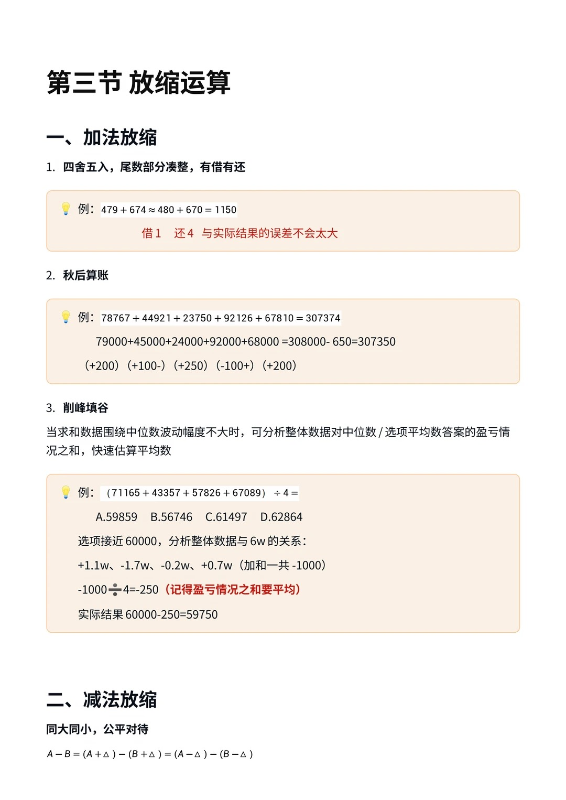
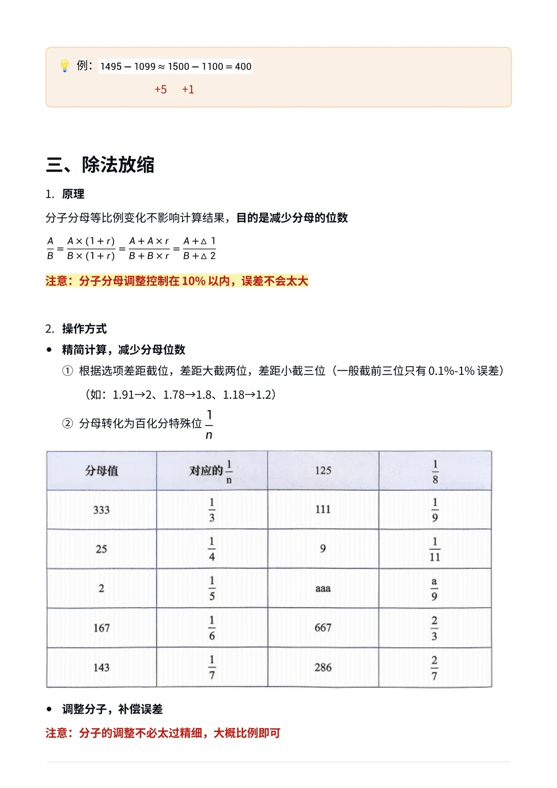
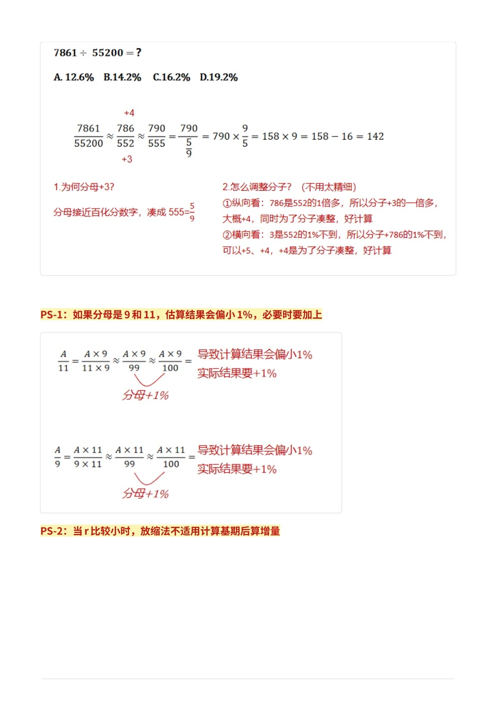
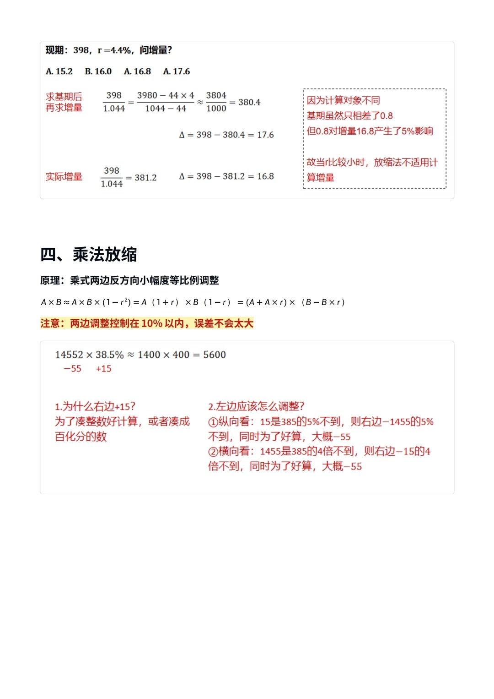

# 第三节 放缩运算（加、减、除、乘）

> 💡 **本节定位**：放缩是资料分析一切速算的地基。核心思想一句话——**先把数凑整好算，再按"公平原则"补偿误差**。加法讲"有借有还"，减法讲"同大同小"，除法讲"等比例同向调"，乘法讲"等比例反向调"。所有调整的幅度都控制在 **10% 以内**，误差就不会失控。

---

## 一、加法放缩

### 1. 四舍五入 · 尾数凑整 · 有借有还

> 📌 每个数向最近的整十/整百靠，**借了多少、还了多少心里要有数**，总误差会相互抵消，不会累积。

**例**：

$$
479 + 674 \;\approx\; \underbrace{480}_{借1} + \underbrace{670}_{还4} = 1150
$$

一个多加了 1、一个少加了 4，与实际结果（1153）误差仅 3。

### 2. 秋后算账

> 📌 多个大数相加：先统一"抹零"取整求和，**最后把每个数的零头盈亏一次性清算**。

**例**：78767 + 44921 + 23750 + 92126 + 67810 = ?

| 原数 | 取整 | 盈亏 |
| --- | --- | --- |
| 78767 | 79000 | +233 |
| 44921 | 45000 | +79 |
| 23750 | 24000 | +250 |
| 92126 | 92000 | −126 |
| 67810 | 68000 | +190 |

$$
79000+45000+24000+92000+68000 = 308000,\quad 盈亏合计 \approx +650
$$

$$
实际 \approx 308000 - 650 = 307350\quad(精确值\ 307374)
$$

### 3. 削峰填谷（求平均数神器）⭐

> 📌 当数据围绕某个"中位数"波动不大时，**以选项附近的整数为基准，分析各数据对基准的盈亏**，盈亏之和平均后加回基准即可。

**例**：(71165 + 43357 + 57826 + 67089) ÷ 4 = ?

A. 59859　B. 56746　C. 61497　D. 62864

**解**：选项围绕 60000 波动，以 6 万为基准看盈亏：

$$
+1.1万、\;-1.7万、\;-0.2万、\;+0.7万 \;\Rightarrow\; 合计约 -1000
$$

> ⚠️ 盈亏之和**别忘了再平均**：−1000 ÷ 4 = −250

$$
平均数 \approx 60000 - 250 = 59750 \;\Rightarrow\; 选\ A
$$

---

## 二、减法放缩

> 📌 **同大同小，公平对待**：被减数和减数同时加上（或减去）差不多的量，差不变。

$$
A - B = (A+\Delta) - (B+\Delta) = (A-\Delta) - (B-\Delta)
$$

**例**：

$$
1495 - 1099 \;\approx\; \underbrace{1500}_{+5} - \underbrace{1100}_{+1} = 400
$$

两边都往整百凑，且调整量接近（+5、+1），差几乎不受影响。

---

## 三、除法放缩 ⭐

### 1. 原理：分子分母等比例同向变化，商不变

$$
\frac{A}{B} = \frac{A\times(1+r)}{B\times(1+r)} = \frac{A+A\cdot r}{B+B\cdot r} = \frac{A+\Delta_1}{B+\Delta_2}
$$

> ⚠️ 分子分母的调整幅度都控制在 **10% 以内**，误差不会太大。调整的目的只有一个——**减少分母位数，让分母变好除**。

### 2. 操作方式

**① 精简分母：根据选项差距截位**

| 选项差距 | 截位策略 | 误差量级 |
| --- | --- | --- |
| 差距大 | 截两位 | 约 1% |
| 差距小 | 截三位 | 约 0.1%～1% |

如：1.91→2、1.78→1.8、1.18→1.2。

**② 分母凑"百化分"特殊值 1/n**（背熟下表，看到就条件反射）

| 分母 | 百化分 | 分母 | 百化分 |
| --- | --- | --- | --- |
| 333 | 1/3 | 111 | 1/9 |
| 25 | 1/4 | 9 | 1/11 |
| 2 | 1/5 | aaa | a/9 |
| 167 | 1/6 | 667 | 2/3 |
| 143 | 1/7 | 286 | 2/7 |
| 125 | 1/8 | | |

**③ 调整分子，补偿误差**（不必太精细，大概比例即可）

- **纵向看**：分子是分母的几倍，分子的调整量 ≈ 分母调整量的几倍；
- **横向看**：分母调整了百分之几，分子也调整差不多的百分比。

### 3. 例题

**例**：7861 ÷ 55200 = ?

A. 12.6%　B. 14.2%　C. 16.2%　D. 19.2%

**解**：

$$
\frac{7861}{55200} \approx \frac{786}{552} \approx \frac{790}{555} = 790\times\frac{9}{5} = 158\times 9 \approx 142 \;\Rightarrow\; 14.2\%,\ 选\ B
$$

- **为何分母 +3？** 552 距百化分数字 555（=5/9 的分母变形）很近，+3 凑成 555，除法变乘法；
- **分子为何 +4？**
  - 纵向看：786 是 552 的 1 倍多 → 分子调整量取分母调整量（+3）的 1 倍多 → +4；
  - 横向看：+3 约为 552 的 1% 不到 → 分子 +786 的 1% 不到，+4、+5 都行，取 +4 顺便把分子凑整。

> ⚠️ **PS-1：分母凑到 9 或 11 时，估算结果会偏小约 1%，必要时补上**

$$
\frac{A}{11} = \frac{A\times 9}{99} \approx \frac{A\times 9}{100}\quad\Rightarrow\quad 结果偏小约1\%，实际要 +1\%
$$

> ⚠️ **PS-2：r 较小时，不要用放缩法"先算基期、再算增量"**（见下方例题）

**例（反面教材）**：现期 398，r = 4.4%，问增量？

A. 15.2　B. 16.0　C. 16.8　D. 17.6

$$
\frac{398}{1.044} = \frac{3980-44\times 4}{1044-44} \approx \frac{3804}{1000} = 380.4
\;\Rightarrow\; \Delta = 398-380.4 = 17.6\;(\textbf{错！})
$$

实际：398 ÷ 1.044 ≈ 381.2，Δ = 398 − 381.2 = **16.8（选 C）**。

> 📌 **为什么错**：计算对象不同——基期只差了 0.8（约 0.2%），但这 0.8 占增量 16.8 的约 **5%**。r 越小增量越小，基期的小误差被"放大"到增量上。**r 小时算增量请用化除为乘（见第四节）**。

---

## 四、乘法放缩

### 1. 原理：两边反方向、小幅度、等比例调整

$$
A\times B \;\approx\; A\times B\times(1-r^2) = A(1+r)\times B(1-r) = (A+A\cdot r)\times(B-B\cdot r)
$$

> 📌 一边涨 r、另一边降 r，乘积只变化 r²（≤10% 调整 ⇒ 误差 ≤1%）。同样控制在 **10% 以内**。

### 2. 例题

**例**：14552 × 38.5% ≈ ?

$$
1455 \times 385 \;\approx\; \underbrace{1400}_{-55} \times \underbrace{400}_{+15} = 560000 \;\Rightarrow\; 5600
$$

- **右边为什么 +15？** 385 凑成 400 好算（或凑百化分的数）；
- **左边应该调多少？**
  - 纵向看：+15 约为 385 的 5% 不到 → 左边减 1455 的 5% 不到，为好算取 −55；
  - 横向看：1455 约为 385 的 4 倍不到 → 左边减 15 的 4 倍不到，为好算取 −55。

---

## 五、总结

| 运算 | 口诀 | 调整方向 | 目的 |
| --- | --- | --- | --- |
| **加法** | 有借有还 / 秋后算账 / 削峰填谷 | 各自凑整 | 尾数抵消误差 |
| **减法** | 同大同小，公平对待 | 同向同量 | 差不变 |
| **除法** | 等比例同向调 | 分子分母同向 | 分母凑整、凑百化分 |
| **乘法** | 等比例反向调 | 一边涨一边降 | 一边凑整，乘积只变 r² |

> 💡 **三条通用纪律**：
> 1. 一切调整控制在 **10% 以内**；
> 2. 调整永远服务于"**凑整好算**"，方向对了不必过分精确；
> 3. 补偿误差时**纵向看倍数、横向看比例**，大概齐即可。
