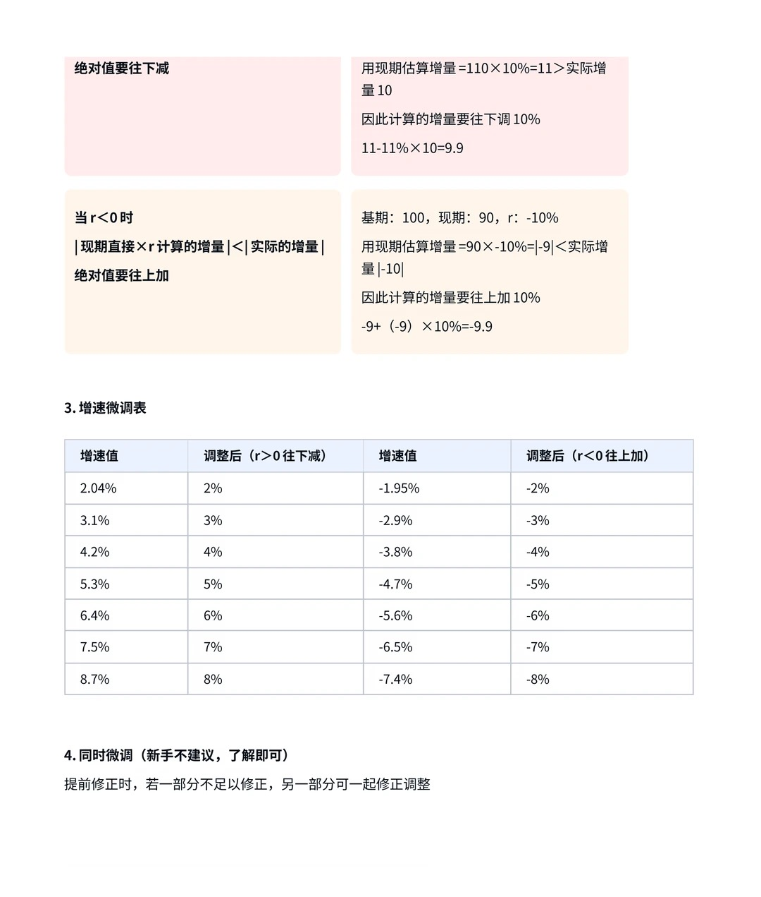
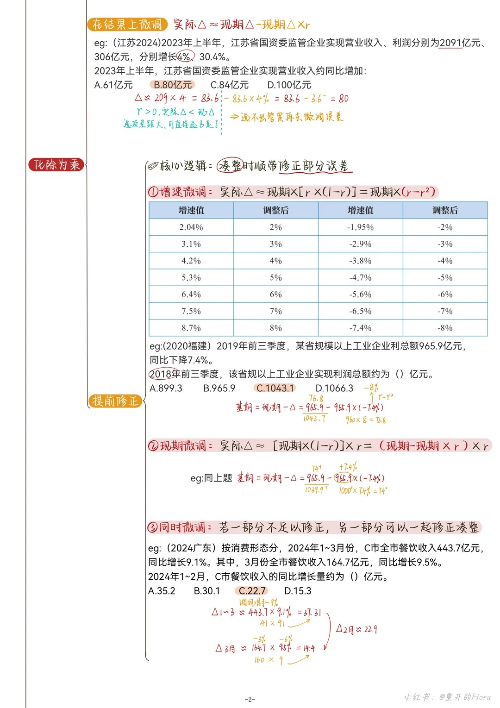
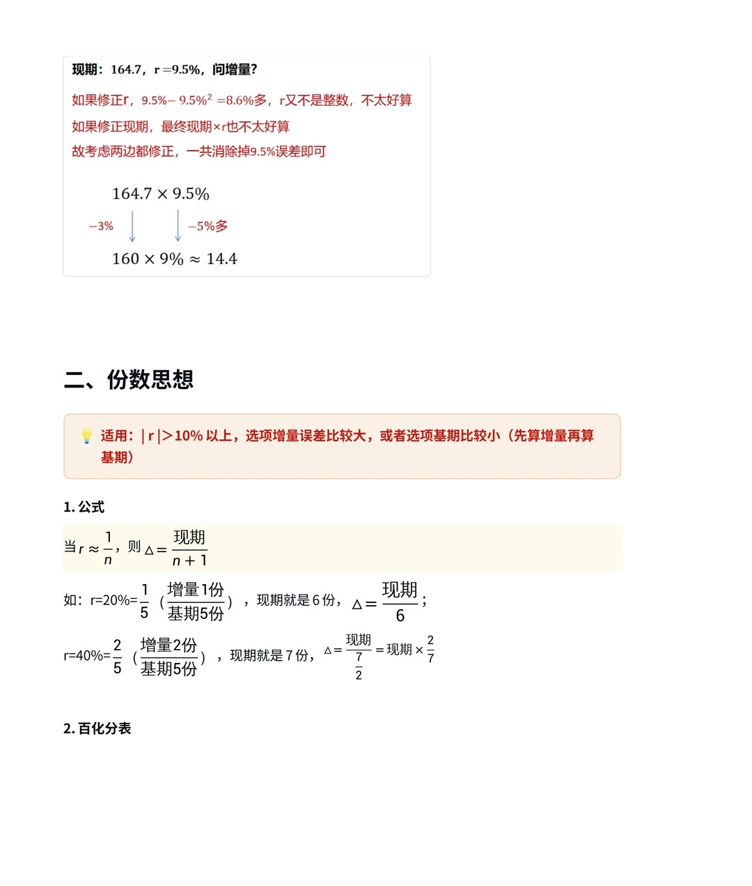
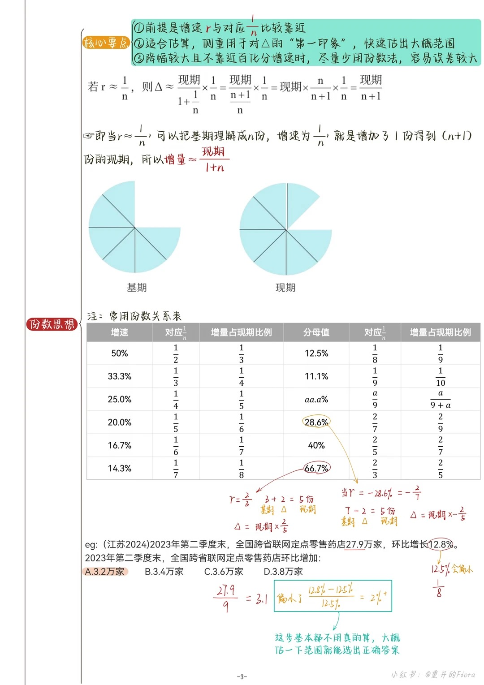
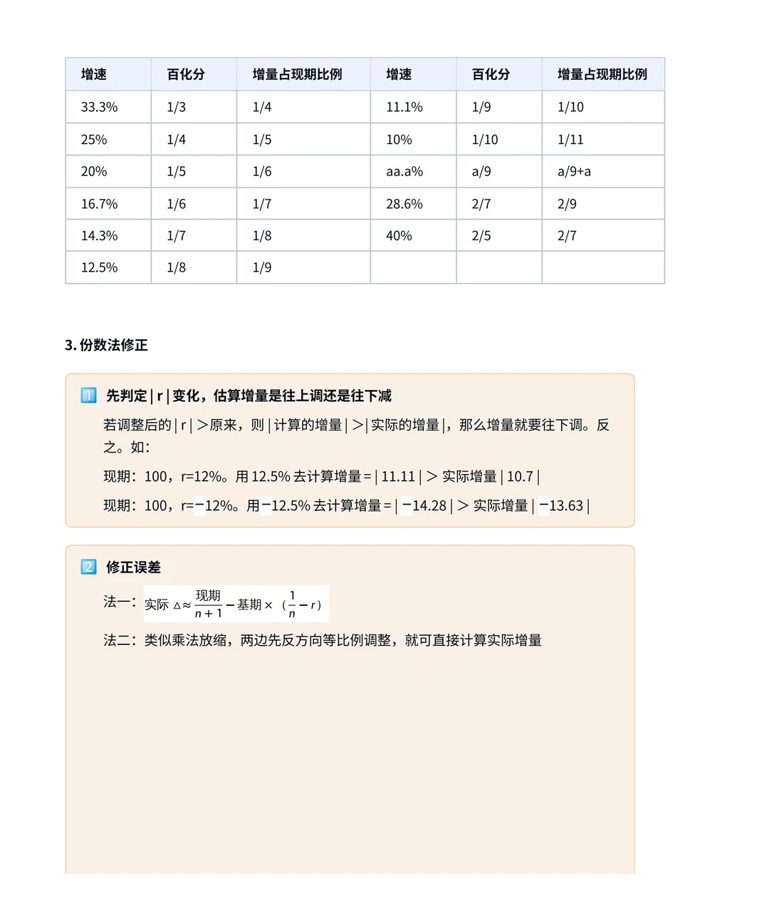

# 第四节 快速估算（化除为乘 & 份数思想）

> 💡 **本节定位**：求**增量/基期**的三大武器——**化除为乘**（|r|≤10%，快且准）、**份数思想**（r≈1/n，最快）、**放缩法**（兜底，精准但慢）。拿到题先看增速落在哪个区间，再决定用哪把刀。

---

## 〇、三大方法总览

| 方法 | 适用范围 | 优点 | 缺点 | 注意点 |
| --- | --- | --- | --- | --- |
| **化除为乘** | 变化率 \|r\| ≤ 10% | 快且准 | — | 正减负增（调的是**绝对值**）；提前修正以凑整为主，方向对了无需过分精确 |
| **份数思想** | 增速 r ≈ 1/n | 最快 | 精准计算较复杂 | 估算 Δ 用"现期/(n+1)"，记住 r 与 1/n 的相对大小就能判断估算偏方向 |
| **放缩法** | 增速不适合前两种方法时兜底 | 精准 | 不够快 | 放缩幅度不要大、以凑整为主；分子较整时可在结果上修正 |

---

## 一、化除为乘 ⭐

### 1. 适用范围与公式推导

> 📌 **适用**：变化幅度 |r| ≤ 10%，求增量或基期。增速小 ⇒ 现期和基期差距小 ⇒ 可以"以现期代替基期"快速估出增量范围。

**推导**（核心是约掉分母里的 1−r²）：

$$
\Delta = 基期 \times r = \frac{现期 \times r}{1+r} = \frac{现期 \times r \times (1-r)}{(1+r)(1-r)} = \frac{现期 \times r \times (1-r)}{1-r^2} \approx 现期 \times r \times (1-r)
$$

> 当 −10% ≤ r ≤ 10% 时，0.99 ≤ 1−r² ≤ 1，把分母近似看作 1，误差不到 1%。

展开后得到**三种计算形式**（外加高手形态）：

| 形式 | 公式 | 适用人群/场景 |
| --- | --- | --- |
| ① 结果微调 | $\Delta \approx (现期 \times r) - (现期 \times r)\times r$ | **新手**：先算现期×r，最后再调误差 |
| ② 增速微调 | $\Delta \approx 现期 \times (r - r^2)$ | **r 好修正**时，提前把 r 调成整数 |
| ③ 现期微调 | $\Delta \approx (现期 - 现期 \times r)\times r$ | **现期好修正**时，提前把现期凑整 |
| ④ 同时微调 | 两边都动 | 高手：一边不足以修正时，另一边一起调 |

**例（一题三解）**：现期 105.99，r = 5.26%，问增量？

A. 5　B. 5.3　C. 5.6　D. 6

- **法一（结果微调）**：106 × 5.26% ≈ 5.57；再减去 5.57 × 5.26% ≈ 0.25+ ⇒ 5.57 − 0.25 ≈ **5.3**
- **法二（增速微调）**：5.26% − 5.26%² ≈ 5%（提前把 r 修成整数）⇒ 106 × 5% ≈ **5.3**
- **法三（现期微调）**：106 × 5.26% ≈ 5 多；106 − 5 多 ≈ 100 ⇒ 100 × 5.26% = 5.26 ≈ **5.3**

均选 **B**。

### 2. 做题步骤

1. **以现代基**：估算增量 = 现期 × r；
2. **微调误差**（必要时才调，大部分题估出偏大/偏小即可出答案）：
   - 在结果上微调（形式①）；
   - 提前修正：增速微调（形式②）/ 现期微调（形式③）/ 同时微调（形式④）。

### 3. 核心要点：正减负增（调绝对值）⭐

> ⚠️ 用**现期**代替基期算出的增量，和实际增量相比：

**r > 0 时**：|现期×r 算出的增量| **>** |实际增量| ⇒ 绝对值要**往下减**

$$
基期100 \xrightarrow{+10\%} 现期110：\quad 110\times10\% = 11 > 实际\ 10 \;\Rightarrow\; 11 - 11\times10\% = 9.9
$$

**r < 0 时**：|现期×r 算出的增量| **<** |实际增量| ⇒ 绝对值要**往上加**

$$
基期100 \xrightarrow{-10\%} 现期90：\quad |90\times(-10\%)| = 9 < 实际\ 10 \;\Rightarrow\; -9 + (-9)\times10\% = -9.9
$$

### 4. 增速微调表（背熟，凑整顺手就修了）

**r > 0（往下减一点）**：

| 增速值 | 2.04% | 3.1% | 4.2% | 5.3% | 6.4% | 7.5% | 8.7% |
| --- | --- | --- | --- | --- | --- | --- | --- |
| 调整后 | 2% | 3% | 4% | 5% | 6% | 7% | 8% |

**r < 0（往上加一点，按绝对值调）**：

| 增速值 | −1.95% | −2.9% | −3.8% | −4.7% | −5.6% | −6.5% | −7.4% |
| --- | --- | --- | --- | --- | --- | --- | --- |
| 调整后 | −2% | −3% | −4% | −5% | −6% | −7% | −8% |

> 💡 微调幅度就是 r² 的量级（如 7%² ≈ 0.5%），所以调整后的整数增速天然弥补了"以现代基"的误差。**同时微调（④）新手不建议，了解即可**。

### 5. 真题演练

**例 1（在结果上微调）**：(2024 江苏) 2023 年上半年，江苏省国资委监管企业实现营业收入、利润分别为 2091 亿元、306 亿元，分别增长 4%、30.4%。2023 年上半年营业收入约同比增加：

A. 61 亿元　B. 80 亿元　C. 84 亿元　D. 100 亿元

**解**：以现代基 → 2091 × 4% ≈ 83.6；r > 0，实际增量 < 83.6 ⇒ 排除 C、D；选项差距大可直接选 **B**（要更稳就微调：83.6 − 83.6×4% ≈ 83.6 − 3.3 ≈ 80）。

**例 2（增速微调 / 现期微调）**：(2020 福建) 2019 年前三季度，某省规模以上工业企业利润总额 965.9 亿元，同比下降 7.4%。2018 年前三季度利润总额约为（ ）亿元。

A. 899.3　B. 965.9　C. 1043.1　D. 1066.3

**解**：基期 = 现期 − Δ，且 r < 0，估算的 |Δ| 偏小，基期要比"现期 + |估Δ|"更大一点。

- **增速微调**：r = −7.4% 调为 −8%（−7.4% − 7.4%² ≈ −8%）⇒ Δ ≈ 965.9 × (−8%) ≈ −76.8（960×8%）⇒ 基期 ≈ 965.9 + 76.8 ≈ 1042.7 ≈ **1043.1，选 C**
- **现期微调**：965.9 ≈ 1000 ⇒ Δ ≈ 1000 × (−7.4%) = −74 ⇒ 基期 ≈ 965.9 + 74 ≈ 1039.9，最接近 **C**

**例 3（同时微调）**：(2024 广东) 2024 年 1~3 月 C 市餐饮收入 443.7 亿元，同比增长 9.1%；其中 3 月份 164.7 亿元，同比增长 9.5%。2024 年 1~2 月餐饮收入的同比增长量约为（ ）亿元。

A. 35.2　B. 30.1　C. 22.7　D. 15.3

**解**：Δ₁~₂ = Δ₁~₃ − Δ₃。

- Δ₁~₃ ≈ 443.7 × 9.1%：现期微调（443.7−443.7×9% ≈ 410）⇒ 410 × 9.1% ≈ 37.3
- Δ₃ ≈ 164.7 × 9.5%：增速调 9%、现期调 160 ⇒ 160 × 9% = 14.4
- Δ₁~₂ ≈ 37.3 − 14.4 = 22.9 ≈ **22.7，选 C**

---

## 二、份数思想 ⭐

### 1. 适用与公式推导

> 📌 **适用**：增速 r 与某个百化分 1/n 比较靠近时。把基期理解成 **n 份**，增速 1/n 就是"增加了 1 份"，现期变成 (n+1) 份：

$$
\Delta = \frac{现期}{1+\frac{1}{n}}\times\frac{1}{n} = \frac{现期}{\frac{n+1}{n}}\times\frac{1}{n} = \frac{现期 \times n}{n+1}\times\frac{1}{n} = \frac{现期}{n+1}
$$

> 💡 一句话：**r ≈ 1/n ⇒ 增量 ≈ 现期 ÷ (n+1)**。份数法给出的是对 Δ 的"第一印象"，用来快速框定范围。

### 2. 常用份数表（必背）

| 增速 r | 百化分 | 增量占现期 | 增速 r | 百化分 | 增量占现期 |
| --- | --- | --- | --- | --- | --- |
| 50% | 1/2 | 1/3 | 11.1% | 1/9 | 1/10 |
| 33.3% | 1/3 | 1/4 | aa.a% | a/9 | a/(9+a) |
| 25.0% | 1/4 | 1/5 | 28.6% | 2/7 | 2/9 |
| 20.0% | 1/5 | 1/6 | 40% | 2/5 | 2/7 |
| 16.7% | 1/6 | 1/7 | 66.7% | 2/3 | 2/5 |
| 14.3% | 1/7 | 1/8 | −28.6% | −2/7 | −2/5 |
| 12.5% | 1/8 | 1/9 | | | |

> 📌 分子是 2 的情况同理：r = 2/3 ⇒ 基期 3 份 + 增 2 份 = 现期 5 份，Δ = 现期×2/5；r = −2/7 ⇒ 基期 7 份 − 减 2 份 = 现期 5 份，Δ = 现期×(−2/5)。

### 3. 使用注意

> ⚠️ ① 前提是 r 与 1/n **确实靠近**；
> ② 份数法适合**估算**，快速给出大概范围；
> ③ **降幅较大且不靠近百化分增速时，尽量少用份数法**，容易误差较大。

**例**：(2024 江苏) 2023 年第二季度末，全国跨省联网定点零售药店 27.9 万家，环比增长 12.8%。环比增加约：

A. 3.2 万家　B. 3.4 万家　C. 3.6 万家　D. 3.8 万家

**解**：12.8% → 12.5% = 1/8（把 r 调小了，估算会**偏小**）⇒ Δ ≈ 27.9 ÷ 9 = 3.1，实际略大 ⇒ **3.2，选 A**。

> 💡 (12.8%−12.5%)/12.5% ≈ 2%+，所以 3.1 再放大 2% ≈ 3.16 → 3.2。这一步基本不用真算，大概估个范围就能选出答案。

### 4. 份数法修正（选项接近时用）

> 📌 估算偏多少，取决于 r 与 1/n 的相对差距：r > 1/n 则实际 Δ > 估算 Δ，反之偏小。

**修正法一：按比例补估算 Δ**

$$
实际\Delta \approx 估算\Delta + 估算\Delta \times \frac{r-\frac{1}{n}}{\frac{1}{n}}
$$

**修正法二：按基期补差**

$$
实际\Delta \approx \frac{现期}{n+1} + 基期 \times \left(r-\frac{1}{n}\right)
$$

**例**：2016 年某省小微服务业样本企业营业收入 80.1 亿元，同比增长 15.4%。比 2015 年大约多多少亿元？

A. 5.3　B. 10.7　C. 12.3　D. 23

**解**：15.4% ≈ 14.3% = 1/7（低了 1.1 个百分点，估算偏小）⇒ 估算 Δ = 80.1 ÷ 8 ≈ 10。

- 法一：10 + 10 × (1.1%/14.3%) ≈ 10 + 0.7 = **10.7，选 B**
- 法二：10 + (80.1−10) × 1.1% ≈ 10 + 0.7 = **10.7，选 B**

> 💡 两种修正方式习惯哪种用哪种；分析层面记住"1/7 比 15.4% 低 ⇒ 算出来的 Δ 偏低，要往上加一点"即可排除干扰项。

> 📌 **精准修正（了解即可）**：实际 Δ ≈ 估算Δ + [估算Δ × (r−1/n)/(1/n)] ÷ (1+r)。过程过于繁琐——**份数思想不追求完全精准，只用来快速解决低精度问题**。

**例（法一实战）**：18506 × 16% ≈ ?

A. 2644　B. 2958　C. 2971　D. 3024

**解**：16% ≈ 14.3% = 1/7 ⇒ 18506 × 14.3% ≈ 18506 ÷ 7 ≈ 2644；16% 比 14.3% 高 1.7 个百分点 ⇒ 2644 + 2644 × (1.7%/14.3%) ≈ 2644 + 314 ≈ **2958，选 B**。

### 5. 提前修正（挪凑思想）

> 📌 现期 A、增速 r：若把增速修成 1/n 的同时，把现期按 **A : B ≈ 1/n : r** 的比例反向挪动，两者增量基本一致（类似于乘法放缩，方向对了无需过分精确）。

**操作步骤**：① 增速转化为靠近的百化分增速；② 现期对应放大/缩小弥补误差。

**例**：现期 27.9，r = 12.8%：12.8% → 12.5%（约 −0.3%），12.5% : 12.8% ≈ 1 : 1.02 ⇒ 现期 +2% 左右，27.9 → 28.6 ⇒

$$
\Delta = 28.6 \div 9 = 3.17^+
$$

---

## 三、方法选择决策树

$$
增速 \to
\begin{cases}
|r| \le 10\% & \Rightarrow \textbf{化除为乘}（快且准，正减负增）\\
r \approx 1/n & \Rightarrow \textbf{份数思想}（增量 = 现期/(n+1)，最快）\\
其他 & \Rightarrow \textbf{放缩法}（兜底，精准）
\end{cases}
$$

> 💡 **实战心法**：
> 1. 先判断增速落区，选出方法，**估出范围 + 知道偏大偏小**，大部分题已经能出答案；
> 2. 选项接近时才做修正——化除为乘调 r² 量级，份数法补 (r−1/n) 的差；
> 3. 一切提前修正都遵循"**凑整为主、方向正确即可，无需过分精确**"。
