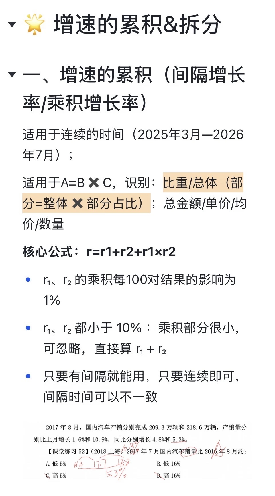
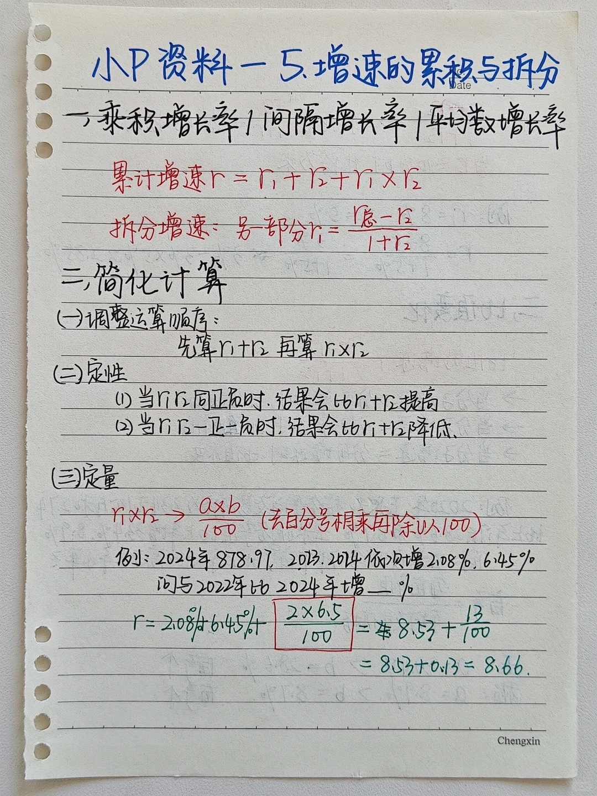
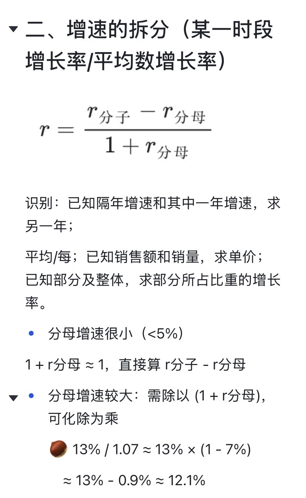
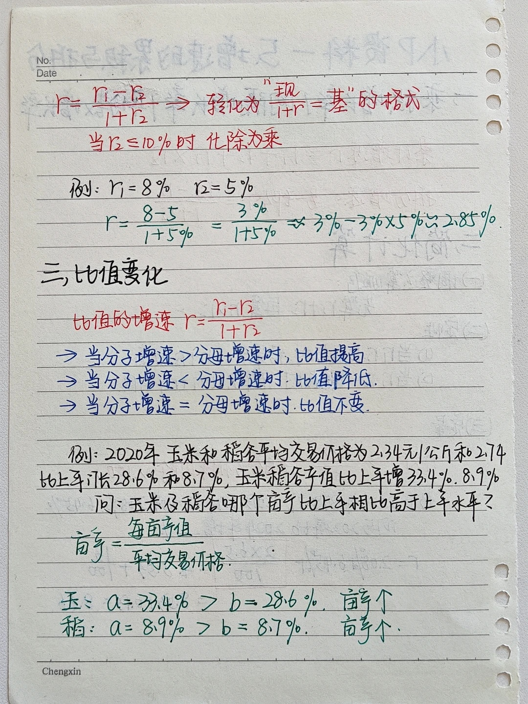
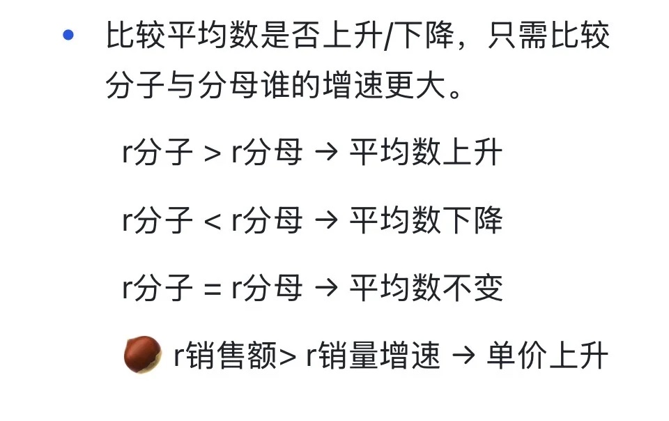
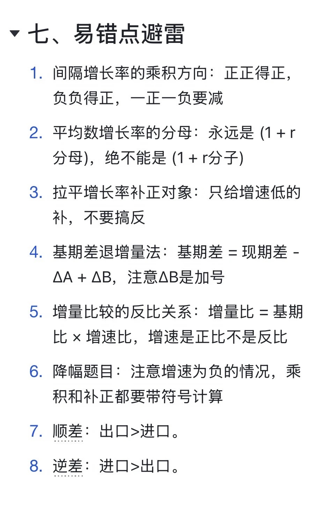

# 第五节 增速的累积与拆分

> 💡 **本节定位**：增速的累积与拆分是小 P 资料分析第五课（对应 27 版课程第 5 节），研究「多段增长如何合并、合并后如何拆开」。
> - **累积**：两段增速 $r_1$、$r_2$ 合并成一段总增速 → **乘积增长率（间隔增长率）** $r=r_1+r_2+r_1\times r_2$；
> - **拆分**：已知总增速与其中一段，反求另一段 → **平均数增长率公式** $r=\dfrac{r_1-r_2}{1+r_2}$。
>
> 二者互为逆运算，是同一枚硬币的两面。拆分公式同时是所有「$A=\dfrac{B}{C}$ 型分式增速」（均价、亩产、比重变化）的通用工具，也是第六节拉平增长率的理论根基。
>
> 📎 素材：@公冶小羊《27小p资料分析笔记（5-6节）》、@小徐的碎碎念🎈《资料复盘04｜【小P】-增速的累积与拆分》。

---

## 一、增速的累积（间隔增长率 / 乘积增长率）

### 1. 核心公式

$$
\boxed{\;r=r_1+r_2+r_1\times r_2\;}
$$

**推导**：两段连续增长，基期 → $(1+r_1)$ → $(1+r_1)(1+r_2)=1+(r_1+r_2+r_1r_2)$，展开即得。

### 2. 两大适用场景（识别）

| 场景 | 特征 | 例子 |
| --- | --- | --- |
| **连续时间（间隔增长率）** | 跨过中间时间点的两段增长，**只要有间隔就能用，间隔时间可以不一致** | 2025 年 3 月 → 2026 年 7 月；2016.8 → 2017.7 → 2017.8 |
| **乘积关系（$A=B\times C$）** | 总量 = 两个因子相乘，求总量的增速 | 部分 = 整体 × 部分占比（比重）；总金额 = 单价 × 数量；总支出 = 人数 × 人均支出 |

### 3. 计算技巧

> 📌 **运算顺序**：先算 $r_1+r_2$，再算 $r_1\times r_2$ 的修正项。

- **定性（判方向）**：
  - $r_1$、$r_2$ 同正或同负 ⇒ 结果比 $r_1+r_2$ **偏大**（正正得正、负负得正）；
  - $r_1$、$r_2$ 一正一负 ⇒ 结果比 $r_1+r_2$ **偏小**（乘积为负要减）。
- **定量（算乘积）**：$r_1\times r_2 \rightarrow \dfrac{a\times b}{100}\%$——**去百分号相乘，再除以 100**（乘积部分每 100 对结果的影响为 1%）。
- **可忽略的情形**：$r_1$、$r_2$ **都小于 10%** 时乘积部分很小（$<1\%$），可直接算 $r_1+r_2$（选项差距大时）。

### 4. 例题

**例 1（乘积速算）** 2023 年、2024 年依次增长 2.08%、6.45%，问 2024 年比 2022 年约增长百分之几？

> ✅ **解答**：
> $$r=2.08\%+6.45\%+\frac{2\times 6.5}{100}\%=8.53\%+0.13\%\approx 8.66\%$$
> 💡 乘积项：$2.08\times 6.45\approx 2\times 6.5=13$，除以 100 即 0.13 个百分点。若题目再给出现期量（如 2024 年为 878.97），可进一步求间隔基期或间隔增量。

**例 2（课堂练习 52 · 2018 上海，间隔增长率逆用）** 2017 年 8 月，国内汽车销量 218.6 万辆，比上月增长 10.9%，同比增长 5.3%。2017 年 7 月国内汽车销量比 2016 年 8 月约：
A. 低 5%　B. 低 16%　C. 高 5%　D. 高 16%

> ✅ **解答**：时间轴 2016.8 → 2017.7 → 2017.8。
> - 2016.8 → 2017.8（同比）：总增速 $r_总=5.3\%$；
> - 2017.7 → 2017.8（环比）：$r_2=10.9\%$；
> - 求 2016.8 → 2017.7 的增速，即把总增速**拆分**（公式见第二节）：
> $$r=\frac{5.3\%-10.9\%}{1+10.9\%}=\frac{-5.6\%}{1.109}\approx -5\%$$
> **答案 A（低 5%）**。
> ⚠️ 环比增速 10.9% 与同比增速 5.3% 的时间基准不同，不能直接用间隔公式套 $5.3\%+10.9\%$；先画时间轴、确认哪段是「总」、哪段是「部分」。





---

## 二、增速的拆分（某一时段增长率 / 平均数增长率）

### 1. 核心公式

$$
\boxed{\;r=\frac{r_{分子}-r_{分母}}{1+r_{分母}}\;}
$$

**推导**：$1+r=\dfrac{1+r_{分子}}{1+r_{分母}}=1+\dfrac{r_{分子}-r_{分母}}{1+r_{分母}}$。与累积公式互为逆运算：把 $r_总=r+r_2+r\times r_2$ 反解即得。

### 2. 识别场景

| 场景 | 问法 |
| --- | --- |
| **时间拆分** | 已知隔年（总）增速和其中一年增速，求另一年的增速（如例 2） |
| **分式拆分（平均 / 每）** | 已知销售额和销量的增速，求单价增速；已知部分及整体的增速，求部分所占比重的增长率 |

### 3. 计算技巧

> 📌 把 $r=\dfrac{r_1-r_2}{1+r_2}$ 转化为「$\dfrac{现}{1+r}=$ 基」的格式处理。

- **分母增速很小（$r_2<5\%$）**：$1+r_2\approx 1$，直接算 $r_1-r_2$；
- **分母增速较大**：需除以 $(1+r_2)$，**化除为乘**（$r_2\le 10\%$ 时好用）：
  $$\frac{13\%}{1.07}\approx 13\%\times(1-7\%)\approx 13\%-0.9\%\approx 12.1\%$$

**例 3（化除为乘）** $r_1=8\%$，$r_2=5\%$，求 $r$。

> ✅ **解答**：
> $$r=\frac{8\%-5\%}{1+5\%}=\frac{3\%}{1+5\%}\approx 3\%-3\%\times 5\%\approx 2.85\%$$





---

## 三、比值（平均数）升降的定性判断

> ⭐ **比较平均数是否上升 / 下降，只需比较分子与分母谁的增速更大**（不用算具体值）：

| 条件 | 结论 |
| --- | --- |
| $r_{分子}>r_{分母}$ | 平均数（比值）**上升** |
| $r_{分子}<r_{分母}$ | 平均数（比值）**下降** |
| $r_{分子}=r_{分母}$ | 平均数（比值）**不变** |

🌰 例：$r_{销售额}>r_{销量}$ ⇒ 单价上升。

**例 4（2019 联考 · 亩产判断）** 2020 年 H 省秋粮玉米、稻谷平均交易价格分别比上年上涨 28.6%、8.7%，产值分别比上年增长 33.4%、8.9%。玉米和稻谷的亩产与上年相比：
A. 仅稻谷高于上年　B. 仅玉米高于上年　C. 两者均高于上年　D. 两者均低于上年

> ✅ **解答**：亩产 $=\dfrac{每亩产值}{平均交易价格}$，定性比较分子分母增速即可：
> - 玉米：$a=33.4\%>b=28.6\%$ ⇒ 亩产 **↑**；
> - 稻谷：$a=8.9\%>b=8.7\%$ ⇒ 亩产 **↑**。
>
> **答案 C（两者均高于上年）**。
> 💡 差距再小（如稻谷只差 0.2 个百分点）也是「>」就上升，定性判断不需要精算。



---

## 四、易错点避雷

| # | 易错点 | 正确做法 |
| --- | --- | --- |
| 1 | **间隔增长率的乘积方向搞错** | 正正得正、负负得正，一正一负要**减**——定性先判结果比 $r_1+r_2$ 大还是小 |
| 2 | **平均数增长率的分母用错** | 分母永远是 $(1+r_{分母})$，绝不能是 $(1+r_{分子})$ |
| 3 | **降幅题目丢符号** | 增速为负时，乘积和补正都要**带符号**计算（如 $-2.2\%-(-2.9\%)=+0.7\%$） |
| 4 | **环比、同比时间基准混淆** | 先画时间轴，确认「总增速」与「部分增速」再套公式（例 2 的 10.9% 与 5.3% 基准不同） |
| 5 | 顺差 / 逆差概念混淆 | 顺差：出口 > 进口；逆差：进口 > 出口 |

> ⚠️ 原笔记本页还含第 6 节「拉平增长率」的 3 条易错点（补正对象只补增速低的、基期差退增量法 $\Delta B$ 是加号、增量比 = 基期比 × 增速比是正比），详见《06-拉平增长率》。



---

## 五、总结归纳

### 1. 知识框架

```
增速的累积与拆分
├── 累积（合并）：r = r₁ + r₂ + r₁×r₂
│   ├── 连续时间：间隔增长率（间隔时间可不一致）
│   ├── 乘积关系：A = B×C（总金额/单价/数量、部分/整体/占比）
│   └── 技巧：先 r₁+r₂ 后乘积；乘积 = a×b/100；同号偏大、异号偏小
├── 拆分（逆运算）：r = (r分子 − r分母)/(1 + r分母)
│   ├── 时间拆分：隔年增速 − 一年增速 → 另一年增速
│   ├── 分式拆分：平均数增长率（单价、亩产、比重变化）
│   └── 技巧：分母增速小直接减；大则化除为乘
└── 定性判断：r分子 vs r分母 → 平均数升 / 降 / 不变
```

### 2. 两大公式对比（互为逆运算）

| | 累积（乘积增长率） | 拆分（平均数增长率） |
| --- | --- | --- |
| 公式 | $r=r_1+r_2+r_1r_2$ | $r=\dfrac{r_1-r_2}{1+r_2}$ |
| 已知 → 求 | 两段增速 → 总增速 | 总增速 + 一段 → 另一段 |
| 结构 | $A=B\times C$ | $A=\dfrac{B}{C}$ |
| 速算 | 乘积项 $a\times b/100$，<10% 可略 | 分母小直接减，大则化除为乘 |

### 3. 实战决策流

> ① **先识别结构**：是 $B\times C$ 的合并，还是 $B/C$ 的拆分？时间题先画时间轴；
> ② **先定性后定量**：累积看同号 / 异号，拆分看分子分母谁快——一半题目定性即出答案；
> ③ **定量从简**：乘积项 $a\times b/100$；分母增速小直接减、大则化除为乘；
> ④ **符号敏感**：降幅题全程带符号，顺差 = 出口 > 进口。

### 4. 与前后章节的联系

- 与 **06 拉平增长率**：拆分公式 $r=\dfrac{r_1-r_2}{1+r_2}$ 即拉平增长率 $\bar r$ 的本源公式，「谁低补谁」的补偿思想由此展开；
- 与 **09 比重特殊问题**：两期比重差的定性判断（部分增速 vs 整体增速）就是本章第三节的应用；
- 与 **11 增长贡献率与拉动增长率**：增长贡献拆解同样基于「部分 = 整体 × 占比」的乘积结构。

---

> 📎 **资料来源**：小红书笔记 @公冶小羊《27小p资料分析笔记（5-6节）》（框架 + 课堂练习 52 + 易错点）、@小徐的碎碎念🎈《资料复盘04｜【小P】-增速的累积与拆分》（手写公式 + 简化计算 + 比值变化例题）。
