# 第六节 拉平增长率（含第四课：平均数增长率）

> 💡 **本节定位**：拉平增长率是小 P 资料分析第五课，其理论根基是第四课的**平均数增长率**公式 $\bar r=\dfrac{r_1-r_2}{1+r_2}$。所谓「拉平」，就是**把两个不同的增速补偿/回退到同一水平**，从而把「基期才能比的事」搬到「现期直接比」——万物皆可拉平。它是基期比较、增量比较、基期差、分式混合精算等一系列题型的通用换算工具。
>
> 📎 素材：@小羊咩咩🌿《拉平增长率》（第五课框架）、@重开的Fiora《第四课：平均数增长率》（课堂全例题）、《补充：第五节课前答疑》（基期比较/增量比较整合版）。

---

## 一、核心概念与定义

### 1. 平均数增长率公式

分式 $A=\dfrac{B}{C}$（如均价 = 销售额/销量），设分子增速 $r_1$、分母增速 $r_2$，则分式本身的增速：

$$
\boxed{\;r=\frac{r_1-r_2}{1+r_2}\;}
$$

**推导**：$1+r=\dfrac{现期均价}{基期均价}=\dfrac{1+r_1}{1+r_2}=1+\dfrac{r_1-r_2}{1+r_2}$。

> ⭐ **结论（定性先判方向）**：
> - 分子增速 **>** 分母增速 ⇒ 平均数**提高**
> - 分子增速 **<** 分母增速 ⇒ 平均数**降低**
> - 分子增速 **=** 分母增速 ⇒ 平均数**不变**

**与乘积增长率的关系**：乘积增长率（$A=B\times C$，$r=r_1+r_2+r_1r_2$）是把 2 次变化合并为 1 次；平均数增长率则是从合并后的 1 次变化中拆出另 1 次——二者是同一枚硬币的两面。

### 2. 什么是「拉平增长率」

> 📌 **定义**：两个量 A、B 增速不同（$r_a\ne r_b$）时，给增速**低**的一方补上一段「虚拟增量」，使其增速与另一方**拉平**，这个补偿增速就是拉平增长率：
>
> $$\bar r=\frac{r_高-r_低}{1+r_低}$$
>
> 操作口诀：**谁低补谁（补 r̄），谁高退谁（退 r̄）**。

**为什么可以拉平**：增速是连接基期与现期的桥梁。把 A、B 的增速拉平后，**基期比 = 现期比**（两者同步变化，比值不变），于是：

$$
\boxed{\;\text{基期比}=\frac{\text{现期比}}{1+\bar r}\;}\qquad\Longleftrightarrow\qquad \text{现期比}=\text{基期比}\times(1+\bar r)
$$

- 补 r̄：低增速方的**现期**补上 r̄ 的虚拟增量后，两者增速相同，此时现期比 = 基期比；
- 求基期比：拿到现期比后**除以** $(1+\bar r)$ 还原（先补 r̄ 后算比，或先算现期比后除 $(1+\bar r)$，殊途同归）。

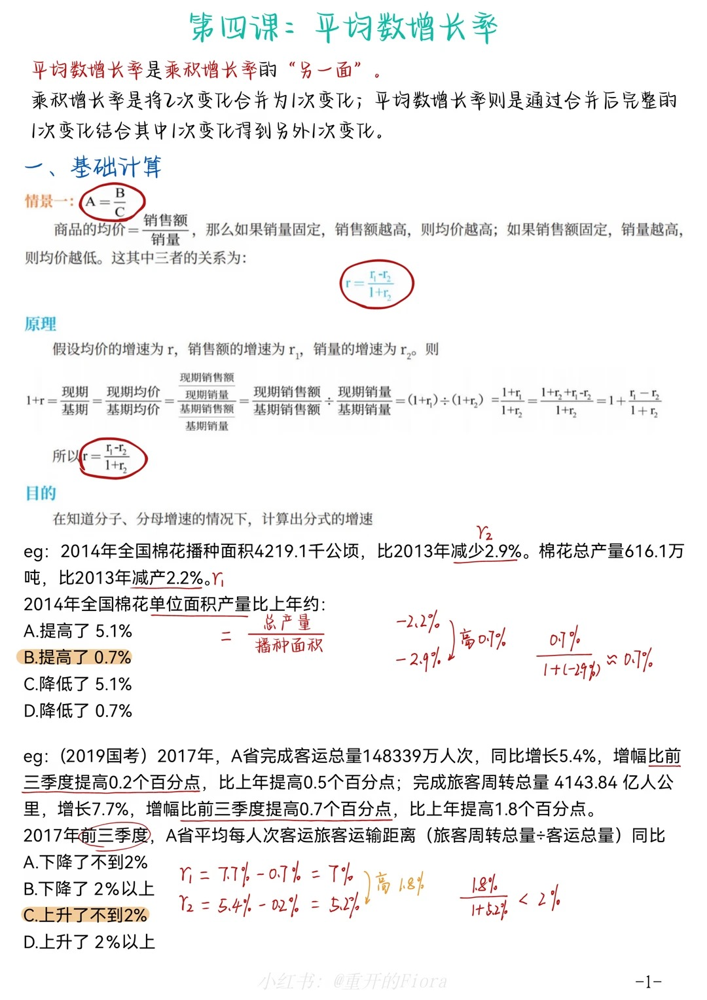

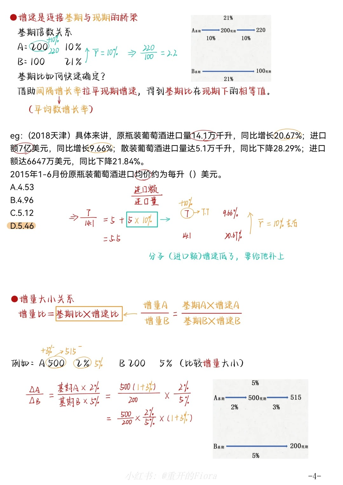

### 3. 拉平增长率的应用地图（万物皆可拉平）

| # | 应用 | 核心式子 |
| --- | --- | --- |
| 1 | 平均数增长率基础计算（$A=B/C$） | $r=\dfrac{r_1-r_2}{1+r_2}$ |
| 2 | 间隔增长率逆运算（总时段 = 时段1 + 时段2） | $r=\dfrac{r_1-r_2}{1+r_2}$ |
| 3 | 基期平均数 / 基期比重 / 基期倍数 | 基期比 $=\dfrac{\text{现期比}}{1+\bar r}$ |
| 4 | 基期环比增速 | 环比倍数增速 $=\dfrac{\text{后月同比}-\text{前月同比}}{1+\text{前月同比}}$ |
| 5 | 平均数增量计算 | 现期 $=\frac AB$，增量 $=\frac AB\cdot\bar r$ 或硬算两期差 |
| 6 | 基期大小比较 | 跳板法：现期补 r̄ 后直接比 |
| 7 | 增量比较大小 | $\dfrac{\Delta A}{\Delta B}=$ 基期比 $\times$ 增速比 |
| 8 | 增量比 / 增量倍数估算 | $\dfrac{\Delta a}{\Delta b}=\dfrac{\text{现期比}}{1+\bar r}\times$ 增速比 |
| 9 | 基期差 / 基期和 | 拉平法 or 现期差 $-\Delta a+\Delta b$ |

---

## 二、基础计算（$A=B/C$ 型分式增速）

> 📌 **方法**：找到分子增速 $r_1$、分母增速 $r_2$，先定性（$r_1$ vs $r_2$ 定升降），再套 $r=\dfrac{r_1-r_2}{1+r_2}$ 估算（分母通常可粗取 1）。

**例 1（棉花单产）** 2014 年全国棉花播种面积比上年减少 2.9%，棉花总产量比上年减产 2.2%。2014 年棉花单位面积产量比上年约：
A. 提高了 5.1%　B. 提高了 0.7%　C. 降低了 5.1%　D. 降低了 0.7%

> ✅ **解答**：单产 = 总产量/面积。$r_1=-2.2\% > r_2=-2.9\%$ ⇒ 提高，排除 C、D。$r=\dfrac{-2.2\%-(-2.9\%)}{1+(-2.9\%)}=\dfrac{0.7\%}{1-2.9\%}\approx0.7\%$。**答案 B**。

**例 2（2019 国考）** 2017 年 A 省客运总量同比增长 5.4%、增幅比前三季度提高 0.2 个百分点；旅客周转量增长 7.7%、增幅比前三季度提高 0.7 个百分点。2017 年前三季度平均每人次客运运输距离同比：
A. 下降了不到 2%　B. 下降了 2% 以上　C. 上升了不到 2%　D. 上升了 2% 以上

> ✅ **解答**：先还原前三季度增速：$r_1=7.7\%-0.7\%=7\%$，$r_2=5.4\%-0.2\%=5.2\%$。$r_1>r_2$ ⇒ 上升；$r=\dfrac{1.8\%}{1+5.2\%}<2\%$。**答案 C**。
> ⚠️ 题干给的是全年增速，问的是**前三季度**，必须先做百分点还原——最常见的掉坑点。

**例 3（2015 北京）** 2013 年全国商品房销售面积比上年增长 17.3%，销售额增长 26.3%。平均销售价格约比上年增长了：
A. 4.4%　B. 7.7%　C. 11.1%　D. 15.5%

> ✅ **解答**：$r=\dfrac{26.3\%-17.3\%}{1+17.3\%}=\dfrac{9\%}{1.173}\approx7.7\%$。**答案 B**。

**例 4（2015 北京）** 2014 年某区限额以上第三产业利润总额同比增长 11.9%，从业人员同比下降 4.3%。平均每名从业人员创造的利润比上年约：
A. 下降了 7%　B. 下降了 17%　C. 上升了 7%　D. 上升了 17%

> ✅ **解答**：$r_1=11.9\%>r_2=-4.3\%$ ⇒ 上升；$r=\dfrac{16.2\%}{1-4.3\%}\approx17\%$。**答案 D**。

**例 5（2021 四川，复合型）** 2016 年全国棉花产量 534.3 万吨、比 2015 年减产 26.0 万吨；播种面积 3376.1 千公顷、比 2015 年减少 420.5 千公顷。2016 年棉花单位面积产量比上年约：
A. 下降 6.8%　B. 下降 3.9%　C. 上升 2.6%　D. 上升 7.2%

> ✅ **解答**：先算两个增速：$r_1=\dfrac{-26}{560}\approx-5\%$，$r_2=\dfrac{-420}{3796}\approx-11\%$；$r_1>r_2$ ⇒ 上升；$r=\dfrac{6\%}{1-11\%}\approx7\%$。**答案 D**。
> 💡 复合型题目（增速要自己算）对计算精度要求不高，增速估算即可。

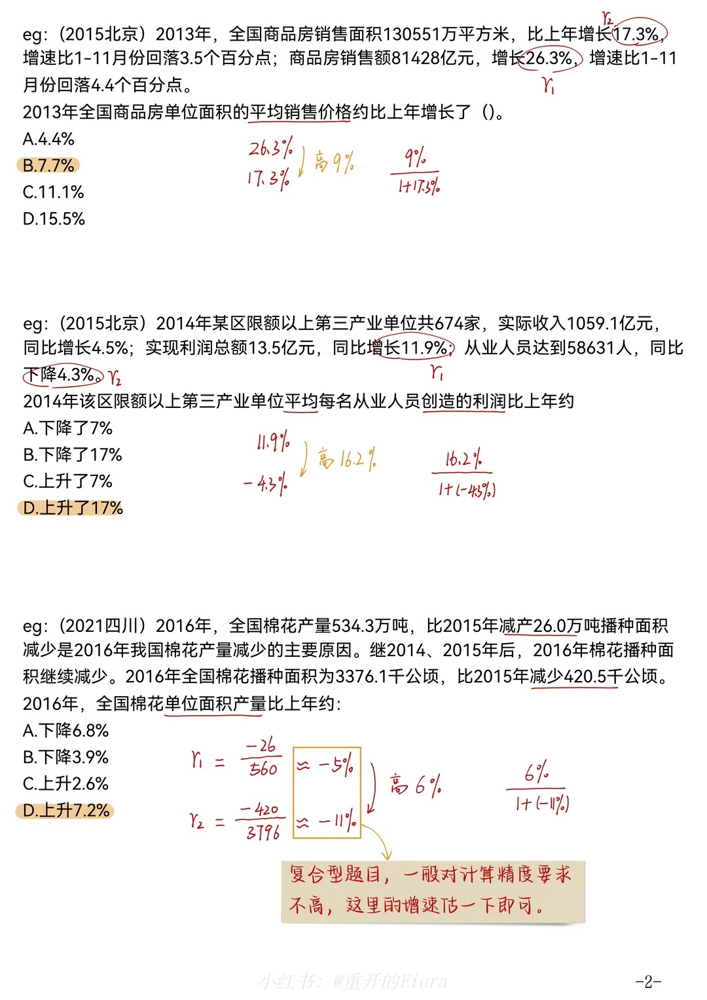

---

## 三、间隔增长率（总时段 = 时段 1 + 时段 2）

> 📌 **情景**：现期比时间点 1 增长 $r_1$、比时间点 2 增长 $r_2$（时间点 1 在 2 之前），求时间点 2 相比时间点 1 的增速 $r$。
>
> 由间隔增长率公式 $r_1=r+r_2+r\times r_2$ 反解：$\boxed{r=\dfrac{r_1-r_2}{1+r_2}}$——**与平均数增长率同一个式子**。
>
> 目的：已知总增速与其中一段增速，求剩下一段的增速。

**例 6（2021 房地产）** 2021 年 1—2 月全国商品房销售面积同比增长 1.05 倍（105%），比 2019 年同期增长 23.3%。2020 年 1—2 月销售面积同比增长：
A. −40.0%　B. −32.5%　C. 40%　D. 17.2%

> ✅ **解答**：时间轴 2019→2020→2021，$r_1=23.3\%$（2019→2021），$r_2=105\%$（2020→2021）。$r=\dfrac{23.3\%-105\%}{1+105\%}=\dfrac{-82\%}{2.05}\approx-40\%$。**答案 A**。

**例 7（2018 国考）** 2017 年 2 月末手持船舶订单 9207 万载重吨，同比下降 22.6%，比 2016 年末下降 7.6%。2016 年末全国手持船舶订单较同年 2 月末：
A. 降低 16.2%　B. 降低 2.2%　C. 增加 16.2%　D. 增加 2.2%

> ✅ **解答**：时间轴 2016.2 末→2016 年末→2017.2 末，$r_1=-22.6\%$，$r_2=-7.6\%$。$r=\dfrac{-22.6\%-(-7.6\%)}{1-7.6\%}=\dfrac{-15\%}{0.924}\approx-16\%$。**答案 A**。

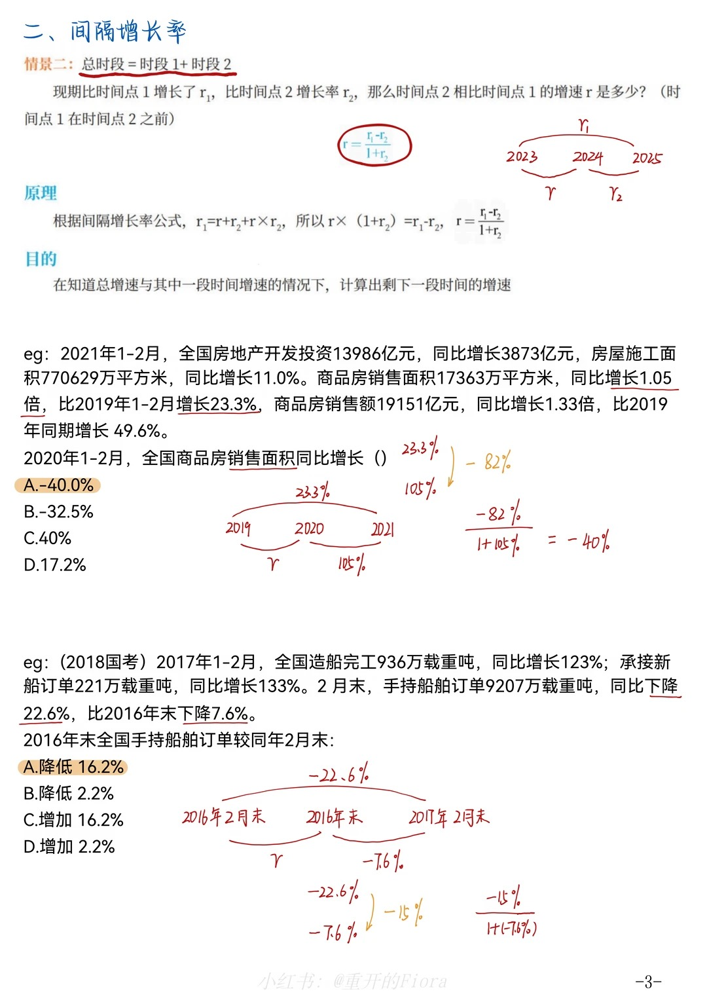

---

## 四、基期平均数与基期比（现期比 ÷ (1 + r̄)）

> 📌 **核心**：平均数增长率是连接平均数基期与现期的桥梁：
>
> $$\text{基期}=\frac{\text{现期}}{1+r}\qquad\text{基期平均数}=\frac{\text{现期平均数}}{1+\text{平均数增长率}}\qquad\text{基期比}=\frac{\text{现期比}}{1+\bar r}$$
>
> ⚠️ **不要再套「基期比重 = 现期比重 × (1+r₂)/(1+r₁)」的常规公式**——乘除两次太慢；用「现期比 ÷ (1+r̄)」一步到位。

**例 8（2019 联考）** 2020 年 H 省秋粮玉米、稻谷价格分别比上年上涨 28.6%、8.7%；产值分别增长 33.4%、8.9%。2020 年 H 省秋粮玉米和稻谷的亩产与上年相比：
A. 仅稻谷高于上年　B. 仅玉米高于上年　C. 两者均高于上年　D. 两者均低于上年

> ✅ **解答**：亩产 = 产值/面积（面积不变），直接看分子分母增速：玉米 33.4% > 28.6% ⇒ 提高；稻谷 8.9% > 8.7% ⇒ 提高。**答案 C**。

**例 9（2020 北京）** 2017 年全国民办中等职业学校 2069 所、比上年下降 2.17%；在校生 197.33 万人、比上年增长 7.16%。2016 年平均每所民办中职在校生人数约为：
A. 871 人　B. 991 人　C. 1091 人　D. 1181 人

> ✅ **解答**：2017 现期平均数 $=\dfrac{197}{207}\approx0.95$ 千人 = 950 人；$\bar r=\dfrac{7.16\%-(-2.17\%)}{1-2.17\%}\approx9.5\%>0$ ⇒ 平均数提高 ⇒ 2016 < 950，只有 A 符合。**答案 A**。

**例 10（河北 2013，基期比重）** 2010 年少儿读物进口额占图书进口总额的：
A. 4.0%　B. 5.4%　C. 8.2%　D. 8.6%
> （2011 年少儿读物进口 629.25 万美元、增长 67.66%；图书进口总额 11666.91 万美元、增长 24.09%）

> ✅ **解答**：现期比重 $=\dfrac{629}{11667}\approx5.4\%$；$r_1=67.66\%>r_2=24.09\%$ ⇒ 比重提高 ⇒ 2010 年 < 5.4%，只有 A。**答案 A**。
> ⚠️ 对比常规公式：$5.42\%\times\dfrac{1.24}{1.68}\approx4\%$，也能算但明显慢——所以不用。

**例 11（2019 联考，基期比重）** 2017 年 12 月乡村消费品零售额占社会消费品零售总额的比重约是：
A. 13.4%　B. 15.3%　C. 15.5%　D. 17.8%
> （2018 年 12 月社零总额 35893 亿元、增长 8.2%，其中乡村 5565 亿元、增长 9.3%）

> ✅ **解答**：现期比 $=\dfrac{5565}{3589\times10}\approx15.5\%$（直除 $\frac{5565}{35893}$）；$r_1=9.3\%>r_2=8.2\%$，$\bar r>0$ 但 $r_1,r_2$ 很接近、$\bar r$ 很小 ⇒ 2017 年略小于 15.5% ⇒ **答案 B（15.3%）**。

**例 12（2021 联考，基期倍数 · 第五课答疑）** 2019 年 S 省应用研究经费 19.5 亿元、下降 8.6%；试验发展经费 161.3 亿元、增长 11.3%。2018 年试验发展经费是应用研究经费的：
A. 10 倍以上　B. 8~10 倍　C. 6~8 倍　D. 6 倍以下

> ✅ **解答**：现期比 $=\dfrac{161.3}{19.5}\approx8.3$ 倍；$\bar r=\dfrac{11.3\%-(-8.6\%)}{1-8.6\%}\approx20\%^+$；基期比 $=\dfrac{8.3}{1.2}\approx6.9$ 倍。**答案 C**。
> 💡 「基期比 = 现期比/(1+r̄)」这个公式的本质就是拉平增长率原理。

**例 13（2018 天津，基期均价 · 第五课答疑）** 2016 年 1—6 月原瓶装葡萄酒进口量 14.1 万千升、同比增长 20.67%，进口额 7 亿美元、同比增长 9.66%。2015 年 1—6 月原瓶装葡萄酒进口均价约为每升：
A. 4.53　B. 4.96　C. 5.12　D. 5.46

> ✅ **解答**：现期均价 $=\dfrac{7}{14.1}\approx5.0$；分子（进口额）增速低，要补：$\bar r\approx\dfrac{20.67-9.66}{1.2}\approx10\%$，基期均价 $=5.0\times(1+10\%)\approx5.5$。**答案 D**。
> ⚠️ 方向判断：均价 = 额/量，分子增速 < 分母增速 ⇒ 均价下降 ⇒ 基期均价 **高于** 现期，直接排除 A、B、C 中与 5.0 同向的干扰。

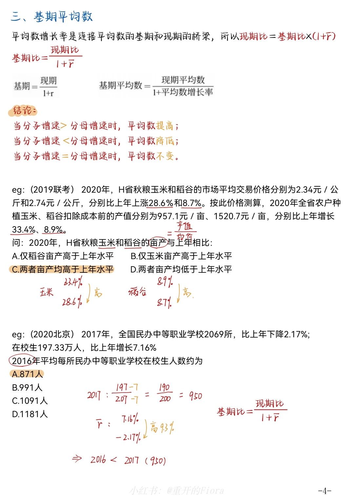

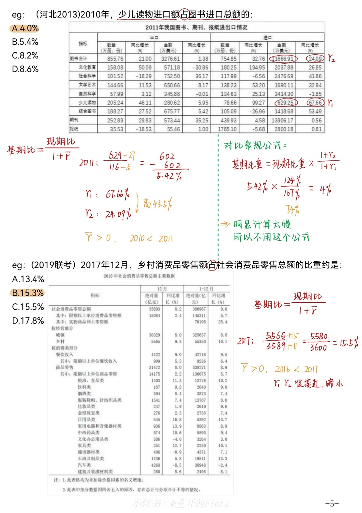

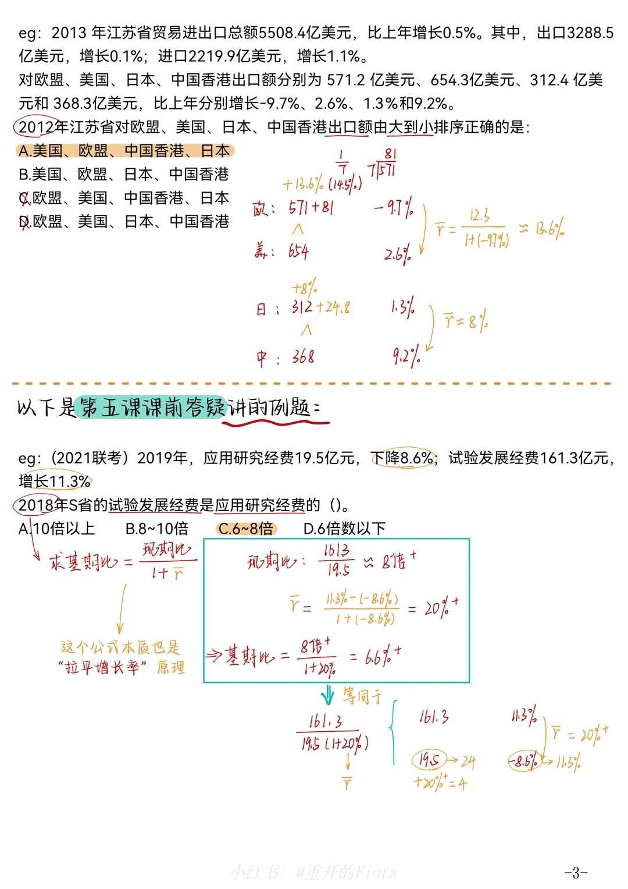

---

## 五、基期环比增速

> 📌 **公式**：
>
> $$\text{环比倍数增速}=\frac{\text{后一个月同比增速}-\text{前一个月同比增速}}{1+\text{前一个月同比增速}}$$
>
> 原理：$1+\text{环比增速}=\dfrac{\text{后一个月}}{\text{前一个月}}$，它的同比增速 = 平均数增长率公式。
>
> ⭐ **结论**：当月同比增速 **>** 上月同比 ⇒ 当月环比增速同比**提高**；< ⇒ 同比**降低**；= ⇒ **不变**。

**例 14（2019 国考）** 2016 年 5 月全国进口药品金额环比增速：
A. 超过 100%　B. 在 40%~100% 之间　C. 在 0%~40% 之间　D. 低于 0%
> （2017 年 4 月 18.8 亿美元、同比 +12.2%；5 月 27.8 亿美元、同比 +54.5%）

> ✅ **解答**：正常做：2016.5 $=\frac{27.8}{1.54}\approx18.2$，2016.4 $=\frac{18.8}{1.12}\approx16.8$，$r_环=\frac{18.2-16.8}{16.8}\approx8\%$。
> 拉平做：$1+r_环$ 的现期比 $=\dfrac{27.8}{18.8}\approx1.5^-$，$\bar r=\dfrac{54.5\%-12.2\%}{1+12.2\%}\approx38\%$ ⇒ 2016 年 $1+r_环=\dfrac{1.5}{1.38}\approx1.1^-$ ⇒ $r_环\approx10\%^-$。**答案 C**。

**例 15（2018 江苏）** 2016 年 3—12 月，江苏规模以上光伏产业产值环比增速低于上年同期的月份个数为：
A. 2 个　B. 3 个　C. 5 个　D. 8 个

> ✅ **解答**：套结论——**当月同比低于上月同比，则当月环比低于上年同期**。数同比增速折线下降的月份：3 月、7 月、8 月、9 月、10 月，共 5 个。**答案 C**。

**例 16（入境游客）** 2018 年 4—12 月，接待入境游客人次环比增速低于上年同期的月份个数为：
A. 2 个　B. 3 个　C. 5 个　D. 6 个

> ✅ **解答**：同上，同比增速低于上月的有 5、6、7、9、11、12 月，共 6 个。**答案 D**。

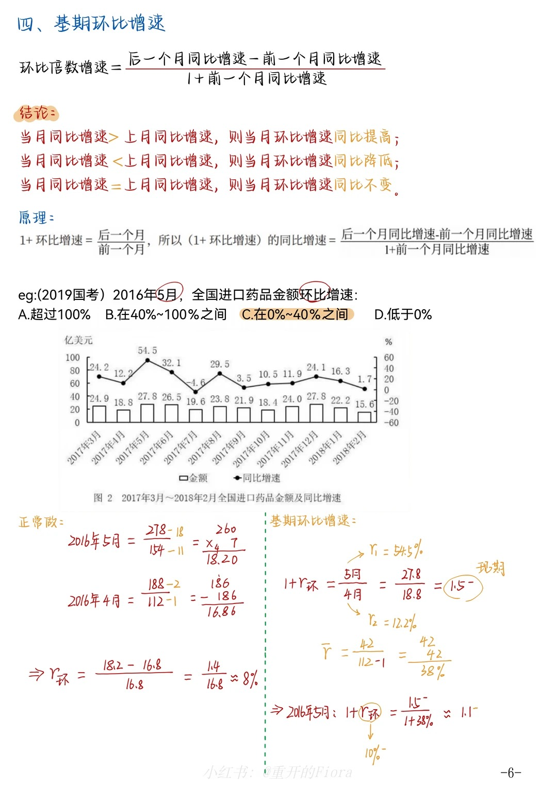

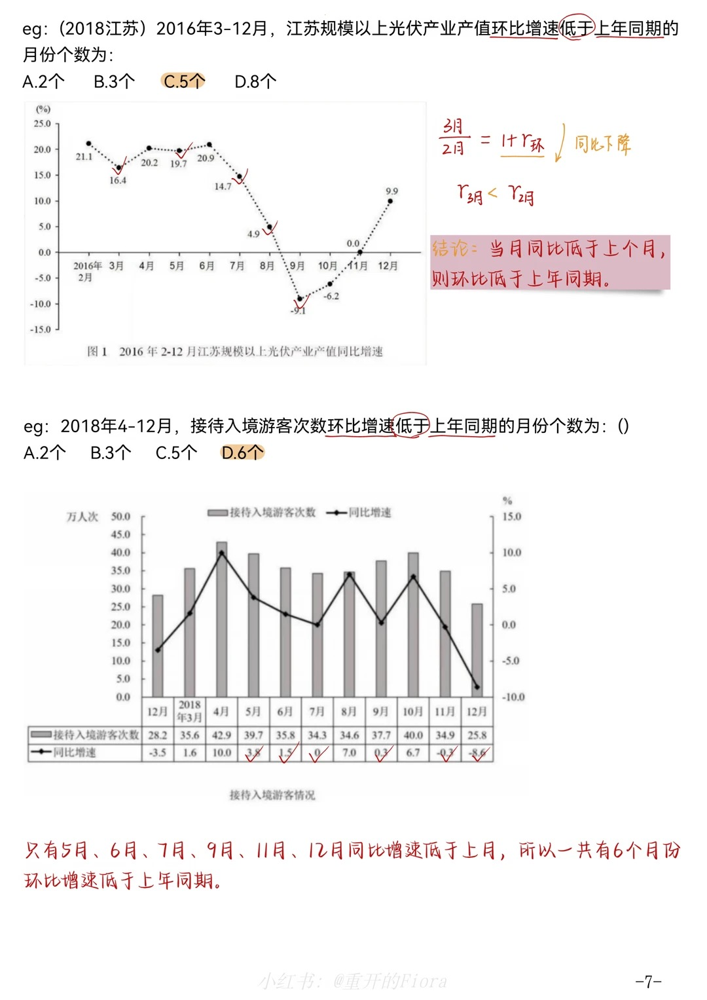

---

## 六、平均数增量计算

> 📌 **方法**：现期 $=\dfrac{A}{B}$，$\bar r=\dfrac{r_1-r_2}{1+r_2}$，则增量 $\Delta\approx$ 现期 $\times\,\bar r$（$\bar r$ 小时）；或者直接硬算两期平均数之差。根据增速特性选择估算方式。

**例 17（铁路人均周转距离）** 2014 年铁路旅客平均每人次周转距离比 2013 年多约多少公里？
A. 15　B. 25　C. 34　D. 44
> （铁路旅客周转量 201.9 亿人公里、增长 15%；客运量 4796.5 万人、增长 8.2%）

> ✅ **解答**：现期 $=\dfrac{201.9\times10^4}{4796.5}\approx\dfrac{202}{48}\approx42$ 公里；$\bar r=\dfrac{15\%-8.2\%}{1+8.2\%}\approx7\%^-$；$\Delta<42\times7\%\approx28$。**答案 B（25）**。

**例 18（电影票价）** 2016 年我国平均电影票价比上一年约：
A. 提高了 2.9 元　B. 提高了 1.6 元　C. 降低了 1.6 元　D. 降低了 2.9 元
> （2015 年总票房 440.7 亿元、观影人次 12.6 亿；2016 年 457.1 亿元、13.7 亿人次）

> ✅ **解答**：两期直接做差：$\dfrac{457}{137}-\dfrac{441}{126}\approx\dfrac{420-441}{126}=\dfrac{-21}{126}\approx-1.6$ 元。**答案 C**。
> 💡 分子分母增速都小且接近时，硬算两期差往往更快更准。

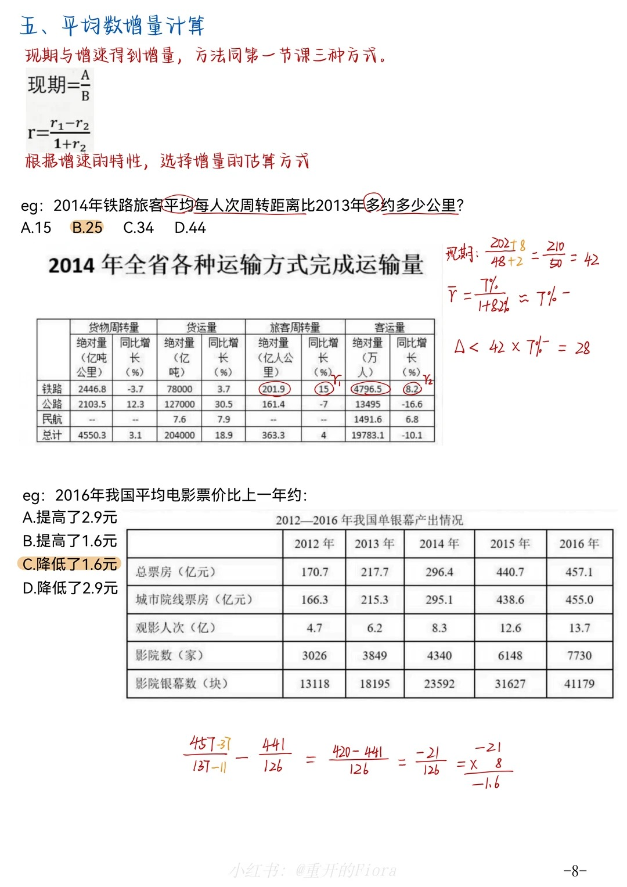

---

## 七、基期大小比较（跳板法）

> 📌 **两情景**：
> - **情景一**：现期 A > 现期 B，$r_A<r_B$ ⇒ 基期 A > 基期 B（直接定，不用算）；
> - **情景二 ⭐**：现期 A > 现期 B，$r_A>r_B$ ⇒ 找一个增速一样的「跳板」：把 B 的增速补到与 A 相同，即比较 $A$ 与 $B+B\times\dfrac{r_A-r_B}{1+r_B}$——若后者 > A，则基期 B > 基期 A；反之基期 B < 基期 A。
>
> 目的：需要比较基期大小时，若两者增速适合估算平均数增长率，则**直接在现期的基础上比较大小**，不用分别求基期。

**例 19（原理例）** 现期 A = 10000、增速 10%；现期 B = 11100、增速 21%。基期 A 与基期 B 谁大？

> ✅ **解答**：把 A 的 10% 拉高到 21%，$\bar r=\dfrac{21\%-10\%}{1+10\%}=10\%$，A 补上增量后 $=10000\times1.1=11000<11100$ ⇒ 基期 A < 基期 B。
> 变式：5800（5%）与 6000（10%）比基期：$\bar r=\frac{5\%}{1.05}<5\%$，5800 补不到 5% 即 $<5800+290=6090$……精算补约 4.8% ≈ 278 ⇒ 6078 > 6000 ⇒ **基期前者大**。

**例 20（文化产业）** 2018 年上半年文化及相关产业 9 个行业营收均增长：内容创作生产 8820 亿元、增长 11.9%；文化消费终端生产 7911 亿元、增长 4.2%；创意设计服务 5143 亿元、增长 15.1%；文化休闲娱乐服务 663 亿元、增长 0.2%……2017 年上半年营收最高的行业是：
A. 内容创作生产　B. 创意设计服务　C. 文化休闲娱乐服务　D. 文化消费终端生产

> ✅ **解答**：B 与 A 比「现期小、增速大 ⇒ 基期小」排除；C 现期太小排除。D vs A：$\bar r\approx7.7\%$（精算 $\frac{7.7\%}{1+4.2\%}$），D 补 8% 也才 $7911+640\approx8550<8820$ ⇒ 基期 A 最大。**答案 A**。

**例 21（河北 2013）** 2010 年文化教育（571.18，−30.86%）、文学艺术（650.66，+8.17%）、综合图书（675.77，+5.42%）出口额由高到低排序：
A. 综合图书—文化教育—文学艺术　B. 综合图书—文学艺术—文化教育
C. 文化教育—文学艺术—综合图书　D. 文化教育—综合图书—文学艺术

> ✅ **解答**：教育 vs 图书：$\bar r=\dfrac{5.42\%-(-30.86\%)}{1-30.86\%}\approx50\%$，教育补 50% ≈ $571+280=850^+>675$ ⇒ 基期教育 > 图书；图书 675 > 艺术 650 且增速更低 ⇒ 基期图书 > 艺术。**答案 D**。

**例 22（2013 江苏）** 2013 年江苏对欧盟（571.2，−9.7%）、美国（654.3，+2.6%）、日本（312.4，+1.3%）、中国香港（368.3，+9.2%）出口额如上，2012 年出口额由大到小排序：
A. 美国、欧盟、中国香港、日本　B. 美国、欧盟、日本、中国香港
C. 欧盟、美国、中国香港、日本　D. 欧盟、美国、日本、中国香港

> ✅ **解答**：欧 vs 美：$\bar r=\dfrac{2.6\%-(-9.7\%)}{1-9.7\%}\approx13.6\%$，欧补后 $571+81=652<654$ ⇒ 基期美 > 欧；日 vs 港：$\bar r\approx8\%$，日补后 $312+24.8\approx337<368$ ⇒ 基期港 > 日。**答案 A**。

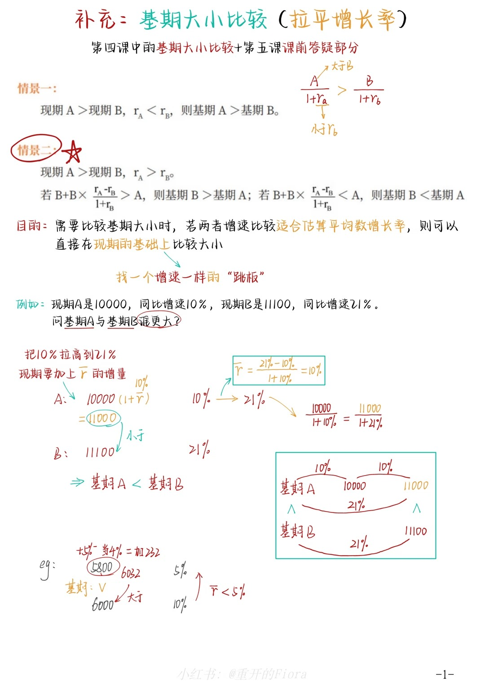

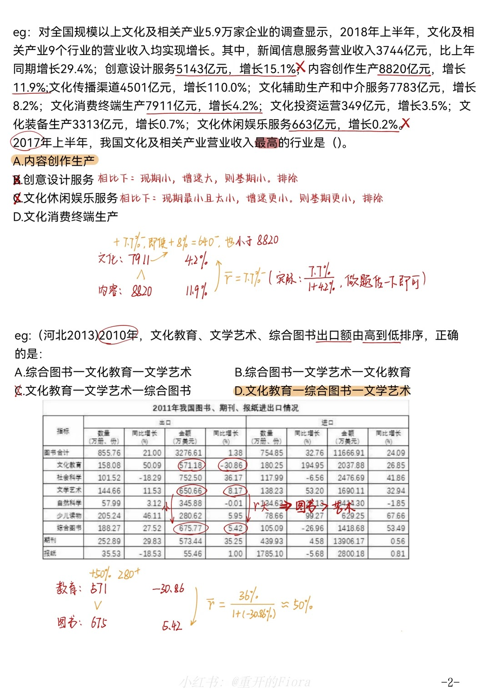

---

## 八、增量比较大小

> 📌 **两情景**（|Δ| 看绝对值）：
> - **情景一：大大则大**——现期大者增速也大，则其增量也大（指绝对值）；
> - **情景二：现期与增速不同边**——比较**基期比与增速比**：
>   - 现期比（大除小）> 增速比（大除小）⇒ 现期大的增量大；
>   - 现期比补上平均数增长率后能超过增速比 ⇒ 仍是现期大的增量大；
>   - 补完还小于增速比 ⇒ 增速大的增量大。
>
> 原理：$\dfrac{\Delta A}{\Delta B}=\dfrac{\text{基期}A\times r_A}{\text{基期}B\times r_B}=$ 基期比 $\times$ 增速比 $=\dfrac{\text{现期比}\times\text{增速比}}{1+\bar r}$。
>
> **核心：给现期比补上 r̄ 的误差再与增速比比较。**

**例 23（2023 深圳）** 2021 年 1—2 月各地区商品房销售额同比增量从大到小排列：
东部（11891 亿元，+148.1%）；中部（3280 亿元，+130.2%）；西部（3620 亿元，+103.6%）；东北（359 亿元，+72.7%）。
A. 中部 > 东部 > 东北 > 西部　B. 东部 > 西部 > 中部 > 东北
C. 中部 > 西部 > 东北 > 东部　D. 东部 > 中部 > 西部 > 东北

> ✅ **解答**：东部现期、增速均为最大 ⇒ 增量最大；东北均最小 ⇒ 增量最小。中部 vs 西部硬算基期：中部 $\frac{3280}{2.302}\approx1424$、$\Delta=3280-1424=1856$；西部 $\frac{3620}{2.036}\approx1775$、$\Delta=3620-1775=1845$ ⇒ 中部略大。**答案 D**。

**例 24（2021 江苏）** 2019 年我国主要海洋产业中产值年增量最大的是：
A. 滨海旅游业（18086，9.3%）　B. 海洋船舶工业（1182，11.3%）　C. 海洋油气业（1541，4.7%）　D. 海洋工程建筑业（1732，4.5%）

> ✅ **解答**：B、C、D 现期只有 A 的零头、增速最多 11.3%，现期比 10 倍以上远大于增速比 ⇒ **答案 A**（大大则大的直觉 + 量级碾压）。

**例 25（2022 国考）** 将 2020 年 H 省秋粮机耕、机播、机收、排灌成本按同比增量从高到低排列：
机耕（22.1，0.3%）、机播（21.7，1.1%）、机收（62.3，−2.0%）、排灌（24.3，−12.0%）。
A. 机收、排灌、机耕、机播　B. 机耕、机播、机收、排灌
C. 机耕、机播、排灌、机收　D. 机收、机播、机耕、排灌

> ✅ **解答**：机收 vs 排灌：现期比 $\frac{62.3}{24.3}\approx2.5$ 倍，增速比（绝对值）$\frac{12}{2}=6$ 倍；补 $\bar r\approx10\%$ 后 $2.5\times1.1\approx2.8$ 仍 < 6 ⇒ **排灌减少量的绝对值更大**。但排灌、机收增量都是**负的**，|Δ| 越大实际增量越小 ⇒ 机收 > 排灌。机耕、机播增量为正排在前面（机播现期接近但增速 1.1% > 0.3% ⇒ 机播 > 机耕？不——机耕 22.1 > 21.7 且增速 0.3% < 1.1%，不同边：现期比 ≈1.02 倍 < 增速比 3.7 倍 ⇒ 机播增量大）。**答案 B（机耕、机播、机收、排灌）**。
> ⚠️ 负数增量排序：先比 |Δ| 再翻号，「补 r̄ 先绝对值、后正负号」。

**例 26（2018 山西 · 答疑）** 截至 2018 年 10 月底，A 省东、中、西部农民外出从业人员分别为 230.59 万（+10%）、350.35 万（+5%）、329.06 万（+3%）。同比增加人数排列正确的是：
A. 东部 > 中部 > 西部　B. 东部 > 西部 > 中部　C. 中部 > 东部 > 西部　D. 中部 > 西部 > 东部

> ✅ **解答**：东 vs 中：现期比 $\frac{350}{230}\approx1.5$ 倍，增速比 $=2$ 倍；补 $\bar r\approx5\%$：$1.5+1.5\times5\%\approx1.6$ 也到不了 2 ⇒ Δ东 > Δ中。西部现期、增速都比中部小 ⇒ Δ西最小。**答案 A**。

**例 27（2017 辽宁 · 答疑）** 2017 年 1—5 月 A 区农村居民四项人均现金收入同比增量由高到低：
工资性（5421，8.5%）、经营性（760，−0.6%）、财产性（1241，28.7%）、转移性（1631，10%）。
A. 工资、转移、财产、经营　B. 财产、转移、工资、经营
C. 工资、财产、转移、经营　D. 经营、工资、转移、财产

> ✅ **解答**：经营为负垫底。工资 vs 财产：现期比 4 倍多 > 增速比 3 倍多，补 r̄ 后更大 ⇒ Δ工资 > Δ财产；财产 vs 转移：现期比 1.5 倍− < 增速比 2.8 倍，补 $\bar r\approx17\%$ 也到不了 2.8 ⇒ Δ转移 > Δ财产？不——注意方向：转移现期大、增速小；财产现期小、增速大。现期比 $\frac{1631}{1241}\approx1.3$ < 增速比 $\frac{28.7}{10}\approx2.9$，补完仍小 ⇒ Δ财产 > Δ转移。**答案 C**。

**例 28（2020 青海）** 下列 A 市指标中，2017 年同比增量最多的是：
A. 气候调节价值年值（732.34，5.6%）　B. 水源涵养价值年值（287.78，10.2%）
C. 水源涵养价值贴现值（402.98，7.5%）　D. 生物多样性价值贴现值（2898.67，1.2%）

> ✅ **解答**：D 现期约为 A 的 4 倍，但 A 增速 5.6% 是 D 增速 1.2% 的 4.5 倍多；给 D 的现期倍数补上 r̄（约 4%）后 4×1.04 仍 < 4.5 ⇒ A 的增量 > D。再验证 B、C 均不及 A。**答案 A**。
> 💡 **注意**：只有弱势方增速低时，才需要给它补 r̄ 的误差公平比较；比较对象较多时，直接分别算增量往往更快。

**例 29（2025 天津）** 以下折线图最能准确反映 2023 年哪几个月我国公共充电桩累计数量同比增量的变化趋势？
A. 5—8 月　B. 6—9 月　C. 7—10 月　D. 8—11 月

> ✅ **解答**：逐月比较累计增量（同比增速 × 累计量的边际变化），可得 6 月 > 7 月 < 8 月 < 9 月 的「降—升—升」形态，与 B 段吻合。**答案 B**。

**例 30（2019 天津 · 答疑）** 同上年相比，2017 年 1—10 月我国钢材出口数量相差最多的月份是：
A. 1 月（742，−23.8%）　B. 3 月（756，−24.2%）　C. 6 月（681，−37.8%）　D. 7 月（696，−32.4%）

> ✅ **解答**：都是负增长，比 |Δ|。1 月现期小、降幅也小，先排除。3 月 vs 6 月：现期比 $\frac{756}{681}\approx1.1$ 倍 < 增速比 $\frac{37.8}{24.2}\approx1.5$ 倍 ⇒ |Δ₆| > |Δ₃|；6 月 vs 7 月：现期比 1.02 倍 < 增速比 1.1 倍+ ⇒ |Δ₆| > |Δ₇|。**答案 C（6 月）**。
> 💡 都是下降时「谁低谁补」：给降幅小的一方补 r̄。

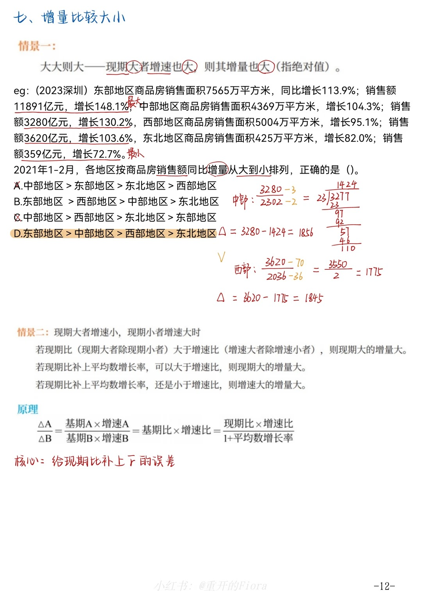

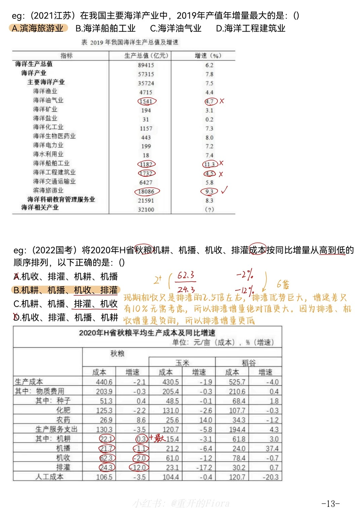

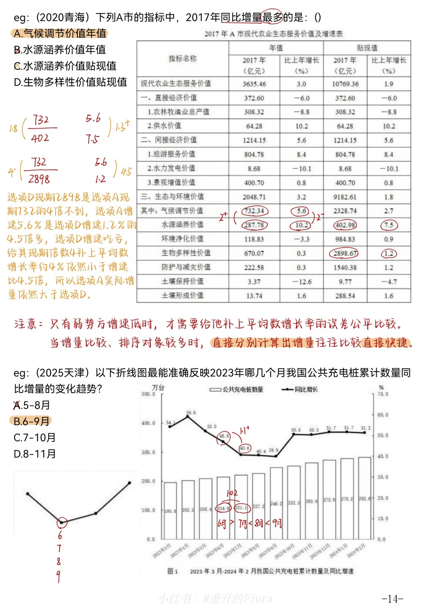

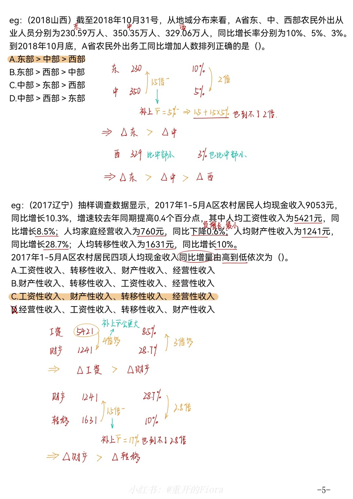

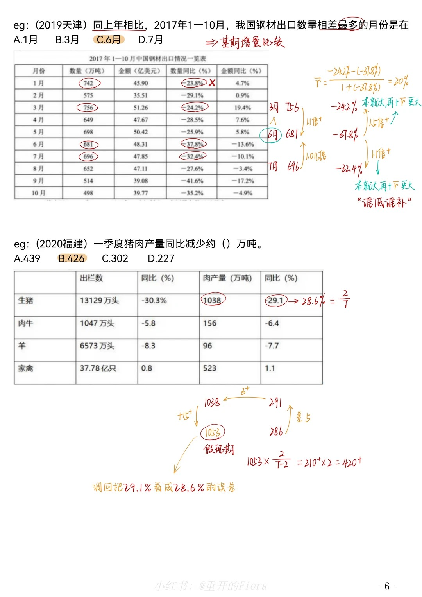

---

## 九、增量比与增量倍数估算

> 📌 **公式**：
>
> $$\frac{\Delta a}{\Delta b}=\frac{\text{基期}a\times r_a}{\text{基期}b\times r_b}=\text{基期比}\times\text{增速比}=\frac{\text{现期比}}{1+\bar r}\times\text{增速比}$$
>
> **核心**：利用好算的现期比与增速比，先粗后细。
> **注意点**：r̄ 不方便估算或者过大时，慎用（老老实实算增量）。

**例 31（求增量比 · 优势不在我）** a = 15394（r = 3.6%），b = 1210（r = 5.4%），求 Δa/Δb。

> ✅ **解答**：补 $\bar r\approx2\%$，基期比 $\approx\dfrac{15400\times(1+2\%)}{1210}\approx\dfrac{15700}{1200}\approx13$ 倍；增速比 $=\dfrac{3.6}{5.4}\approx\dfrac{1}{1.5}$。「优势不在我」（基期比大但增速小）：$\dfrac{\Delta a}{\Delta b}=\dfrac{13}{1.5}\approx8.7$ 倍。

**例 32（求增量比 · 优势在我）** a = 41.96（r = 18.77%），b = 28.63（r = 9.91%），求 Δa/Δb。

> ✅ **解答**：a 现期大、增速也大。先求现期比与增速比（好算）：$\frac{41.96}{28.63}\approx1.5$ 倍、$\frac{18.77}{9.91}\approx1.9$ 倍；补 $\bar r\approx8\%$：$\dfrac{\Delta a}{\Delta b}=\dfrac{1.5\times1.9}{1+8\%}\approx2.6$ 倍（是否精算看选项）。

**例 33（国考 2020，Δ大/Δ小）** 2018 年前三季度 S 省社会物流总额 35357.26 亿元、同比增长 6.4%，其中工业品物流总额 16636.15 亿元、同比增长 0.2%。工业品物流总额同比增量约为社会物流总额同比增量的：
A. 超过 30%　B. 10%—30% 之间　C. 5%—10% 之间　D. 不到 5%

> ✅ **解答**：直接算：$\dfrac{166\times0.2\%}{354\times6.4\%}\approx\dfrac{0.33}{21.6}\approx1.5\%^-$；倍数估算：现期比 $\frac{35357}{16636}\approx2.1$、增速比 $\frac{6.4}{0.2}=32$ ⇒ 社会/工业 $=2.1\times32\approx67$ ⇒ 工业/社会 $\approx\frac1{67}\approx1.5\%$。**答案 D**。
> ⚠️ 增量比较核心思想是拿现期比代替基期比，两者增速越近误差越小；增速差距大、倍数关系难算时不要「走火入魔」强行估算，建议老实算增量再比。

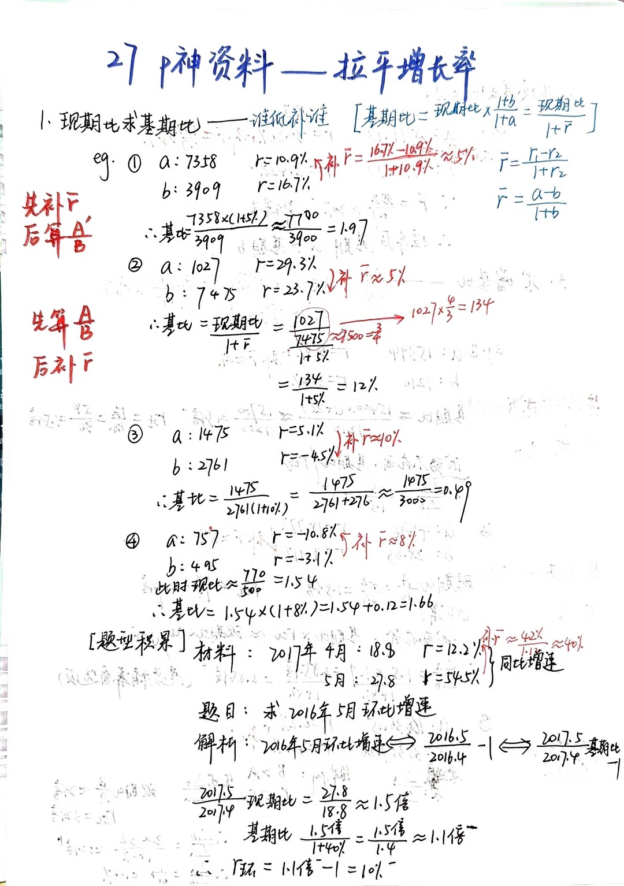

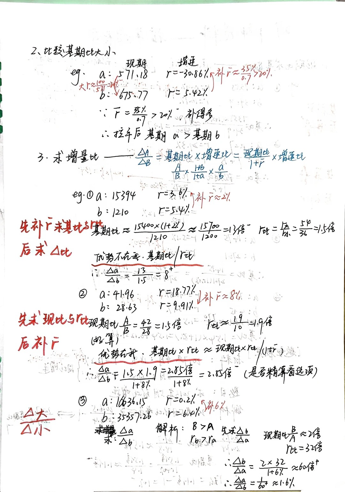

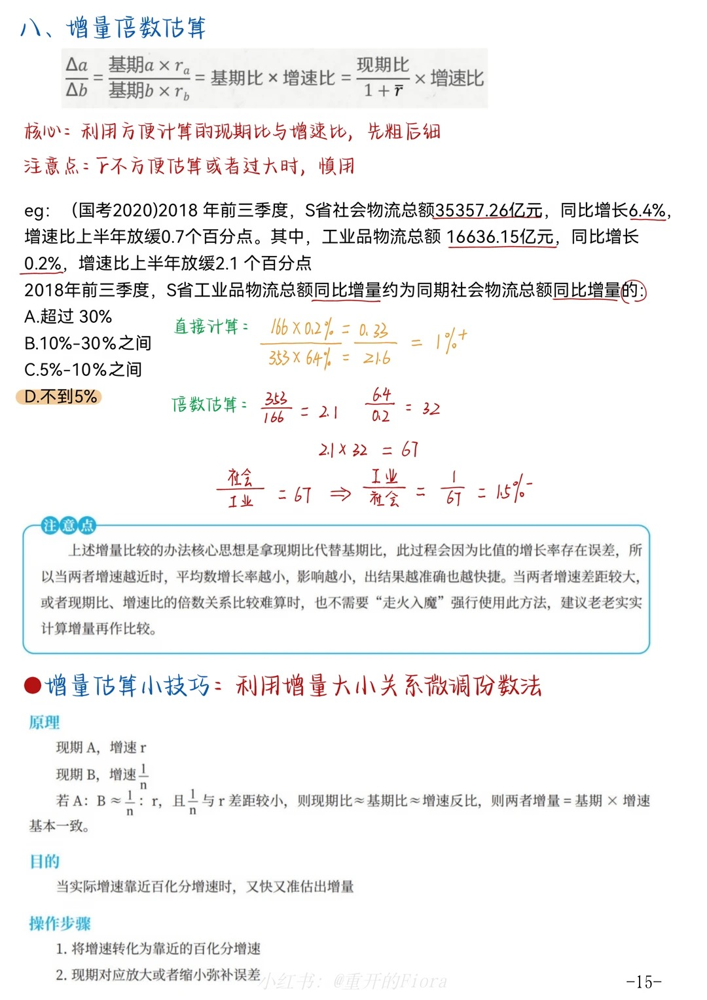

---

## 十、基期差与基期和（拉平法 vs 退 Δ 法）

> 📌 **两套工具**：
>
> | 方法 | 式子 | 适用 |
> | --- | --- | --- |
> | **拉平法** | 基期差 $=\dfrac{\text{大}\times(1+\bar r)-\text{小}}{1+r_高}$（拉平后 r 相同，求基期 $=\frac{\Delta}{1+r_{拉平}}$） | ① Δr 小；② Δ 不好估 |
> | **退 Δ 法** | 基期差 $=$ 现期差 $-\Delta a+\Delta b$；基期和 $=$ 现期和 $-\Delta a-\Delta b$ | ① Δr 大；② r 特殊（百化分好算 Δ） |

**例 34（顺差/逆差基期差）** 进口 745.63 亿美元、增长 3.2%；出口 713.09 亿美元、增长 5.2%。求基期顺差/逆差多少？

> ✅ **解答**：进口基期 > 出口基期 ⇒ 逆差。
> **法一（拉平法）**：补 $\bar r\approx2\%$，基期逆差 $=\dfrac{745\times(1+2\%)-713}{1+5.2\%}=\dfrac{760-713}{1.052}\approx44.7$ 亿美元。
> **法二（退 Δ）**：现期差 $-\Delta_进+\Delta_出=(745-713)-22.5+35=32.5+12.5=45$ 亿美元。两法互验 ≈ 45 亿美元。

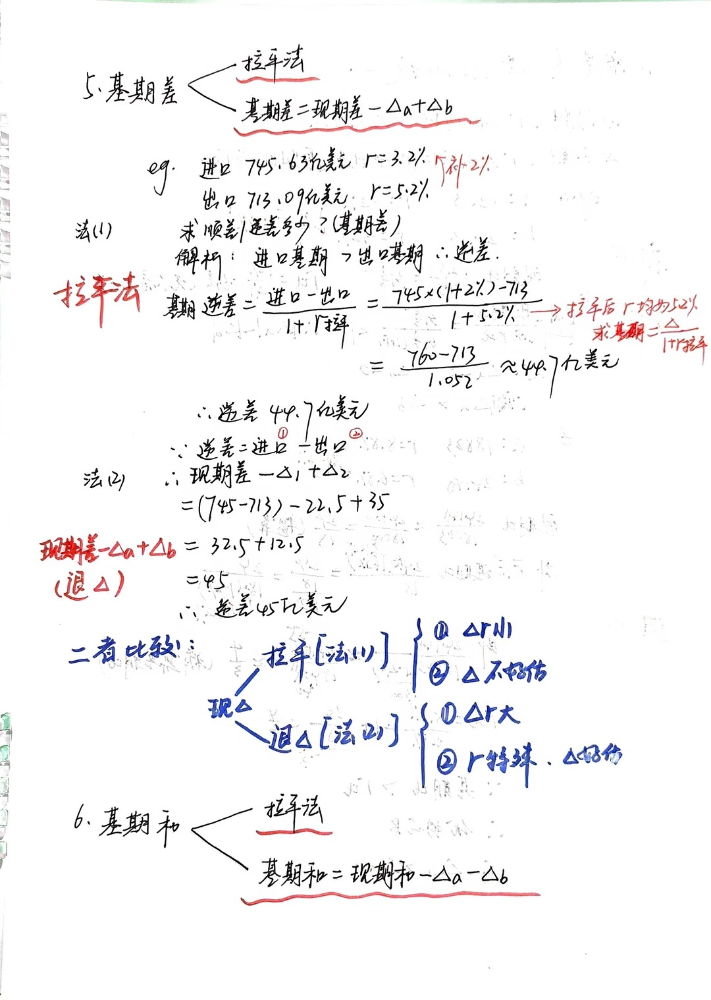

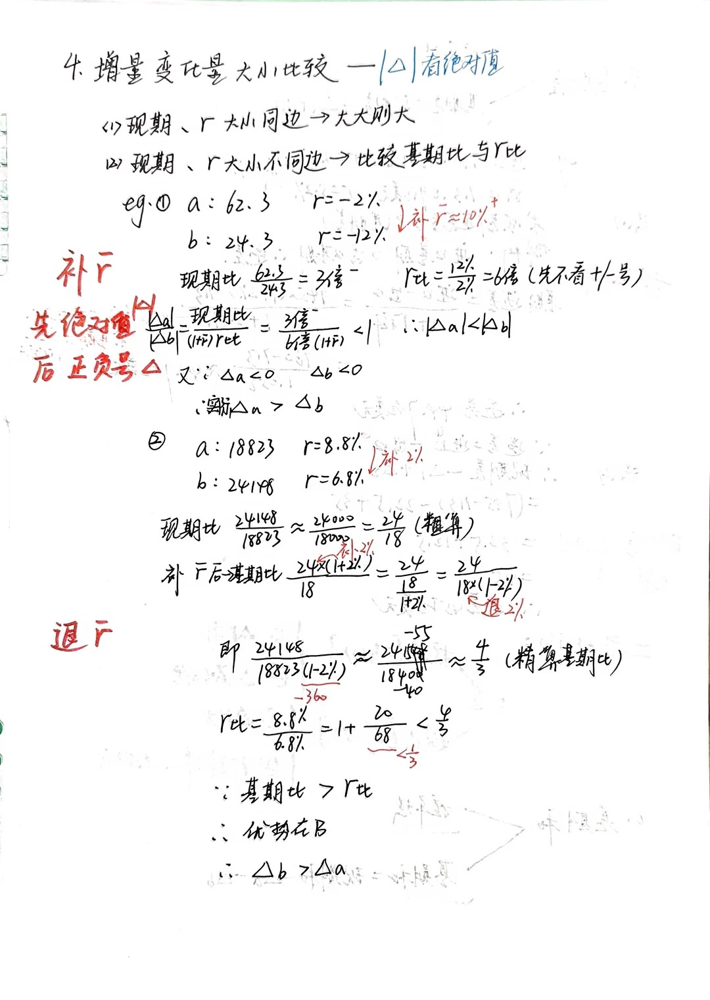

---

## 十一、增量估算小技巧：微调份数法（百化分微调）

> 📌 **原理**：现期 A、增速 r；若把 r 就近看成 $\frac1n$ 且与真实值差距较小，则现期比 ≈ 基期比 ≈ 增速反比，两者增量基本一致——可把增速转化为好算的百化分，**现期对应放大或缩小弥补误差**。
>
> **操作**：① 将增速转化为靠近的百化分；② 现期反向微调（增速看小了，现期调大一点；增速看大了，现期调小一点）。

**例 35（机床工具出口）** 2021 年 1—9 月我国机床工具对美国出口 17.5 亿美元、同比增长 27.4%。对美国出口额同比约增长多少亿美元？
A. 1.9　B. 2.3　C. 3.1　D. 3.8

> ✅ **解答**：27.4% ≈ 25% = 1/4，增速看小了 ⇒ 现期调大约 10%：17.5 + 1.7 ≈ 19；$\Delta=\dfrac{19}{5}=3.8$。**答案 D**。

**例 36（证券公司净收入）** 2019 年第一季度 131 家证券公司代理买卖证券业务净收入 221.49 亿元、同比增长 13.77%。2018 年第一季度约为：
A. 184.6 亿元　B. 190.1 亿元　C. 194.7 亿元　D. 204.2 亿元

> ✅ **解答**：13.77% ≈ 14.3% = 1/7，增速看大了 ⇒ 现期调小：221 → 200 附近，$\Delta\approx\dfrac{200}{8}=25$，基期 $\approx221-25=196$；或微调 $\dfrac{221-6}{114-3}\times100\approx194$。**答案 C**。

**例 37（2020 福建 · 答疑）** 2020 年一季度生猪出栏 13129 万头、下降 30.3%，猪肉产量 1038 万吨、下降 29.1%。一季度猪肉产量同比减少约多少万吨？
A. 439　B. 426　C. 302　D. 227

> ✅ **解答**：29.1% ≈ 28.6% = 2/7，增速看小了 ⇒ 现期调大：1038 + 15 ≈ 1053；$\Delta=1053\times\dfrac{2}{7-2}=210^+\times2=420^+$。**答案 B**。
> ⚠️ 减少量百化分：$\Delta=\dfrac{\text{现期}}{n-1}$ 的变形——下降 $\frac{2}{7}$ 时，减少量 = 假现期 × $\frac{2}{7-2}$。

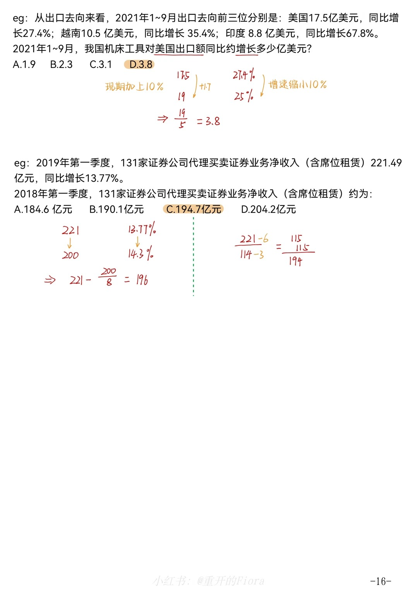

---

## 十二、易错点与常见误区

| # | 误区 | 正确认知 |
| --- | --- | --- |
| 1 | r̄ 的分母用错 | $\bar r=\dfrac{r_高-r_低}{1+r_低}$——分母是**被补偿方（低增速）**的 $1+r$，且 $r$ 带正负号代入 |
| 2 | 平均数方向判断相反 | 分子增速 > 分母增速 ⇒ 平均数**提高**；套公式前先定性，方向错了全盘皆错 |
| 3 | 题干增速与所问时段不一致 | 给全年增速问**前三季度**（例 2），必须先做百分点还原再套公式 |
| 4 | 基期比重死套常规公式 | 「现期比重 × (1+r₂)/(1+r₁)」要乘除两次；用**现期比 ÷ (1+r̄)** 一步到位 |
| 5 | r̄ 过大仍硬用估算 | r̄ 不方便估算或过大（如例 33 的 32 倍增速比）时，**老老实实分别算增量** |
| 6 | 负增量排序忘翻号 | 下降题先比 **\|Δ\|**（谁低谁补），得出绝对值大小后**再按负号翻回去**（\|Δ\| 大 ⇒ 实际增量小） |
| 7 | 「是几倍」与「多几倍」混淆 | 基期倍数 = 基期比（是几倍）；增长几倍 = 倍数 − 1。例 12 问「是」几倍直接取基期比 |
| 8 | 基期差只会一种算法 | Δr 小用**拉平法**；Δr 大、增速好百化分时用**退 Δ 法**（现期差 − Δa + Δb），两法可互验 |
| 9 | 百化分微调方向反了 | 增速**看小了** ⇒ 现期**调大**（如 27.4%→25%、29.1%→2/7）；增速看大了 ⇒ 现期调小 |
| 10 | 对象多时逐个补 r̄ | 只有**弱势方增速低**才需要补误差；对象 ≥3 个时直接分别算增量往往更快 |

---

## 十三、总结归纳

### 1. 知识框架

```
拉平增长率  r̄ = (r高 − r低)/(1 + r低) —— 谁低补谁，谁高退谁
├── 本源：平均数增长率 r = (r₁ − r₂)/(1 + r₂)（A = B/C 型分式增速）
│   └── 定性：分子快 ⇒ 升；分子慢 ⇒ 降；同步 ⇒ 不变
├── 时间维度
│   ├── 间隔增长率逆运算：总增速、一段增速 → 另一段增速
│   └── 基期环比增速：当月同比 vs 上月同比 ⇒ 环比同比升降
├── 比值维度（桥梁：基期比 = 现期比/(1+r̄)）
│   ├── 基期平均数 / 基期比重 / 基期倍数
│   └── 平均数增量 = 现期 × r̄（或两期硬算差）
├── 比较维度（跳板：补 r̄ 后在现期基础上比）
│   ├── 基期大小比较：情景一直接定 / 情景二补 r̄ 比
│   ├── 增量比较：大大则大 / 基期比 vs 增速比（补 r̄ 误差）
│   └── 增量比 = 基期比 × 增速比 = 现期比×增速比/(1+r̄)
└── 差和维度
    ├── 基期差：拉平法（Δr小）/ 退Δ法（Δr大）
    ├── 基期和：现期和 − Δa − Δb
    └── 微调份数法：增速百化分 + 现期反向微调
```

### 2. 实战决策流

> ① **先定性**：分子分母增速谁快？现期、增速是否同边？——一半题目到此出答案；
> ② **估算 r̄**：$\bar r=\frac{r_高-r_低}{1+r_低}$，一般只取整数百分点精度；
> ③ **补或退**：比较题补 r̄ 找跳板，求基期比除以 (1+r̄)；
> ④ **该硬算就硬算**：r̄ 过大、选项精度高、对象太多时，回归「分别算基期/增量」。

### 3. 与前后章节的联系

- 与 **05 增速的累积与拆分**：间隔增长率 $r=r_1+r_2+r_1r_2$ 的逆运算就是本章第三节；
- 与 **07 分式混合**：混合定量精算四步中「现期比 → 基期比」的换算工具就是拉平增长率；
- 与 **09 比重特殊问题**：基期比重、两期比重差的快速算法共享「现期比 ÷ (1+r̄)」思想；
- 与 **10 年均变化问题**：微调/二分估算增速的误差控制思想一脉相承。

---

> 📎 **资料来源**：小红书笔记 @小羊咩咩🌿《拉平增长率》（第五课框架全梳理）、@重开的Fiora《26版 | 小P资料分析 | 第四课：平均数增长率》（课堂全例题）、《补充：第五节课前答疑》（基期比较/增量比较例题整合版）。
