# 第七节 分式混合

> 💡 **本节定位**：分式混合研究的是「整体 = 部分₁ + 部分₂」结构下，**均值类属性**（增速、浓度、人均收入、利润率等）在整体与部分之间的数学关系。核心三句话：**混合后居中、偏向分母大的一侧、距离比 = 分母反比**。绝大多数题目「定性 + 代入」即可秒杀，精算是最后手段。

---

## 一、核心概念与定义

### 1. 什么是分式属性

> 📌 **定义**：能写成 $\dfrac{a}{b}$ 形式的**均值属性**，混合（分子相加、分母相加）后仍保持该属性。

| 分式属性 | 分子 | 分母 |
| --- | --- | --- |
| **增速** r | 增量 Δ | **基期** |
| 浓度 | 溶质 | 溶液 |
| 人均收入 | 总收入 | 人数 |
| 利润率 | 利润 | 成本 |
| 城镇化率 | 城镇人口 | 总人口 |

**混合公式**：分式属性为 $\dfrac{a}{b}$ 的部分与分式属性为 $\dfrac{c}{d}$ 的部分混合后：

$$
\text{混合属性} = \frac{a+c}{b+d}
$$

**增速版**（最常用）：上半年基期 $m$、增速 $r_1$；下半年基期 $n$、增速 $r_2$，则全年增速：

$$
r = \frac{\Delta_1+\Delta_2}{\text{基期}_1+\text{基期}_2} = \frac{m\cdot r_1 + n\cdot r_2}{m+n}
$$

即**混合增速 = 以基期为权的加权平均**。

### 2. 核心结论的推导（盐水模型）

两杯盐水：质量 $m$、浓度 $A$；质量 $n$、浓度 $B$。混合后浓度为 $C$：

$$
C = \frac{\text{溶质}}{\text{溶液}} = \frac{mA+nB}{m+n}
$$

展开 $mC + nC = mA + nB$，移项得 $m(C-A) = n(B-C)$，即：

$$
\boxed{\frac{C-A}{B-C} = \frac{n}{m}}
$$

> ⭐ **核心结论**：两部分分式属性值与混合后属性值的**距离比** = 各自分式属性**分母值的反比**。
> （增速问题中分母是**基期**，所以：增速距离比 = 基期反比）

### 3. 分式混合三步走

| 步骤 | 内容 | 作用 |
| --- | --- | --- |
| ① 范围 | 混合后位于两部分**之间** | 定性，排除选项 |
| ② 方向 | 更靠近**分母大**的一侧 | 定性，一般到这就出答案 |
| ③ 定量 | 根据分母反比确定线段距离比，确定混合后具体位置 | 代入验证为主 |

> ⚠️ **关键细节**：增速混合中基期比相对难确定，而选项精度一般不会太高，所以**两部分增速差距不大时，可用现期比代替基期比**估算；**增速差距过大时（如 21.5% vs 150%），必须先用拉平增长率把现期比换算成基期比**。

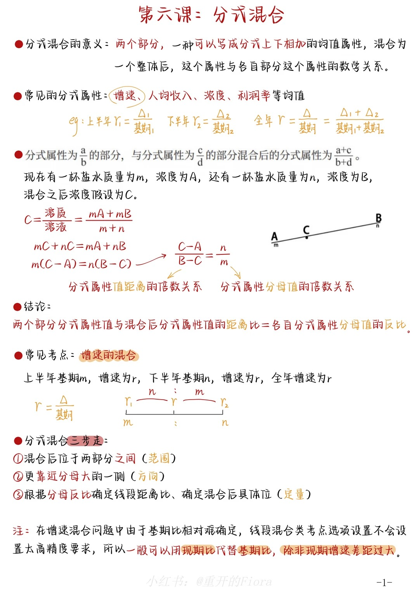

---

## 二、混合定性 vs 混合定量（区别与联系）

| 维度 | 混合定性 | 混合定量 |
| --- | --- | --- |
| **回答什么** | 混合后增速的**范围与方向** | 混合后增速的**具体值**（或某部分增速、分母比） |
| **工具** | 三步走之①②（居中 + 偏向） | 三步走之③（距离比 = 分母反比） |
| **方法** | 看中间值、比分母大小 | 代入验证为主，必要时精算四步 |
| **精度** | 低，只定区间 | 较高，但 99% 题目仍只需估算 |
| **耗时** | 秒级 | 数十秒 |

**联系**：定量建立在定性之上。实战顺序永远是 **先定性（排选项）→ 再代入（锁答案）→ 非必要不精算**。大部分题目做到定性即可选出答案。

**题型家族**（统一于「A − B + B = A」的结构）：

- **增速混合**：上半年 + 下半年 = 全年
- **均值混合**：城镇 + 农村 = 全国（人均收入、城镇化率等）
- **差值混合**：顺差 + 进口 = 出口；逆差 + 出口 = 进口；A − B + B = A

---

## 三、典型例题详解

### 题型 1：混合定性（范围 + 方向，不动笔秒杀）

**例 1（2023 山东）** 2021 年中国跨境电商交易规模 14.2 万亿元，其中出口跨境电商 11 万亿元、同比增速 13.4%；进口跨境电商 3.2 万亿元、同比增速 14.3%。2021 年我国跨境电商交易规模同比增长：
A. 12.8%　B. 13.4%　C. 13.6%　D. 14.3%

> ✅ **解答**：混合后位于 13.4% 与 14.3% **之间**，四个选项中只有 C（13.6%）落在区间内。**答案 C**。

**例 2（2019 北京）** 2017 年上半年 B 市科学研究和技术服务业增加值同比增长 10.0%，比一季度增幅扩大 1.4 个百分点。2017 年第二季度同比增速的范围是：
A. 小于 8.6%　B. 等于 8.6%　C. 大于 8.6% 且小于等于 10%　D. 大于 10%

> ✅ **解答**：一季度增速 = 10.0% − 1.4% = 8.6%。上半年 = 一季度 + 二季度混合，上半年 10% 居中 ⇒ 一季度 8.6% < 上半年 10% < 二季度增速。**答案 D**。

**例 3（2020 太阳能发电量）** 2020 年 1—2 月全国太阳能发电量 179.2 亿千瓦时、增速 12.0%，3 月发电量 128.9 亿千瓦时、增速 8.6%。2020 年第一季度同比增速是：
A. 9.7%　B. 10.0%　C. 10.3%　D. 10.6%

> ✅ **解答**：中间值 (8.6+12)/2 = 10.3%，混合后在中间无法直接排除。比较分母（基期）：1—2 月基期 > 3 月基期 ⇒ 混合增速更靠近 12.0%，即 10.3% < r < 12%。**答案 D**。

**例 4（2015 河北）** 2015 年河北省油料产量 79.17 万吨、增长 31.2%，水果产量 126.37 万吨、增长 2.4%。油料和水果总产量比 2014 年增产：
A. 2.3%　B. 11.9%　C. 16.9%　D. 24.9%

> ✅ **解答**：中间值 (2.4+31.2)/2 = 16.8%；水果基期 > 油料基期 ⇒ 混合增速更靠近水果，2.4% < r < 16.8%，只有 B 符合。**答案 B**。

**例 5（2021 北京）** 2016 年参加城镇职工基本医保的女性 1.4 亿人、比 2011 年增长 21.5%；参加城镇居民基本医保的女性 1.9 亿人、比 2011 年增长了 1.5 倍（150%）。2016 年参加两类医保的女性比 2011 年增长了约多少倍？
A. 0.7　B. 1.2　C. 1.7　D. 2.2

> ✅ **解答**：中间值 (21.5+150)/2 = 85.7%。城镇职工基期更大 ⇒ 21.5% < r < 85.7%，只有 A（0.7 倍 = 70%）符合。**答案 A**。
>
> ⚠️ 本题两部分增速差距极大（21.5% vs 150%），**不能直接用现期比** 1.4:1.9，要先用拉平增长率求基期比：$\frac{1.4\times(1+\bar r)}{1.9}\approx\frac{2.8}{1.9}\approx3:2$。精算验证：$r = 21.5\% + \frac{150\%-21.5\%}{2+3}\times2 \approx 72.9\%$，与 A 吻合。（非必要不精算，大部分题目估算即可。）

### 题型 2：混合定量——混合后增速估算

**例 6（2021 电信）** 2021 年固定数据及互联网业务收入 2601 亿元、增长 9.8%；移动数据及互联网业务收入 6409 亿元、增长 3.3%。全国数据及互联网业务总收入的同比增长率是：
A. 4.5%　B. 5.1%　C. 6.2%　D. 7.0%

> ✅ **解答**：
> ① 中间值 (3.3+9.8)/2 = 6.55%，移动数据基期更大 ⇒ r < 6.55%，排除 D；
> ② 3.3% 与 9.8% 差距不大，可暂用现期比 6409:2601 ≈ 2.5 倍代替基期比；
> ③ **代入验证**：代入 4.5% → 距离比 1.2:5.3 ≈ 4 倍多，不符合 2.5 倍；代入 5.1% → 距离比 1.8:4.7 ≈ 2.5 倍 ✓。**答案 B**。
>
> 💡 一般情况**代入更快**；精算（基期比 64(1+r̄)/26 ≈ 2.6，距离比 1:2.6，r = 3.3% + 6.5%/3.6 ≈ 5.1%）结果一致。

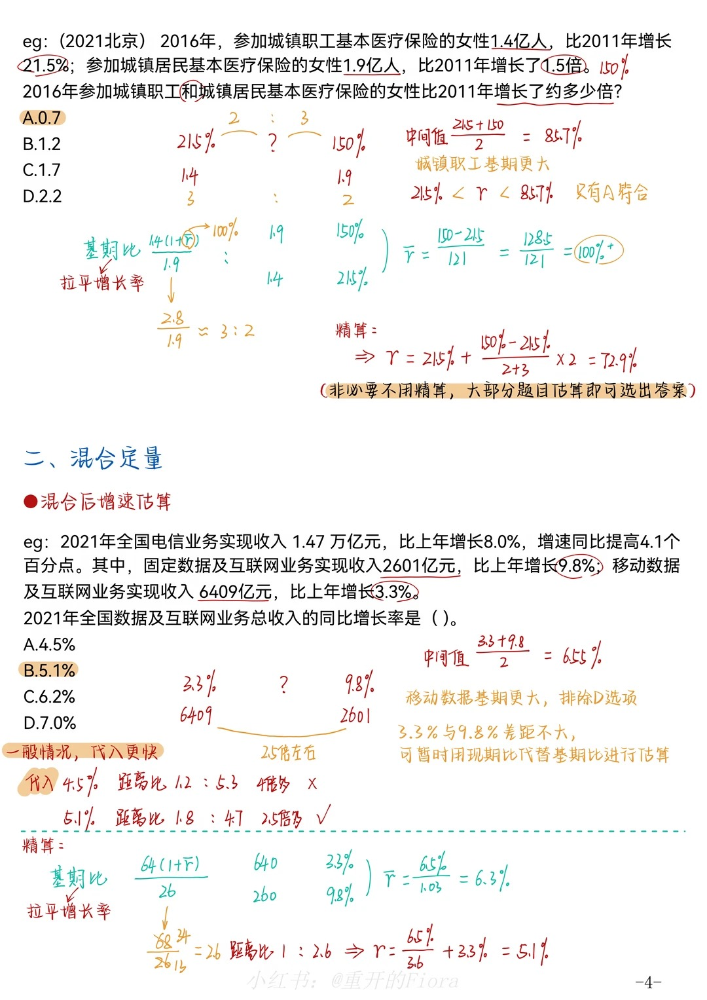

### 题型 3：部分增速估算（知整体 + 一部分，求另一部分）

**例 7（2015 水产品）** 2015 年上半年全国水产品产量 2700.09 万吨、增长 3.20%，其中养殖水产品 2114.38 万吨、增长 4.13%。非养殖水产品产量同比变化最接近：
A. −20%　B. 0%　C. 5%　D. 10%

> ✅ **解答**：非养殖现期 = 2700 − 2114 = 586 万吨。混合增速 3.2% 居中，养殖 4.13% 在右侧 ⇒ 非养殖增速 **r < 3.2%**，排除 C、D。代入 −20% → 距离比 23:1，而两部分量比只有 3~4 倍，不符合 ⇒ 选 **B（0%）**。

**例 8（2021 甘肃）** 2020 年互联网业务收入居前 5 名的广东、北京、上海、浙江、江苏共完成 10706 亿元、增长 15.1%；东部地区共 11227 亿元、增长 14.8%。东部地区除五省市之外的省份收入约比上年：
A. 增长 9%　B. 增长 19%　C. 减少 9%　D. 减少 19%

> ✅ **解答**：其余省份现期 = 11227 − 10706 = 521 亿元。14.8% 居中、15.1% 在右 ⇒ r < 14.8%。两部分现期比约 10706:521 ≈ 20 倍。代入 9% → 距离比 5.8:0.3 ≈ 20 倍 ✓。**答案 A**。

**例 9（2021 北京）** 2016 年 1—8 月全国一般公共预算收入 110178 亿元、增长 6.0%，其中税收收入 92637 亿元、增长 7.3%。非税收入同比：
A. 增长 0.4%　B. 下降 4%　C. 下降 0.4%　D. 增长 4%

> ✅ **解答**：非税现期 = 110178 − 92637 = 17541 亿元。6.0% 居中 ⇒ 非税增速 r < 6.0%。税收体量约为非税的 5 倍 ⇒ r ≈ 6% − (7.3%−6%)/0.2 × 0.2 ≈ −0.5% 左右，即小幅下降。**答案 C**。

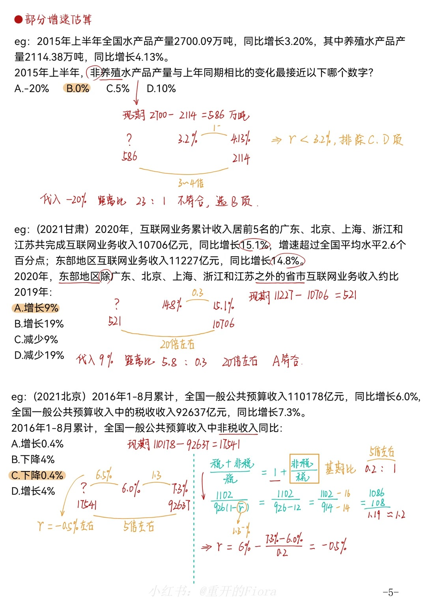

### 题型 4：精算四步（部分增速反推，99% 题目无需精算）

> 📌 **精算步骤**：
> ① $\dfrac{整体}{部分}$ 现期比 → 基期比（乘上拉平增长率修正）
> ② $\dfrac{整体}{部分}$ 基期比 − 1 = $\dfrac{另一部分}{部分}$ 基期比
> ③ 增速距离比（= 基期反比）
> ④ 另一部分增速

**例 10（2024 江苏泰州）** 猪牛羊禽肉产量 2.4 万吨、增长 31.5%，其中猪肉 2.2 万吨、增长 40.0%。2023 年该市牛羊禽肉产量比 2022 年：
A. 增长了 21.3%　B. 下降了 21.3%　C. 增长了 27.0%　D. 下降了 27.0%

> ✅ **解答**（本题两部分增速差距不大，但仍演示精算全流程）：
> ① 牛羊禽现期 = 2.4 − 2.2 = 0.2；整体/猪现期比 = 2.4/2.2 ≈ 1.09，增速差修正 $\frac{40-31.5}{131}\approx6.5\%$ ⇒ 基期比 = 1.09 × (1+6.5%) ≈ 1.16；
> ② 牛羊禽/猪基期比 = 1.16 − 1 = 0.16 : 1 ≈ 4 : 25；
> ③ 距离比 = 基期反比 = 25 : 4；
> ④ $r = 31.5\% - \frac{40\%-31.5\%}{4}\times25 \approx 31.5\% - 53\% = -21.3\%$。**答案 B**。
>
> 💡 更快做法：算出基期比 4:25（距离比 25:4）后**代入选项**——代入 −21.3%，距离 52.8:8.5 ≈ 25:4 ✓。

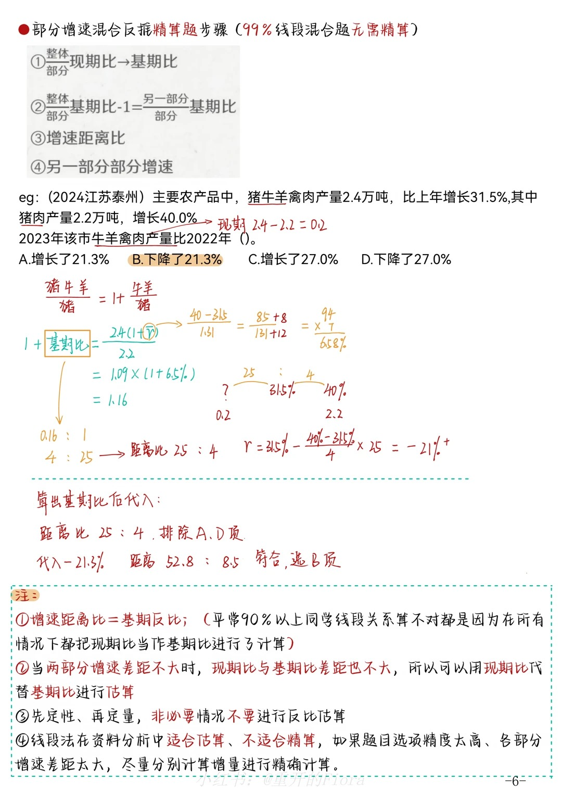

### 题型 5：反推分母比（基期比 / 人数比）

**例 11（2015 手机出货量）** 2015 年 1—6 月国内手机市场出货量同比增长 7.4%，第 1、2 季度分别增长 6.7% 和 8.2%。2014 年第 1 季度与第 2 季度出货量比值是：
A. 0.75　B. 0.88　C. 1.14　D. 1.81

> ✅ **解答**：增速距离 0.7 : 0.8 ⇒ 基期比 = 反比 = 8 : 7 ⇒ 比值 = 8/7 ≈ **1.14**。**答案 C**。
> ⚠️ 问的是 **2014 年**（基期）比值，恰好等于基期比，直接反比即可；若问 2015 年（现期）比值还需再乘增速修正。

**例 12（2019 A 市人数比）** 2019 年 A 市居民人均可支配收入 28920 元，城镇 37939 元，农村 15133 元。城镇居民与农村居民人数之比为：
A. 2:3　B. 3:2　C. 3:4　D. 4:3

> ✅ **解答**：人均收入的**分母是人数** ⇒ 距离比 = 人数反比。
> 距离：37939 − 28920 ≈ 9000⁺，28920 − 15133 ≈ 13800⁻ ⇒ 城镇:农村 ≈ 138 : 90 ≈ **3 : 2**。**答案 B**。
> 💡 同一题用人均消费支出（25785 / 20774 / 13112）或恩格尔系数（食品/总支出）也能推出相同人数比——**求人数比，找人均**。

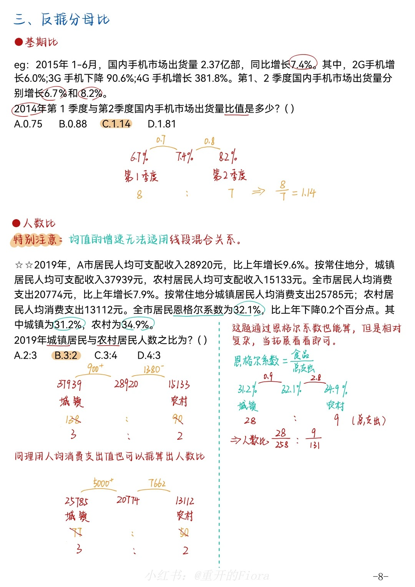

> ⚠️ **特别注意：均值的增速无法适用线段混合关系！**
> 例：M 实验室 20 人、N 实验室 16 人，把 M 最年轻的 6 人调入 N 后，N 的平均年龄增加 2 岁、M 的平均年龄增加 5 岁——两个"部分"的均值增速都 > 0，但**总年龄不变，整体增速 = 0**。若均值增速能混合，整体增速必须介于两部分之间，矛盾。
> 原因：均值的分母（人数）本身在变，$\frac{a}{b}$ 的分母不固定，(a+c)/(b+d) 的结构被破坏。

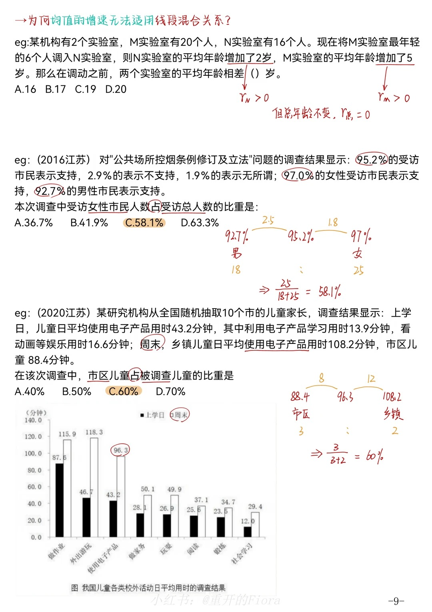

### 题型 6：特殊概念——顺差逆差（差值混合）

> 📌 **结构转换**：顺差 = 出口 − 进口 ⇒ **顺差 + 进口 = 出口**；逆差 = 进口 − 出口 ⇒ **逆差 + 出口 = 进口**。
> 任何 A − B + B = A 的结构，三者增速都构成线段混合关系。

**例 13（2023 机器人）** 2023 年 1—3 月我国机器人设备累计出口 1.9 亿美元、增长 62.1%，累计进口 6.9 亿美元、增长 55.1%。2023 年一季度进出口贸易逆差比上年同期：
A. 下降了不到 30%　B. 下降了 30% 以上　C. 上升了不到 30%　D. 上升了 30% 以上

> ✅ **解答**：逆差 + 出口 = 进口。逆差现期 = 6.9 − 1.9 = 5。进口 55.1% 居中，出口 62.1% 在右 ⇒ 逆差增速 < 55.1%。逆差基期(≈5) > 出口基期(≈1.2) ⇒ 进口增速更靠近逆差 ⇒ 逆差增速 > 55.1% − (62.1%−55.1%) = 48.5% > 30%。**答案 D**。

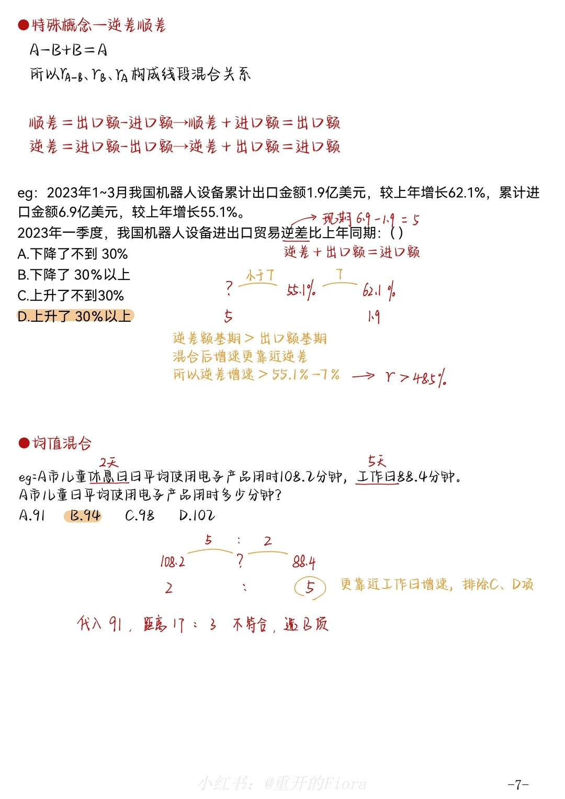

### 题型 7：均值混合（分母 = 人数 / 天数 / 户数）

**例 14（儿童用时）** A 市儿童休息日日均使用电子产品 108.2 分钟，工作日 88.4 分钟。A 市儿童日均用时多少分钟？
A. 91　B. 94　C. 98　D. 102

> ✅ **解答**：分母是天数，工作日 5 天、休息日 2 天 ⇒ 混合后更靠近 88.4，排除 C、D。代入 91 → 距离比 17:3 ≈ 5.7 ≠ 5:2 不符合 ⇒ **答案 B（94）**。

**例 15（2016 江苏控烟）** 95.2% 的受访市民支持控烟条例，其中 97.0% 的女性支持、92.7% 的男性支持。受访女性市民占受访总人数的比重是：
A. 36.7%　B. 41.9%　C. 58.1%　D. 63.3%

> ✅ **解答**：支持率的分母是人数 ⇒ 距离 2.5 : 1.8 ⇒ 女:男 = 2.5 : 1.8 ⇒ 女性占比 = 2.5/(2.5+1.8) ≈ **58.1%**。**答案 C**。

**例 16（2020 江苏儿童）** 周末乡镇儿童日均使用电子产品 108.2 分钟、市区儿童 88.4 分钟、总体 96.3 分钟。市区儿童占被调查儿童的比重是：
A. 40%　B. 50%　C. 60%　D. 70%

> ✅ **解答**：距离 8 : 12 = 2 : 3 ⇒ 市区:乡镇 = 3 : 2 ⇒ 市区占比 = 3/5 = **60%**。**答案 C**。

**例 17（2021 上海广东城镇化率）** 2019 年底广东全省城镇化率 71.4%，珠三角九市（常住人口 6447 万）城镇化率 86.28%，其他地区常住人口 5074 万。其他地区城镇化率：
A. 小于 40%　B. 在 40% 至 50% 之间　C. 在 50% 至 60% 之间　D. 大于 60%

> ✅ **解答**：71.4% 居中 ⇒ 其他地区 < 71.4%。距离上段 = 86.28 − 71.4 ≈ 15，两部分人口接近（分母值接近，其他地区略小）⇒ 下段距离略大于 15 ⇒ 其他地区 < 71.4% − 15% = 56.4%，且不会远低 ⇒ **答案 C**。

**例 18（2015 江苏城镇占比）** 2014 年全国居民人均可支配收入 20167 元，城镇 28844 元，农村 10489 元。2014 年城镇居民人数占全国居民的比重是：
A. 36.4%　B. 42.1%　C. 52.7%　D. 69.9%

> ✅ **解答**：距离 288−201 : 201−105 ≈ 87 : 96 ⇒ 城镇:农村 = 96 : 87 ⇒ 城镇占比 = 96/(96+87) ≈ 52%⁺。**答案 C**。

### 题型 8：均值比较混合 + 累计增速变化

> 📌 **原理**：[1~n] = [1~n−1] + n，即**当月累计增速**与**上月累计增速**、**当月增速**构成线段混合关系，$r_{1\sim n}$ 位于 $r_{1\sim n-1}$ 与 $r_n$ 之间。
>
> ⭐ **结论：只要增速不滑坡，当月就比累计多。**
> - 累计增速**提高** ⇒ 当月增速 **高于** 此前累计整体增速
> - 累计增速**降低** ⇒ 当月增速 **低于** 此前累计整体增速
> - 累计增速**不变** ⇒ 当月增速 **等于** 此前累计整体增速

**例 19（2022 机器人产量）** 2022 年 12 月工业机器人产量 4 万套、服务机器人 49.1 万套；1—12 月累计分别为 44.3 万套、645.8 万套。12 月产量与 1—11 月月均水平相比：
A. 均高于　B. 均低于　C. 仅①高于　D. 仅②高于

> ✅ **解答**：比较"12 月"与"1—12 月月均"即可（12 月与 1—11 月混合成全年）。
> 工业机器人：4 × 12 = 48 > 44.3 ⇒ 12 月 > 全年月均 > 1—11 月月均 ✓；
> 服务机器人：49.1 × 12 ≈ 589 < 645.8 ⇒ 12 月 < 全年月均 ✗。**答案 C**。
> 💡 **技巧**："某月 vs 之前月均"一律转化为"该月 × 12 vs 全年累计"。

**例 20（2022 软件业利润）** 2022 年 4—12 月，我国软件业**当月**利润同比增速**高于当月累计**增速的月份有几个？
A. 2　B. 3　C. 4　D. 5

> ✅ **解答**：数累计增速折线**上升**的月份（累计增速提高 ⇒ 当月 > 累计）。图中 1—6 月、1—10 月、1—11 月等累计增速环比上升的共 5 段。**答案 D**。

**例 21（2020 J 省发电量）** 2020 年 3—12 月，J 省当月发电量同比增速快于当月累计增速的月份有几个？
A. 5　B. 6　C. 7　D. 8

> ✅ **解答**：同上，数累计增速折线在 3—12 月区间内上升的段数，共 7 个。**答案 C**。

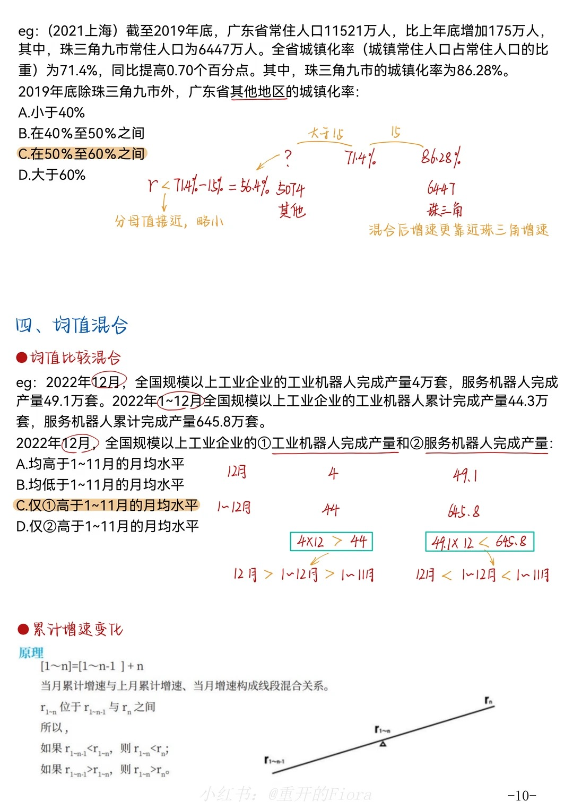

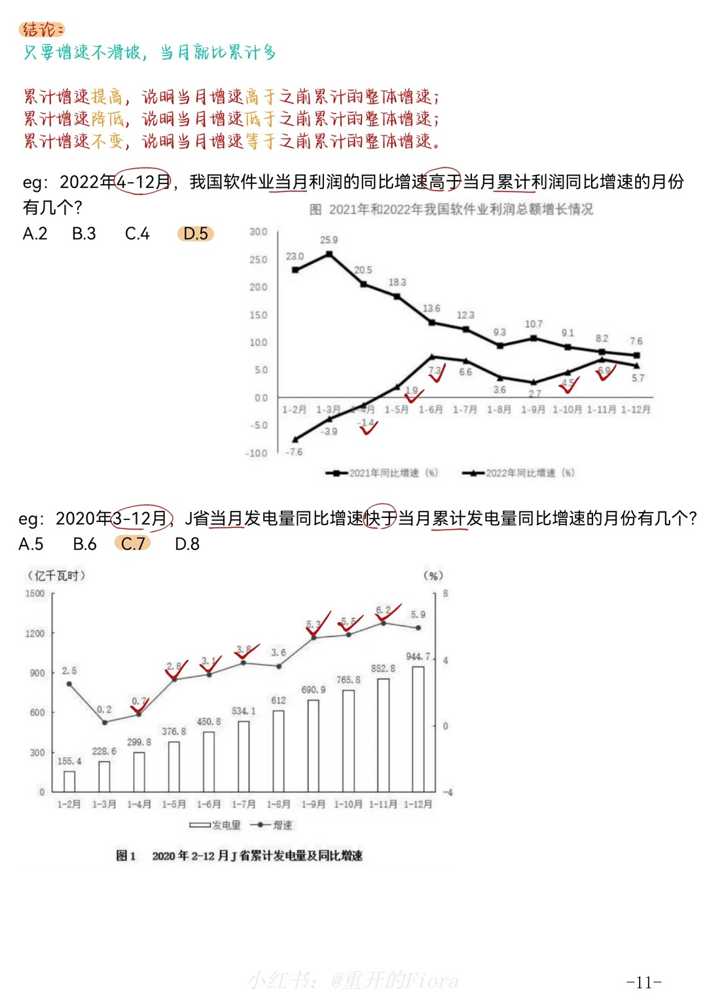

### 题型 9：差值估算与增量修正（基期差）

> 📌 **两层工具**：
> ① **差值混合**：(A − B) + B = A ⇒ 差值的增速满足线段混合，可估基期差的**增速**；
> ② **增量修正**（更普适）：$\boxed{\text{基期差} = \text{现期差} - \Delta A + \Delta B}$，其中 $A_0 - B_0 = (A-\Delta A) - (B-\Delta B)$。若 ΔA > ΔB，则基期差 < 现期差，反之更大。

**例 22（2017 集成电路逆差）** 2017 年我国集成电路进口 2601 亿美元、增长 14.59%，出口 670 亿美元、增长 8.96%。进出口贸易逆差额约同比增长：
A. 5.6%　B. 12.5%　C. 16.7%　D. 21.5%

> ✅ **解答**：逆差 + 出口 = 进口。逆差现期 = 2601 − 670 = 1930。进口 14.59% 居中 ⇒ 逆差增速 r > 14.59%。距离比 = 分母反比 ≈ 670 : 1930 ≈ 1 : 3 ⇒ r = 14.59% + (14.59 − 8.96)/3 ≈ 14.59% + 1.88% ≈ **16.5%**。**答案 C**。

**例 23（2016 重庆寿险）** 2015 年寿险原保险保费收入 13241.52 亿元、增长 21.46%，寿险给付 3565.17 亿元、增长 30.67%。2014 年保费收入比给付金额多：
A. 10902 亿元　B. 8174 亿元　C. 9676 亿元　D. 3800 亿元

> ✅ **解答**：① 现期差 = 13241 − 3565 = 9676（排除 C，C 是现期差陷阱）；② 比较增量：收入的量约为给付的 3 倍多、增速比约 1.5 倍 ⇒ Δ收入 > Δ给付；③ 基期差 = 现期差 9676 − Δ收入 + Δ给付 < 9676 ⇒ **答案 B**（估一下增量，差值到不了 D）。

**例 24（2015 上海汽车）** 2013 年 1—11 月汽车整车进口 107.34 万辆、增长 1.8%，出口 87.24 万辆、下降 6.4%。2012 年 1—11 月进口量比出口量多：
A. 不到 10 万辆　B. 10~20 万辆　C. 20~30 万辆　D. 30 万辆以上

> ✅ **解答**：① 现期差 = 107 − 87 = 20；② Δ进口为正、Δ出口为负；③ 基期差 = 20 − 正数 + 负数 < 20 ⇒ **答案 B**（估增量，差距到不了 A）。

**例 25（2022 用电占比差）** 2022 年 7 月全社会用电量 8324 亿千瓦时、增长 6.3%，其中第三产业 1591 亿千瓦时、增长 11.5%，城乡居民生活 1480 亿千瓦时、增长 26.8%。2021 年 7 月第三产业用电量的占比与城乡居民生活用电量的占比相较约：
A. 高 3.3%　B. 低 3.8%　C. 高 9.8%　D. 低 10.3%

> ✅ **解答**：① 现期差 = (1591 − 1480)/8324 = 111/8324 ≈ 1.4%；② 比较占比增量：第三产业占比增量 $\frac{(11.5\%-6.3\%)\times\frac{1591}{8324}}{1+11.5\%}$ **<** 城乡居民占比增量 $\frac{(26.8\%-6.3\%)\times\frac{1480}{8324}}{1+26.8\%}\approx3.3\%$；③ 基期差 = 现期差 1.4% − 小数 + 大数 ≈ **3.3%** ⇒ **答案 A**。

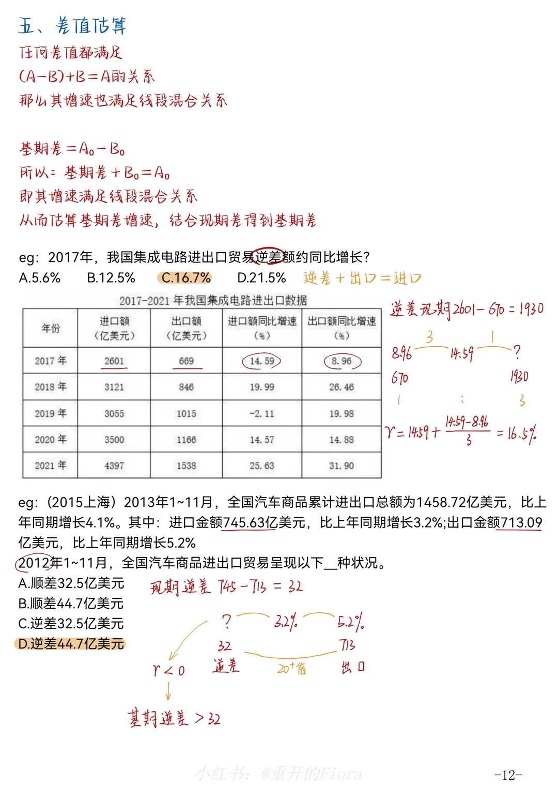

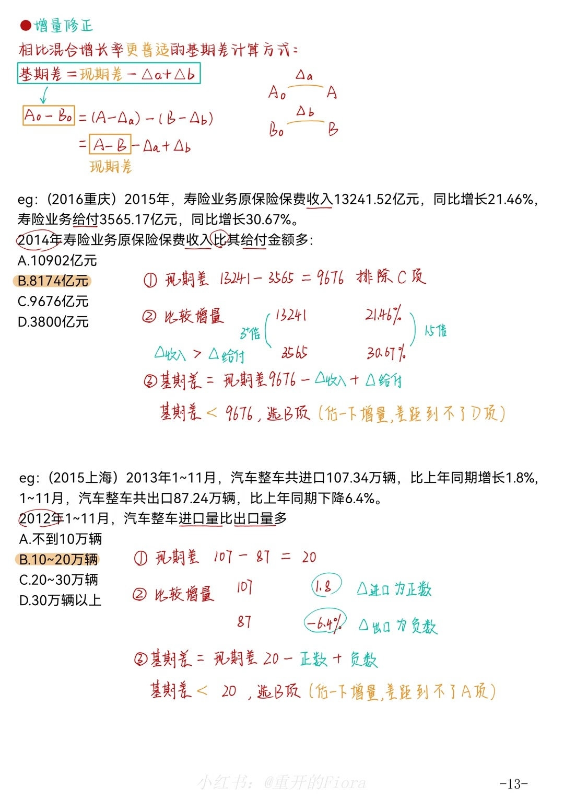

### 题型 10：精确计算（选项精度高、增速差距大时回归硬算）

**例 26（2022 四季度中式成药）** 2022 年第四季度我国中式成药出口金额同比增速约为：
A. −6%　B. −2%　C. 2%　D. 6%

> ✅ **解答**：10/11/12 月出口金额 2010/3390/3390 万美元，增速 −29.8%/48.4%/−1.6%——增速差距极大，线段法不可靠，**直接算基期、算增量**：
> 10 月基期 = 2010/(1−29.8%) ≈ 2864；11 月基期 = 3390/1.484 ≈ 2289；12 月基期 ≈ 3390 + 3390×1.6% ≈ 3444。
> 增速 = [(2010−2864) + (3390−2289) − 54] / (2864+2289+3444) = 193/8597 ≈ **2%**。**答案 C**。

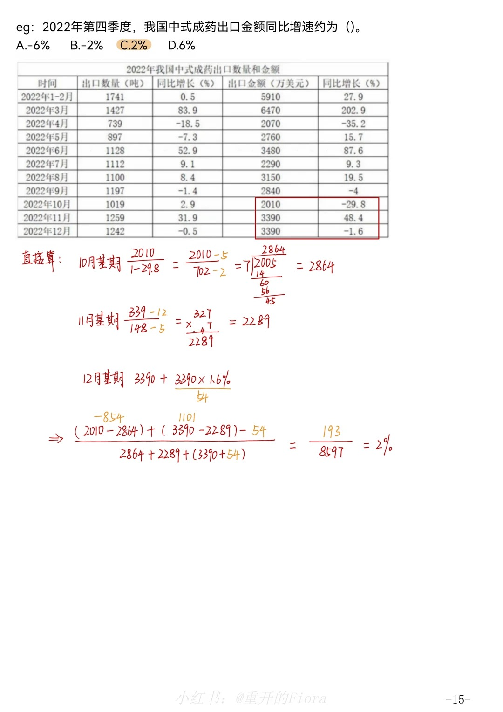

---

## 四、易错点与常见误区

| # | 误区 | 正确认知 |
| --- | --- | --- |
| 1 | 任何情况都拿**现期比**当分母比算距离 | 距离比 = 分母反比，增速问题分母是**基期**。只有两部分增速差距不大时才能用现期比代替基期比（90% 以上算错都源于此） |
| 2 | 增速差距悬殊（如 21.5% vs 150%）仍用现期比 | 必须先用**拉平增长率**把现期比换算成基期比 |
| 3 | 对**均值的增速**用线段混合 | 均值（人均收入等）的分母本身在变，其增速**不适用**线段混合；能混合的是均值本身（求人数比） |
| 4 | 用线段法硬算高精度答案 | 线段混合**适合估算、不适合精算**。选项精度高、各部分增速差距大时，回归"分别算基期 → 算增量"的精确计算 |
| 5 | 顺差逆差结构记反 | **顺差 + 进口 = 出口**；**逆差 + 出口 = 进口**（大数 = 小数 + 差） |
| 6 | 累计增速题直接拿单月增速比 | 用结论"增速不滑坡，当月比累计多"，数**累计增速折线上升段**即可 |
| 7 | "某月 vs 之前月均"逐月重算 | 转化为 **该月 × 12 vs 全年累计** 一步比较 |
| 8 | 现期差 / 基期差混淆 | 求基期差先算现期差，再用 **基期差 = 现期差 − ΔA + ΔB** 修正方向 |

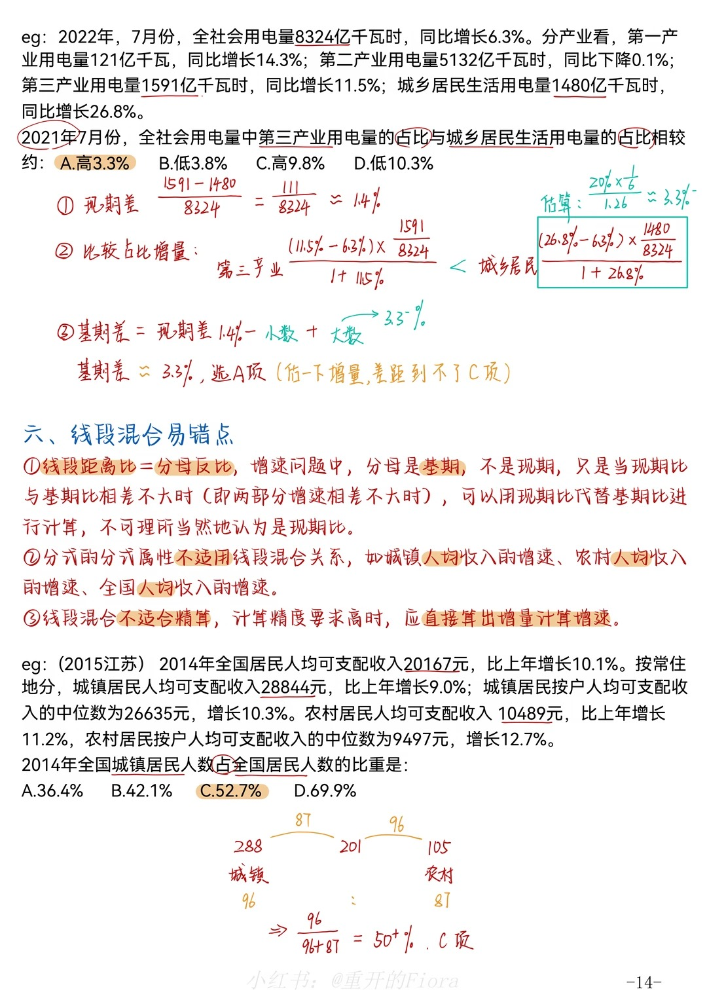

---

## 五、总结归纳

### 1. 知识框架

```
分式混合（a/b 与 c/d → (a+c)/(b+d)）
├── 核心：距离比 = 分母反比（增速问题分母 = 基期）
├── 三步走：① 居中定范围 → ② 偏向定方向 → ③ 反比定位置
├── 混合定性：范围 + 方向，秒杀大部分题
├── 混合定量
│   ├── 求混合后增速：定性排除 + 代入验证
│   ├── 求部分增速：同上；必要时精算四步
│   └── 求分母比：基期比（增速反比）/ 人数比（均值反比）
├── 特殊结构
│   ├── 顺差逆差：差 + 小 = 大，三者增速线段混合
│   ├── 累计增速：[1~n] = [1~n−1] + n → 增速不滑坡，当月比累计多
│   └── 基期差：基期差 = 现期差 − ΔA + ΔB
└── 底线：精度要求高 / 增速差距大 → 直接算增量硬算
```

### 2. 实战决策流

> ① **先定性**：混合后居中吗？靠近谁？→ 能选就走；
> ② **再代入**：把选项逐个放到线段上验证距离比 ≈ 分母反比；
> ③ **慎用精算**：基期比换算（拉平增长率）→ 距离比 → 答案；
> ④ **该硬算就硬算**：选项精度高、增速差距大时，分别求基期算增量。

### 3. 与前后章节的联系

- 与 **06 拉平增长率**：增速差距大时，现期比 → 基期比的换算工具；
- 与 **11 增长贡献率与拉动增长率**：都要用到"基期比 × 增速比"的思想，混合增速本质是增量按基期分摊；
- 与 **09 比重特殊问题**：占比增量比较（例 25）本质是分式混合在比重上的应用。

---

## 附：课后作业（共 15 题，建议用时 15—25 min）

> 第二篇笔记附带小 P 课后作业手写批改版，覆盖本课全部题型（r 混合 / 均值混合 / 线段混合 / 差值混合 / 基期比），可用于自测。

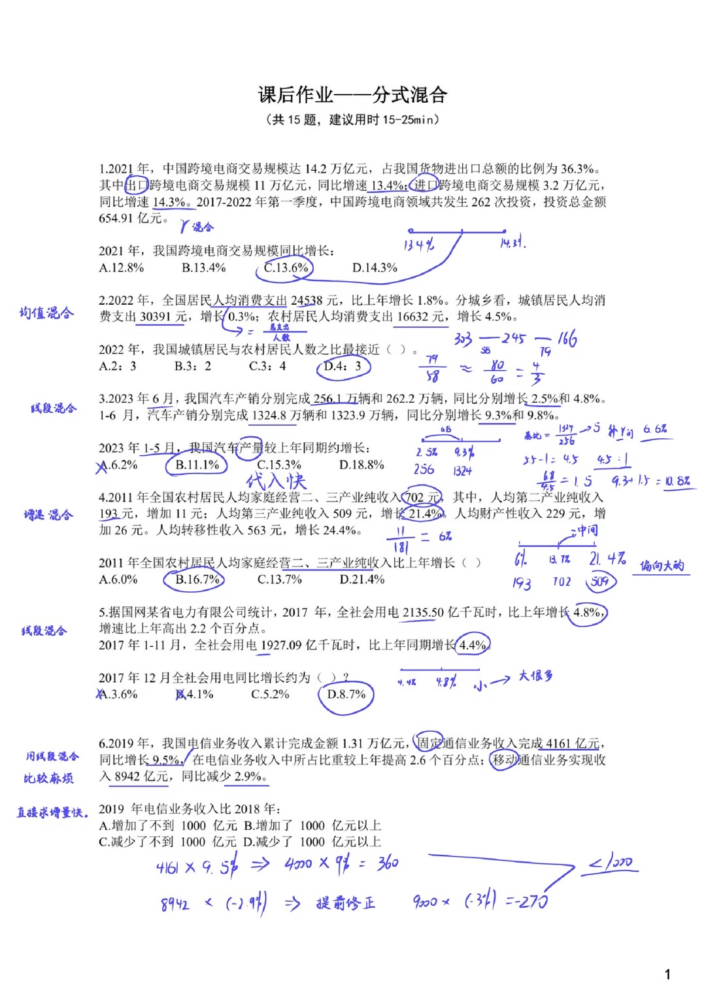

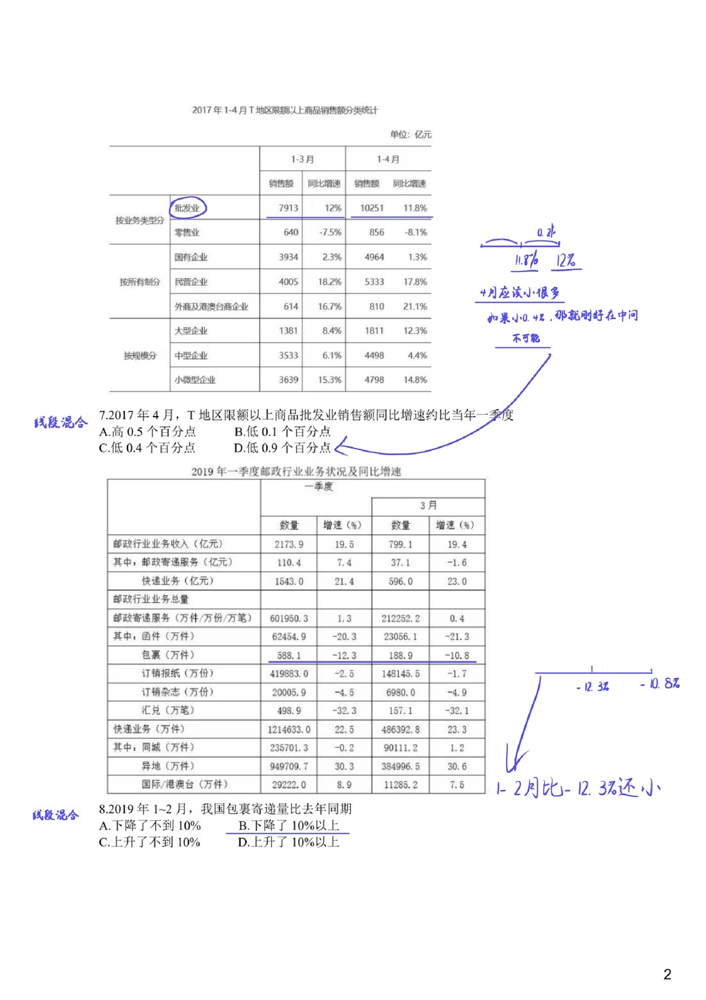

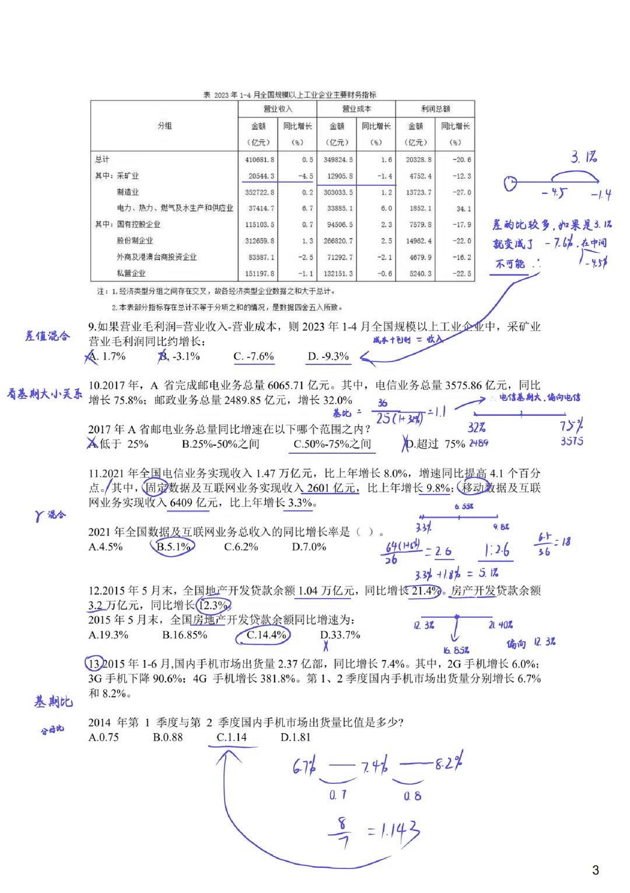

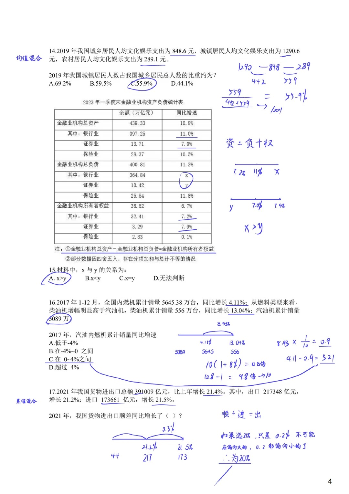

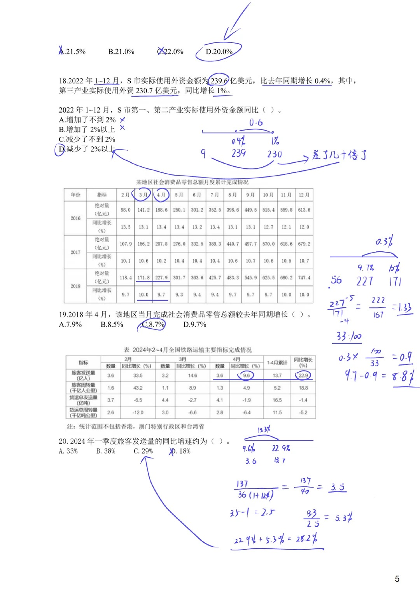

---

> 📎 **资料来源**：小红书笔记《26版 | 小P资料分析 | 第六课：分式混合》（@重开的Fiora，课堂笔记全例题）、《小p公考——分式混合》（@笆斗先生，含课后作业批改）。
