# 第八课 · 分式比较大小 —— 学习笔记

> 📌 课程定位：本课任务量不大，核心是教大家**比较"距离近"的分式大小**，这种比较最难。三大知识点：
> 1. **差分法**——基期越大，增速越近（用来比较两个很近的分式）；
> 2. **增速比较大小**——确定方向和远近，快速排除不可能的选项；
> 3. **A 与非 A 比较**——距离比等于分母的反比，避免多余加减运算。

## 🗺️ 课程框架总览

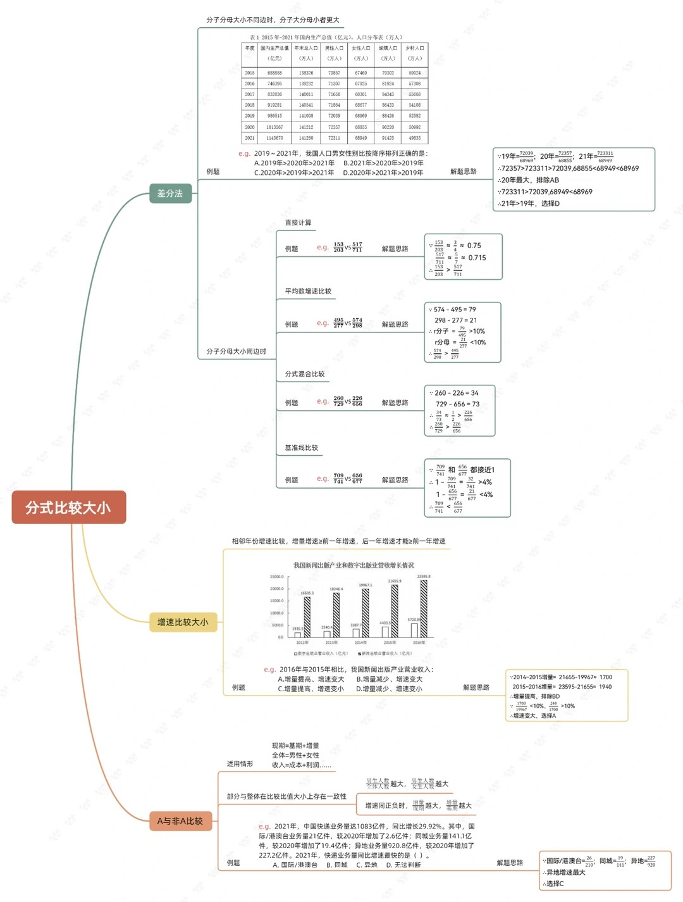

---

## 一、核心概念与基本逻辑

### 1.1 分式比较的两大类情形

| 情形 | 特征 | 策略 |
|---|---|---|
| **分子分母大小不同边** | 一个分式分子更大、分母反而更小 | **直接判断**：分子大、分母小者更大（"僧多粥少 / 狼多肉少"） |
| **分子分母大小同边** | 一个分式的分子和分母都更大 | 无法定性判断，需**定量计算**（差分法四法，见第二节） |

**例（不同边）**：$\dfrac{480}{175}$ vs $\dfrac{347}{194}$，因为 480 > 347 且 175 < 194，所以 $\dfrac{480}{175}$ 更大。

> 💡 实战价值：资料分析中大量"增速最快 / 比重最高"的题目，先用"分子最大且分母最小"直接锁定选项，往往瞪眼就出答案。

### 1.2 入门例题：直接看出答案

**例 1（2018 吉林）** 2019～2021 年，我国人口男女性别比按降序排列正确的是（ ）
A. 2019年>2020年>2021年　B. 2021年>2020年>2019年　C. 2020年>2019年>2021年　D. 2020年>2021年>2019年

**解答**：
- 2019 年男女比 = 72039/68969，2020 年 = 72357/68855，2021 年 = 72311/68949；
- 2020 年**分子最大、分母最小**（相当于钱最多、人最少，人均就最大）→ 2020 年最高，排除 A、B；
- 比较 2019 与 2021：2021 年分子更大、分母更小 → 2021 > 2019，排除 C；
- **选 D**。

> ⚠️ 细节：一般分子分母保留三位即可看出排序；但本题三个分式很接近，保留 5 位更保险。

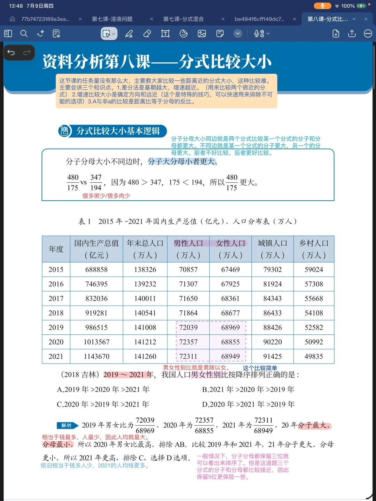

---

## 二、分子分母大小同边时：四大定量方法

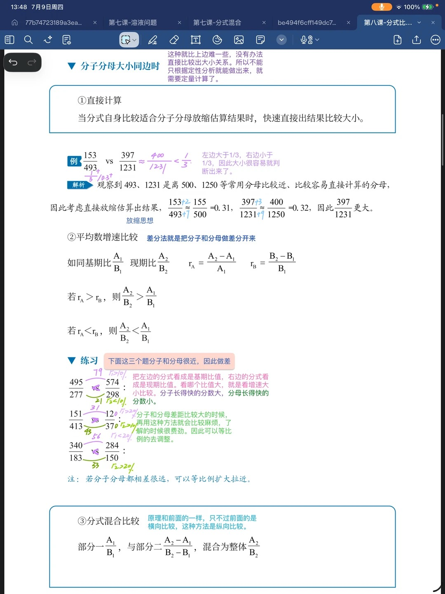

### 2.1 方法一：直接计算（放缩估算）

当分式自身适合**分子分母放缩估算**出结果时，快速直接算出结果再比较。

**例 2**：$\dfrac{153}{493}$ vs $\dfrac{397}{1231}$

**解答**：观察到 493、1231 离 500、1250 等常用好算的分母很近，放缩估算：
- $\dfrac{153}{493}\approx\dfrac{155}{500}=0.31$（左边 > 1/3？不，左边 < 1/3）
- $\dfrac{397}{1231}\approx\dfrac{400}{1250}=0.32$
- 因此 $\dfrac{397}{1231}$ 更大。

**配套技巧——代入验算**：存在可以快速出结果的分式时，先算一个，再代入乘另一个分式的分母比较分子大小。
- 如左式 ≈ 31%，验算右边：1231 × 31% ≈ 381.6 < 397 → 右边更大。

> 💡 何时直接计算更快：分母接近整百整千、或分式接近常见分数时，直接算反而比差分快。笔记中 $\frac{153}{203}>\frac{517}{711}$、$\frac{741}{1142}>\frac{220}{344}$、$\frac{513}{1117}>\frac{36}{85}$ 三组均为"直接计算更快"的典型。

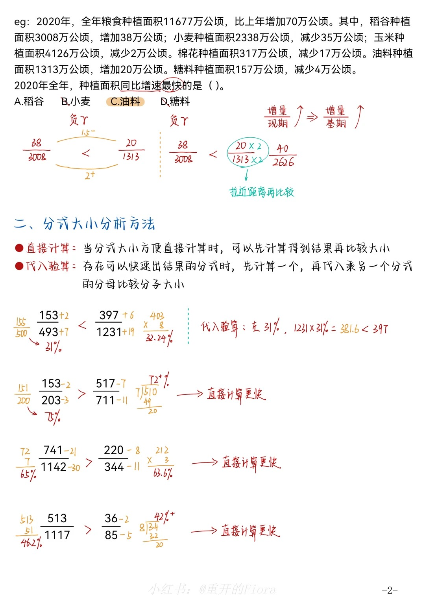

### 2.2 方法二：平均数增速比较（差分法·横向）

**原理**：把分子和分母做差分开，比较"分子的增速"与"分母的增速"。

如同基期比 $\dfrac{A_1}{B_1}$、现期比 $\dfrac{A_2}{B_2}$，定义：

$$r_A=\frac{A_2-A_1}{A_1},\qquad r_B=\frac{B_2-B_1}{B_1}$$

- 若 $r_A>r_B$（分子增速快），则 $\dfrac{A_2}{B_2}>\dfrac{A_1}{B_1}$（分式变大）
- 若 $r_A<r_B$（分母增速快），则 $\dfrac{A_2}{B_2}<\dfrac{A_1}{B_1}$（分式变小）

> 📐 **补充证明（笔记未展开，自行推导）**：
> $r_A>r_B \iff \dfrac{A_2}{A_1}-1>\dfrac{B_2}{B_1}-1 \iff \dfrac{A_2}{A_1}>\dfrac{B_2}{B_1} \iff A_2B_1>A_1B_2 \iff \dfrac{A_2}{B_2}>\dfrac{A_1}{B_1}$。
> 交叉相乘即得，非常干净。

**例 3（差分法三组经典练习）**：

| 比较 | 分子差/原分子 | 分母差/原分母 | 结论 |
|---|---|---|---|
| 495/277 vs 574/298 | 79/495 ≈ 16% | 21/277 ≈ 8% | 分子增速快 → **574/298 大** |
| 151/413 vs 120/370 | 31/120 ≈ 26% | 43/370 ≈ 12% | 分子增速明显更大 → **151/413 大** |
| 340/183 vs 284/150 | 56/284 ≈ 20%⁻ | 33/150 = 22% | 分母增速更大 → **340/183 < 284/150 大** |

> 💡 技巧：若分子分母都相差很远，可以**等比例扩大拉近**再比较差分（如 ×2、×5 把两对数拉到同一量级）。
> 💡 把左边分式看成基期比值、右边看成现期比值，"分子长得快的分数大，分母长得快的分数小"。

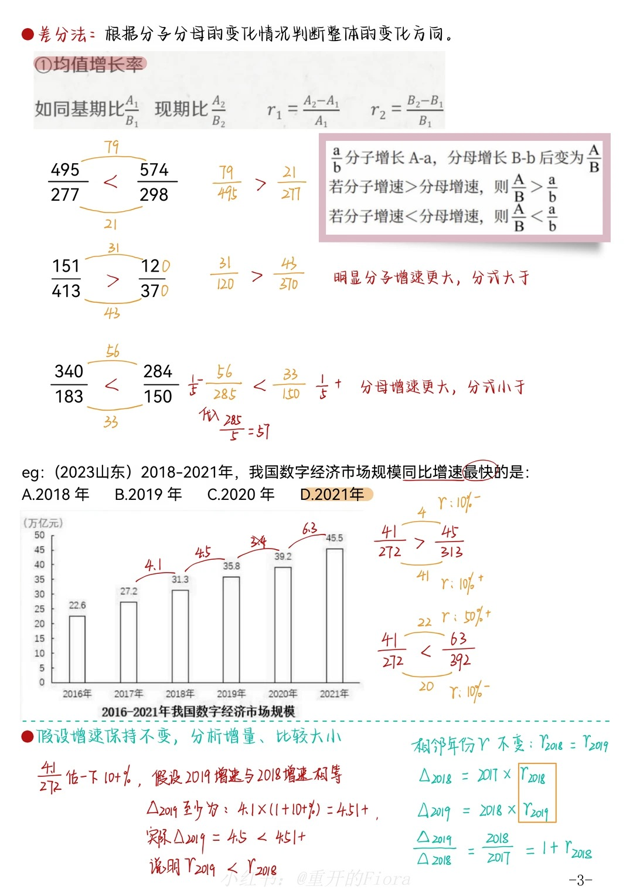

### 2.3 方法三：分式混合比较（差分法·纵向）

**原理**：部分一 $\dfrac{A_1}{B_1}$ 与部分二 $\dfrac{A_2-A_1}{B_2-B_1}$，混合为整体 $\dfrac{A_2}{B_2}$。

$$\frac{a}{b}\ \text{与}\ \frac{A-a}{B-b}\ \text{混合为}\ \frac{A}{B}\ \Rightarrow\ \frac{A}{B}\ \text{一定介于两者之间}$$

即 $\dfrac{a}{b}<\dfrac{A}{B}<\dfrac{A-a}{B-b}$，或者 $\dfrac{a}{b}>\dfrac{A}{B}>\dfrac{A-a}{B-b}$。

> 🧪 类比：两杯不同浓度的盐水混合，混合后的浓度必然介于两杯之间——这就是"溶液混合"思想在分式中的运用（与第七课分式混合一脉相承）。原理与平均数增速比较相同，只不过前者是**横向**比较，这里是**纵向**比较。

**例 4**：$\dfrac{260}{729}$ vs $\dfrac{226}{656}$

**解答**：差分得 $\dfrac{260-226}{729-656}=\dfrac{34}{73}$。可看成 34/73 的浓度与 226/656 的浓度混合成 260/729：
- $\dfrac{226}{656}\approx\dfrac{1}{3}^-$，$\dfrac{34}{73}\approx\dfrac{1}{2}^-$，混合后 $\dfrac{260}{729}$ 介于两者之间；
- 即 $\dfrac{226}{656}<\dfrac{260}{729}<\dfrac{34}{73}$ → **260/729 更大**。

**练习对照**：574/2982 vs 495/2771：差分 79/211 ≈ 1/3⁺ > 495/2771 ≈ 1/5⁻ → 574/2982 混合在两者之间 → **574/2982 > 495/2771**。

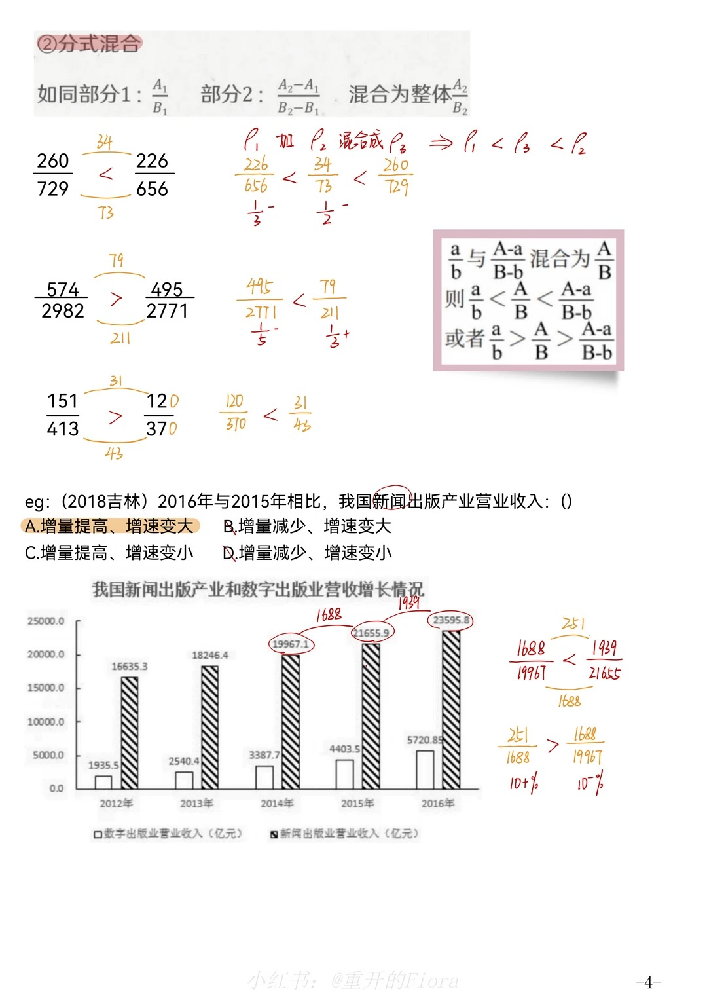

**例 5（2018 吉林）** 2016 年与 2015 年相比，我国新闻出版产业营业收入（ ）
A. 增量提高、增速变大　B. 增量减少、增速变大　C. 增量提高、增速变小　D. 增量减少、增速变小

**解答**：
- 2015 年增量 = 21655.9 − 19967.1 ≈ 1688；2016 年增量 = 23595.8 − 21655.9 ≈ 1940 → 增量提高，排除 B、D；
- 增速比较：1688/19967 vs 1940/21655。差分：$\dfrac{1940-1688}{21655-19967}=\dfrac{251}{1688}\approx15\%$，明显大于 1688/19967 ≈ 8.5%；
- 1940/21655 混合在 251/1688 与 1688/19967 之间 → 1940/21655 > 1688/19967，**增速变大**；
- **选 A**（本质上就是利滚利的思想：1940 比 1688 高出明显不止 10%，而 2015 年增速 1688÷19967 明显低于 10%，所以 2016 年增速提高）。

### 2.4 方法四：基准线法

**原理**：方法②③强调"等比例扩大拉近可辅助判断"，正是因为**靠得越近，差距越重要、越明显**。基准线法是一样的原理——当分式离某个**常用且好算的值**（比如 1、0.5、0.1）很近时，统一减去这个值（或看到这个值的距离），通过**差距**判定大小关系。

**例 6（四组经典练习）**：

| 比较 | 基准 | 差距比较 | 结论 |
|---|---|---|---|
| 709/741 vs 656/677 | 都接近 1 | 距 1：32/741 > 21/677 | 左边距离 1 更远 → **656/677 更大** |
| 741/709 vs 677/656 | 都略大于 1 | 多了：32/709 > 21/656 | 左边多出的距离更远 → **741/709 更大** |
| 514/1180 vs 356/656 | 都接近 1/2 | 距 1/2：76/1180 > 28/656 | 左边距离更远 → **356/656 更大** |
| 314/3065 vs 481/4722 | 都略大于 1/10 | 多了：8.5/3065 > 8.8/4722 | 左边多出的距离更远 → **314/3065 更大** |

> ⚠️ 方向别搞反：**都小于基准**时，距基准近者大；**都大于基准**时，超出基准多者大。口诀：距离更近，分式更大（小于基准时）；多的距离更远，分式更大（大于基准时）。

**例 7（2013 浙江）** 第二产业增加值占 GDP 的比重最高的是（ ）
A. 湖州市　B. 宁波市　C. 嘉兴市　D. 绍兴市

**解答**：四个选项对应比重分别为 888/1662、3517/6524、1621/2885、1949/3620，观察发现都**比 0.5 略大**，以 0.5 为基准作差突出差距：
- 湖州：(888−831)/1662 = 57/1662
- 宁波：(3517−3262)/6524 = 255/6524
- 嘉兴：(1621−1442)/2885 = **179/2885**
- 绍兴：(1949−1810)/3620 = 139/3620
- 179/2885（≈6.2%）明显高于其他三个 → 嘉兴市比重最高，**选 C**。

> ⚠️ 名词陷阱："第二产业增加值"不是"第二产业增加的量"，而是把它看成一个整体，相当于一个现期值。
> 💡 做完减法之后简单估算一下就可以了，会很明显地看出谁大谁小。

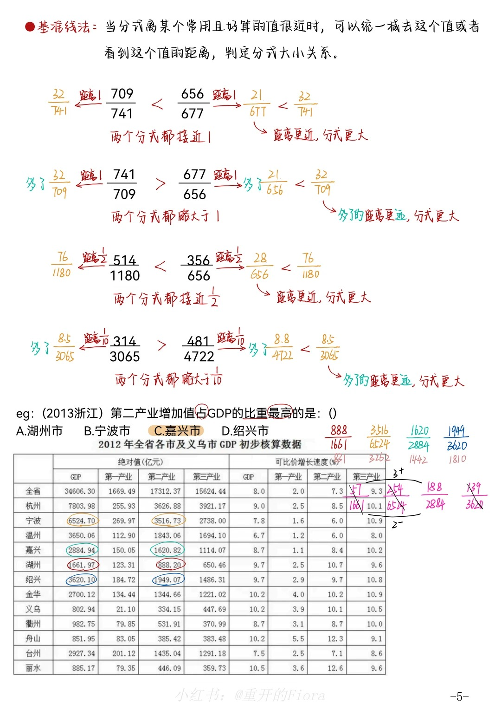

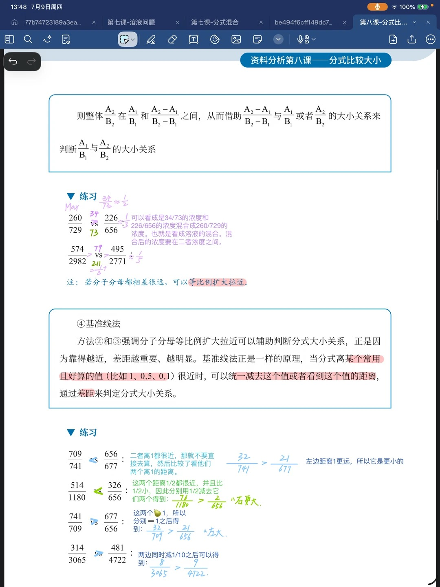

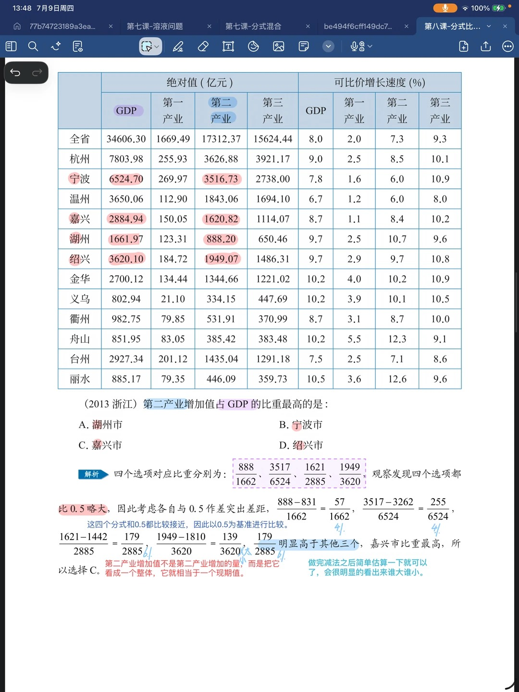

### 2.5 四大方法的区别与联系

| 方法 | 适用场景 | 核心动作 | 比较方向 |
|---|---|---|---|
| 直接计算/放缩 | 分母接近好算的数、分式接近常见分数 | 放缩估算出结果 | 直接出值 |
| 平均数增速比较 | 两个分式分子分母同大且**接近** | 分别算分子、分母增速 | **横向**（基期比→现期比） |
| 分式混合比较 | 有"部分+部分=整体"结构 | 差分出"增量浓度"，利用整体居中 | **纵向**（两盐水混合） |
| 基准线法 | 分式都离 1、0.5、0.1 等很近 | 统一减基准值，比差距 | 距离定大小 |

**联系**：四法同源——都是"把分子分母的变化拆开看"。差分法（②③）靠的是"等比例变化不改变分式大小"，基准线法靠的是"同减一个基准不改变大小顺序"，而 ①是兜底通法。分子分母相差很远时，②③④都可以先**等比例扩大拉近**再用。

> 💡 补充——**代入验算法**（笔记中单独提及）：存在可以快速出结果的分式时，先计算一个，再代入乘另一个分式的分母比较分子大小（如 1231×31%≈381.6 < 397）。

---

## 三、增速比较大小技巧（连续年份）

### 3.1 核心结论

> 🔑 **相邻年份增速比较：只有后一年增量比前一年增量高出的比例 ≥ 前一年增速，后一年增速才能 ≥ 前一年增速。**
> 口诀：**要想增速不降低，增量跟着上"楼梯"**（等比例扩大）。

一般来说，连续年份比较增速大小的题目中，柱状图数据都是逐年增加的。**如果增量同比降低，则增速必然同比降低**（基期还在变大，分子变小分母变大，双重打击）。

### 3.2 公式证明

$$r_{2025}=\frac{2025\text{增量}}{2024\text{年}}=\frac{2025\text{增量}}{2023\text{年}\times(1+r_{2024})},\qquad r_{2024}=\frac{2024\text{增量}}{2023\text{年}}$$

若 $r_{2025}\geq r_{2024}$，则：

$$\frac{2025\text{增量}}{2023\text{年}\times(1+r_{2024})}\geq\frac{2024\text{增量}}{2023\text{年}}\ \Rightarrow\ \boxed{2025\text{增量}\geq 2024\text{增量}\times(1+r_{2024})}$$

即相邻年份 r 不变时，$\dfrac{\Delta_{2019}}{\Delta_{2018}}=\dfrac{2018}{2017}=1+r_{2018}$——**增量必须按 (1+r) 的比例放大**。

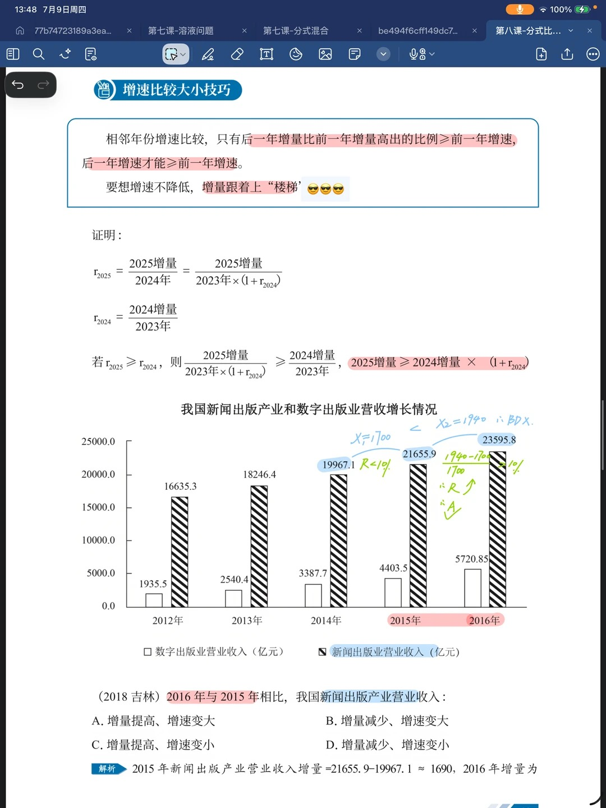

### 3.3 典型例题

**例 8（宽带用户）** 比较 2013 与 2014 年固定互联网宽带接入用户增速。
**解答**：
1. 估一下 r₂₀₁₃ = 17000/23280，大于 50%；
2. 假设 r₂₀₁₄ = 50%，则 Δ₂₀₁₄ 应为 Δ₂₀₁₃×(1+50%) = 17000×1.5 = 25500；
3. 实际 Δ₂₀₁₄ = 18000⁺，明显达不到 → r₂₀₁₃ > r₂₀₁₄。

**例 9（2023 山东）** 2018-2021 年，我国数字经济市场规模同比增速最快的是（ ）
A. 2018年　B. 2019年　C. 2020年　D. 2021年

**解答**：
- 18-21 年增量分别为 4.1、4.5、3.4、6.3；
- 19 年增量 4.5 比 4.1 高了不到 10%，而 18 年增速 4.1÷27.2 明显超过 10% → 19 年增速下滑；20 年增量下降，更是下滑（基期是不断增加的，先排除 2020 年——别的年份都在欣欣向荣，只有它越来越回旋）；
- 只需比较 18 和 21 年：18 年增速 = 4.1/27.2，21 年增速 = 6.3/39.2。6.3 比 4.1 高出不止 50%，39.2 比 27.2 高出不到 50% → 21 年增速更高；
- （或分式混合思路：差分得到 2.2/12 > 1/6 > 4.1/27.2，6.3/39.2 混合在两者之间，所以 6.3/39.2 > 4.1/27.2）
- **选 D**。

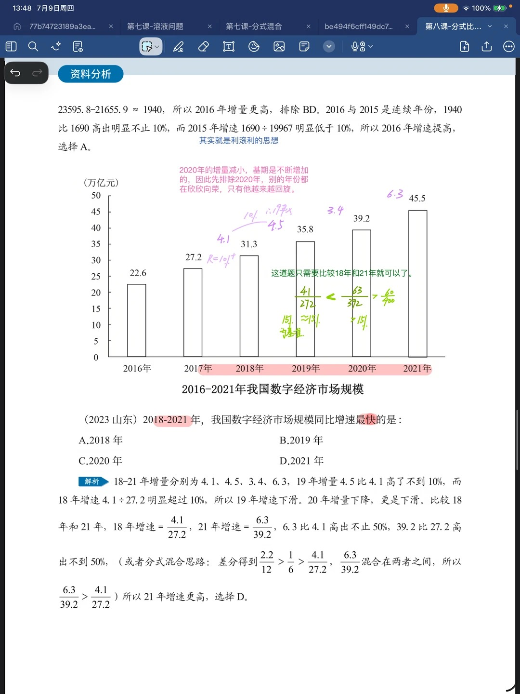

**例 10** 2012-2015 年，福建省哪一年的全部工业增加值增速最快？（ ）
A. 2015年　B. 2014年　C. 2013年　D. 2012年

**解答**：
- 2012-2015 年增量分别为 866、914、971、548；
- 15 年增量下滑，首先排除（基期一直增加，15 年增量反倒下降）；
- 12 年增速明显 > 10%，而 13 年增量 914 并未比 866 高出 10% → 13 年增速下滑（利滚利滚不起来），排除；14 年同理排除；
- 比较 12 和 14 年：866/7675 vs 971/9455，都比 10% 高出一些，**统一减去 10%**（基准线法）：
  - (866−766)/7675 = 100/7675 ≈ 1.30%
  - (971−945)/9455 = 26/9455 ≈ 0.27%
- 明显 12 年更高，**选 D**。

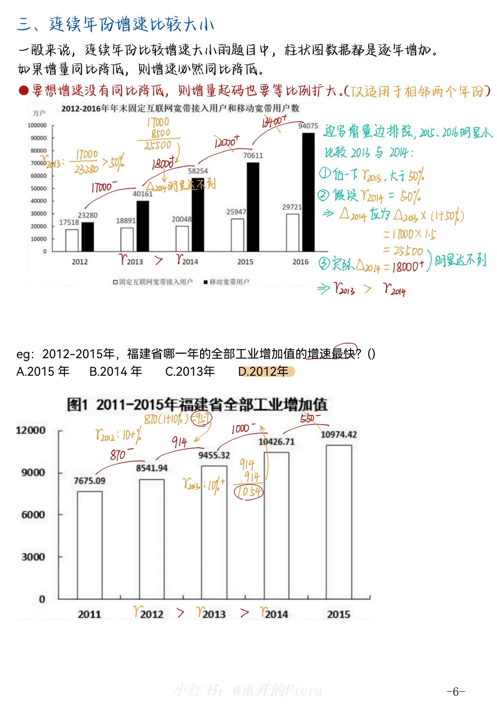

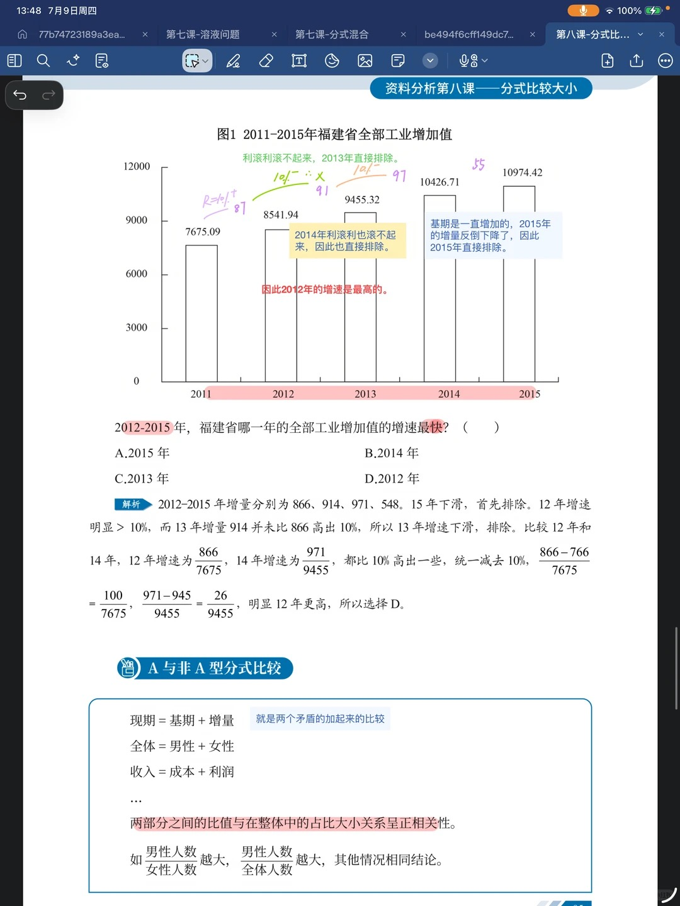

**例 11（2024 山东）** 2018-2022 年，中国国内旅游收入同比增速最大的年份是（ ）
A. 2021年　B. 2019年　C. 2022年　D. 2018年

**解答**：
- 各年增量：2018 年 0.64、2019 年 0.59、2021 年 2.91、2022 年增量为负（下降，排除）；
- 2020 年基数骤降后，明显 **r₂₀₂₁ 的分子（增量 2.91）最大且分母（基期 2.23）最小**——不同边情形，直接当选；
- **选 A**。

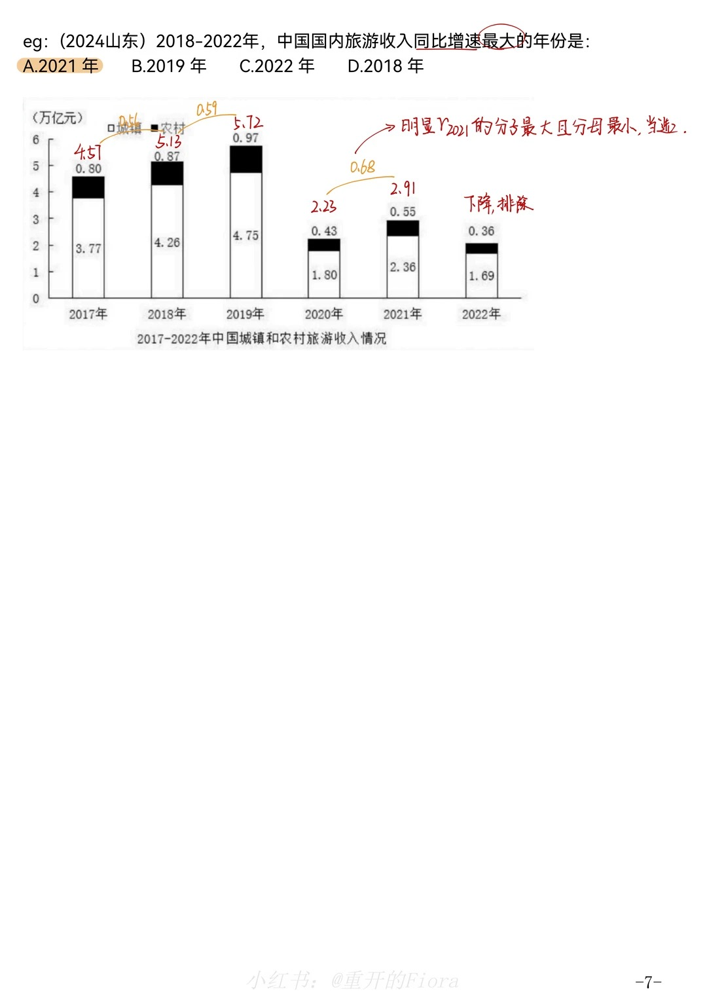

---

## 四、A 与非 A 型分式比较（混合型分式）

### 4.1 适用情形与结论

题干常给"整体 = A + 非A"的结构：

$$\text{现期}=\text{基期}+\text{增量},\qquad \text{全体}=\text{男性}+\text{女性},\qquad \text{收入}=\text{成本}+\text{利润}\ \cdots$$

> 🔑 **两部分之间的比值，与其在整体中的占比，大小关系呈正相关性**：
> $$\frac{\text{男性人数}}{\text{女性人数}}\text{ 越大}\ \iff\ \frac{\text{男性人数}}{\text{全体人数}}\text{ 越大}$$
> 同理：**增量/现期 越大 ⇔ 增量/基期（=增速）越大**。
>
> 🎯 目的：**避免多余的加减运算**，直接从题干数据比较分式大小。比如直接根据"增量/现期"的大小关系，判定"增速=增量/基期"的大小关系——材料给的就是现期和增量，不用再减出基期。

### 4.2 证明

设男性人数 = A，女性人数 = B，全体人数 = A+B：

$$\frac{A}{B}\text{ 越大} \Rightarrow \frac{B}{A}\text{ 越小} \Rightarrow 1+\frac{B}{A}=\frac{A+B}{A}\text{ 越小} \Rightarrow \frac{A}{A+B}\text{ 越大}$$

所以 A/B 越大，则 A/(A+B) 越大。证明过程很简单，也可以自己举些例子用实际数字佐证，更好理解。

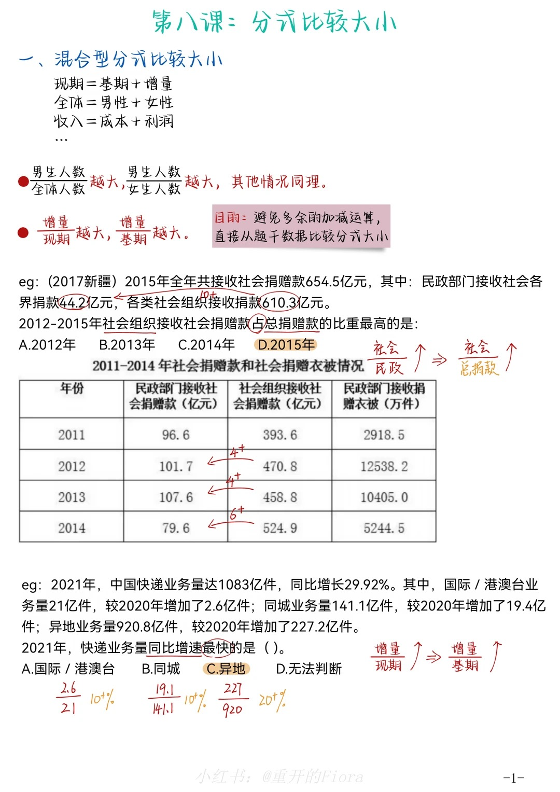

### 4.3 典型例题

**例 12（2021 国考）** 2021 年，中国快递业务量达 1083 亿件，同比增长 29.92%。其中，国际/港澳台业务量 21 亿件，较 2020 年增加了 2.6 亿件；同城业务量 141.1 亿件，增加了 19.4 亿件；异地业务量 920.8 亿件，增加了 227.2 亿件。2021 年，快递业务量同比增速最快的是（ ）
A. 国际/港澳台　B. 同城　C. 异地　D. 无法判断

**解答**：现期 = 增量 + 基期，所以 增量/现期 越大 ⇔ 增量/基期（增速）越大。直接比较三个"增量/现期"：
- 国际/港澳台：2.6/21 ≈ 0.1⁺
- 同城：19.4/141.1 ≈ 0.1⁺
- 异地：227.2/920.8 ≈ **0.2⁺**
- 明显只有异地的值 > 0.2 → 异地增速最高，**选 C**。

> 💡 直接用增量除以现期去比较会快很多，因为材料给的就是这种数据，不用再用现期减增量计算基期。这样比较步骤少、计算量小，直接瞪眼就可以看出来。一般的题都不会选"无法判断"这种选项。

**例 13（粮食种植）** 2020 年全年，种植面积同比增速最快的是（ ）
A. 稻谷　B. 小麦　C. 油料　D. 糖料
（稻谷 3008 万公顷、增加 38；小麦 2338、减少 35；油料 1313、增加 20；糖料 157、减少 4）

**解答**：
- 小麦、糖料同比减少（增速为负），直接排除——问同比增速最快，有正有负先排除负的，最后变成二选一；
- 稻谷 vs 油料，比较"增量/现期"：38/3008 vs 20/1313；
- **拉近距离再比较**：20/1313 = (20×2)/(1313×2) = 40/2626，与 38/3008 比：40 > 38 且 2626 < 3008，分子大分母小 → 油料更大；
- **选 C**。

> 💡 这样做少算了三步减法，最后变成两三个分式比较，往往瞪眼就可以直接看出来。

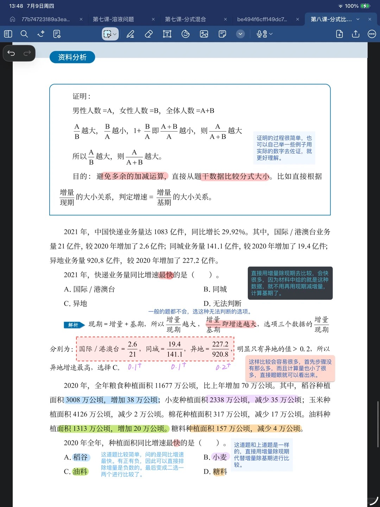

**例 14（2017 新疆）** 2012-2015 年社会组织接收社会捐赠款占总捐赠款的比重最高的是（ ）
A. 2012年　B. 2013年　C. 2014年　D. 2015年
（民政部门接收捐款：12年 101.7、13年 107.6、14年 79.6；社会组织：12年 470.8、13年 458.8、14年 524.9；15年总额 654.5 = 民政 44.2 + 社会组织 610.3）

**解答**：总捐款额 = 民政接收 + 社会组织接收，题干没给总额，但：

$$\frac{\text{社会捐款额}}{\text{民政接收捐款额}}\text{ 越大}\ \iff\ \frac{\text{社会捐款额}}{\text{总捐款额}}\text{ 越大}$$

直接比较"社会组织/民政"：12年 470.8/101.7（4⁺）、13年 458.8/107.6（4⁺）、14年 524.9/79.6（6⁺）、15年 610.3/44.2（10⁺）——15 年**分子最大、分母最小**，所以 15 年最高，**选 D**。

> 💡 四个分式比较时，先找分子最大、分母最小的，看能否直接选出来；如果不能，看这几个分式是否大小接近某个常用分数，如果能，就以它为基准比较各分式到那个特殊值的距离。

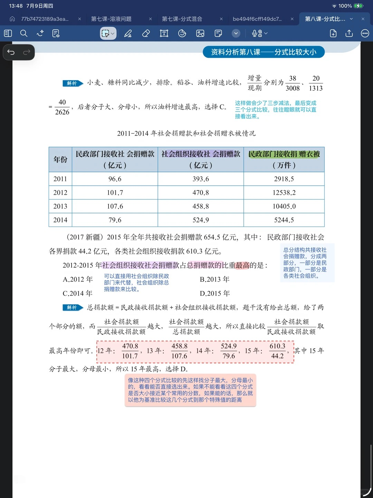

---

## 五、课后作业：练习七（分式比较大小）

> 正确率参考 80%，易错题：**6、10**。

### 5.1 答案与考点速查

| 题号 | 考点 | 答案 | 关键步骤 |
|---|---|---|---|
| 1 | A与非A比较 | **C** | 场馆数 54/2770≈2%，坐席数 3.4%，美术馆 59/618≈10%，从业人员 451/5467≈9% → 美术馆数最大 |
| 2 | 差分法（平均数增速比较） | **D** | 18-21年增量 2072、2466、2249、3471；20年增量下降排除C；2466比2072高约20%、19678比17606高约10% → 19>18；3471比2466高约40%、24393比19678高约20% → 21>19 |
| 3 | 增速比较大小 | **D** | 13-16年增量 1.1、1.1、1.6、1.5，基期逐年增加 → 14、16年增速同比下降 |
| 4 | 差分法（分式混合比较） | **B** | 17-20年增量 114、197、204、308；增速 114/200>50%、197/314>50%、204/511<50%、308/715<50% 排除CD；18年增速接近 2/3 |
| 5 | 差分法（基准线比较） | **B** | 全国 347/413、城镇 493/542、农村 196/231 都靠近 1；用 1 做差：全国 66/413≈16%、城镇 49/542<10%、农村 35/231≈15% → 城镇>农村>全国 |
| 6 ⭐ | 差分法（平均数增速比较） | **A** | 选项最大都是2020、最小都是2016，只需比较17/18/19；增量 828、827、945；18年增量降、基期升 → 18<17 排除BD；18年 827/15831 vs 19年 945/16658，分子高10%以上、分母高不足10% → 18<19 |
| 7 | 差分法 | **A** | 2019-2022 面积增量 3.23、1.82、3.12、2.91 → 19年增量最大、基期最小 |
| 8 | A与非A比较 | **C** | 法人单位 375/1085≈0.3，有证照个体户 405/3279≈0.13，活动单位 417/1303≈0.3，排除BD；企业法人单位比重提高 → 其增速>法人单位数增速 |
| 9 | 差分法 | **D** | 出口单价 127/301、138/324、148/328、161/355；15与16分母基本一致、分子16大 → 排除B；16比14分子高10%以上、分母高10%不到 → 排除A；17比16分子高9%、分母高8% → 17最高 |
| 10 ⭐ | 差分法 | **A** | 19-22年增量 1.4、2、0.8、2.3；21年增量降排除C；20年分母比19高10%、分子高40%以上 → 20>19；22比20分子高15%、分母高20% → 20>22 |

### 5.2 作业原题与详解（截图）

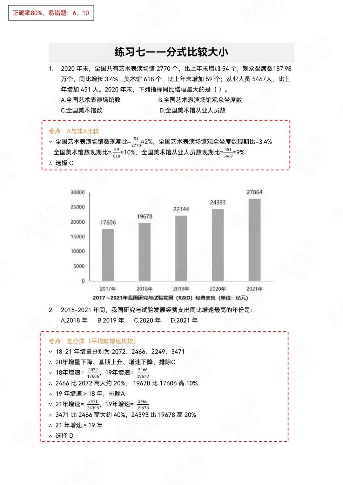
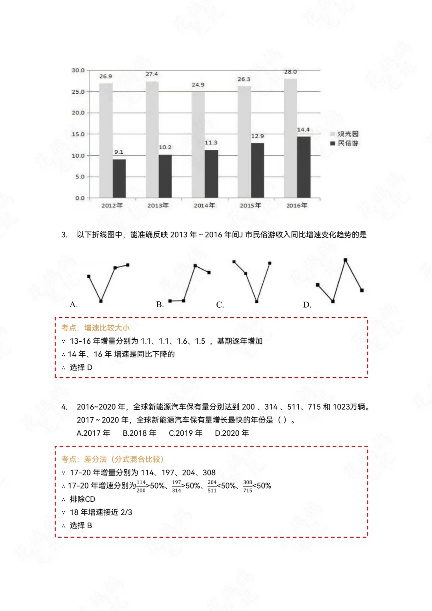
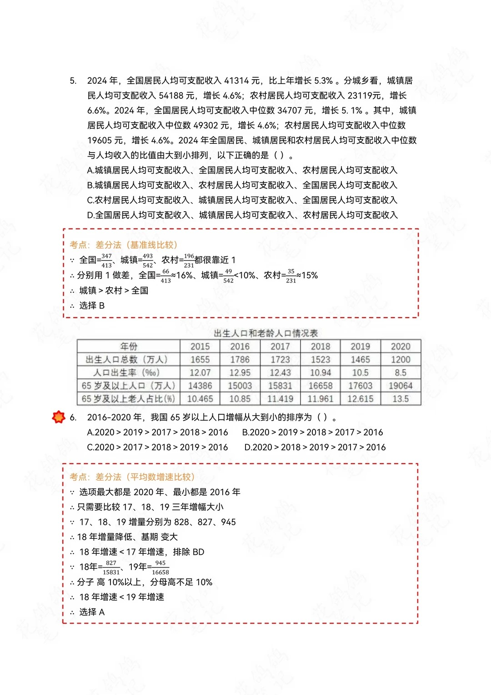
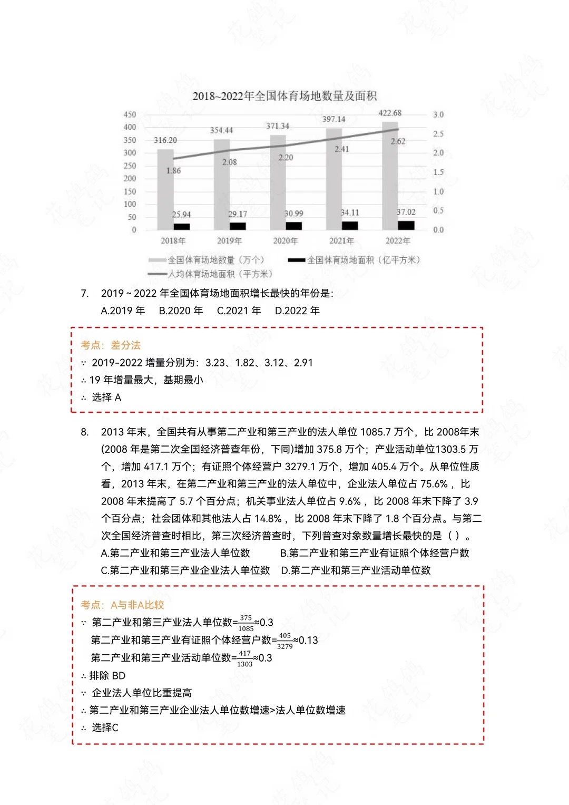
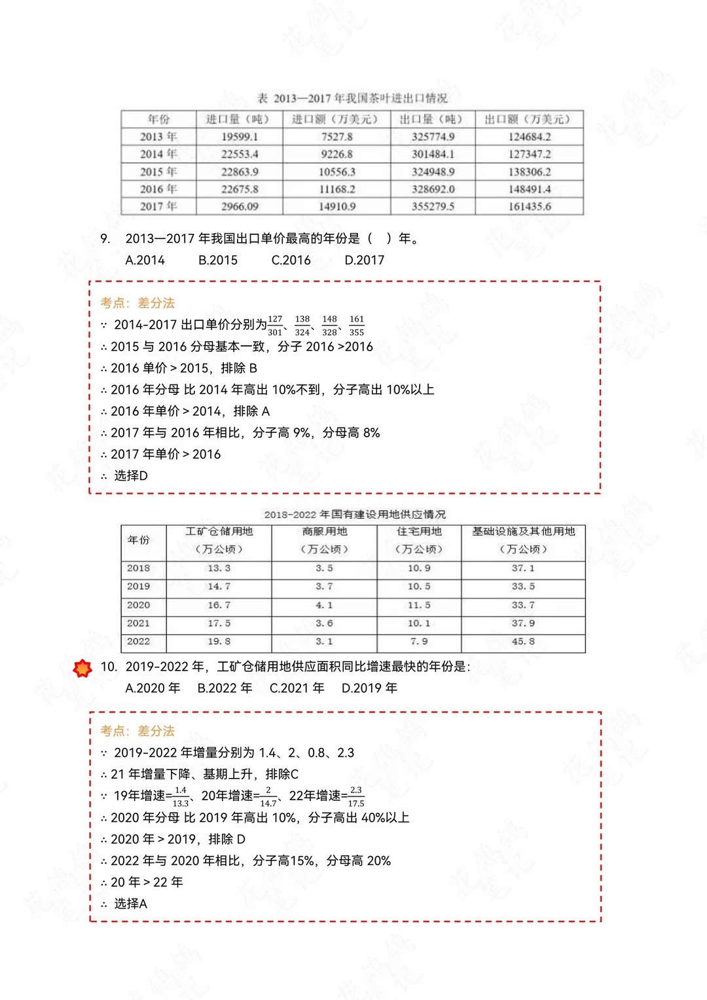

---

## 六、易错点与常见误区

| # | 误区 | 正确做法 |
|---|---|---|
| 1 | 基准线法方向搞反 | **都小于基准**：距基准近者大；**都大于基准**：超出多者大。先判断两侧再比距离 |
| 2 | 认为"增量下降"随时能推出"增速下降" | 仅适用于**相邻两个年份**且基期上升的情形（柱状图逐年增加类题目） |
| 3 | 用"增量/现期"代替增速比较时怀疑分母不同不可比 | 由 A与非A 原理，增量/现期 与 增量/基期 **单调性一致**，大小关系完全相同，放心用 |
| 4 | 分子分母相差很远就直接差分 | 先**等比例扩大拉近**（如 ×2、×5）再做差分，否则增速估算容易失真 |
| 5 | 把"第二产业增加值"理解成"第二产业增加的量" | "增加值"是统计术语，是一个整体现期值，不是增长量 |
| 6 | 四个分式比较时逐个死算 | 先找**分子最大且分母最小**的直接出答案；不行再找共同接近的基准值比距离 |
| 7 | 增速有正有负时全部列入计算 | 问"增速最快"，先排除负增长，正的几个再二选一 |
| 8 | 分子分母很接近时只保留三位 | 接近的分式保留 4~5 位更保险（如人口男女比例题） |
| 9 | 看到"无法判断"选项就纠结 | 一般的题都不会选"无法判断" |
| 10 | 每个选项都算出精确增速 | 排除法优先：增量下降先排、增量未按 (1+r) 放大即增速下滑再排，最后只比 2 个候选 |

---

## 七、总结归纳

### 7.1 方法选择决策流程

```
拿到分式比较题
├─ 分子分母不同边？ → 分子大分母小者更大，直接选（秒题）
├─ 有负增长选项？ → 先排除，缩小范围
├─ 增速比较且给"现期+增量"？ → A与非A转化：比"增量/现期"
├─ 连续年份增速比较？ → 增量楼梯法：
│   增量下降 → 增速必降（排除）；增量未按(1+r)放大 → 增速下滑（排除）
└─ 分子分母同边的两个近分式？
    ├─ 分母好算/接近常见分数 → 直接计算 or 代入验算
    ├─ 分子分母接近 → 平均数增速比较（横向差分）
    ├─ 部分+部分=整体结构 → 分式混合比较（纵向差分，整体居中）
    └─ 都离 1、0.5、0.1 很近 → 基准线法（比距离）
    （分子分母相差远 → 先等比例扩大拉近）
```

### 7.2 一句话记忆

> - **不同边**：僧多粥少，直接选；
> - **差分法**：分子长得快的分数大，分母长得快的分数小；
> - **分式混合**：混合浓度居中间；
> - **基准线**：先定两侧再比距离；
> - **增速比较**：要想增速不降低，增量跟着上楼梯；
> - **A与非A**：部分之比与占比同大同小，省下减法直接比。

### 7.3 与其他章节的衔接

- **第七课（分式混合）**：本课"分式混合比较"即溶液混合思想的逆用；
- **第三课（放缩运算）**：直接计算法的放缩估算同源；
- **第九课（比重特殊问题）**：A 与非 A 的正相关性是比重升降判断的基础。
