# 资料分析 · 第九课 比重特殊问题

> 📌 **笔记来源**：小P（P神）资料分析第九课，综合三份小红书听课笔记交叉整理
> ① 《2027小p资料分析详细听课复盘笔记9》@乐一一（16页，最详细）
> ② 《2027公考小P资料分析课笔记（第九节）》@潜心笃志（5页，框架+双解法对比）
> ③ 《关于P神比重问题的一点小总结》@凉秋拾果（2页，含独有补充）
> 文中【补充】标记 = 三份笔记均未展开、由整理者查漏补缺的内容。

---

## 🗺️ 课程地图

| 模块 | 考频 | 核心武器 | 一句话记忆 |
|---|---|---|---|
| 一、两期比重差 | ⭐⭐⭐ 高频 | 三步走 | 增速差定性 → 乘现期比定量 → 除(1+r₁)精算 |
| 二、比重差 vs 平均数增量 | ⭐⭐⭐ 高频 | 方法选择 | 比重看增速差，平均数看现期值 |
| 三、比重与增长率 | ⭐⭐ 中频 | 乘积增长率 | 部分 = 整体 × 比重（A = B × C） |
| 四、比重饼状图 | ⭐ 低频 | 12点顺时针 + 特殊点位 | 定位 → 倍数 → 排除 |
| 五、部分量的两期差 | ⭐ 冷门 | 假设性思维 | 先假设一个量不变，再调差值 |
| 六、比重转化 | ⭐ 冷门 | 正比 / 反比（隔级比重） | 小总体/大总体 = 小比重/大比重 |

---

# 一、两期比重差

## 1.1 核心概念与公式

**问法识别**："……占……的比重，比上年上升/下降了多少**个百分点**"

$$
\text{两期比重差（增量）} = \frac{A}{B} \times \frac{a-b}{1+a}
$$

- A = 部分现期量，B = 整体现期量
- a = 部分增速，b = 整体增速

> 💡 **百分数数据（比重本身）一般默认讨论增量、不讨论增速**，所以问"比重变化"答"个百分点"。

**公式推导**（增量 = 基期比重 × 比重的"增长"折算而来）：

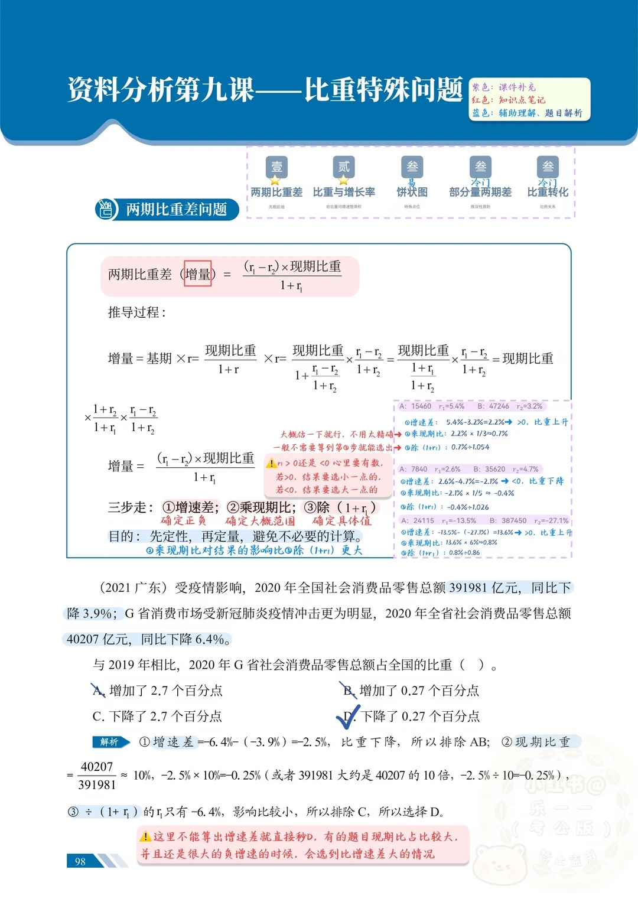
*▲ 原笔记 P98：公式推导全过程 + 三步走要点 + 方向感警示*

## 1.2 解题三步走

| 步骤 | 操作 | 目的 |
|---|---|---|
| ① 增速差 | 算 a − b | **定性**：a > b 比重上升，a < b 比重下降，先排除两个方向错误选项 |
| ② 乘现期比 | (a−b) × A/B | **定大概范围**：现期比 < 100%，结果一定比增速差小 |
| ③ 除 (1+a) | 上一步 ÷ (1+a) | **精确定量**：a 很小时可忽略；a > 0 结果再小一点，a < 0 结果再大一点 |

> ⚠️ **方向感**：r₁ > 0 结果要选**小**一点的；r₁ < 0 结果要选**大**一点的（除以小于 1 的数会放大）。
> ⚠️ 一般算到第②步即可选出答案；②乘现期比对结果的影响比③除(1+r₁)更大。
> 💡 第②步估算现期比时，粗略估"总量大约是部分量的几倍"即可，精度要求很低。

## 1.3 典型例题

### 例 1（2021 广东）标准三步走

> 2020 年全国社会消费品零售总额 391981 亿元，同比下降 3.9%；G 省社会消费品零售总额 40207 亿元，同比下降 6.4%。
> 与 2019 年相比，2020 年 G 省社零总额占全国的比重（　）
> A. 增加了 2.7 个百分点  B. 增加了 0.27 个百分点  C. 下降了 2.7 个百分点  D. 下降了 0.27 个百分点

**解答**：
1. **增速差** = −6.4% − (−3.9%) = **−2.5%** < 0 → 比重下降，排除 A、B；
2. **乘现期比** = 40207 / 391981 ≈ 10% → −2.5% × 10% = **−0.25%**；
3. **除 (1+r₁)**：r₁ = −6.4% 很小，影响有限，结果略大于 0.25% → **−0.27 个百分点**。
✅ **选 D**

> ⚠️ 不能算完增速差 −2.5% 就直接选 C！有的题目现期比占比较大、且负增长很深时，÷(1+r₁) 会放大结果，可能选到比增速差还大的情况。

### 例 2（2017 新疆）增速需要自己估

> 2015 年国家自然科学基金委共接收 173017 项申请，同比增长约 10%；择优资助 40668 项，比上年增加 1579 项。2015 年平均资助率较 2014 年约（　）
> A. 增加 1.4%  B. 减少 1.4%  C. 增加 2.1%  D. 减少 2.1%

**解答**：
1. 资助项目增速 ≈ 1579 / 39000 ≈ **4%**（增速小，直接 变化量÷现期 ≈ 变化量÷基期）；
2. **增速差** = 4% − 10% = **−6%** → 减少，排除 A、C；
3. **乘现期比**：173017 约为 40668 的 4 倍 → −6% ÷ 4 = **−1.5%**；
4. r₁ = 4% > 0，结果略小于 1.5%。
✅ **选 B**（老题表述不规范，把"个百分点"写成了"%"，按百分点理解）

### 例 3（2021 山东）没给增速的情形

> 2019 年全国棉花产量 588.9 万吨，比上年减少 21.3 万吨；其中新疆棉花产量 500.2 万吨，比上年减少 10.8 万吨。2019 年新疆棉花产量占全国的比重比上年（　）
> A. 上升了不到 5 个百分点  B. 上升了 5 个百分点以上  C. 下降了不到 5 个百分点  D. 下降了 5 个百分点以上

**解答（方法二：直接作差，更优）**：
- 现期比重 = 500.2 / 588.9 ≈ 510/600 = **85%**
- 基期比重 = (500.2+10.8) / (588.9+21.3) = 511 / 610.2 ≈ **83.7%**
- 85% − 83.7% ≈ **+1.3 个百分点**
✅ **选 A**

> 💡 **没有给分子分母增速时，不必强行三步走**，分别估算现期比、基期比作差即可。
> （若用方法一：估算增速 −10.8/511 ≈ −2%、−21.3/610 ≈ −3.5%，增速差 = +1.5% > 0 → 上升，也可直接锁定 A。增速小、影响小时方法一更快。）

---

# 二、两期比重差 VS 平均数增量（区别与联系）

## 2.1 联系

平均数（如人均收入、单位面积产量）本质上也是一种"比值"，两期比重差公式 **同样适用** 于求平均数的增量：

$$
\Delta\frac{A}{B} = \frac{a-b}{1+a} \times \frac{A}{B}
$$

## 2.2 区别（方法选择的依据）

| 对比维度 | 两期比重差 | 平均数增量 |
|---|---|---|
| 现期比 A/B | **< 100%**，必然压缩增速差 | 可以很大（几百几千），量级影响大 |
| 选项风格 | 两正两负、差距大，精度要求极低 | 差距可能很小，精度要求相对高 |
| 哪个因素影响大 | **增速差更重要**（算完增速差就知大概范围） | **现期值的首位更重要**（只算增速差没用，不知乘多少） |
| 推荐做法 | **三步走**（先增速差） | **先估现期比量级 + 大概增速差估增量**，或直接算平均数增长率 |

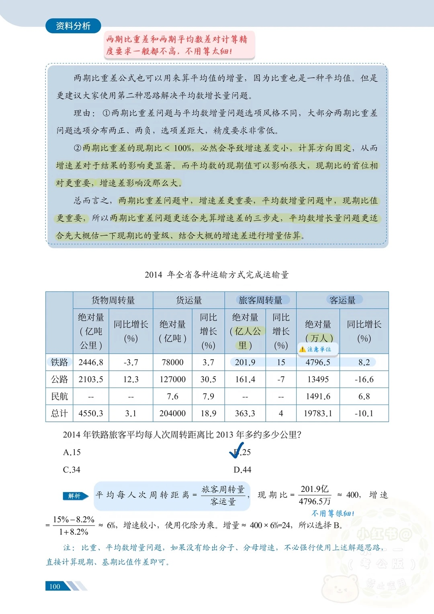
*▲ 原笔记 P100：方法选择的完整论证 + 铁路旅客周转例题*

## 2.3 平均数增量的两种做法

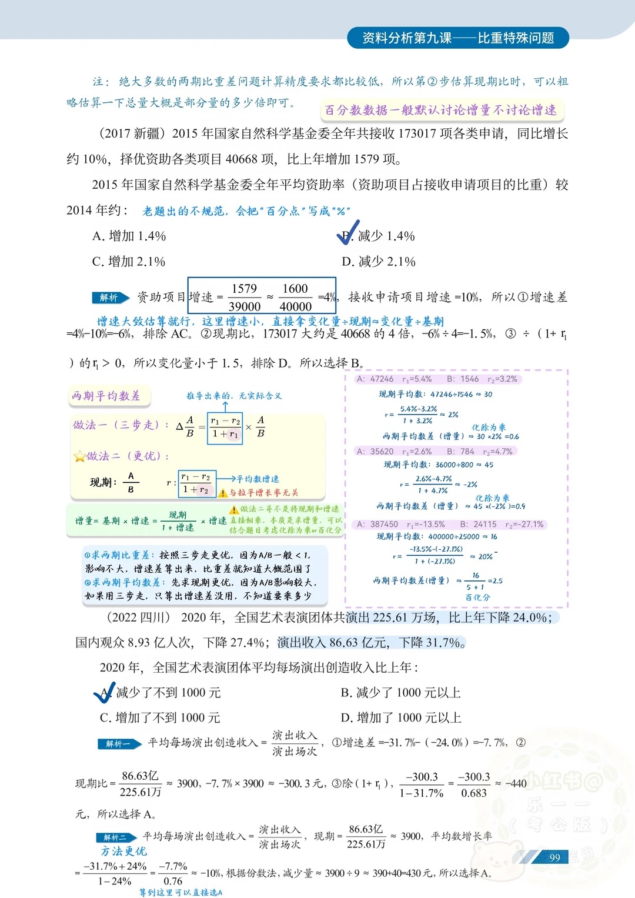
*▲ 原笔记 P99：做法一（三步走）与做法二（先求现期值）对比 + 三道示例演算*

- **做法一（三步走）**：Δ(A/B) = (r₁−r₂)/(1+r₁) × A/B
- **做法二（更优）**：先求现期平均数 A/B，再算平均数增长率 R = (r₁−r₂)/(1+r₂)，增量 = 基期 × R ≈ 现期/(1+R) × R，可结合**化除为乘 / 份数法 / 百化分**

### 例 4（2022 四川）两种方法对照

> 2020 年全国艺术表演团体共演出 225.61 万场，比上年下降 24.0%；演出收入 86.63 亿元，下降 31.7%。2020 年平均每场演出创造收入比上年（　）
> A. 减少了不到 1000 元  B. 减少了 1000 元以上  C. 增加了不到 1000 元  D. 增加了 1000 元以上

**法一（三步走）**：增速差 = −31.7% − (−24%) = −7.7%；现期比 = 86.63亿/225.61万 ≈ 3900 元；−7.7% × 3900 ≈ −300；÷(1−31.7%) = −300/0.683 ≈ **−440 元**
**法二（更优）**：平均数增长率 R = −7.7%/(1−24%) = −7.7%/0.76 ≈ **−10%**；份数法减少量 ≈ 3900 ÷ 9 ≈ **430 元**
✅ **选 A**

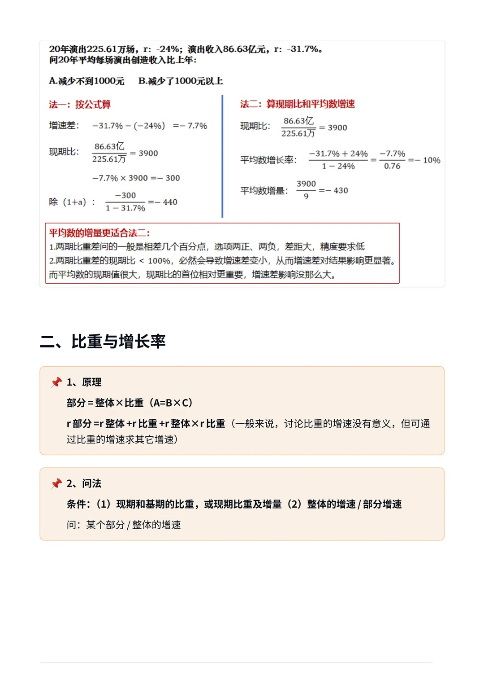
*▲ 笔记②：同一题双解法并排对照*

### 例 5（2014 河南联考·铁路）化除为乘

> 2014 年铁路旅客周转量 201.9 亿人公里（+15%），客运量 4796.5 万人（+8.2%）。平均每人次周转距离比 2013 年约多多少公里？
> A. 15  B. 25  C. 34  D. 44

**解答**：现期比 = 201.9亿 / 4796.5万 ≈ **400 公里**；R = (15%−8.2%)/(1+8.2%) ≈ 6%；增速较小化除为乘：增量 ≈ 400 × 6% = **24**
✅ **选 B**（⚠️ 注意单位：亿人公里 ÷ 万人）

### 例 6（电影票价）直接算更快的情形

> 2016 年总票房 457.1 亿、观影 13.7 亿人次；2015 年总票房 440.7 亿、观影 12.6 亿人次。2016 年平均票价比上年约（　）
> A. 提高了 2.9 元  B. 提高了 1.6 元  C. 降低了 1.6 元  D. 降低了 2.9 元

**解答**：457.1/13.7 ≈ 33.4 元，440.7/12.6 ≈ 35.0 元，作差 ≈ **−1.6 元**
✅ **选 C**（选项差距小、估增速误差大；分母 12.6 可百化分，直接算更稳）

## 2.4 【补充】平均数增长率公式

三份笔记中仅笔记③明确列出，此处补齐：

$$
R_{平均数} = \frac{r_1 - r_2}{1 + r_2} \quad (r_1=分子增速,\ r_2=分母增速)
$$

> 例：注册资本 1796（+23.87%），企业 3.84 万户（+5.76%），户均注册资本增速 R = (23.87 − 5.76)/1.05 ≈ **17%**。
> 注意与两期比重差区分：**平均数问"增长百分之几"→ 增速；比重问"上升/下降多少"→ 个百分点（增量）**。

---

# 三、比重与增长率（乘积增长率）

## 3.1 核心原理

$$
\text{部分} = \text{整体} \times \text{比重} \quad (A = B \times C)
$$

$$
r_{部分} = r_{整体} + r_{比重} + r_{整体} \times r_{比重}
$$

- 比重的增速本身讨论意义不大，但可**借助比重的增速求其他增速**（增速的累积与拆分）。
- **问法识别**：题目讨论增速，且给出的与基期有关的数据是**比重关系**（现期+基期比重，或现期比重+比重增量）→ 绝对要想到乘积增长率 / 平均数增长率。

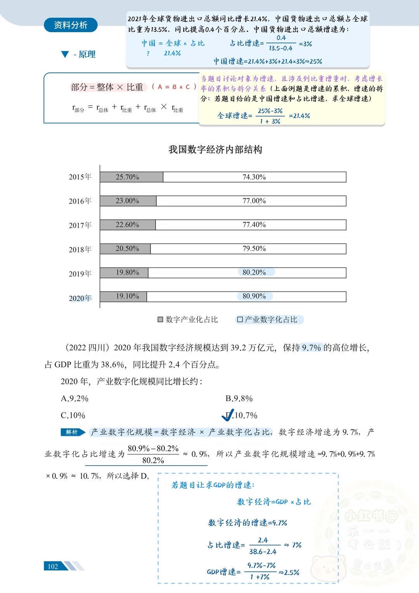
*▲ 原笔记 P102：原理公式 + 2021 全球贸易示例 + 2022 四川数字经济例题*

## 3.2 典型例题

### 例 7（2022 四川）增速的累积

> 2020 年我国数字经济规模 39.2 万亿元，增长 9.7%；产业数字化占比由 80.2% 升至 80.9%。2020 年产业数字化规模同比增长约（　）
> A. 9.2%  B. 9.8%  C. 10%  D. 10.7%

**解答**：产业数字化 = 数字经济 × 占比
1. 占比增速 = (80.9% − 80.2%)/80.2% ≈ **0.9%**
2. r部分 = 9.7% + 0.9% + 9.7% × 0.9% ≈ **10.7%**
✅ **选 D**

> 🔁 变式（增速的拆分）：若给数字经济增速 9.7%、占 GDP 比重 38.6% 提高 2.4 个百分点，求 GDP 增速：
> 占比增速 = 2.4/(38.6 − 2.4) ≈ 7%；rGDP = (9.7% − 7%)/(1 + 7%) ≈ **2.5%**

### 例 8（散装饲料）增速的拆分

> 2020 年全国散装饲料总量 5897.6 万吨，同比增长 33.6%，占配合饲料总产量的 25.6%，比上年提高 4.6 个百分点。求配合饲料总产量增速。
> A. 4%  B. 9.6%  C. 19.2%  D. 25.6%

**解答**：散装饲料 = 配合饲料总产量 × 占比
1. 占比增速 = 4.6/(25.6 − 4.6) ≈ **22%**
2. r整体 = (33.6% − 22%)/(1 + 22%) ≈ **9.5%**
✅ **选 B**

### 例 9（2023 江苏）临界值判别法 ⭐

> 某市 2021、2022 年分别调查 1181 位和 1107 位老年人使用智能手机情况（12 个功能项，给出两年各自使用率）。2022 年使用人数多于 2021 年的功能项数占比为（　）
> A. 41.7%  B. 50%  C. 58.3%  D. 75%

**解答**：使用人数 = 总人数 × 使用率（相当于问：人数增速 > 0 的项目有几个）
1. 总人数增速 = (1107−1181)/1181 ≈ **−6.3%**
2. **临界值**：令使用人数增速 = 0，则使用率增速需 > 6.3%/(1−6.3%) ≈ **6.7%**
3. 逐项筛选 12 个功能项：占比增速 > 6.7% 的有 **6 项**（线上支付、新闻资讯、挂号就医、照相修图、游戏、其他）
4. 6 ÷ 12 = **50%**
✅ **选 B**

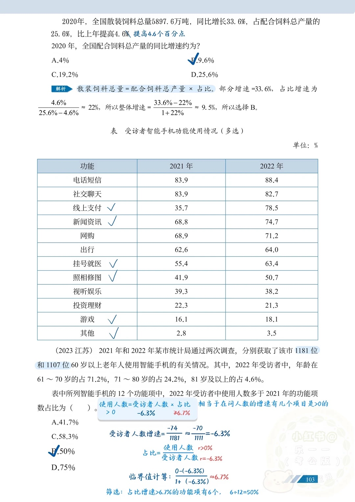
*▲ 原笔记 P103：智能手机功能题完整筛选过程*

> 💡 **【补充】临界值判别法一般化**（笔记③独有）：
> 题干给两期总人数和各分项占比，问"同比增加的有几项"时——
> 设临界点：分子（人数）增速 = 0，解出占比的临界增速 r\* = (0 − r总)/(1 + r总)，**分项占比增速 > r\* 则人数同比增加**。
> 例：总人数增长 11%，则 r\* = (0−11%)/(1+11%) ≈ −10%，占比增速 > −10% 即人数增加。

### 例 10（2019 陕西）双因素比较

> 给 2014-2018 年软件行业收入（表格）与三大子行业占比（条形图），问软件产品收入同比增速最高的年份。
> A. 2018  B. 2017  C. 2016  D. 2015

**解答**：软件产品收入 = 行业收入 × 占比
- 行业收入增量分别为 6160、5263、6526、8024，只有 **2015 年增速 > 15%**（最高）
- 占比 32.5%→32.3%→31.7%→31.3%→30.7%，**2015 年占比减少量 0.2 最小、基期占比最大 → 占比降幅最小（增速最高）**
- 两者都最高 → 乘积增速最高
✅ **选 D**（题型特征：给占比，问增速）

---

# 四、比重饼状图

## 4.1 三大要点

1. **组成各部分默认按题干名称顺序，从 12 点钟方向顺时针排布**；
2. **注意 1/4、1/3、1/2、2/3、3/4 关键位置**（特殊点位定位）；
3. **注意各部分之间的倍数关系**（如单独看某两部分的倍数）。

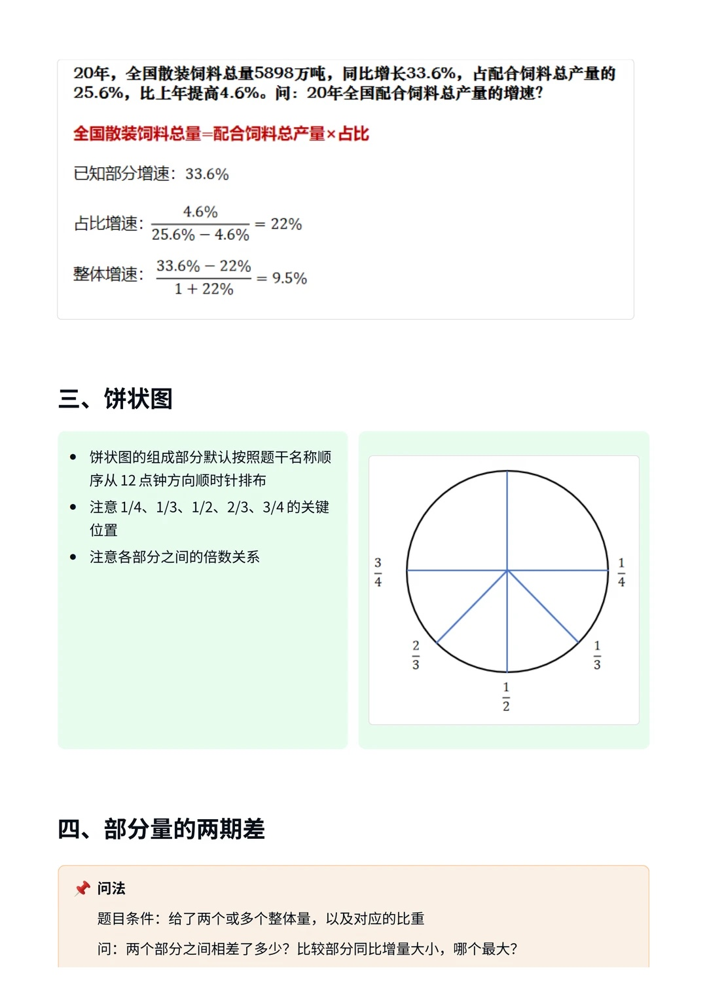
*▲ 笔记②：饼状图关键位置示意（1/4、1/3、1/2、2/3、3/4）*

## 4.2 典型例题

### 例 11（2024 国考）常规题

> 2017 年末农林生物质发电（斜线）装机 700.9 万千瓦、生活垃圾焚烧发电（白色）725.3、沼气发电（黑色）50.0，总装机 1476.2。选正确饼图。

**解答**：
- 700/1476 **明显小于 1/2** → 排除 B、D
- 白色（725.3）最大、黑色（50）最小；白色略小于 1/2；白+斜线约为黑色的 **14 倍** → 排除 C
✅ **选 A**

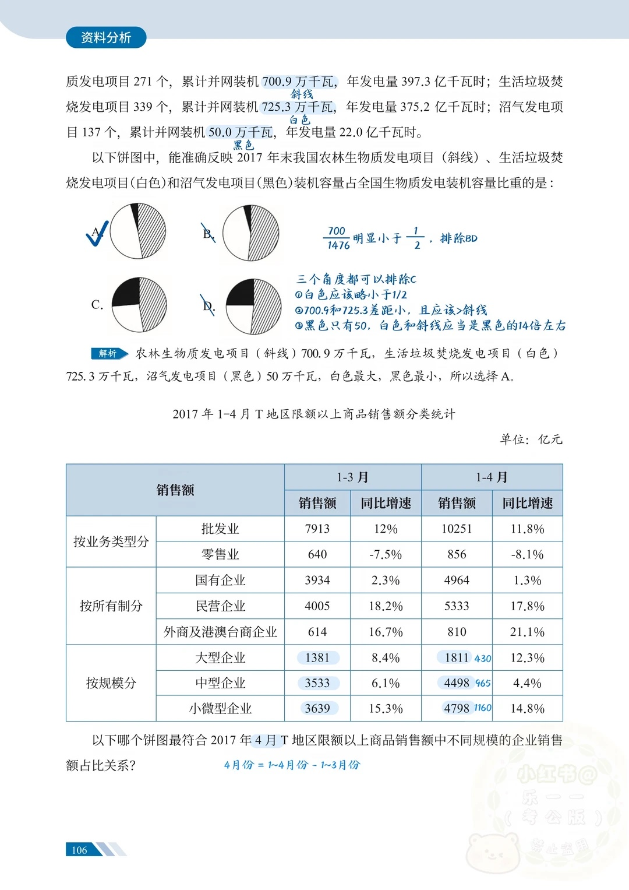
*▲ 原笔记 P106：生物质发电饼图排除过程 + T地区销售额题目*

### 例 12（T 地区销售额）先算 4 月当月

> 给 1-3 月、1-4 月累计数据，问 4 月当月不同规模企业销售额占比饼图。

**解答**：4 月 = 1-4月 − 1-3月：大型 1811−1381=**430**、中型 4498−3533=**965**、小微 4798−3639=**1159**
从 12 点顺时针第一个（白色）= 430 最小，第三个（斜线）= 1159 最大 → ✅ **选 A**

### 例 13（2023 软件）非常规题警示 ⚠️

> 四领域收入：软件产品 29030、信息技术服务 81226、信息安全 2232、嵌入式 10770。选正确饼图。

**解答**：按 12 点顺时针检验发现**本题并未按常规排布**（D 选项第三个区域最小但第四个与第三个差不多大，与 10770:2232 ≈ 5:1 不符）→ 改用大小关系：
- 最大 81226 ≈ 总量 123258 的 **2/3** → 排除 A、D
- 第二 29030 ≈ **1/4**；第三 10770 ≈ 最小 2232 的 **5 倍** → 排除 B
✅ **选 C**

> ⚠️ **教训**：默认规则只是"一般"，必须用大小/倍数关系双重验证。

---

# 五、部分量的两期差（假设性思维）

## 5.1 核心公式（理解即可，不要死记）

**问法识别**：给两个（或多个）时期的整体量和对应比重，问"某部分两期相差多少 / 哪年增量最大"。双变量（整体、比重都变），老实算计算量大 → **先假设一个量不变，再调整差值**。

$$
\text{公式一（假设比重不变）：}\ \Delta部分 = \Delta整体 \times 基期比重 + \Delta比重 \times 现期整体
$$

$$
\text{公式二（假设整体不变）：}\ \Delta部分 = \Delta比重 \times 基期整体 + \Delta整体 \times 现期比重
$$

**推导示例**：基期总量 90、占比 60%；现期总量 100、占比 75%
- 常规：100×75% − 90×60%
- 假设比重没变：100×(60%+15%) − 90×60% = (100−90)×60% + 100×15%
- 假设总量没变：(90+10)×75% − 90×60% = 90×(75%−60%) + 10×75%

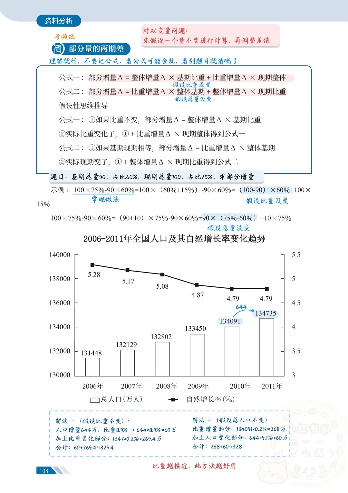
*▲ 原笔记 P108：公式一/公式二、假设性思维推导 + 人口图示例题双解法*

## 5.2 典型例题

### 例 14（2014 河南）双解法对照

> 2011 年末全国人口 134735 万人，65 岁及以上占 9.1%；2010 年末 134091 万人，占 8.9%。2011 年 65 岁及以上人口比 2010 年约多多少万人？
> A. 124  B. 249  C. 327  D. 467

**解法一（假设比重不变）**：人口增量 644 × 8.9% ≈ 57；补比重变化 134735 × 0.2% ≈ 269.5；合计 ≈ **327**
**解法二（假设总量不变）**：比重增量 134091 × 0.2% ≈ 268；补人口变化 644 × 9.1% ≈ 59；合计 ≈ **327**
✅ **选 C**

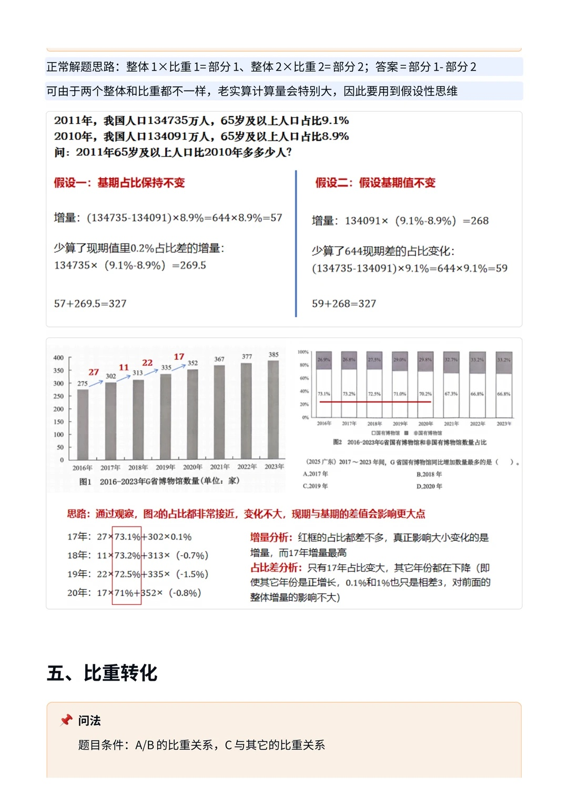
*▲ 笔记②：人口题两种假设并排对照 + 博物馆题增量分析*

### 例 15（2025 广东）比重接近时假设法最好用

> 2017~2023 年 G 省博物馆总数（柱状图）与国有/非国有占比（堆积图），问国有博物馆同比增加数量最多的年份。
> A. 2017  B. 2018  C. 2019  D. 2020

**解答**：部分增量 = 整体增量 × 基期比重 + 比重增量 × 现期整体
- 17-20 年整体增量：27、11、22、17；基期比重：73.1%、73.2%、72.5%、71.0%；比重增量：**+0.1%**、−0.7%、−1.5%、−0.8%
- 2017 年：整体增量最高 + 基期比重基本最高 + 比重增量唯一为正 → 部分增量必然最高
✅ **选 A**

> 💡 **比重越接近，假设法越好用**：比重差不多时，真正影响大小的是整体增量，先比增量再微调。

### 例 16（"十四五"FTTH 端口）判断题

> 判断正误："十四五"时期全国 FTTH/O 端口净增数量最多的是 2021 年。（端口总量与占比各年相差不大）

**解答**：
- 比重增量 × 整体基期影响很小（最多不到 0.2），主要看**整体增量 × 现期比重**；现期比重相差不大 → 重点比较整体增量最高的 21 年和 23 年
- 23 年比 21 年"后面"高出 (96.3%−94.3%)×0.7 = 0.7×2%；21 年比 23 年"前面"高出约 10×0.7% = 1×7% > 0.7×2% → **21 年最高** ✅ 判断正确

> 🎯 **实战思路**：比重和整体量各年相差比例都不大时，主要比较两边的增量差异（这样不精确，但基本不出错）。

---

# 六、比重转化

## 6.1 正比关系（分母不变）

> **整体相同，部分量与比重成正比**：相同总量内 A%/B% = A/B，即 A% = B% × (A/B)
> 分母不变，分子越大分式越大，分子越小分式越小。

### 例 17（2017 江苏）

> 2015 年 J 省 S 市全社会研发经费投入占 GDP 比重为 2.7%；其中规上工业企业研发经费占全社会研发经费的 89%。规上工业研发经费占 GDP 的比重是（　）
> A. 1.8%  B. 2.1%  C. 2.4%  D. 2.7%

**解答**：分子（规上工业研发）是全社会研发的 89%，分母同为 GDP → 占比也是其 89%：2.7% × 89% ≈ **2.4%**
✅ **选 C**

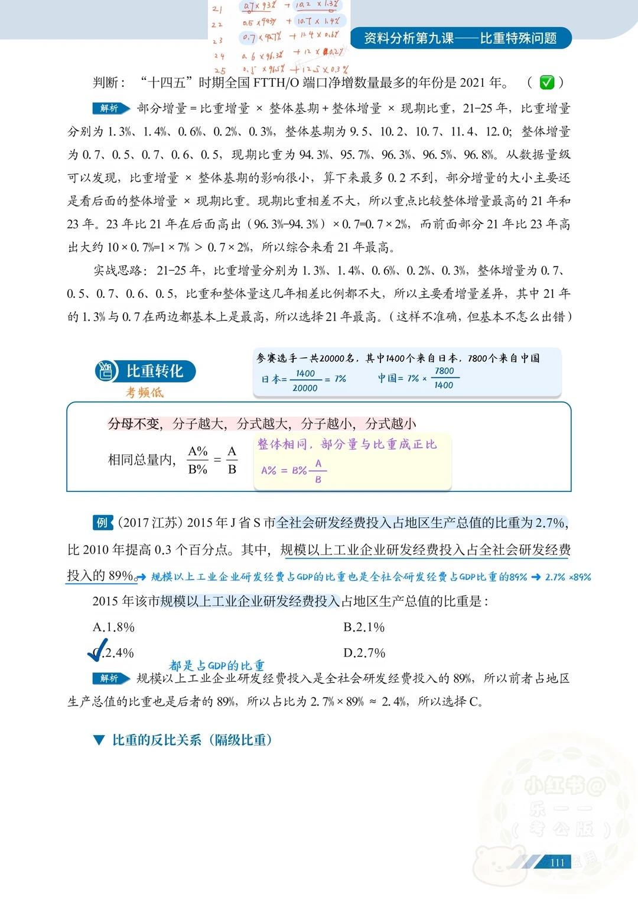
*▲ 原笔记 P111：正比原理 + 参赛选手示例 + 2017 江苏例题*

## 6.2 反比关系（分子不变 / 隔级比重）

> **部分量不变，整体量与比重成反比**：相同分子 A%/B% = B/A
> **隔级比重**：A/C = A/B × B/C（比重① × 比重②）
> 分子不变，分母越大分式越小，分母越小分式越大。

### 例 18（2015 江苏）

> 2014 年金融业增加值占第三产业增加值的比重达 15.3%，占 GDP 的比重升至 7.37%。第三产业增加值占 GDP 的比重约为（　）
> A. 48.2%  B. 46.8%  C. 45.3%  D. 44.1%

**解答**：分子同为金融业 → 第三产业/GDP = (金融/GDP) ÷ (金融/第三产业) = 7.37% / 15.3% ≈ **48.3%**
✅ **选 A**（从小分母变成大分母，直接拿小的 ÷ 大的）

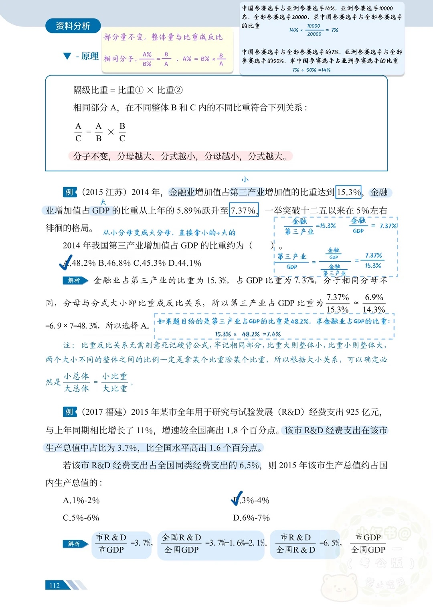
*▲ 原笔记 P112：反比原理 + 隔级比重公式 + 江苏/福建例题*

### 例 19（2017 福建）两次转化 ⭐

> 2015 年某市 R&D 经费支出占该市 GDP 的 3.7%，比全国水平高 1.6 个百分点；该市 R&D 经费占全国同类经费的 6.5%。该市 GDP 约占全国 GDP 的（　）
> A. 1%-2%  B. 3%-4%  C. 5%-6%  D. 6%-7%

**解答**：
1. 全国 R&D/全国 GDP = 3.7% − 1.6% = **2.1%**
2. 市GDP/全国GDP = (市R&D/全国R&D) × (全国R&D占比/市R&D占比) = 6.5% × 2.1%/3.7% ≈ **3.7%**
✅ **选 B**

> 🔁 变式：若该市 R&D 占比比全国**低** 2.4 个百分点 → 全国 = 6.1%，6.5% × 6.1%/3.7% ≈ 10.7% → 选 10%-12%
> 💡 **方向感**：本市 R&D 占 GDP 水平高于全国，而 R&D 占全国才 6.5%，所以本市 GDP 占全国只会更低 → 在 6.5% 基础上乘一个**小于 1** 的数（2.1%/3.7% 而不是 3.7%/2.1%）。

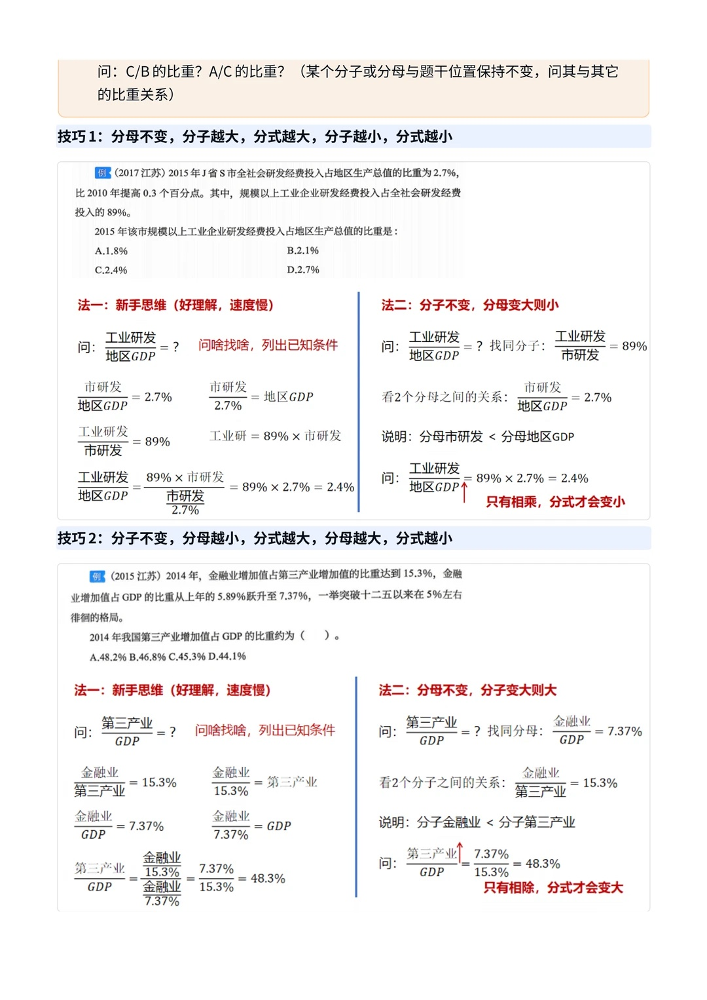
*▲ 笔记②：技巧1（分母不变）与技巧2（分子不变）的新手思维 vs 快捷思维对照*

---

# 七、易错点与常见误区

| # | 易错点 | 正确姿势 |
|---|---|---|
| 1 | 把"比重上升/下降多少"当增速算 | 比重是百分数，默认讨论**增量**，答"**个百分点**" |
| 2 | 被老题的"%"表述带偏 | 老题不规范，会把"个百分点"写成"%"，按百分点理解 |
| 3 | 算完增速差直接选答案 | 必须②乘现期比；增速差为负且负增长深时，÷(1+r₁) 会**放大**结果 |
| 4 | 第③步方向搞反 | r₁ > 0 结果选**小**一点；r₁ < 0 结果选**大**一点 |
| 5 | 两期比重差和平均数增量用同一套打法 | 比重三步走（增速差重要）；平均数先估现期比量级（现期值重要） |
| 6 | 没给增速还硬套三步走 | 直接 现期比 − 基期比 作差（如棉花题） |
| 7 | 选项差距小时粗估增速 | 直接精确算（如电影票价题）；善用百化分 |
| 8 | 单位陷阱 | 亿人公里 ÷ 万人、亿 ÷ 万等，先统一单位再除 |
| 9 | 饼状图盲目默认 12 点顺时针 | 只是一般规律！用大小 + 倍数关系双重验证（2023 软件题反例） |
| 10 | 比重转化乘除方向搞反 | 记住 小总体/大总体 = 小比重/大比重；用"结果该变大还是变小"校验 |
| 11 | 部分量两期差漏掉调整项 | 假设比重不变后，**必须补上** Δ比重 × 现期整体 |
| 12 | 看到增速题没想到比重关系 | 题干给的基期数据是**比重**时，立即想乘积增长率 / 平均数增长率 |

---

# 八、总结归纳

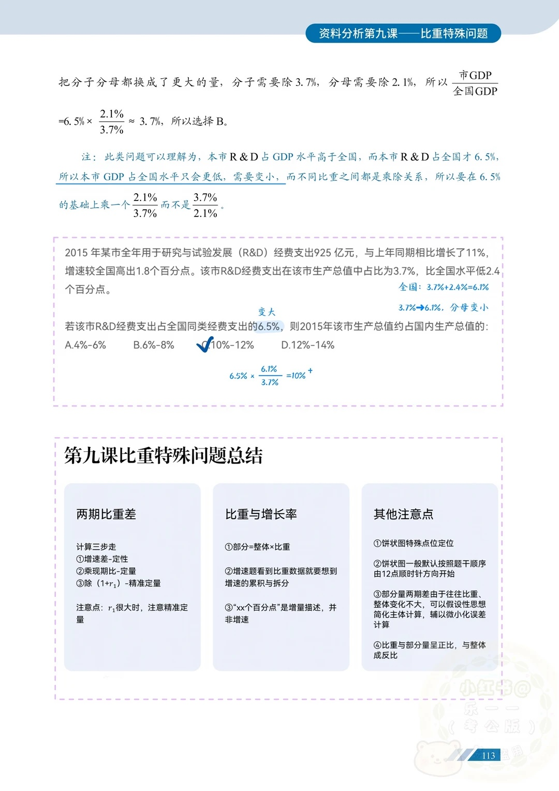
*▲ 原笔记 P113：课程官方总结（两期比重差 / 比重与增长率 / 其他注意点）*

## 知识框架

```
比重特殊问题
├── 两期比重差（高频）
│   └── 三步走：增速差定性 → ×现期比定量 → ÷(1+r₁)精算
│   └── 对比：平均数增量 → 先估现期比量级（或算平均数增长率 R=(r₁−r₂)/(1+r₂)）
├── 比重与增长率（中频）
│   └── 部分=整体×比重 → r部分=r整体+r比重+r整体×r比重
│   └── 临界值判别：占比增速 > (0−r总)/(1+r总) ⟺ 人数/部分量增加
├── 比重饼状图（低频）
│   └── 12点顺时针 + 特殊点位 + 倍数关系（双重验证！）
├── 部分量两期差（冷门）
│   └── 假设性思维：先假设一个量不变，再调整差值
└── 比重转化（冷门）
    └── 正比：整体相同，部分∝比重；反比：部分相同，整体∝1/比重（隔级相乘）
```

## 速记口诀

> **增速差先行，现期比压缩，一除定乾坤**（两期比重差）
> **比重乘整体，增速层层积**（乘积增长率）
> **十二点钟顺时针，特殊点位加倍数**（饼状图）
> **假设一个量不变，调完差值再相加**（部分量两期差）
> **同比正、反比分，小比重配小总体**（比重转化）

---

## 附录：图片来源索引

| 图片 | 内容 | 出处 |
|---|---|---|
| images/note1/01~16.jpg | 第九课完整复盘（公式推导、例题、总结） | @乐一一（重启版） |
| images/note2/01~05.jpg | 课程框架整理（双解法对照） | @潜心笃志 |
| images/note3/01~02.jpg | 个人总结（平均数增长率、临界值法、假设不变思维） | @凉秋拾果 |

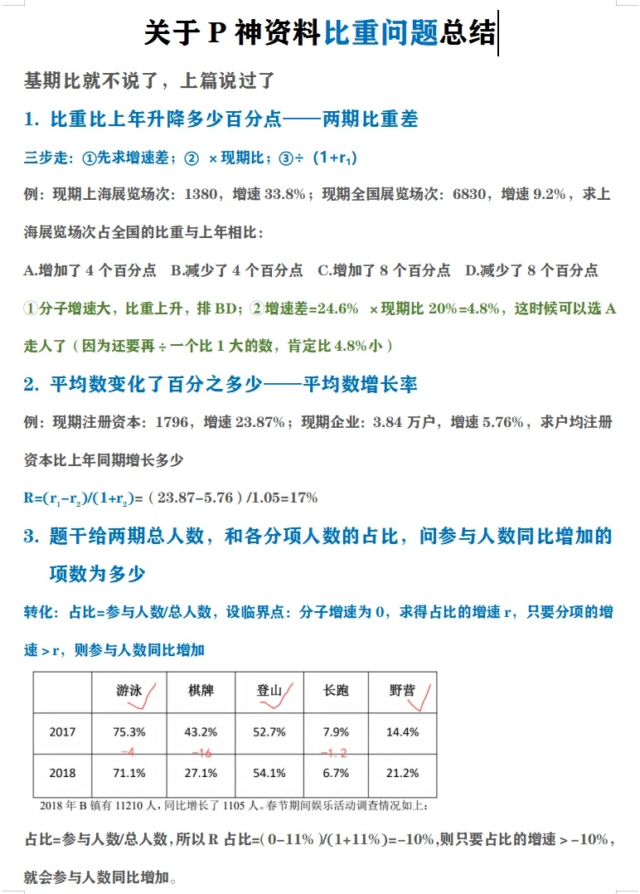
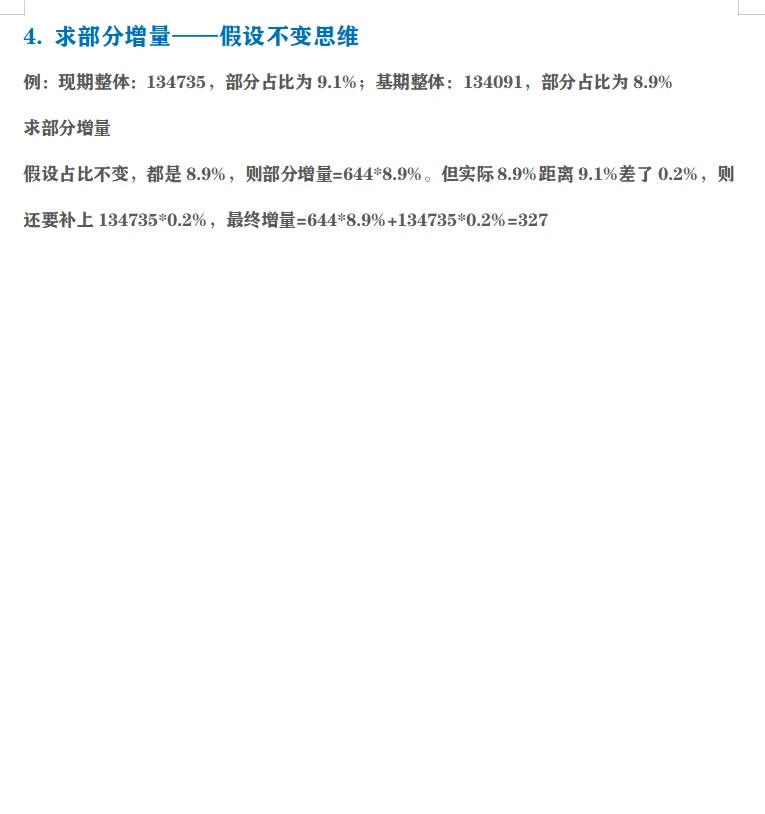
