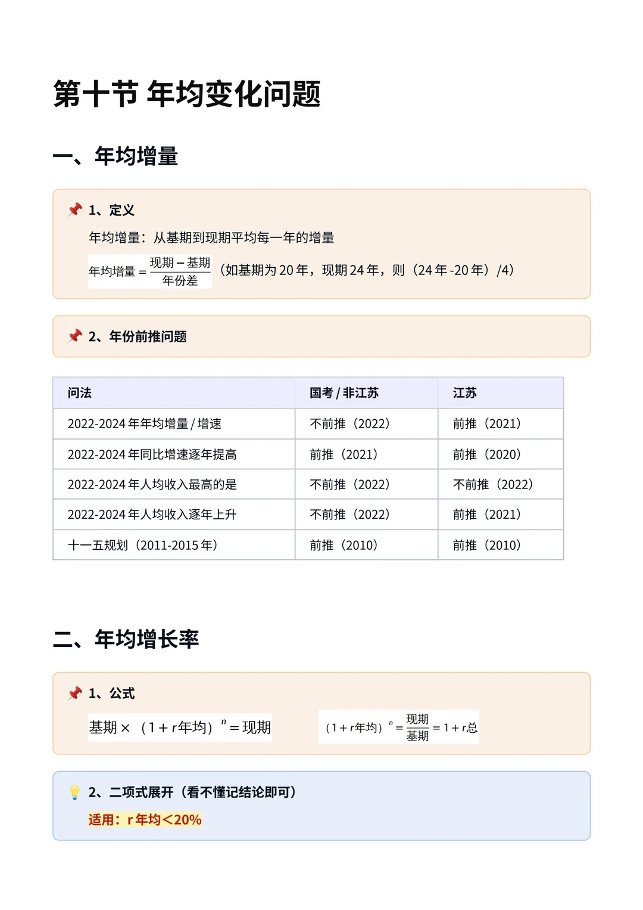
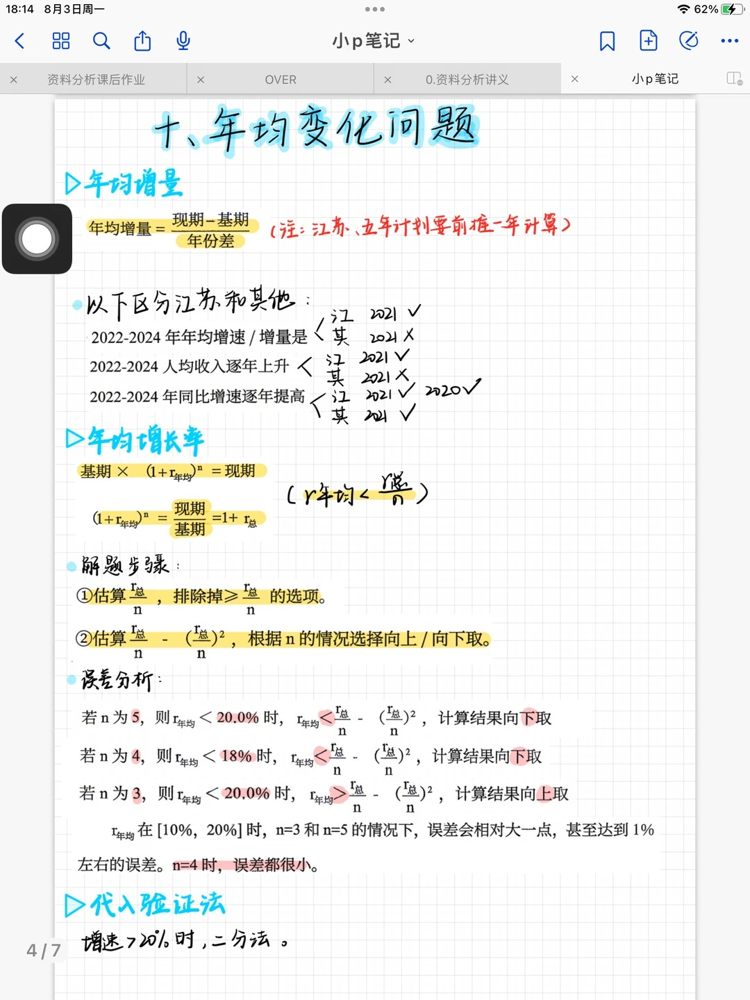
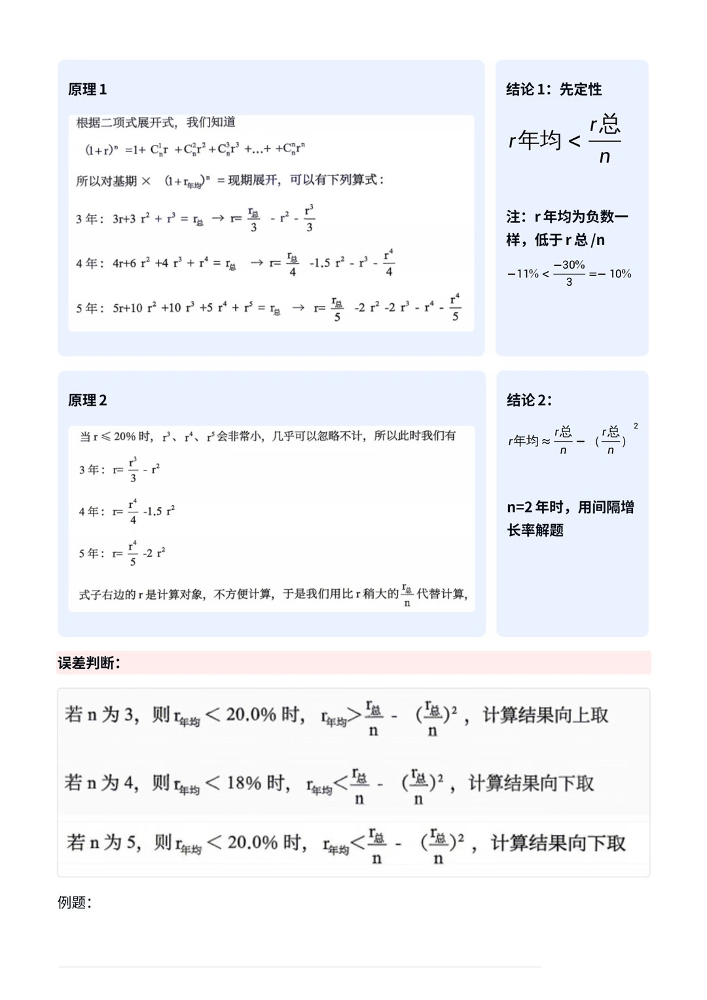
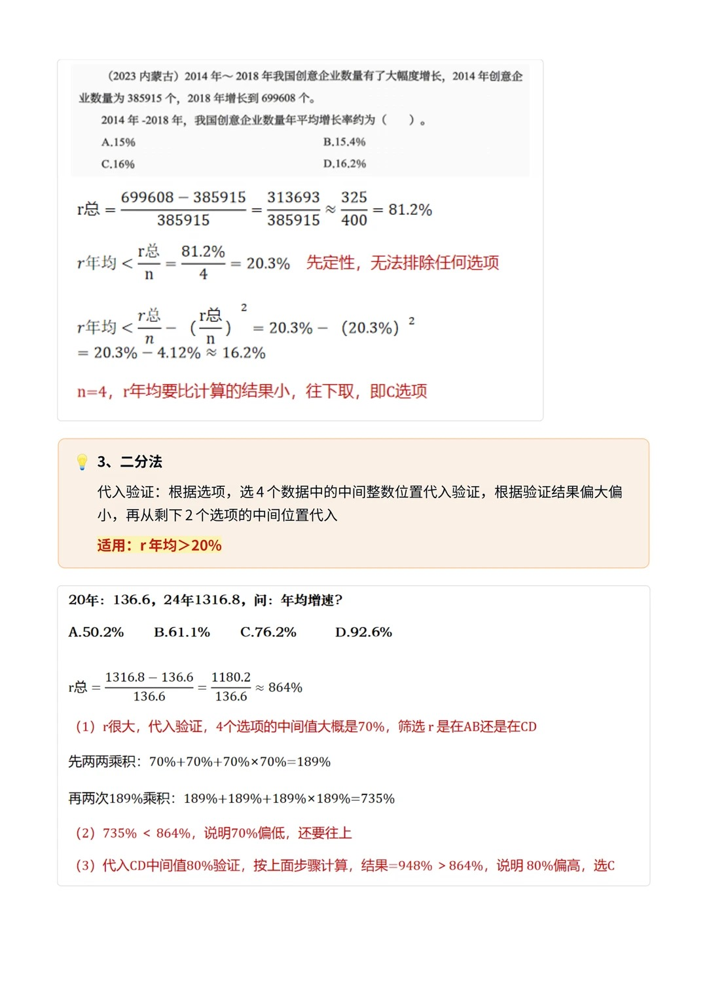
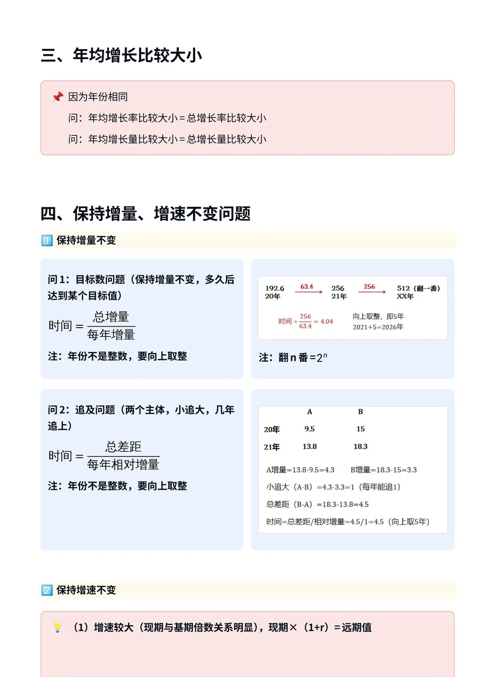
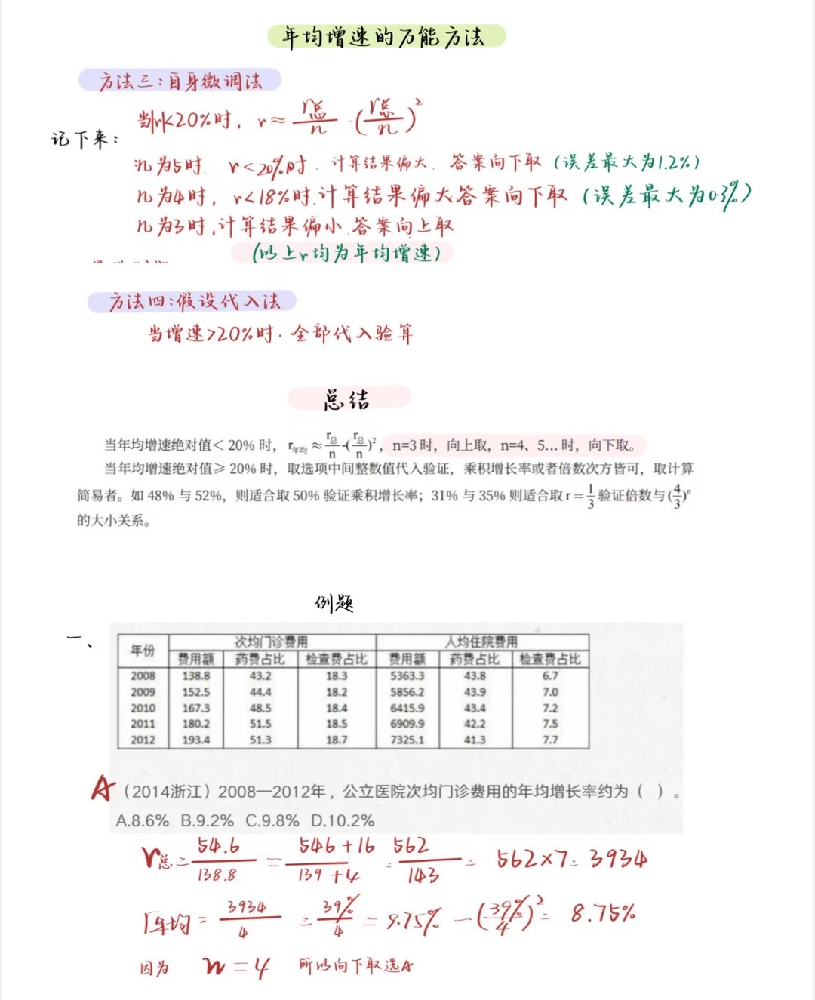
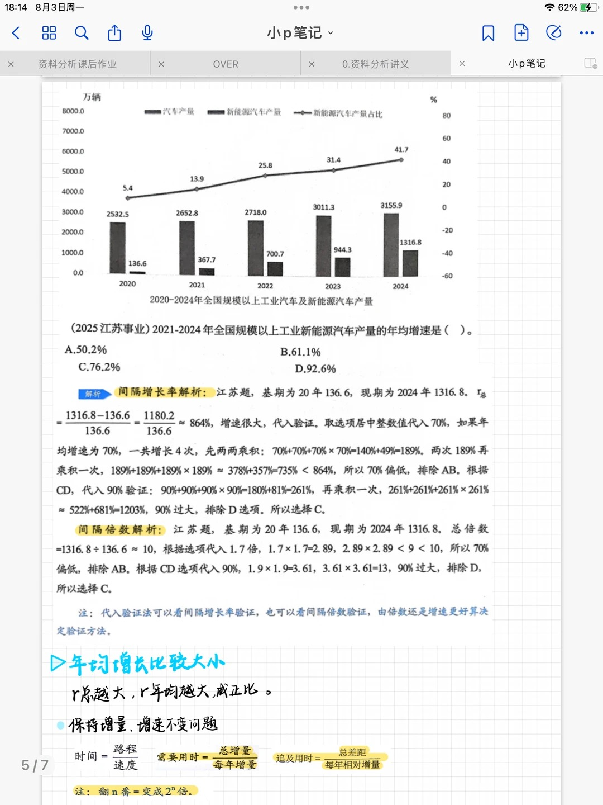
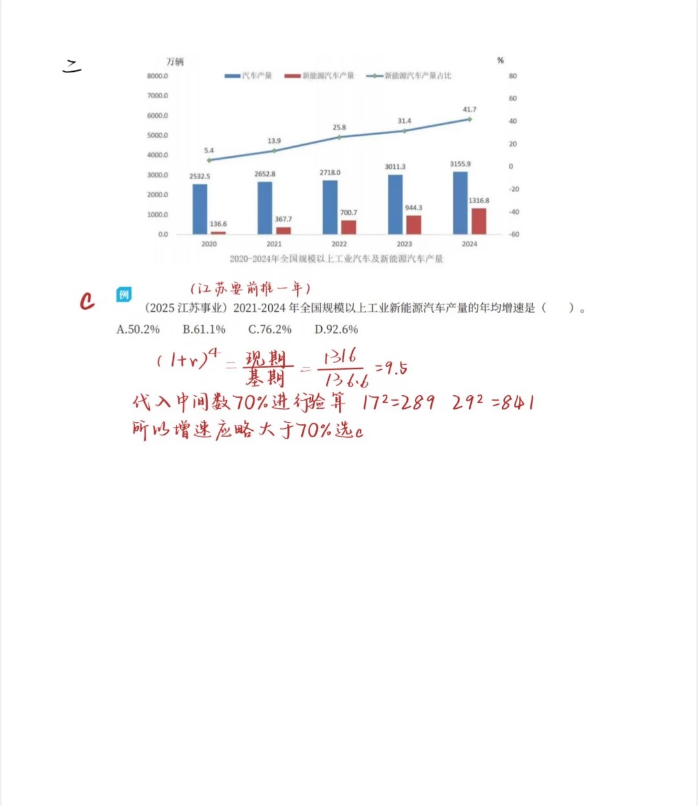
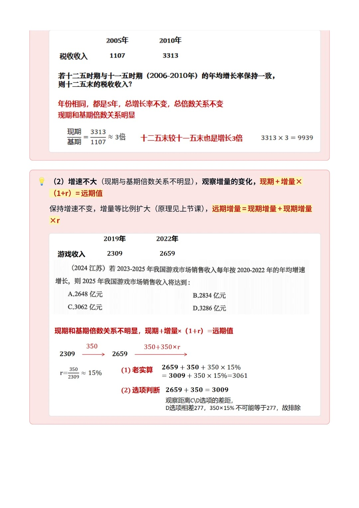
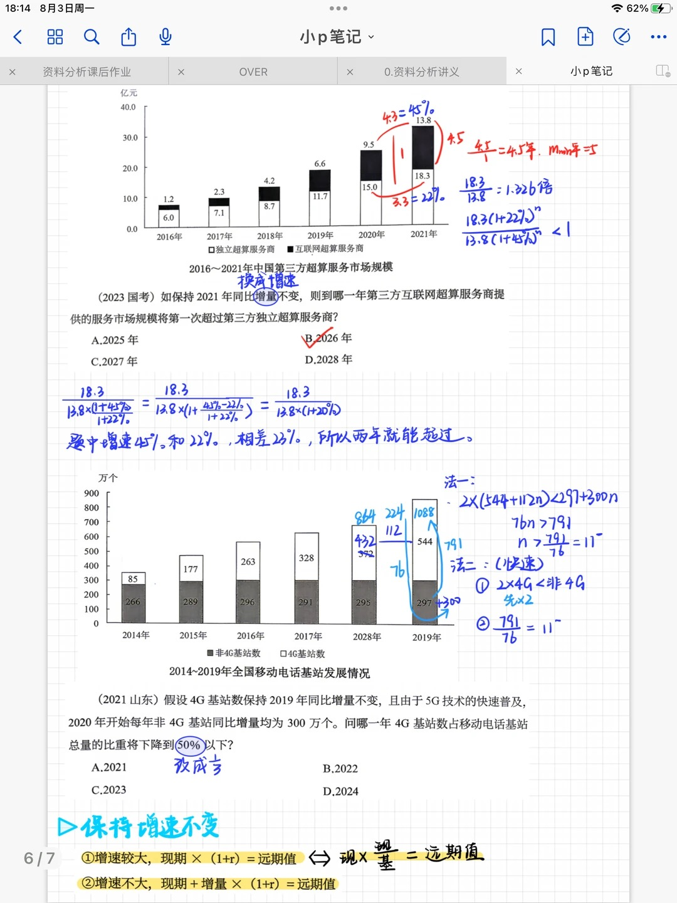

# 第十节 年均变化问题（年均增量 & 年均增长率）

> 💡 **本节定位**：年均变化问题只有三个要素——**基期、现期、年份差 n**。年均增量考"算术平均"，年均增长率考"几何平均"。求年均增速是难点，核心就两条路：**r < 20% 用微调公式（二项式展开），r ≥ 20% 用代入验证（二分法）**。

---

## 一、核心概念与定义

### 1. 年均增量

> 📌 **定义**：从基期到现期，平均每一年的增量。

$$
年均增量 = \frac{现期 - 基期}{年份差}
$$

**示例**：基期为 2020 年，现期为 2024 年，则年份差 n = 2024 − 2020 = 4，
年均增量 =（2024 年值 − 2020 年值）÷ 4。

### 2. 年均增长率

> 📌 **定义**：假设每年以相同速度 r 增长，使基期恰好增长到现期，这个 r 就是年均增长率。

$$
基期 \times (1 + r_{年均})^n = 现期
\qquad\Longleftrightarrow\qquad
(1 + r_{年均})^n = \frac{现期}{基期} = 1 + r_{总}
$$

- **r总**：基期 → 现期的**总增长率**，r总 =（现期 − 基期）÷ 基期
- **n**：年份差（现期年份 − 基期年份）

### 3. 年均增量 vs 年均增长率（区别与联系）

| 维度 | 年均增量 | 年均增长率 |
| --- | --- | --- |
| **本质** | 增量的**算术平均** | 增速的**几何平均** |
| **公式** | (现期 − 基期) ÷ n | 基期 ×(1+r)ⁿ = 现期 |
| **结果性质** | 一个**量**（带单位） | 一个**率**（%） |
| **计算难度** | 简单，直接算 | 开 n 次方，需估算技巧 |
| **常见问法** | "年均增长（ ）亿元/万人" | "年均增速/年均增长率约为" |
| **联系** | 都用同一组三要素（基期、现期、n）；年份相同时，比大小都可转化为"比总量/总率"（见第四节） |

---

## 二、年份前推问题（基期认定）⭐

> ⚠️ **这是年均问题第一易错点**：n 取决于基期算哪一年，而基期认定**分考区、分问法**。

| 问法 | 国考 / 非江苏 | 江苏 |
| --- | --- | --- |
| 2022-2024 年年均增量 / 增速 | 不前推（基期 2022） | **前推**（基期 2021） |
| 2022-2024 年同比增速逐年提高 | 前推（2021） | 前推（2020） |
| 2022-2024 年人均收入最高的是 | 不前推（2022） | 不前推（2022） |
| 2022-2024 年人均收入逐年上升 | 不前推（2022） | 前推（2021） |
| 十一五规划（2011-2015 年） | 前推（2010） | 前推（2010） |

**规律总结**：
1. **江苏卷基本都要前推一年**（年均增量/增速、"逐年上升"类）；
2. **五年规划**（十一五、十二五……）无论哪个考区都要前推（2011-2015 的基期是 2010）；
3. "**逐年**提高 / 上升"涉及每一年都要验证，往往要前推；
4. "最高的是""最大的是"只是找最值，**不前推**。



---

## 三、年均增长率的两大解法

### 总览：解题步骤

1. **先定性**：估算 r总 ÷ n，**排除掉 ≥ r总/n 的选项**（因为 r年均 恒小于 r总/n）；
2. **再定量**：估算 r总/n − (r总/n)²，根据 n 的情况选择**向上 / 向下取**；
3. r ≥ 20% 时微调公式失效，改用**代入验证（二分法）**。



### 解法一：二项式展开（自身微调法）—— 适用 r年均 < 20%

**原理**（看不懂记结论即可）：对 基期 ×(1+r年均)ⁿ = 现期 做二项式展开：

$$
(1+r)^n = 1 + C_n^1 r + C_n^2 r^2 + C_n^3 r^3 + \dots + C_n^n r^n
$$

当 r ≤ 20% 时，r³、r⁴、r⁵ 非常小可忽略，于是：

> ⭐ **结论 1（先定性）**：$r_{年均} < \dfrac{r_总}{n}$
> 注：r年均 为负数时一样成立（低于 r总/n），例：−11% < −30% ÷ 3 = −10%

> ⭐ **结论 2（再定量）**：$r_{年均} \approx \dfrac{r_总}{n} - \left(\dfrac{r_总}{n}\right)^2$
> 注：**n = 2 时不要用此公式**，直接用间隔增长率解题。

**误差判断（决定向上取还是向下取）**：

| n | 适用条件 | r年均 与估算值的关系 | 计算结果取法 |
| --- | --- | --- | --- |
| 3 | r年均 < 20% | r年均 **>** r总/n − (r总/n)² | **向上取**（结果偏小） |
| 4 | r年均 < 18% | r年均 **<** r总/n − (r总/n)² | **向下取**（结果偏大） |
| 5 | r年均 < 20% | r年均 **<** r总/n − (r总/n)² | **向下取**（结果偏大） |

> 💡 **误差量级**：n = 4 时误差最小（最大约 0.3%）；n = 5 时误差最大约 1.2%；r年均 落在 [10%, 20%] 区间时，n = 3 和 n = 5 的误差相对大，甚至可达 1% 左右。



### 解法二：代入验证（二分法）—— 适用 r年均 > 20%

> 📌 **方法**：根据选项，选 4 个选项中的**中间整数**位置代入验证；根据验证结果偏大 / 偏小，再从剩下 2 个选项的中间位置代入。

**两种验证方式**（哪个好算用哪个）：

| 方式 | 操作 | 适用场景 |
| --- | --- | --- |
| **间隔增长率验证** | 两两复合：a + a + a×a，复合两次得 4 年总增速，与 r总 比 | 选项是"整十"增速好复合时（如 48% 与 52%，取 50% 验证） |
| **间隔倍数验证** | (1+r)² 再平方，与 现期/基期 总倍数比 | 倍数关系明显时（如 31% 与 35%，取 r = 1/3，验证 (4/3)ⁿ 的大小） |



---

## 四、年均增长比较大小

> ⭐ **前提：年份相同**（n 相同）
> - 问**年均增长率**比较大小 = 比较**总增长率**大小（r总 越大，r年均 越大，成正比）
> - 问**年均增长量**比较大小 = 比较**总增长量**大小

⚠️ 年份不同时**不能**直接比总增速，必须回到定义式。

---

## 五、保持增量、增速不变问题

### 1. 保持增量不变

**问 1：目标数问题**（保持增量不变，多久后达到某个目标值）

$$
时间 = \frac{总增量}{每年增量}
$$

> ⚠️ 年份不是整数时，要**向上取整**。
> 💡 **翻番**：翻 n 番 = 变成 2ⁿ 倍（翻一番 = 2 倍）。

**示例**：20 年 192.6 → 21 年 256（每年增量 63.4），问哪年达到 512（翻一番）？
时间 = 256 ÷ 63.4 ≈ 4.04 → 向上取整 5 年 → 2021 + 5 = **2026 年**。

**问 2：追及问题**（两个主体，小追大，几年追上）

$$
时间 = \frac{总差距}{每年相对增量}
$$

**示例**：20 年 A = 9.5、B = 15；21 年 A = 13.8、B = 18.3。
A 增量 = 13.8 − 9.5 = 4.3，B 增量 = 18.3 − 15 = 3.3；
每年相对增量 = 4.3 − 3.3 = 1（A 每年能追 1）；总差距 = 18.3 − 13.8 = 4.5；
时间 = 4.5 ÷ 1 = 4.5 → 向上取 **5 年**。

### 2. 保持增速不变

**（1）增速较大**（现期与基期倍数关系明显）：

$$
现期 \times (1+r) = 远期值
\qquad\Longleftrightarrow\qquad
现期 \times \frac{现期}{基期} = 远期值
$$

**（2）增速不大**（现期与基期倍数关系不明显）：观察**增量的变化**——保持增速不变时，增量等比例扩大：

$$
现期 + 增量 \times (1+r) = 远期值
\qquad（远期增量 = 现期增量 + 现期增量 \times r）
$$



---

## 六、典型例题

### 例 1（2023 内蒙古）微调法：n = 4 向下取

> 2014 年~2018 年我国创意企业数量有了大幅度增长，2014 年创意企业数量为 385915 个，2018 年增长到 699608 个。2014 年-2018 年，我国创意企业数量年平均增长率约为（ ）。
> A. 15%　B. 15.4%　C. 16%　D. 16.2%

**解答**：

1. **算 r总**：
$$
r_总 = \frac{699608 - 385915}{385915} = \frac{313693}{385915} \approx \frac{325}{400} = 81.2\%
$$
2. **先定性**：r年均 < 81.2% ÷ 4 = 20.3%，无法排除任何选项；
3. **再定量**：
$$
r_{年均} < \frac{r_总}{n} - \left(\frac{r_总}{n}\right)^2 = 20.3\% - (20.3\%)^2 = 20.3\% - 4.12\% \approx 16.2\%
$$
4. **误差判断**：n = 4，r年均 要比计算结果**小，往下取** → **选 C（16%）**。

### 例 2（2014 浙江）微调法：快速估算 r总

> 2008—2012 年，公立医院次均门诊费用的年均增长率约为（ ）。（2008 年 138.8 元，2012 年 193.4 元）
> A. 8.6%　B. 9.2%　C. 9.8%　D. 10.2%

**解答**：

1. **算 r总**（放缩速算）：
$$
r_总 = \frac{193.4 - 138.8}{138.8} = \frac{54.6}{138.8} \approx \frac{56.2}{143} \approx 39.3\%
$$
2. **代公式**：
$$
r_{年均} \approx \frac{39.3\%}{4} - \left(\frac{39\%}{4}\right)^2 \approx 9.75\% - 0.95\% \approx 8.75\%
$$
3. **误差判断**：n = 4，计算结果**偏大，向下取** → **选 A（8.6%）**。



### 例 3（2025 江苏事业）代入验证：两种验证方式

> 2021-2024 年全国规模以上工业新能源汽车产量的年均增速是（ ）。（2020 年 136.6 万辆，2024 年 1316.8 万辆）
> A. 50.2%　B. 61.1%　C. 76.2%　D. 92.6%

> ⚠️ **江苏题，基期前推一年**：基期 2020 年 136.6，现期 2024 年 1316.8，n = 4。

**解答**：

$$
r_总 = \frac{1316.8 - 136.6}{136.6} = \frac{1180.2}{136.6} \approx 864\%
$$

增速很大（r年均 显然 > 20%）→ **代入验证**，取选项中间整数值 70%。

**方法一：间隔增长率验证**
- 先两两乘积：70% + 70% + 70%×70% = 140% + 49% = **189%**
- 再复合一次：189% + 189% + 189%×189% ≈ 378% + 357% = **735% < 864%** → 70% 偏低，排除 A、B
- 代入 90% 验证：90% + 90% + 90%×90% = 180% + 81% = 261%；再复合：261% + 261% + 261%×261% ≈ 522% + 681% = **1203% > 864%** → 90% 过大，排除 D
- **选 C（76.2%）**

**方法二：间隔倍数验证**
- 总倍数 = 1316.8 ÷ 136.6 ≈ 9.5
- 代入 70%：1.7² = 2.89，2.89² ≈ 8.35 < 9.5 → 70% 偏低，排除 A、B
- 代入 90%：1.9² = 3.61，3.61² ≈ 13 > 9.5 → 90% 过大，排除 D
- **选 C（76.2%）**

> 💡 代入验证可以看间隔增长率，也可以看间隔倍数，**由倍数还是增速更好算来决定**。




### 例 4 保持增速不变：倍数关系明显

> 税收收入 2005 年 1107，2010 年 3313。若十二五时期与十一五时期（2006-2010 年）的年均增长率保持一致，则十二五末的税收收入为？

**解答**：

1. 年份相同（都是 5 年）→ **总增长率不变，总倍数关系不变**；
2. 现期 ÷ 基期 = 3313 ÷ 1107 ≈ **3 倍**；
3. 十二五末较十一五末也增长 3 倍：3313 × 3 = **9939**。

### 例 5（2024 江苏）保持增速不变：增速不大看增量

> 2019 年我国游戏市场销售收入 2309 亿元，2022 年 2659 亿元。若 2023-2025 年我国游戏市场销售收入每年按 2020-2022 年的年均增速增长，则 2025 年我国游戏市场销售收入将达到：
> A. 2648 亿元　B. 2834 亿元　C. 3062 亿元　D. 3286 亿元

**解答**：

1. 现期和基期倍数关系不明显 → 用 **现期 + 增量 ×(1+r) = 远期值**；
2. 年增量 = 2659 − 2309 = 350，r = 350 ÷ 2309 ≈ **15%**；
3. **老实算**：2659 + 350 + 350×15% = 3009 + 52.5 ≈ **3061**；
4. **选项判断**：2659 + 350 = 3009，观察与 C、D 选项的差距——D 选项相差 277，而 350×15% ≈ 52.5 不可能等于 277，排除 D；
5. **选 C（3062 亿元）**。



### 例 6（2023 国考）保持增量不变：追及问题

> 如保持 2021 年同比增量不变，则到哪一年第三方互联网超算服务商提供的服务市场规模将第一次超过第三方独立超算服务商？（2021 年：独立超算 18.3 亿元、互联网超算 13.8 亿元）
> A. 2025 年　B. 2026 年　C. 2027 年　D. 2028 年

**解答**（追及问题，小追大）：

1. 互联网超算增量 = 13.8 − 9.5 = **4.3**；独立超算增量 = 18.3 − 15.0 = **3.3**；
2. 每年相对增量 = 4.3 − 3.3 = **1**（互联网每年能追 1）；
3. 总差距 = 18.3 − 13.8 = **4.5**；
4. 时间 = 4.5 ÷ 1 = 4.5 → **向上取整 5 年** → 2021 + 5 = **2026 年，选 B**。

> 💡 **另解（换成增速）**：互联网增速 4.3/9.5 ≈ 45%，独立增速 3.3/15 = 22%，两者相差约 23%。每年体量比约缩小 13.8×(1+45%) ÷ [18.3×(1+22%)] ≈ 1.11 倍 → 约两年反超，同样指向 2026 年。

### 例 7（2021 山东）保持增量不变：占比下降临界点

> 假设 4G 基站数保持 2019 年同比增量不变，且由于 5G 技术的快速普及，2020 年开始每年非 4G 基站同比增量均为 300 万个。问哪一年 4G 基站数占移动电话基站总量的比重将下降到 50% 以下？（2019 年：4G 基站 544 万个、非 4G 基站 297 万个；2019 年 4G 同比增量 = 544 − 432 = 112 万个）
> A. 2021　B. 2022　C. 2023　D. 2024

**解答**：

1. **关键转化**：占比 < 50% ⇔ **4G 数 < 非 4G 数**（2×4G < 总量）；
2. 设 n 年后（2019 年起）：544 + 112n < 297 + 300n；
3. 化简：247 < 188n → n > 1.31 → **向上取 n = 2**；
4. 2019 + 2 = **2021 年，选 A**。

> 💡 **快速法**：非 4G 每年比 4G 多增 300 − 112 = 188 万，当前差距 544 − 297 = 247 万，247 ÷ 188 ≈ 1.3 → 两年反超。



---

## 七、易错点与常见误区

| # | 易错点 | 正确做法 |
| --- | --- | --- |
| 1 | **年份差算错**（把 2014→2018 当成 5 年） | n = 现期年份 − 基期年份 = 4，间隔数 ≠ 年份个数 |
| 2 | **江苏卷忘记前推一年**；五年规划忘记前推 | 江苏年均问题、十一五/十二五等规划，基期统一前推一年 |
| 3 | 把 **r总/n 直接当年均增速** | r年均 恒**小于** r总/n（负增速同理），只能用来定性排除 |
| 4 | 微调公式**取方向记反** | 口诀：**n=3 向上取，n=4、5 向下取** |
| 5 | r年均 ≥ 20% 还用微调公式 | 误差失控，改用**代入验证（二分法）** |
| 6 | n = 2 也套微调公式 | n = 2 直接用**间隔增长率** r = r₁+r₂+r₁r₂ 求解 |
| 7 | 保持增量不变求年份，**忘记向上取整** | 4.04 年 → 5 年；4.5 年 → 5 年，一律进一 |
| 8 | **翻番**理解错 | 翻 n 番 = 2ⁿ 倍，翻一番 = 2 倍（不是 +100% 的随意表述） |
| 9 | 比较大小不看年份 | 只有**年份相同**才能"年均增速比 = 总增速比" |
| 10 | 保持增速不变一律用现期×(1+r) | 增速不大、倍数不明显时用 **现期 + 增量×(1+r)** 更快更准 |

---

## 八、总结归纳

> ⭐ **一张图记住本节**

**三要素**：基期、现期、年份差 n（先定基期，江苏/五年规划前推一年）。

**两大考点**：

| 考点 | 公式 | 关键动作 |
| --- | --- | --- |
| 年均增量 | (现期 − 基期) ÷ n | 直接算，注意前推 |
| 年均增长率 | 基期×(1+r)ⁿ = 现期 | 见下方决策树 |

**求年均增速决策树**：

```
算 r总 = (现期−基期)÷基期
   │
   ├─ 先定性：r年均 < r总/n，排除 ≥ r总/n 的选项
   │
   ├─ r年均 < 20% → 微调公式：r ≈ r总/n − (r总/n)²
   │      n=3 向上取；n=4（r<18%）、n=5 向下取
   │      （n=2 用间隔增长率）
   │
   └─ r年均 ≥ 20% → 代入验证（二分法）
          取选项中间整数代入，间隔增长率 或 间隔倍数验证
```

**三类延伸题**：
1. **比较大小**：年份相同 → 年均增速比 = 总增速比，年均增量比 = 总增量比；
2. **保持增量不变**：时间 = 总差距 ÷ 每年（相对）增量，**向上取整**；
3. **保持增速不变**：倍数明显 → 现期×(1+r)；倍数不明显 → 现期 + 增量×(1+r)。
