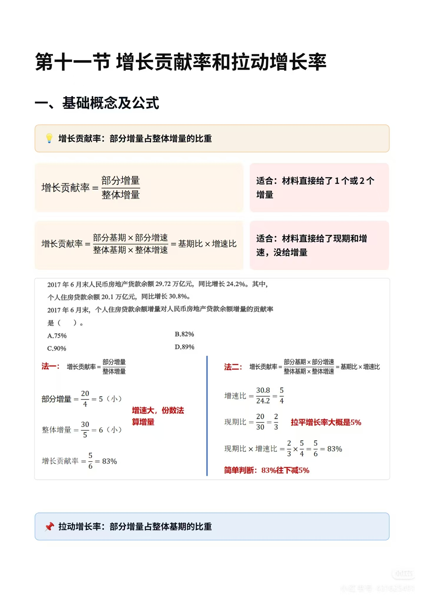
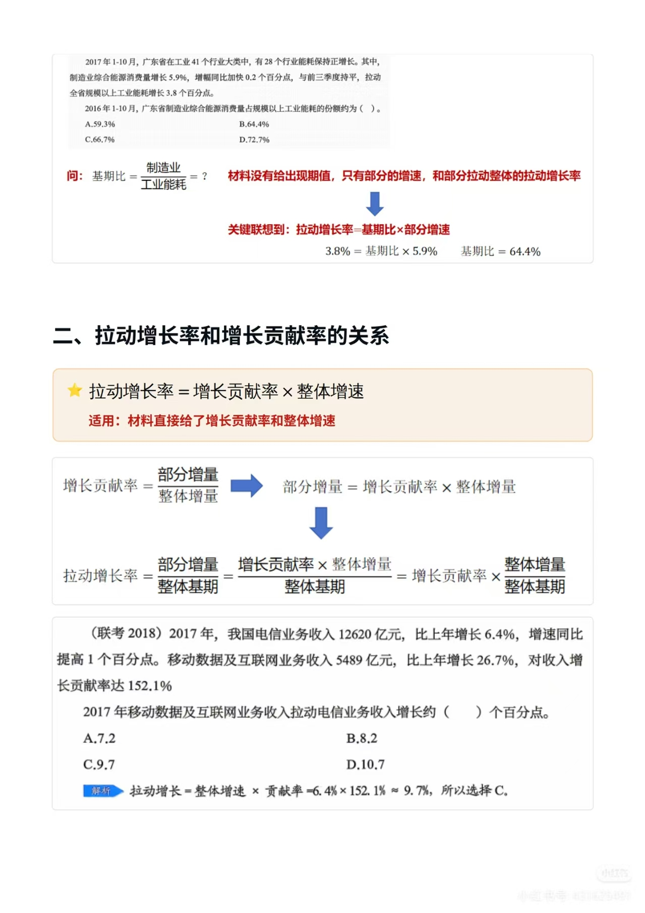
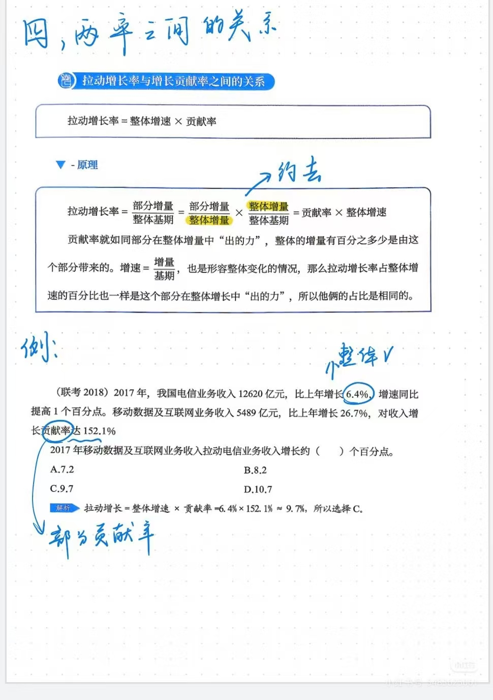
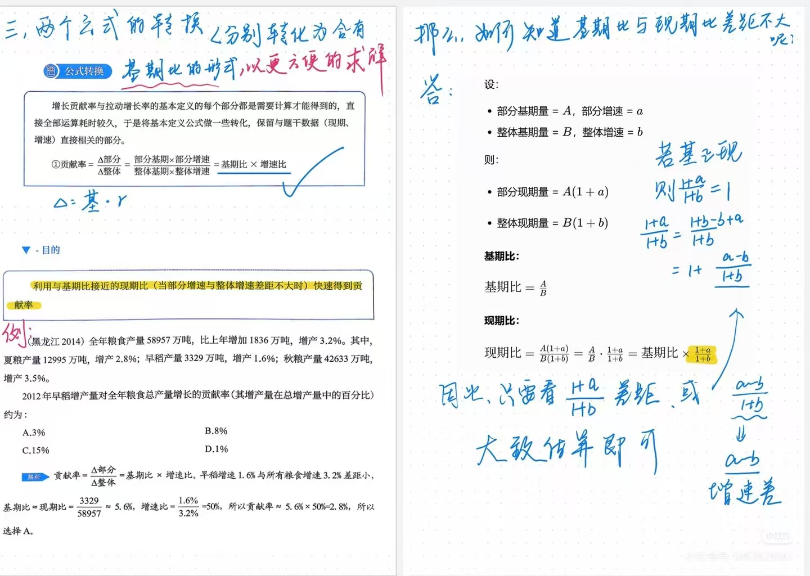
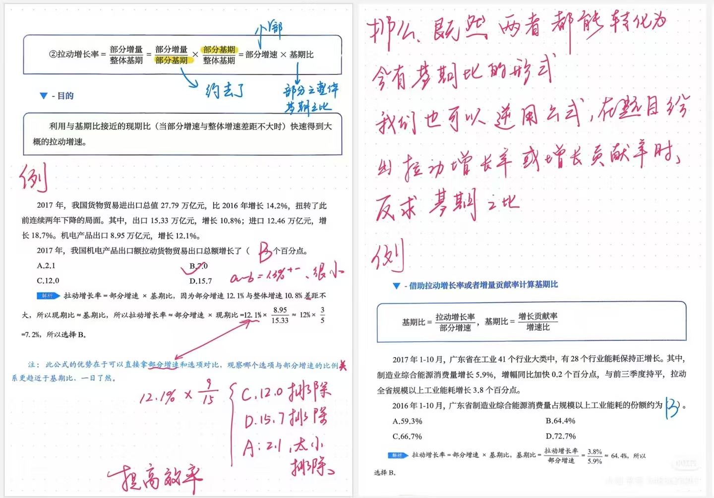
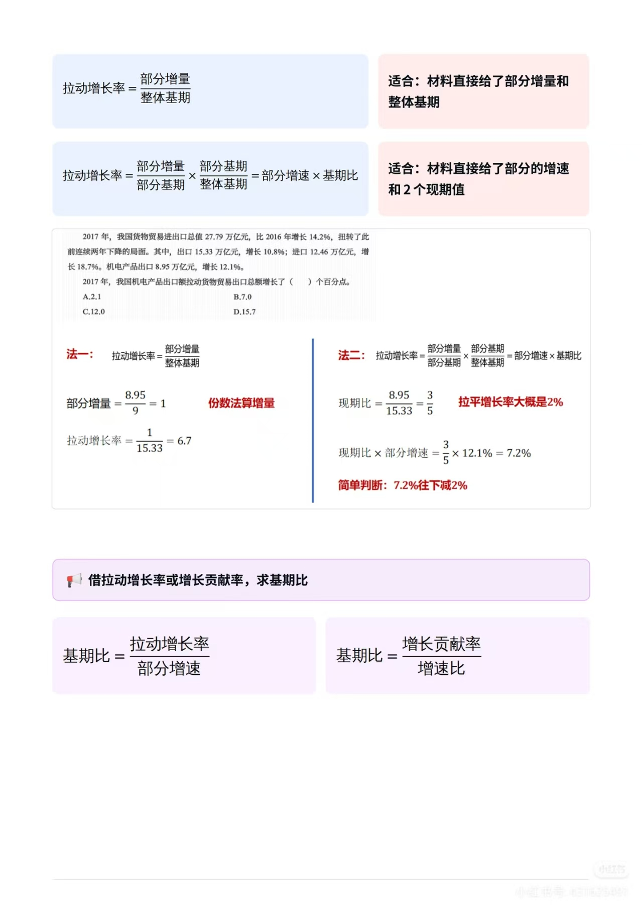
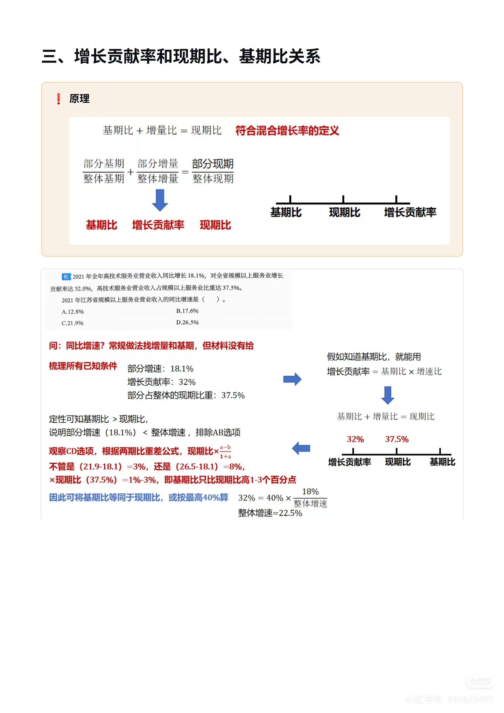
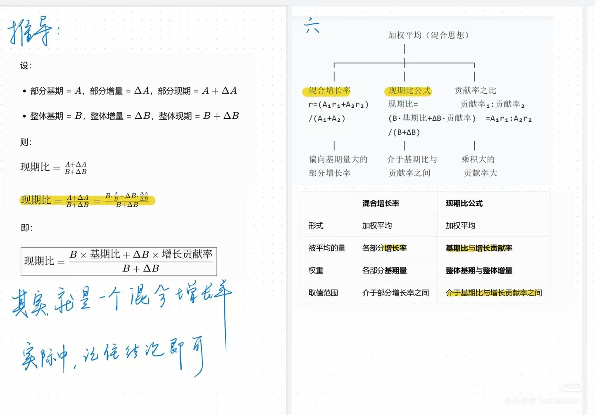

# 第十一节 增长贡献率与拉动增长率

> 💡 **本节定位**：两个指标都是「部分 → 整体」的关系量，常结合比重、增速混合考查。核心是三句话：**贡献率看增量、拉动看基期、两率差一个整体增速**。

---

## 一、核心概念与定义

### 1. 增长贡献率

> 📌 **定义**：部分增量占**整体增量**的比重（部分在整体增长中"出的力"）。

$$
增长贡献率 = \frac{部分增量}{整体增量}
$$

**变形公式**（材料给现期和增速、没给增量时用）：

$$
增长贡献率 = \frac{部分基期 \times 部分增速}{整体基期 \times 整体增速} = 基期比 \times 增速比
$$

### 2. 拉动增长率

> 📌 **定义**：部分增量占**整体基期**的比重（部分的增长带动整体增长了几个百分点）。本质是**一种增速**，单位是**个百分点**。

$$
拉动增长率 = \frac{部分增量}{整体基期}
$$

**变形公式**（材料给部分增速和两个现期值时用）：

$$
拉动增长率 = \frac{部分增量}{部分基期} \times \frac{部分基期}{整体基期} = 部分增速 \times 基期比
$$



### 3. 定义对比的代数本质（手写推导）

设整体 A = 部分 B + 部分 C（基期 A₀ = B₀ + C₀，现期 A₁ = B₁ + C₁），则 ΔA = ΔB + ΔC：

- B 的拉动增长率 = ΔB / A₀
- C 的拉动增长率 = ΔC / A₀
- 整体 A 的增长率 = ΔA / A₀ = (ΔB + ΔC) / A₀

👉 **推论：各部分拉动增长率之和 = 整体增长率**（各部分贡献率之和 = 100%，允许出现负值或超 100% 的情形）。


---

## 二、两者的区别与联系

### 1. 区别一览表

| 维度 | 增长贡献率 | 拉动增长率 |
| --- | --- | --- |
| **分母** | 整体**增量** | 整体**基期** |
| **含义** | 部分在整体增量中占多大份额 | 部分带动整体增长了几个点 |
| **性质** | 比重（%） | 增速（**个百分点**） |
| **各部分合计** | = 100%（可为负、可超 100%） | = 整体增速 |
| **常见问法** | "……对……增长的贡献率" | "……拉动……增长（ ）个百分点" |

### 2. 联系（两率互化）

> ⭐ **拉动增长率 = 增长贡献率 × 整体增速**
> 适用：材料直接给了增长贡献率和整体增速。

**推导**：

$$
拉动增长率 = \frac{部分增量}{整体基期} = \frac{部分增量}{整体增量} \times \frac{整体增量}{整体基期} = 增长贡献率 \times 整体增速
$$

直觉理解：贡献率是"部分在整体增量中出的力"，增速是"整体变化的程度"，两者占比口径一致，故贡献率 × 整体增速 = 拉动增长率。




---

## 三、公式的转换与逆用（速算关键）

### 1. 为什么转换

基本定义式中"增量、基期"都要计算才能得到，直接算耗时。转换为与题干数据（现期、增速）直接相关的形式：

- ① 增长贡献率 = **基期比 × 增速比**
- ② 拉动增长率 = **部分增速 × 基期比**

> 💡 **Δ = 基期 × 增速**，所有变形都靠这一句。

### 2. 基期比 ≈ 现期比的近似条件

**目的**：当部分增速与整体增速差距不大时，用现期比代替基期比快速求解。

**推导**：设部分基期 A、增速 a；整体基期 B、增速 b，则

$$
现期比 = \frac{A(1+a)}{B(1+b)} = 基期比 \times \frac{1+a}{1+b}, \qquad \frac{1+a}{1+b} = 1 + \frac{a-b}{1+b}
$$

👉 只需看 $\frac{1+a}{1+b}$ 与 1 的差距（即**增速差 a−b** 除以 1+b）大致估算修正幅度即可。增速差小 → 基期比 ≈ 现期比；部分增速 > 整体增速 → 基期比 < 现期比，结果要"往下减"。



### 3. 逆用公式：反求基期比

> 📢 材料给出拉动增长率或增长贡献率时，可逆用公式求基期比（基期份额）：

$$
基期比 = \frac{拉动增长率}{部分增速} \qquad\qquad 基期比 = \frac{增长贡献率}{增速比}
$$




---

## 四、增长贡献率与现期比、基期比的关系（加权平均思想）

> ❗ **原理：基期比 + 增长贡献率 = 现期比**（按整体基期、整体增量加权混合，符合混合增长率定义）。

$$
\frac{部分基期}{整体基期} \;+\; \frac{部分增量}{整体增量} \;\xrightarrow{加权混合}\; \frac{部分现期}{整体现期}
$$

即：

$$
现期比 = \frac{B \times 基期比 + \Delta B \times 增长贡献率}{B + \Delta B}
$$

👉 **现期比介于基期比与增长贡献率之间**（加权平均的取值范围）。

**三种"加权平均（混合思想）"对比**：

| | 混合增长率 | 现期比公式 | 贡献率之比 |
| --- | --- | --- | --- |
| **形式** | 加权平均 | 加权平均 | 贡献率₁ : 贡献率₂ = A₁r₁ : A₂r₂ |
| **被平均的量** | 各部分增长率 | 基期比与增长贡献率 | — |
| **权重** | 各部分基期量 | 整体基期与整体增量 | — |
| **取值/结论** | 介于部分增长率之间，偏向基期量大的部分 | 介于基期比与贡献率之间 | 乘积大的贡献率大 |




---

## 五、典型例题（附详细解答）

<details>
<summary>▶ 例 1（基础·贡献率）2017 年 6 月末人民币房地产贷款余额 29.72 万亿元，同比增长 24.2%。其中个人住房贷款余额 20.1 万亿元，同比增长 30.8%。问：个人住房贷款余额增量对人民币房地产贷款余额增量的贡献率是（ ）。A.75%　B.82%　C.90%　D.89%</summary>

**法一：份数法算增量（增速大时用）**
- 部分增量 ≈ 20/4 = 5（30.8% ≈ 1/3，现期≈4 份基期，增量 1 份）
- 整体增量 ≈ 30/5 = 6（24.2% ≈ 1/4）
- 贡献率 = 5/6 ≈ 83%

**法二：基期比 × 增速比**
- 增速比 = 30.8/24.2 = 5/4；现期比 = 20/30 = 2/3
- 现期比 × 增速比 = 2/3 × 5/4 = 5/6 ≈ 83%
- 修正：部分增速(30.8%) > 整体增速(24.2%)，基期比 < 现期比，拉平约 5% → **83% 往下减一点 ≈ 82%**

✅ **选 B（82%）**

</details>

<details>
<summary>▶ 例 2（基础·拉动增长率）2017 年我国货物贸易出口 15.33 万亿元，增长 10.8%。机电产品出口 8.95 万亿元，增长 12.1%。问：机电产品出口额拉动货物贸易出口总额增长了（ ）个百分点。A.2.1　B.7.0　C.12.0　D.15.7</summary>

**法一：份数法**
- 部分增量 ≈ 8.95/9 ≈ 1（12.1% ≈ 1/8，现期 9 份、增量 1 份）
- 拉动增长率 ≈ 1/15.33 ≈ 6.5~7 个百分点

**法二：部分增速 × 基期比（≈ 现期比）**
- 现期比 = 8.95/15.33 ≈ 3/5
- 3/5 × 12.1% ≈ 7.2%
- 修正：增速差 12.1% − 10.8% 很小，拉平约 0.2~2% → **7.2% 往下减 ≈ 7.0**
- 选项对比：12.1% × 9/15 ≈ 7.3%，C(12.0)、D(15.7) 比例明显不对，A(2.1) 太小，均可排除

✅ **选 B（7.0）**

> 💡 此公式优势：直接拿**部分增速**和选项对比，观察哪个选项与部分增速的比例更接近基期比，一目了然，提高效率。

</details>

<details>
<summary>▶ 例 3（逆用·求基期比）2017 年 1—10 月，广东省制造业综合能源消费量增长 5.9%，拉动全省规模以上工业能耗增长 3.8 个百分点。问：2016 年 1—10 月广东省制造业综合能源消费量占规模以上工业能耗的份额约为（ ）。A.59.3%　B.64.4%　C.66.7%　D.72.7%</summary>

**分析**：材料没有给出现期值，只有部分增速和部分拉动整体的拉动增长率 → 联想到 **拉动增长率 = 基期比 × 部分增速**

- 3.8% = 基期比 × 5.9%
- 基期比 = 3.8% / 5.9% ≈ 64.4%

✅ **选 B（64.4%）**

</details>

<details>
<summary>▶ 例 4（两率互化·联考 2018）2017 年我国电信业务收入 12620 亿元，比上年增长 6.4%。移动数据及互联网业务收入 5489 亿元，比上年增长 26.7%，对收入增长贡献率达 152.1%。问：2017 年移动数据及互联网业务收入拉动电信业务收入增长约（ ）个百分点。A.7.2　B.8.2　C.9.7　D.10.7</summary>

- 拉动增长率 = 整体增速 × 贡献率 = 6.4% × 152.1% ≈ 9.7%

✅ **选 C（9.7）**

> ⚠️ 注意本题贡献率 **152.1% > 100%**——因为其他业务收入负增长，移动数据"超额出力"，贡献率完全可以超过 100%。

</details>

<details>
<summary>▶ 例 5（综合·江苏 2021）2021 年全年高技术服务业营业收入同比增长 18.1%，对全省规模以上服务业增长贡献率达 32.0%，高技术服务业营业收入占规模以上服务业比重达 37.5%。问：2021 年江苏省规模以上服务业营业收入的同比增速是（ ）。A.12.8%　B.17.6%　C.21.9%　D.26.5%</summary>

**梳理已知**：部分增速 18.1%；增长贡献率 32%；部分占整体的**现期**比重 37.5%。常规做法缺增量和基期 → 用 **增长贡献率 = 基期比 × 增速比**。

1. **定性排除**：基期比 > 现期比 ⟺ 部分增速(18.1%) < 整体增速，排除 A、B（≤18.1%）
2. **估算基期比**：由两期比重差公式，现期比 × (a−b)/(1+a)：不管整体增速是 21.9% 还是 26.5%，增速差 3%~8%，× 现期比(37.5%) ≈ 1~3 个百分点，即**基期比只比现期比高 1~3 个点**，可按最高 40% 算
3. 32% = 40% × 18%/整体增速 → 整体增速 ≈ 22.5%

✅ **选 C（21.9%）**（基期比略小于 40%，真实值略小于 22.5%）

</details>

<details>
<summary>▶ 例 6（近似速算·黑龙江 2014）全年粮食产量 58957 万吨，比上年增产 3.2%。其中早稻产量 3329 万吨，增产 1.6%。问：2012 年早稻增产量对全年粮食总产量增长的贡献率约为（ ）。A.3%　B.8%　C.15%　D.1%</summary>

- 贡献率 = 基期比 × 增速比；早稻增速 1.6% 与粮食增速 3.2% 差距小 → **基期比 ≈ 现期比**
- 现期比 = 3329/58957 ≈ 5.6%；增速比 = 1.6%/3.2% = 50%
- 贡献率 ≈ 5.6% × 50% ≈ 2.8%

✅ **选 A（3%）**

</details>

<details>
<summary>▶ 例 7（定义辨析·"十一五"）"十一五"期间，我国农村居民人均纯收入由 2005 年的 3255 元提高到 2010 年的 5919 元，增加 2664 元。2010 年工资性收入人均 2431 元，比 2005 年增加 1257 元。求：①工资性收入对纯收入的增长贡献率；②工资性收入拉动纯收入增长多少个百分点。</summary>

- ① 贡献率 = 工资性收入增量 / 纯收入增量 = 1257/2664 ≈ **47.2%**（比重的量纲）
- ② 拉动增长率 = 工资性收入增量 / 纯收入**基期** = 1257/3255 ≈ **38.6%**（增速的量纲）

> 💡 同一组数据，分母换一下就是两个指标——**分母辨析是最核心的考点**。这里工资性收入就是人均纯收入的一部分，贡献率就是用部分的增量去除以整体的增量。

</details>

---

## 六、易错点与常见误区

> ⚠️ **1. 分母张冠李戴（最高频）**
> 贡献率的分母是**整体增量**，拉动增长率的分母是**整体基期**。记法：**"贡献看增量、拉动看基期"**。问"拉动……增长几个百分点"时错除以整体增量，是命题人最常设的坑。

> ⚠️ **2. 量纲混淆：% 与 个百分点**
> 拉动增长率是增速，结果表述为"**个百分点**"；贡献率是比重，表述为"%"。选项若同时出现 6.7% 和 6.7 个百分点，依问法取舍。

> ⚠️ **3. 误以为贡献率 ≤ 100%**
> 当其他部分负增长时，某部分贡献率可 **> 100%**（如例 4 的 152.1%），也可为负。各部分贡献率之和恒等于 100%，各部分拉动增长率之和恒等于整体增速。

> ⚠️ **4. 基期比 ≈ 现期比的滥用**
> 近似成立的前提是**部分增速与整体增速差距不大**。部分增速明显高于整体增速时，基期比 < 现期比，估算结果要"**往下减**"（减幅 ≈ 增速差 × 现期比）。修正方向反了会直接选错相邻选项（如例 1 的 83% vs 82%）。

> ⚠️ **5. 份数法的符号与倍数陷阱**
> 增速为负时增量为负，份数要带着符号算；"增长 1.1 倍"≠"增长到 1.1 倍"（前者现期 = 基期 × 2.1）。

> ⚠️ **6. 求基期比时错用现期数据**
> 逆用公式 $基期比 = 拉动增长率 / 部分增速$ 求出的是**基期份额**（如例 3 求 2016 年占比），不要再按现期口径"修正"，除非题目明确问现期占比。

> ⚠️ **7. 现期比的位置判断错**
> 现期比**介于**基期比与增长贡献率之间（加权平均），用于定性排除选项时别把不等号方向弄反（部分增速 < 整体增速 ⟺ 基期比 > 现期比）。

---

## 七、总结归纳

### 1. 公式速查表

| 公式 | 表达式 | 适用场景 |
| --- | --- | --- |
| 增长贡献率（定义） | 部分增量 / 整体增量 | 材料直接给了 1 个或 2 个增量 |
| 增长贡献率（变形） | 基期比 × 增速比 | 给了现期和增速、没给增量 |
| 拉动增长率（定义） | 部分增量 / 整体基期 | 给了部分增量和整体基期 |
| 拉动增长率（变形） | 部分增速 × 基期比 | 给了部分增速和 2 个现期值 |
| 两率互化 | 拉动增长率 = 增长贡献率 × 整体增速 | 给了贡献率和整体增速 |
| 反求基期比 | 基期比 = 拉动增长率 / 部分增速 = 贡献率 / 增速比 | 给了拉动增长率或贡献率 |
| 混合关系 | 基期比 + 贡献率 →(加权)→ 现期比 | 现期比介于基期比与贡献率之间 |

### 2. 一句话记忆

- 🎯 **贡献率 = 增量里的份额；拉动 = 基期上的点数；两率之间差一个整体增速。**
- 🎯 **算贡献率/拉动，先想"基期比 × 增速"家族；增速差小，现期比直接顶基期比，记得按增速差方向微调。**
- 🎯 **给了拉动/贡献率求份额，一律逆用公式除回去。**

### 3. 解题决策路径

```
题目问什么？
├─ 贡献率 → 有增量？ → 有：部分增量/整体增量
│                    → 无：基期比(≈现期比) × 增速比
├─ 拉动增长率 → 有增量和整体基期？ → 有：部分增量/整体基期
│              → 有贡献率+整体增速？ → 相乘
│              → 只有现期+增速 → 部分增速 × 基期比(≈现期比)
└─ 基期份额 → 逆用：拉动增长率/部分增速 或 贡献率/增速比
```
