# 第十二课 · 容斥问题

> 📌 **课程定位**：冷门考法，但江苏考频高，需掌握。
> 🔑 **题型识别**：出现「至少、至多、一定有、可能是」字眼 + 讨论两种（或多种）属性的交叉 → 基本就是容斥问题。
> 🧩 **两大武器**：① 交集范围（算交叉占比的上下限）② "铺砖"思维（多人次分配求至多/至少）

---

## 一、核心概念与定义

### 1.1 两类统计属性

统计中，统计对象不止一种分类标准。比如统计 100 位学生：50 位男生、50 位女生；70 位往届生、30 位应届生。

| 类型 | 定义 | 举例 | 是否出现容斥 |
| --- | --- | --- | --- |
| **并列型属性** | 无法同时存在于一个个体的属性 | 男性/女性；城镇/乡村；儿童、青年、中年、老年 | ❌ 不会出现容斥 |
| **交叉型属性** | 可以同时存在的两组或者多组属性 | 城镇与儿童；男性与中年 | ✅ 会出现容斥 |

**核心判断**：
- 属性 A + 属性 B **> 总量** → A 与 B **必然存在交叉**（如男生+往届生 = 50+70 = 120 > 100）
- 属性 A + 属性 B **≤ 总量** → A 与 B **不一定存在交叉**（如女生+应届生 = 50+30 < 100，一般见于综合题判断正误）

> 💡 **反证法理解**：假设男生与往届生不存在重叠，则往届生只能在剩下 100−50=50 位女生内，而 50 位女生不可能容纳 70 位往届生，矛盾 → 必然交叉。反之，假设女生与应届生不重叠，应届生可放在 50 位男生内，50 位男生完全可能容纳 30 位应届生，无矛盾 → 不一定交叉。

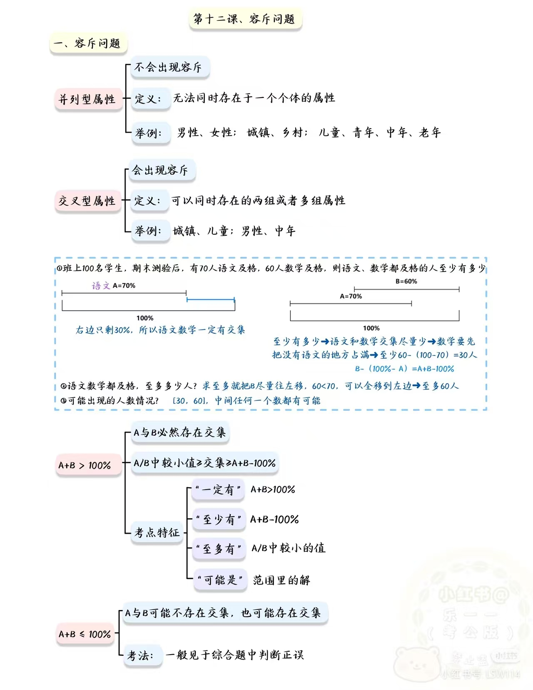
*▲ 图 1：并列型/交叉型属性 + 「至少/至多/可能」三问的直观图解*

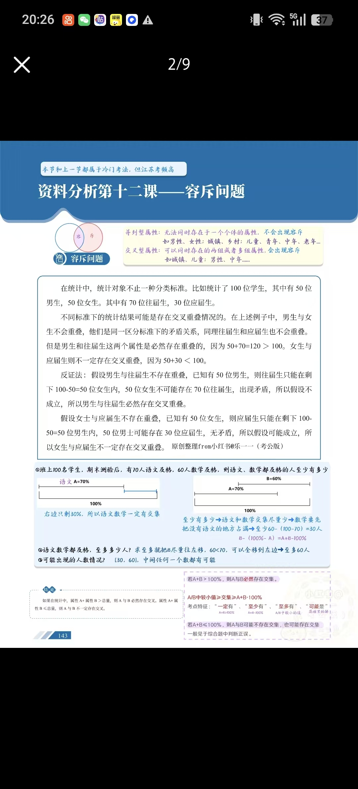
*▲ 图 2：课件原文——反证法推导 + 100 名学生引例的线段图*

---

## 二、交集范围（武器一）

### 2.1 计算公式

> ✅ **两属性**：同时拥有属性 A（a%）与属性 B（b%）的人数占比范围
> **[ a% + b% − 100% ，a% ]**（注：a% ≤ b% 且 a% + b% > 100%）
> 记忆：**A 且 B = A + B − A 或 B 的范围**

> ✅ **三属性**：同时拥有 A（a%）、B（b%）、C（c%）的人数占比范围
> **[ a% + b% + c% − 200% ，a% ]**（注：a% ≤ b% ≤ c%）

### 2.2 原理推导（为什么下限是 a%+b%−100%）

想让属性 A 中「也具有 B」的人尽量少 → 让 B 尽量放在 A 以外的部分（即 100−a%）。
但因为 a%+b% > 100%，即 b% > 100−a%，A 以外**放不下**所有的 B，
所以至少有 **b% − (100−a%) = a%+b%−100%** 的 B 必须落在 A 范围内。

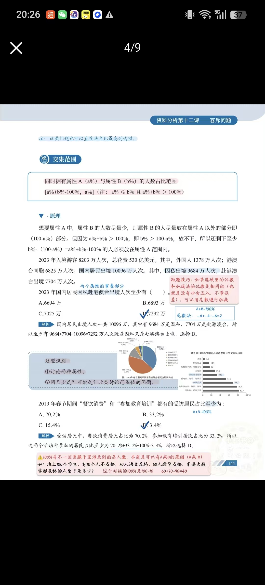
*▲ 图 3：公式框 + 原理推导 + 出入境例题（含尾数法批注）+ 题型识别框*

### 2.3 分情况讨论（换分母问法）

设 A、B 为占比（%）：

| 情形 | 在**所有受访者**中，既 A 也 B 的占比 | 在 **A 中**，也 B 的人的占比 |
| --- | --- | --- |
| **A > B** | 至少 A+B−100%，至多为 **B** | 至少 (A+B−100%)/A，至多为 **B/A** |
| **A < B** | 至少 A+B−100%，至多为 **A** | 至少 (A+B−100%)/A，至多为 **100%** |

### 2.4 考点特征速查（A+B > 100% 时）

| 题干字眼 | 对应结论 |
| --- | --- |
| 「一定有」 | A+B > 100% → 必然存在交集 |
| 「至少有」 | A+B−100% |
| 「至多有」 | A/B 中**较小的值** |
| 「可能是」 | 范围 [A+B−100%, 较小值] 里的解 |

> ⚠️ **100% 不一定是题干里涉及的总人数！** 本质是「可以有 A 或 B 的范围」（A∪B）。
> **例**：班上 100 个学生，10 人不及格，70 人语文及格，60 人数学及格，求语文数学都及格的人至少是多少？
> → 此时的 100% 是 100−10 = **90**（只有及格的人才谈得上"都及格"），**60+70−90 = 40 人**。

### 2.5 经典引例（务必吃透）

班上 100 名学生，期末测验后，70 人语文及格，60 人数学及格：

1. **都及格至少多少人？** → 交集尽量少 → 数学先把"没有语文"的地方占满 → **60 − (100−70) = 30 人**
   （即 B − (100%−A) = A+B−100%）
2. **至多多少人？** → 把 B 尽量往左移，60 < 70 可以全移到左边 → **至多 60 人**
3. **可能出现的人数情况？** → **[30, 60]，中间任何一个数都有可能**

---

## 三、交集范围 · 典型例题

### 📊 背景材料 A：2019 年春节消费调查（例题 1~4 共用）

- **图 2 不同消费项目受访居民占比**：发红包给压岁钱 82.7%、购年俗食品烟酒服饰 78.7%、餐饮消费 70.2%、看电影滑雪逛庙会 53.2%、参加教育培训 33.2%、去旅游 27.9%、购数码产品智能家电 16%、购保健品 14.9%、其他 4.4%
- **图 1 不同消费金额构成（饼图）**：2000 元以下 36.70%、2000-5000 元 42.80%、5000-8000 元 11.50%、8000-11000 元 4.50%、11000 元以上 2.90%、说不清 1.6%

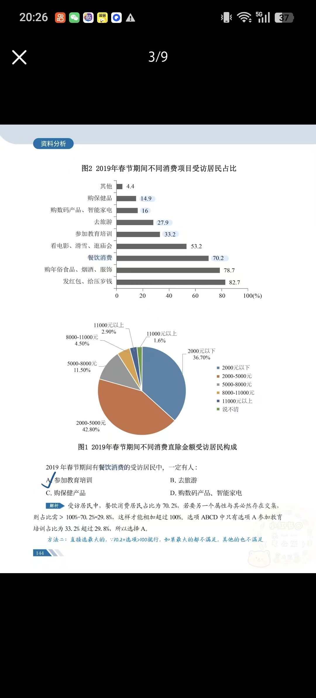
*▲ 图 4：材料原始图表 + 例 1 解析批注*

### 例 1｜"一定有"型

**Q：2019 年春节期间有餐饮消费的受访居民中，一定有人（ ）**
A. 参加教育培训 　B. 去旅游 　C. 购保健产品 　D. 购数码产品、智能家电

> ✅ **解析**：餐饮消费占比 70.2%，若另一属性与其必然存在交集，则该属性占比需 > 100−70.2 = 29.8%（两数相加超过 100%）。选项中只有 A 参加教育培训 33.2% > 29.8%，**选 A**。
> 💡 **技巧**：直接拿占比最大的选项验证，70.2% + 最大项 > 100% 就行；最大的都不满足，其他更不满足。

### 例 2｜"至少有"型

**Q：2019 年春节期间"餐饮消费"和"参加教育培训"都有的受访居民占比至少为（ ）**
A. 70.2% 　B. 33.2% 　C. 15.4% 　D. 3.4%

> ✅ **解析**：70.2% + 33.2% − 100% = **3.4%**，**选 D**。

### 例 3｜换分母型 ⚠️

**Q：2019 年春节期间，在有"餐饮消费"的受访居民中，"参加教育培训"的受访居民占比至少约为（ ）**
A. 33.2% 　B. 14.2% 　C. 4.8% 　D. 3.4%

> ✅ **解析**：占比 = 既餐饮又教培人数 ÷ 参加餐饮消费居民人数。分母固定（70.2% × 总人数），想让占比至少 → 分子最少 → 两活动都参加至少 70.2%+33.2%−100% = 3.4%，
> 占比至少 = 3.4% × 总人数 ÷ (70.2% × 总人数) = 3.4 ÷ 70.2 ≈ **4.8%**，**选 C**。
> ⚠️ **易错点**：「在……的人中」的问法**分母发生了替换**（本题分母不是总受访人数），务必注意！

### 例 4｜换分母 + 饼图材料

**Q：2019 年春节期间消费支出在 2000 元以下的受访居民中，"发红包、给压岁钱"的至少占（ ）**
A. 19.4% 　B. 23.5% 　C. 58.7% 　D. 52.9%

> ✅ **解析**：交集至少 = 36.7% + 82.7% − 100% = 19.4%；
> 占比 = 19.4% ÷ 36.7% ≈ **52.9%**，**选 D**。
> 💡 速算（错位相减）：19.4×3 ≈ 58.2，分母 36.7×3 ≈ 110 → 58.2/110 ≈ 52.9。

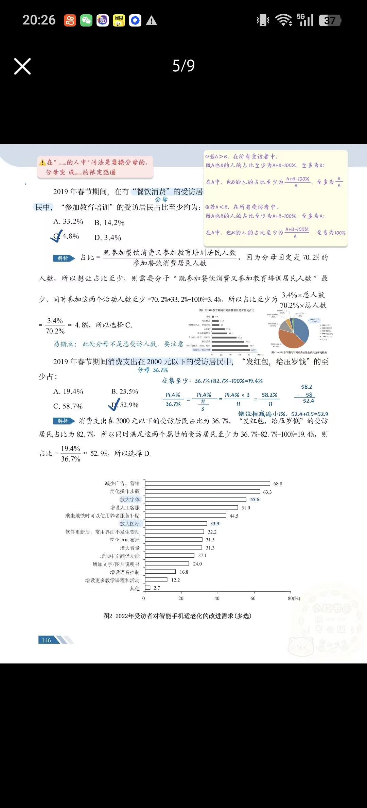
*▲ 图 5：例 3、例 4 完整解析 + 分情况公式贴纸 + 智能手机适老化材料图*

### 📊 背景材料 B：信息安全问卷（例 5 用）

某信息安全机构对 1105 人开展问卷调查（单位 %）：

| | 2012Q1 | 2012Q2 | 2012Q3 | 2012Q4 | 2013Q1 |
| --- | --- | --- | --- | --- | --- |
| 欺诈类 | 74.8 | 71.1 | 71.6 | 75.8 | **68.3** |
| 网站推广类 | 35.3 | 37.0 | 36.6 | 42.9 | **49.3** |
| 病毒类 | 52.7 | 50.0 | 57.9 | 44.5 | 40.1 |
| IT 产品推广类 | 32.2 | 27.1 | 27.1 | 32.1 | 35.3 |
| 教育培训类 | 11.4 | 10.1 | 11.0 | 16.6 | 21.5 |

### 例 5｜"可能是"型

**Q：2013 年第一季度，同时选择"欺诈类"和"网站推广类"的被调查者人数可能是（ ）**
A. 315 　B. 185 　C. 135 　D. 95

> ✅ **解析**：占比范围 = [68.3%+49.3%−100%, 49.3%] = [17.6%, 49.3%]，
> 人数范围 = [1105×17.6%, 1105×49.3%] = **[194, 545]**，只有 A（315）在范围内，**选 A**。
> 💡 **技巧**：同时选两项的占比至多为较小值 49.3%，49.3%×1105 ≈ 545 明显大于所有选项 → 题目问"可能"，直接选最大的 A（A 没超过最大值）。

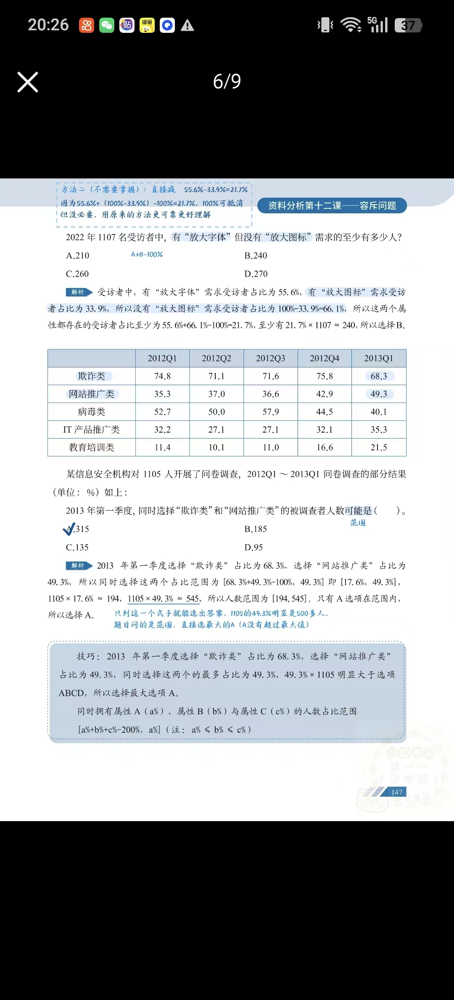
*▲ 图 6：例 5、例 6 解析 + 三属性公式框*

### 例 6｜逆向属性型（2022 智能手机适老化）

材料：图 2 为 2022 年受访者对智能手机适老化的改进需求（多选），其中有"放大字体"需求的占 55.6%，有"放大图标"需求的占 33.9%。

**Q：2022 年 1107 名受访者中，有"放大字体"需求但没有"放大图标"需求的至少有多少人？**
A. 210 　B. 240 　C. 260 　D. 270

> ✅ **解析**：没有"放大图标"需求 = 100% − 33.9% = 66.1%（**逆向构造属性**）；
> 两属性都存在至少 55.6% + 66.1% − 100% = 21.7%，21.7% × 1107 ≈ **240**，**选 B**。
> 📝 附注（方法二，不要求掌握）：直接 55.6% − 33.9% = 21.7%，因为 55.6% + (100%−33.9%) − 100% 中 100% 可抵消；但原方法更可靠、更好理解。

### 例 7｜尾数法（2023 出入境）

2023 年入境游客 8203 万人次，其中外国人 1378 万人次、港澳台同胞 6825 万人次。国内居民出境 10096 万人次，其中因私出境 9684 万人次，赴港澳台出境 7704 万人次。

**Q：2023 年国内居民因私赴港澳台出境人次至少有（ ）**
A. 6694 万 　B. 6893 万 　C. 7025 万 　D. 7292 万

> ✅ **解析**：国内居民出境人次共 10096 万，其中 9684 万因私、7704 万赴港澳台（两个属性的重合部分），
> 至少 9684 + 7704 − 10096 = **7292 万**既是因私又是赴港澳台，**选 D**。
> 💡 **尾数法**：选项尾数不同且不存在四舍五入时，可用尾数加减：4 + 4 − 6 = **2** → 秒选 D。

---

## 四、"铺砖"思维（武器二）

### 4.1 核心定义

> 🧱 统计型问题如同"铺砖头"：统计时从统计对象中收集对应属性"砖头"，分析时再将"砖头"按照要求铺回去。

- **人次** = 各种属性中"砖头"的总数
- **人数** = 铺放"砖头"的格子数
- **人均人次** = 人次和 ÷ 人数

**引例 1**：班上 100 名学生，70 人语文及格、60 人数学及格、50 人英语及格，人均及格多少门？
→ (70+60+50) ÷ 100 = **1.8 门**

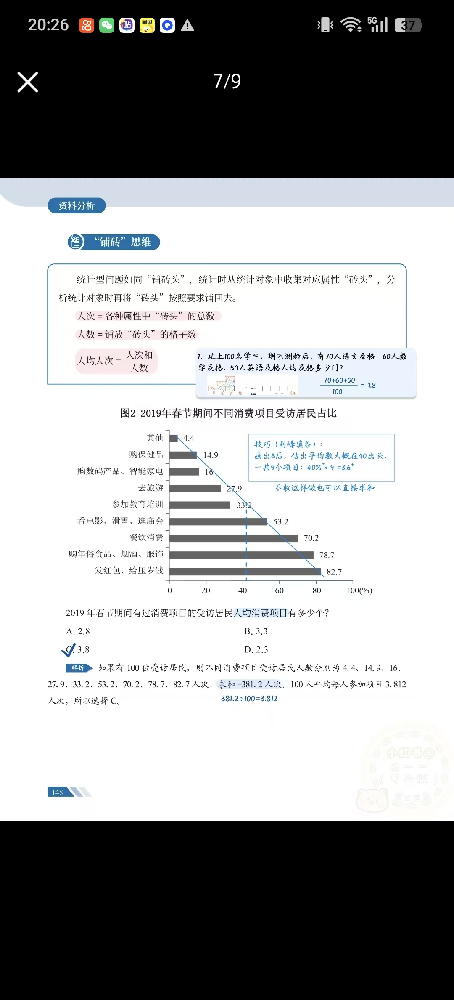
*▲ 图 7：铺砖思维定义 + 人均消费项目例题（含削峰填谷技巧批注）*

### 4.2 复杂容斥问题解题思路（三步）

> 1️⃣ **统计总"砖头"数，确定总"人数"**
> 2️⃣ **按照最低限制分配"砖头"**（先把限制条件铺满）
> 3️⃣ **剩余"砖头"根据至多 / 至少要求尽量发挥**

**引例 2**：班上 100 名学生，70 语文、60 数学、50 英语及格，每人都至少及格 1 门，则至多多少人 3 门都及格？
→ 总人次（总砖头）：70+60+50 = 180；先把第一层（至少及格 1 门）铺满，还剩 180−100 = 80；剩下全分配给及格 3 门的人：80 ÷ (3−1) = **40 人**。

### 4.3 例题精讲

#### 例 8｜人均人次（2019 春节消费项目，材料同背景 A 图 2）

**Q：2019 年春节期间有过消费项目的受访居民人均消费项目有多少个？**
A. 2.8 　B. 3.3 　C. 3.8 　D. 2.3

> ✅ **解析**：假设 100 位受访居民，各项目人次 = 4.4、14.9、16、27.9、33.2、53.2、70.2、78.7、82.7，求和 = **381.2 人次**，381.2 ÷ 100 = 3.812 ≈ **3.8**，**选 C**。
> 💡 **技巧（削峰填谷）**：画出 40 线后估出平均数大概在 40 出头，共 9 个项目：40% × 9 ≈ 3.6，接近 C。（不敢估算也可直接求和）

#### 例 9｜"至多"型（2018 双 11 网购，限选 3 项）

材料：图 1 某市参与 2018 年"双 11"网购的受访者网购原因（限选 3 项）——有实际购物需求 66.1%、优惠力度大 64.5%、宣传力度大 19.3%、商品质量好 12.4%、围人都在"双 11"购物 11.4%、交易过程安全可靠 10.6%、能缓解压力 7.5%、其他 0.6%。

**Q：若所有受访者都至少选择了一项，选择 3 种网购原因的占比至多为（ ）**
A. 30.8% 　B. 46.2% 　C. 64.1% 　D. 66.1%

> ✅ **解析**：假设一共 100 人。
> ① 总人次 = 0.6+7.5+10.6+11.4+12.4+19.3+64.5+66.1 = **192.4 个**
> ② 满足限制条件"每人至少选择 1 项"：剩余 192.4 − 100 = **92.4 个**
> ③ 剩下 92.4 个尽量"堆上"3 项，每人再拿 2 个：92.4 ÷ 2 = **46.2**
> → 至多 46.2% 的人选择 3 种网购原因，**选 B**。

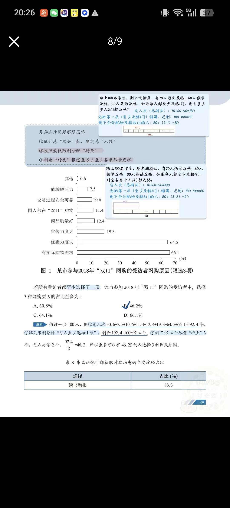
*▲ 图 8：双 11 例题解析 + 引例 2 的铺砖示意图*

#### 例 10｜"至少"型（S 市离退休干部）

材料：表 S 市离退休干部获取时政动态的主要途径占比——读书看报 83.3%、收听广播 76.5%、上网看新闻和视频节目 49.9%。

**Q：三种获取时政动态途径均选择的人占比至少为（ ）**
A. 9.7% 　B. 11.3% 　C. 13.5% 　D. 14.2%

> ✅ **解析**：假设一共 100 人。
> ① 总人次 = 83.3 + 76.5 + 49.9 = **209.7**
> ② 无其他限制条件
> ③ 3 种都选择的尽量少 → 每人都先拿 2 块：209.7 − 2×100 = 9.7，还剩 9.7 个没放完**必须放第 3 层**
> → 至少 **9.7%** 的人选择 3 种途径，**选 A**。
> 📝 变式（绿笔批注）：若题目改问"至多"，则让砖尽量往高处集中、人数少一点 → 9.7 ÷ 2 = **4.85**。

#### 例 11｜带双重限制的综合型（家政服务，压轴难度）

2190 位使用过家政服务居民的类型人次统计：护工护理 100 人次；家庭烹饪 110 人次；保洁 1080 人次；保姆 190 人次；月嫂 190 人次；家电维修、清洗 1020 人次；搬家服务 560 人次；教育服务 400 人次；疏通服务 50 人次；其他 0 人次。调查发现，居民**至多使用过 3 种**家政服务，且使用过 **2 种和 3 种家政服务的居民人数均不少于 100 人**。

**Q：调查使用过家政服务的居民中，使用过 3 种家政服务的居民至多有多少人？**
A. 1510 　B. 1410 　C. 755 　D. 705

> ✅ **解析（官方三步法）**：
> ① 总个数 = 100+110+1080+190+190+1020+560+400+50 = **3700 个**
> ② 满足限制条件：2190 位居民均使用过 → 每人先铺 1 块，剩 3700 − 2190 = **1510 个**；
> 使用过 2 种的不少于 100 人 → 1510 − 100×(2−1) = **1410 个**
> ③ 剩下 1410 个尽量堆到 3 层：1410 ÷ 2 = **705**，至多 705 位，**选 D**。
>
> 📝 **手写验算（另一种拆法，结果一致）**：剩 1510 块后，扣除 2 种保底的 100 人（每人 1 块）→ 1510−100 = 1410；再扣除 3 种保底的 100 人（每人 2 块）→ 1410−100×2 = 1210 块自由发挥；1210 ÷ 2 = 605 人；3 层一共 100 + 605 = **705 人**。

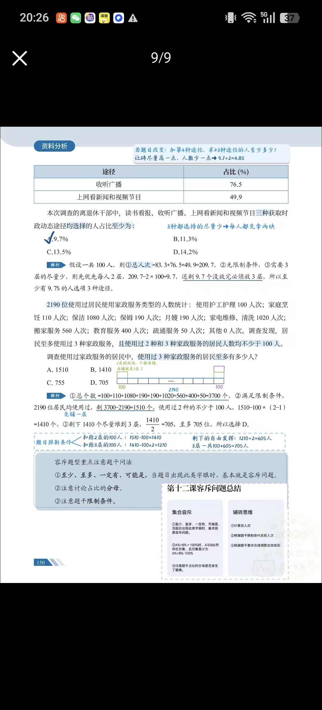
*▲ 图 9：例 10、例 11 解析 + 手写验算 + 容斥题型注意问法框 + 全课总结卡片*

---

## 五、两大武器的区别与联系

| 维度 | 交集范围 | 铺砖思维 |
| --- | --- | --- |
| **研究对象** | 两种（或三种）属性的**交叉占比** | 多种属性人次在人数上的**分配** |
| **典型问法** | 占比/人数的至少、至多、可能范围 | 人均几项、选满 N 项的至多/至少占比或人数 |
| **核心公式** | [A+B−100%, 较小值]（三属性减 200%） | 人均人次 = 人次和 ÷ 人数 |
| **关键动作** | 把 B 往 A 外"推"（求少）或往 A 内"移"（求多） | 先按最低限制铺满，再把剩余砖头集中堆放 |
| **共同本质** | 都是"总量固定下的极端分配"思想 | 同左——求至少就让重叠尽量少，求至多就让重叠尽量集中 |
| **共同陷阱** | 分母替换、100% 的真实含义 | 题干的限制条件（如"均不少于 100 人"） |

> 🔗 **联系**：两者可视为同一思想的两面——交集范围是"两属性"的快捷公式，铺砖思维是"多属性、多限制"时的通用方法。三属性下限 a%+b%+c%−200% 正是铺砖"每人先铺 2 层"的公式化表达（见例 10）。

---

## 六、易错点与常见误区 ⚠️

- [ ] **分母被替换**：「在……的人中」的问法，分母不是总受访人数，而是限定范围的人数（例 3、例 4）
- [ ] **100% 的真实含义**：100% 不一定是题干总人数，本质是"可以有 A 或 B 的范围"（A∪B）——如 100 个学生中 10 人不及格时，及格问题的 100% 其实是 90
- [ ] **忽略题干限制条件**：如"至多使用过 3 种""2 种和 3 种均不少于 100 人"，先用限制条件铺砖头（例 11）
- [ ] **"可能是"≠ 唯一答案**：要先算范围，只有落在 [下限, 上限] 内的选项才可选（例 5）
- [ ] **至多方向搞反**：求至多 3 层的人，是让剩余砖头**集中**堆高层；求至少 3 层的人，是先**均摊**低层再看剩余（例 10 与其变式）
- [ ] **A+B ≤ 100% 的情形**：可能交叉也可能不交叉，**不能**断定必然交叉（综合题判断正误常考）

---

## 七、常用技巧速查

| 技巧 | 适用场景 |
| --- | --- |
| 尾数法 | 选项尾数不同且不存在四舍五入时，用尾数加减秒选（例 7） |
| 选最大项验证 | "一定有"型直接拿占比最大的选项代入验证（例 1） |
| 范围法 | "可能是"型先算占比/人数范围；上限明显大于所有选项时直接选最大（例 5） |
| 削峰填谷 | 多个百分数求和估平均，画基准线速算（例 8） |
| 逆向构造属性 | 求"有 A 但没有 B"，先算"没有 B"= 100%−b%（例 6） |

---

## 八、总结归纳

### 📇 集合容斥（交集范围）

1. 「至少、至多、一定有、可能是」→ 出现此类字眼基本就是容斥问题
2. A% + B% > 100% → A 与 B 必然存在交集，且交集至少为 **A%+B%−100%**，至多为**较小值**
3. 注意题干占比的分母是否发生了替换

### 📇 铺砖思维

1. 计算总人次（总砖头数）
2. 根据题干限制条件优先安排人次（最低限制先铺满）
3. 剩余砖头根据至多 / 至少要求尽量发挥

### 📇 容斥题型三大注意点

> 1. **至少、至多、一定有、可能是**——出现此类字眼，基本就是容斥问题；
> 2. **注意讨论占比的分母**（分母是否被替换成某个子集）；
> 3. **注意题干限制条件**（如"使用 2 种和 3 种服务的居民均不少于 100 人"）。

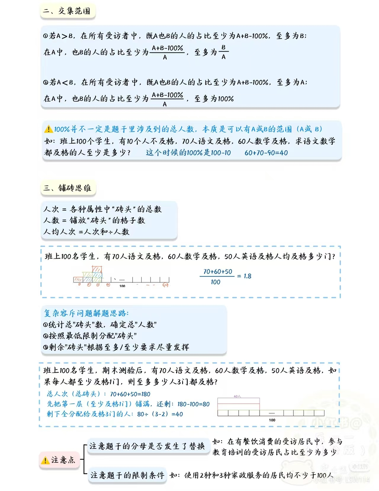
*▲ 图 10：小P 总结卡片——分情况公式 + 铺砖三步法 + 注意点*

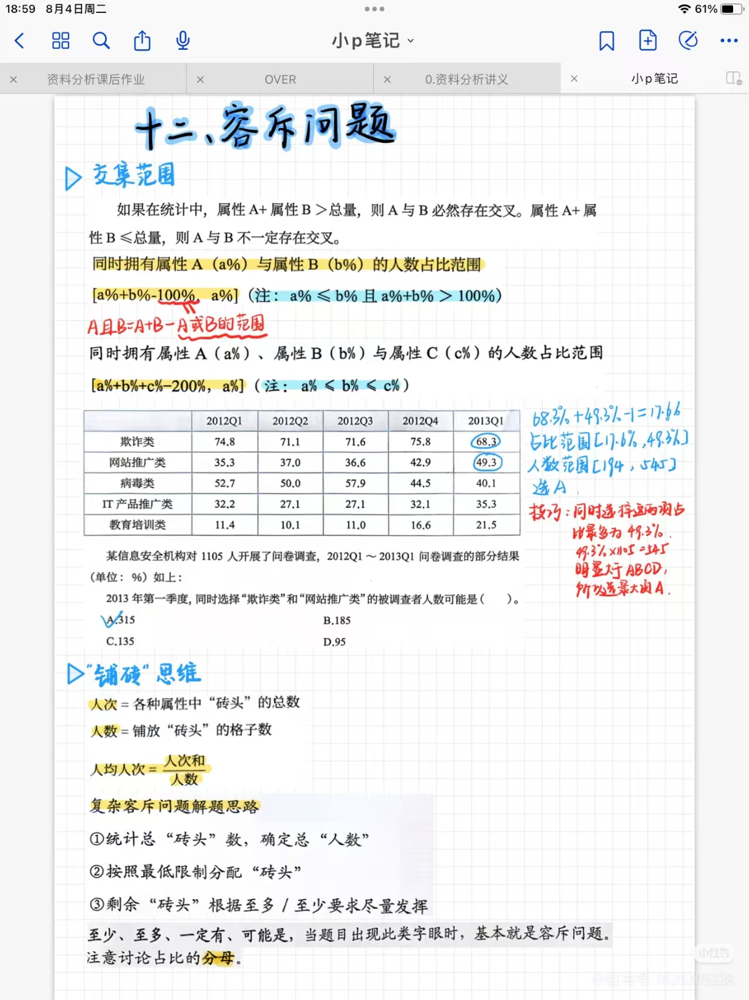
*▲ 图 11：小P 手写笔记第 1 页——交集范围公式 + 信息安全例题批注 + 铺砖思维*

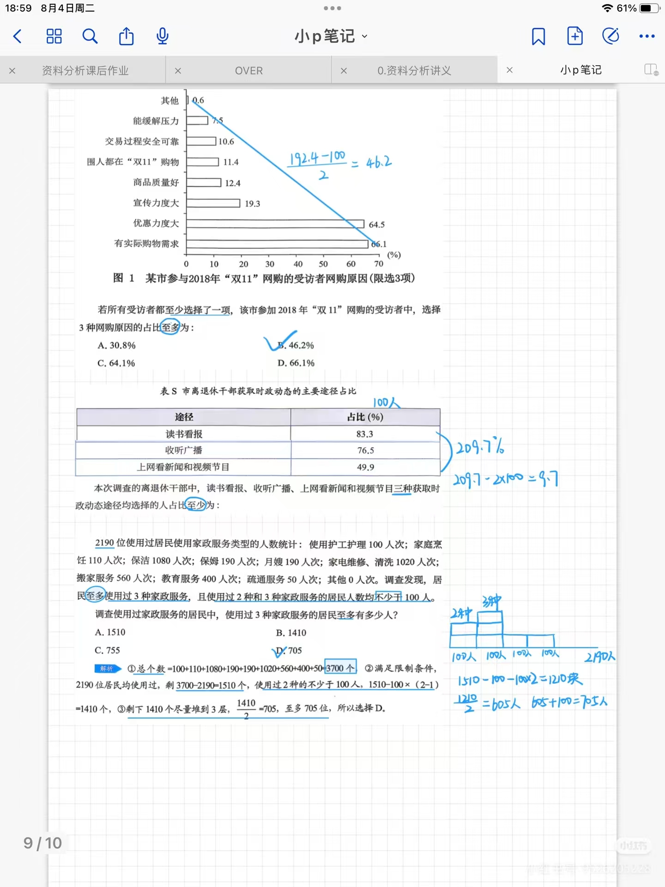
*▲ 图 12：小P 手写笔记第 2 页——双 11 / 离退休干部 / 家政服务三道例题的手写演算*
