# 资料分析总笔记（小P理论体系·完整版）

> 📚 **素材来源**：本篇由两篇小红书笔记合并整理而成——
> 1. 《小p资料分析知识点梳理》（手写课堂笔记 15 页，按「课」组织：第一课~第十一课）
> 2. 《27小p资料分析理论笔记》（框架笔记 7 页，按「章」组织：一~十三）
>
> 两份素材内容高度互补：课堂笔记推导详细、例题丰富；框架笔记体系清晰、配有数字演算示例。本笔记以**章节体系（01~14）为主线**合并去重，与分章笔记文件夹一一对应，可作为全课程的总纲与速查手册。

---

## 🗂️ 全书框架

| 章节 | 主题 | 核心内容 |
|---|---|---|
| 01 | 基本概念 | 四大基本公式、百分点、表头注释单位 |
| 02 | 数据处理与运算分析 | 有效数字、截位误差、加减四技巧 |
| 03 | 放缩运算 | 加/减/除/乘四路放缩、速算小技巧 |
| 04 | 快速估算 | 化除为乘、提前修正、份数法 |
| 05 | 增速的累积与拆分 | 乘积增长率、平均数增长率、基期比 |
| 06 | 拉平增长率 | 基期比较、增量比大小、基期差 |
| 07 | 分式混合 | 线段法三步走、反推精算、累计增速 |
| 08 | 分式比较大小 | 同边四法、差分法、A与非A |
| 09 | 比重特殊问题 | 两期比重差、饼状图、部分量两期差、比重转化 |
| 10 | 年均变化问题 | 年均增量/增速、保持不变、代入验证 |
| 11 | 增长贡献率与拉动增长率 | 两率定义与互化、名义与实际增速 |
| 12 | 容斥问题 | 交集范围公式、铺砖思维、最值容斥 |
| 13 | 假设代入 | 增量验算、均值验算、代入精算 |
| 14 | 易错点总结 | 变化表述、倍数、百分点、单位、词义 |

---

# 01 基本概念

## 1.1 四大基本公式

| 量 | 公式 | 变形 |
|---|---|---|
| 增量 Δ | Δ = 现期 − 基期 | Δ = 基期 × r |
| 增速 r | r = Δ/基期 × 100% = (现期−基期)/基期 × 100% | r = (现期/基期 − 1) × 100% |
| 基期 | 基期 = 现期/(1+r) | 基期 = 现期 − Δ |
| 现期 | 现期 = 基期 + Δ | 现期 = 基期 × (1+r) |

> 💡 **题目提供数据的两种方式**：① 现期 + 增速；② 现期 + 增量。看到题目先判断给的是哪种组合，决定用哪条公式链。

## 1.2 读题三注意

- **注意表头、注释、表格单位！**（单位坑是资料分析第一大坑）
- 讨论自带 % 数据的变化，一般默认讨论**增量**。
- 「…个百分点」= % 数据的**增量**。

## 1.3 绝对值类概念

> ⚠️ **降幅、变化幅度都是增速的绝对值；变化量 = 增量的绝对值。**
> （详细辨析见第 14 章易错点总结）

> 📝 本页要点（笔记2 第1页）：基本概念三注意 → 数据处理（有效数字、截位误差）→ 放缩运算（加法/减法/除法放缩与速算小技巧），是全书的开篇总纲页。

---

# 02 数据处理与运算分析

## 2.1 有效数字与截位误差

- 大多数题目**没有量级坑**，只需看**有效数字**。

| 截位方式 | 误差范围 |
|---|---|
| 截 2 位 | 1% ~ 10% 左右 |
| 截 3 位 | 0.1% ~ 1% 左右 |

> 💡 分母为 1+r 时保留四位；r 很小时分母 1+r 的 r 忽略不计，误差在 r 附近。

## 2.2 误差的表达与控制

- **只有百分比可以准确表达乘除运算结果之间的差距！**
- 一般 10% 以内都算小误差。
- 可以把选项转化成增量，**大胆估算**。
- 乘除计算：数据估算误差 < 最近选项差距比例 ÷ 2（大致估算，5% 为一档）。
- 加减计算：一般保留三位，误差在 0.1% ~ 1% 左右。

## 2.3 加减四技巧（按选项差距选用）

| 技巧 | 适用场景 |
|---|---|
| 截位 | 选项差距很大 |
| 四舍五入 | 选项差距不大 |
| 削峰填谷 | 选项差距较小 |
| 尾数法 | 选项为具体数值，且位数与数据位数相同 |

> 📝 本页要点（笔记1 第3页）：第二课「加减与误差」——误差来源、误差范围、加减四技巧；页末进入第三课「乘除变化」（见第 05 章）。

---

# 03 放缩运算

## 3.1 放缩原理

> 💡 **分式的分子分母等比例变化，不影响计算结果。**
>
> A/B = A×(1+r) / B×(1+r) = (A+A·r) / (B+B·r) = (A+Δ₁) / (B+Δ₂)，其中 Δ₁/Δ₂ = A/B

## 3.2 除法放缩两步走

1. **第一步：减少分母位数** —— 保留整数位，或转化为 1/n 的形式（百化分）。
2. **第二步：调整分子，补偿误差** ——
   - 纵向看：Δ₁/Δ₂ = A/B
   - 横向看：B/Δ₂ = A/Δ₁
   - 横向/纵向哪个倍数明显用哪个。

> 💡 **调整分子数值的两种思路**：
> ① 当 A/B 的近似值明显时，按此近似倍数确定分子取值；
> ② 分母调整量 B·r 与原分母 B 的倍数关系（即 r）较为明显时，按 r 的值对分子进行调整。

## 3.3 四路放缩一览

| 类型 | 方法要点 |
|---|---|
| 加法放缩 | 直接放缩后相加 |
| 平均数计算 | **削峰填谷：找中位数** |
| 减法放缩 | A−B = (A+Δ)−(B+Δ) = (A−Δ)−(B−Δ)（同加同减差不变） |
| 除法放缩 | A/B = (A+Δ₁)/(B+Δ₂)，Δ₁/Δ₂ = A/B |

- 截位示例：1.91→2，1.78→1.8，1.18→2
- 百化分示例：1.23→1.25，1.39→1.43

## 3.4 速算小技巧 ⭐

| 式子 | 技巧 | 说明 |
|---|---|---|
| A/11 | ≈ A×9 = 10A−A（错位相减） | 估算结果偏小 1% |
| A/9 | ≈ A×11 = 10A+A（错位相加） | 估算结果偏小 1% |
| A/nn | = A·n/n = (10A−A)/n | 通用形式 |
| A/5 | = A×2 | 翻倍即可 |

## 3.5 乘法放缩 ⭐

> **A·B ≈ A·B·(1−r²) = A(1+r)·B(1−r) = (A+A·r)(B−B·r)**
>
> 一个因子放大 r，另一个因子缩小 r，乘积只变化 r²（r 小时可忽略）。

- 例：5097 × 5.8% ≈ 5000 × 6% = **300**
- 例：6394 × 4.4% ≈ 7000 × 4% = **280**

> ⚠️ 一定要**小幅调整**，防止误差过大！无需过度追求加减比例相等。

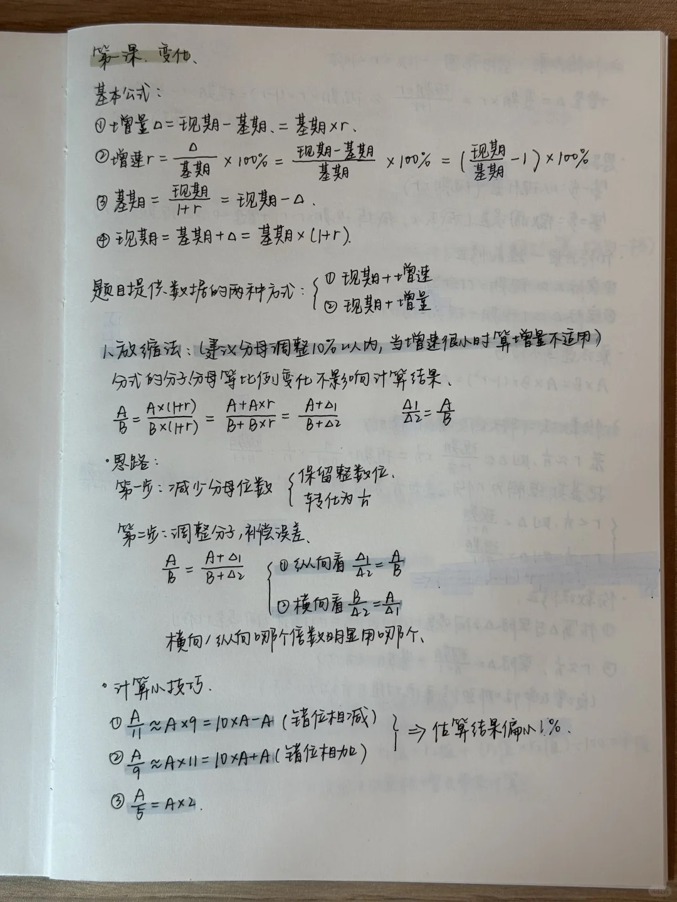

> 📝 本页要点（笔记1 第1页）：第一课「变化」——四大基本公式 → 放缩法原理与两步思路 → 速算小技巧。

---

# 04 快速估算

## 4.1 化除为乘（适用范围：−10% < r < 10%）

> **增量 Δ = 基期×r = 现期×r/(1+r) ≈ 现期×r×(1−r) = 现期×r − 现期×r×r**
> （比实际增量 Δ 略小）

**推导**：Δ = 现·r/(1+r) = 现·r·(1−r) / (1+r)(1−r) = 现·r·(1−r)/(1−r²) ≈ 现·r·(1−r)

> 💡 当 −10% ≤ r ≤ 10% 时，0.99 ≤ 1−r² ≤ 1，可近似看作 1。当 r 比较小、现和基差距小时，先以现代替基，快速估出 Δ 范围。

**思路两步**：
1. 第一步：以现代基（现期 × r）
2. 第二步：微调误差 —— 增速 > 0，减掉 现期×r×r；增速 < 0，加上 现期×r×r（变大变小指绝对值大小）

## 4.2 化除为乘 · 提前修正

| 修正方式 | 公式 |
|---|---|
| 增速微调 | 实际 Δ ≈ 现期 × (r − r²) |
| 现期微调 | 实际 Δ ≈ (现期 − 现期×r) × r |

> 💡 同时微调：一部分不足以修正，另一部分可以一起修正取整。

### 例题 1（增速微调）

> 现期 = 21754，r = 2.04%
>
> Δ = 21754/(1+2.04%) × 2.04% ≈ 21754 × (1−2.04%) × 2.04% = 21754 × (2.04% − 2.04%×2.04%) ≈ 21754 × 2% ≈ **435.08**

### 例题 2（现期微调）

> 现期 = 2116，r = 5.1%
>
> Δ = (2116 − 2116×5.1%) × 5.1% ≈ 2000 × 5.1% = **102**

## 4.3 份数思想

> **若 r ≈ 1/n，则 Δ ≈ 现期/(n+1)**

**原理**：把基期理解为 n 份，增速为 1/n 就是增加了一份、变为 (n+1) 份，所以 Δ = 现期/(n+1)。

- r < 1/n，则 Δ < 现期/(n+1)；r > 1/n，则 Δ > 现期/(n+1)。
- 百化分注记：aa.a% → a/9（如 11.1%→1/9，22.2%→2/9）

## 4.4 份数法修正

1. 估算 Δ 与实际 Δ 之间的误差比例，近似为两个增速之间的误差比例：r : 1/n = 估算Δ : 实际Δ
2. r ≈ 1/n 时：**实际 Δ ≈ 现期/(n+1) − 基期×(1/n − r)**
   （负增长率往哪边修，看绝对值与 1/n 的大小关系）

### 例题 3（份数法 + 修正）

> 现期 = 80.1，r = 15.4% ≈ 1/7
>
> 估算 Δ = 80.1 ÷ 8 ≈ 10
>
> 实际 Δ = 10 + (80.1−10) × (15.4%−14.3%) = 10 + 70 × 1.1% ≈ **10.77**

## 4.5 利用增量大小关系微调（提前修正）

> **原理**：现期 A 增速 r，现期 B 增速 1/n。若 A : B ≈ 1/n : r，且 1/n 与 r 差距较小，则 现期比 ≈ 基期比 ≈ 增速反比，两者增量 = 基期×增速 基本一致。
>
> 因此可以把 r 百化分后，用 B 的增量代替 A 的增量。

**步骤**：① 将 r 转化为靠近的百化分增速；② 现期对应放大或缩小弥补误差。

### 例题 4

> 现期 = 27.9，r = 12.8% → 修正为 28.6、12.5%（=1/8）
>
> Δ = 28.6/9 ≈ **3.15**

## 4.6 乘法速算小技巧

> A×B ≈ A×B×(1−r²) = A×(1+r) × B×(1−r) = (A+A×r)×(B−B×r)

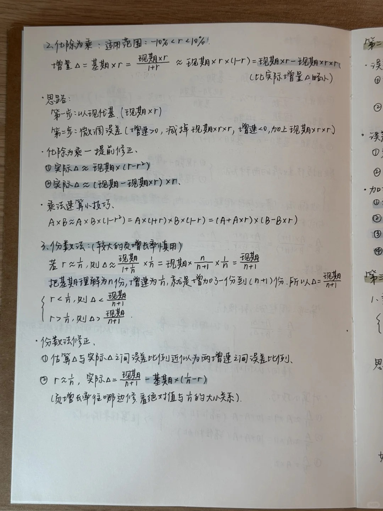

> 📝 本页要点（笔记1 第2页）：化除为乘的公式推导与微调思路 → 提前修正两式 → 乘法速算 → 份数法原理与修正。

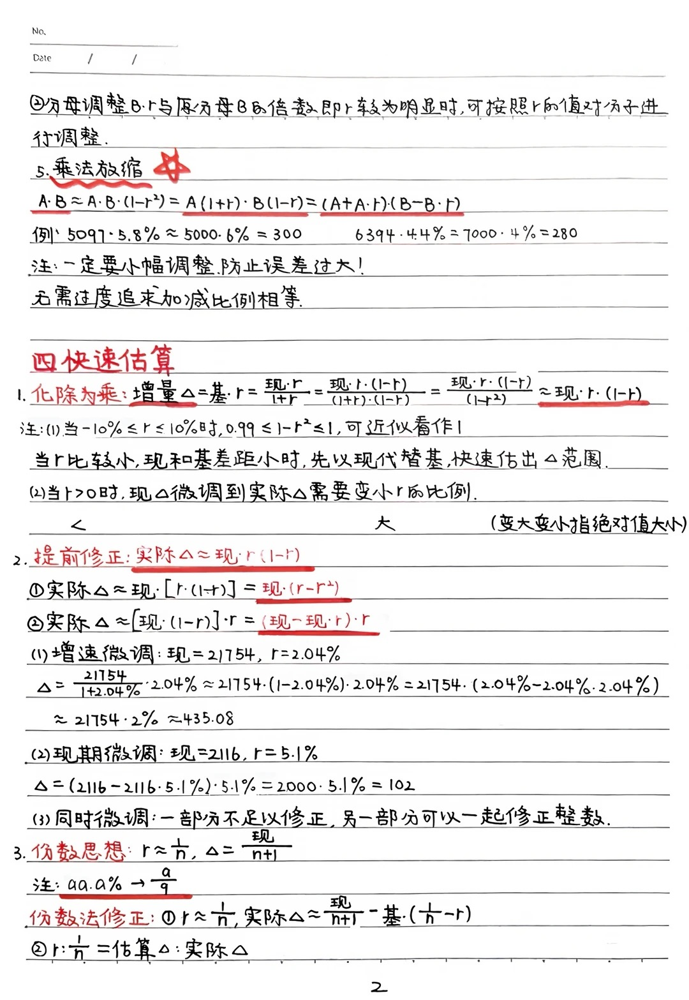

> 📝 本页要点（笔记2 第2页）：乘法放缩星标重点（5097×5.8%、6394×4.4% 两例）→ 化除为乘完整推导 → 提前修正的增速微调/现期微调演算（21754、2116 两例）→ 份数思想。

---

# 05 增速的累积与拆分

## 5.1 乘积增长率（间隔增长率）

> **目的：将两次变化并为一次变化。**
>
> **r = r₁ + r₂ + r₁×r₂**

| 情景 | 模型 |
|---|---|
| 情景 1 | A = B × C（因素增速合成乘积增速） |
| 情景 2 | A₂ = A₀×(1+r₁)×(1+r₂)（间隔增长率：知道两段连续时间增速 → 计算总时间增速） |

**思路**：
1. 第一步：先看主体 r₁ + r₂
2. 第二步：加上 r₁×r₂ 进行微调
   - 增速同正、同负 → 整体提高（指绝对值）
   - 增速一正一负 → 整体下降（指绝对值）
   - r₁×r₂ 计算时统一省去百分号：r值 = r₁值 + r₂值 + (r₁值×r₂值)÷100

> 💡 如果一个对象发生 3 次变化，可以使用 2 次乘积增长率来计算。

## 5.2 平均数增长率

> **r = (r₁ − r₂) / (1 + r₂)**

| 情景 | 说明 |
|---|---|
| 情景 1：A = B/C | 例：均价 = 销售额/销量。设均价增速为 r，销售额增速为 r₁，销量增速为 r₂，则 r = (r₁−r₂)/(1+r₂) |
| 情景 2：总时段 = 时段1 + 时段2 | 例：现期比时间点1增长了 r₁，比时间点2增长了 r₂（时间点1在时间点2之前），时间点2相比时间点1的增速为 r，则 r = (r₁−r₂)/(1+r₂) |

> 💡 拆分方向：总增速为 r、部分增速为 r₁ → 另一部分增速 r₂ = (r−r₁)/(1+r₁)。

## 5.3 现期比与基期比的关系

- 比值的增速 r = (r₁−r₂)/(1+r₂)
- 当 r分子 > r分母，比值提高；当 r分子 < r分母，比值下降。

## 5.4 基期比（基期平均数）

> 基期 = 现期/(1+r) ⟹ **基期比 = 现期比 / (1 + r̄)**，其中 r̄ = (r₁−r₂)/(1+r₂)

### 特殊考法：基期环比增速

> **环比倍数增速 = (后一个月同比增速 − 前一个月同比增速) / (1 + 前一个月同比增速)**

**结论**：
- 当月同比增速 > 上月同比增速 ⟹ 当月环比增速同比**提高**
- 当月同比增速 < 上月同比增速 ⟹ 当月环比增速同比**下降**

**原理**：1 + 环比增速 = 后一个月/前一个月；(1+环比增速) 的同比增速 = (后一月同比增速−前一月同比增速)/(1+前一月同比增速)；同比增速下降 ⟹ 环比增速低于上年同期。

## 5.5 平均数增量计算

1. 现期 A/B，r = (r₁−r₂)/(1+r₂) ⟹ **平均数增量 = A/B × (r₁−r₂)/(1+r₁)**
2. 现期、基期作差。

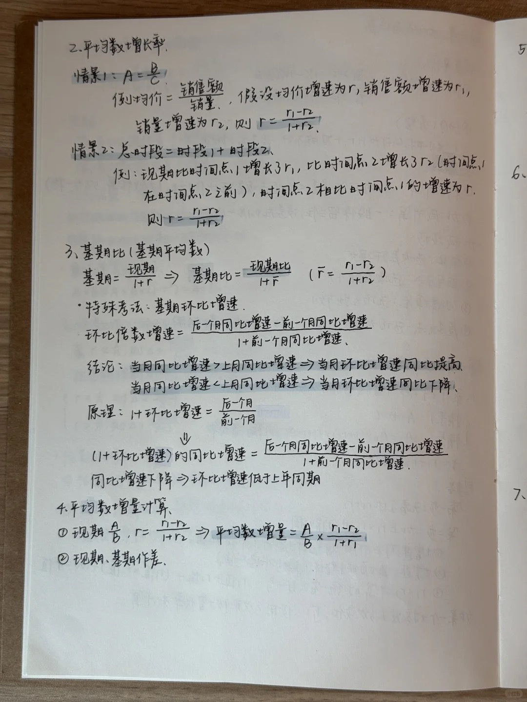

> 📝 本页要点（笔记1 第4页）：平均数增长率两情景 → 基期比公式 → 基期环比增速特殊考法（含推导）→ 平均数增量计算。

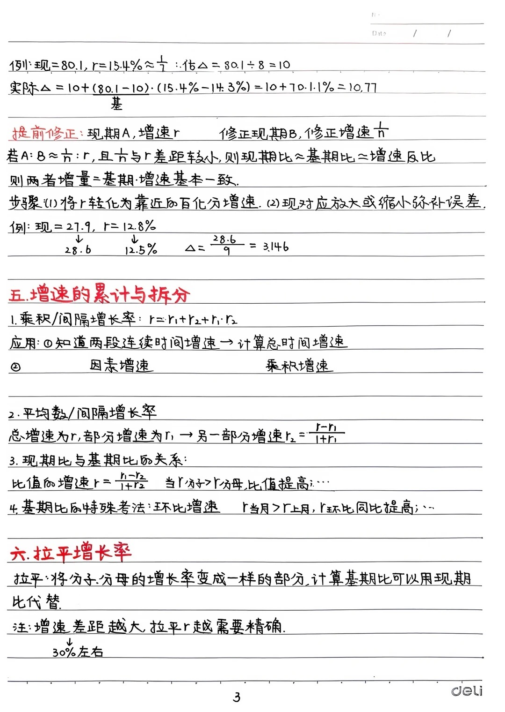

> 📝 本页要点（笔记2 第3页）：份数法修正例题（80.1/15.4%）→ 利用增量关系的提前修正（27.9/12.8%）→ 五、增速的累计与拆分（乘积/平均数增长率、现期比与基期比）→ 六、拉平增长率引入。

---

# 06 拉平增长率

## 6.1 拉平思想

> **拉平：将分子、分母的增长率变成一样的部分，计算基期比可以用现期比代替。**

> ⚠️ 增速差距越大，拉平 r 越需要精确（30% 左右就要小心）。

## 6.2 基期比较大小

| 情景 | 条件 | 结论 |
|---|---|---|
| 情景 1（不同边） | 现期A > 现期B，rA < rB | 基期A > 基期B（现大 r 小的基期更大） |
| 情景 2（同边） | 现期A > 现期B，rA > rB | 拉平 r 后现期更大者基期更大 |

**情景 2 判别**（拉平增速后基期比 = 现期比）：
- 若 B + B×(rA−rB)/(1+rB) > A，则基期B > 基期A
- 若 B + B×(rA−rB)/(1+rB) < A，则基期B < 基期A

## 6.3 增量比大小

**情景 1：大大则大** —— 现期大且增速大 ⟹ 增量大。
> ⚠️ 同正、同负时：现期、增速绝对值大，增量绝对值大。

**情景 2：现期大者增速小，现期小者增速大（不同边）** —— 比较基期比与增速比谁更大即可：
1. 若现期比 > 增速比 ⟹ 现期大的增量大
2. 若现期补上平均数增长率后 > 增速比 ⟹ 现期大的增量大
3. 若现期补上平均数增长率后 < 增速比 ⟹ 增速大的增量大

**原理**：
> ΔA/ΔB = 基期比 × 增速比 = 现期比 × 增速比 × (1+r̄)
>
> 增速相同时基期比等于现期比，所以给增长率小的补上 (1+r̄)，用拉平后的现期比代替基期比 —— 也就是比较 A(1+r̄)/B 与 rb/ra 的大小。

**情景 3：增量倍数估算**
> ΔA/ΔB = 现期比 × 增速比 × (1 + r̄)

## 6.4 基期差估算 ⭐

> **基期差 = 现期差 − Δ₁ + Δ₂ = 现期差/(1+r差)**

- 线段混合思路：基期差 = A₀−B₀ ⟹ 基期差 + B₀ = A₀（构成混合关系）
- 增量修正思路：基期差(A₀−B₀) = 现期差(A−B) − Δa + Δb

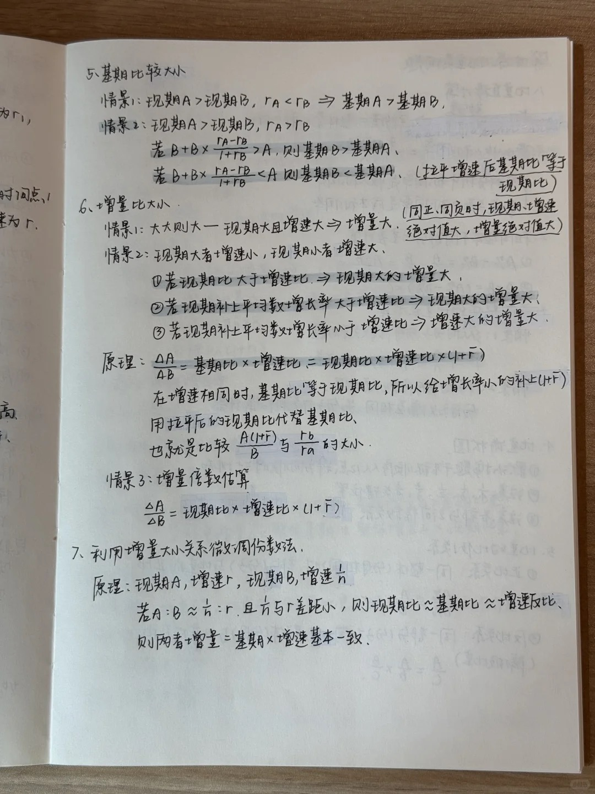

> 📝 本页要点（笔记1 第5页）：基期比较大小两情景 → 增量比大小（大大则大/不同边三判别/原理推导）→ 增量倍数估算 → 利用增量大小关系微调份数法。

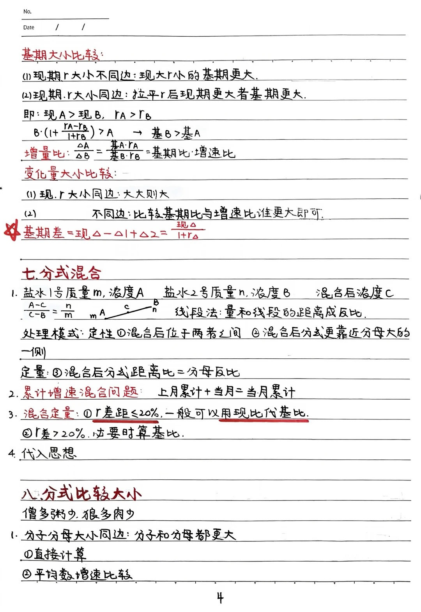

> 📝 本页要点（笔记2 第4页）：基期大小比较两法 → 增量比 = 基期比×增速比 → 变化量大小比较 → 基期差星标公式 → 七、分式混合（盐水模型线段法）→ 八、分式比较大小引入。

---

# 07 分式混合

## 7.1 混合原理

> 分式属性为 a/b 的部分与分式属性为 c/d 的部分，混合后的分式属性为 **(a+c)/(b+d)**。
>
> 两部分分式属性值与混合后分式属性值的**距离比 = 各自分母值的反比**。

**增速混合模型**：上半年基期 m、增速 r₁，下半年基期 n、增速 r₂，全年增速为 r：
> **(r₂ − r) / (r − r₁) = m / n**

**盐水模型**：盐水1号质量 m、浓度 A；盐水2号质量 n、浓度 B；混合后浓度 C：
> **(A−C)/(C−B) = n/m** —— 线段法：量和线段的距离成反比。

## 7.2 分式混合三步走

1. 混合后位于两部分**中间**
2. 更靠近**分母大**的一侧
3. 根据**分母反比**确定线段距离比，确定混合后具体位置

> 💡 一般可用**现期比代替基期比**（除非现期增速差距过大）。
> 混合定量标准：① r 差距 ≤ 20%，一般可以用现比代基比；② r 差 > 20%，必要时算基比。

## 7.3 部分增速混合反推精算步骤

1. 整体/部分：现期比 → 基期比
2. 整体/部分：基期比 − 1 → 另一部分/部分：基期比
3. 增速距离比
4. 另一部分增速

### 例题（反推精算 · 截图详解）

> 主要农产品中，猪牛羊禽肉产量 2.4 万吨，比上年增长 31.5%，其中猪肉产量 2.2 万吨，增长 4%。问 2023 年该市牛羊禽肉产量比 2022 年下降多少？
>
> **解**：基期比 = 2.4/2.2 ×（拉平增长率修正）= 1.09 + 0.07 = 1.16
> → 两部分基期比：牛羊禽肉/猪肉 = 0.16/1 ⇒ 4 : 25
> → 距离比为 25 : 4 → 8.5 × 25/4 ≈ 53
> → 31.5% − 53% = **−21.5%**，即下降 21.5%
>
> （完整手写演算见下方截图）

## 7.4 差值的增速混合

> A − B + B = A ⟹ r(A−B)、rB、rA 构成线段混合。

| 关系 | 转化 |
|---|---|
| 顺差 = 出口额 − 进口额 | 顺差 + 进口额 = 出口额 |
| 逆差 = 进口额 − 出口额 | 逆差 + 出口额 = 进口额 |

## 7.5 累计增速变化

> 当月累计增速与上月累计增速、当月增速构成线段混合关系（上月累计 + 当月 = 当月累计）。

**结论**：只要增速不滑坡，当月就比累计强！
- 累计增速提高 ⟹ 当月增速**高于**之前累计的整体增速
- 累计增速降低 ⟹ 当月增速**低于**之前累计的整体增速

## 7.6 线段混合易错点

> ⚠️ ① 线段距离比 = 分母反比。在增速问题中，分母是**基期**，不是现期！
> ⚠️ ② 分式的分式属性不适用于线段混合关系（如均值的增速）—— 因为对象本身是分式，不满足混合后 (a+c)/(b+d) 的条件。

## 7.7 代入思想

精算困难时，代入选项中的增速值验证混合关系是否成立（详见第 13 章假设代入）。

> 📝 本页要点（笔记1 第8页）：第五课「分式混合」——混合原理与距离比 → 三步走 → 反推精算四步 → 猪牛羊禽肉例题完整演算。

> 📝 本页要点（笔记1 第9页）：差值增速混合（顺差/逆差转化）→ 累计增速混合结论 → 基期差估算 → 线段混合易错点 → 第六课「容斥问题」开篇（交集范围公式，见第 12 章）。

---

# 08 分式比较大小

> 💡 口诀：**僧多粥少，狼多肉少** —— 分子分母同时变大，分式未必变大。

## 8.1 混合型分式比大小

| 模型 | 推论 |
|---|---|
| 现期 = 基期 + 增量 | 增量/现期 越大，增量/基期 越大 |
| 全体 = 男性 + 女性 | 女性人数/全体 越大，女性人数/男性人数 越大 |
| 收入 = 成本 + 利润 | 利润/收入 越大，利润/成本 越大 |

> ⭐ **比较增速大小时，可直接用 增量/现期！**

## 8.2 分式大小分析方法（四法）

### ① 直接计算 / 大致放缩估算

当分式自身比较适合分子分母同方向放缩估算结果时，直接出结果比较大小。

### ② 平均数增速比较（分子分母大小同边）

> 基比 = A₁/B₁，现比 = A₂/B₂，rA = (A₂−A₁)/A₁，rB = (B₂−B₁)/B₁
>
> 若 rA > rB，则 A₂/B₂ > A₁/B₁；若 rA < rB，则 A₂/B₂ < A₁/B₁。

> 💡 若分子分母都相差很远，可以等比例扩大拉近。

### ③ 分式混合比较

> 部分1（A₁/B₁）与部分2（(A₂−A₁)/(B₂−B₁)）混合为整体（A₂/B₂），则**整体在这二者之间**。

### ④ 基准线法

当分式离某个常用且好算的值（如 0.5、1、0.1 等）很近时，可以统一减去这个值，通过**到基准值的距离**判定分式大小关系。

### ⑤ 代入验证法

存在可以快速出结果的分式时，先计算一个，再代入乘另一个分式的分母，与分子比较大小。

### ⑥ 差分法（根据分子、分母变化情况判断整体变化方向）

**(1) 平均数增长率（差分法）**：
> a/b 的分子增长 A−a、分母增长 B−b 后变为 A/B。
> - 若分子增速 > 分母增速，则 A/B > a/b
> - 若分子增速 < 分母增速，则 A/B < a/b

**(2) 分式混合（差分法）**：
> a/b 与 (A−a)/(B−b) 混合成 A/B，则
> a/b < A/B < (A−a)/(B−b)，或 a/b > A/B > (A−a)/(B−b)。

## 8.3 增速大小比较技巧（相邻年份）

> ⭐ 只有**后一年增量比前一年增量高出的比例 ≥ 前一年增速**，后一年增速才能 ≥ 前一年增速。

## 8.4 A 与非 A 型分式比较

> **A/(A+B) → 转化为 A/B 比较**
>
> （A 占整体的比重越大，A 与非 A 的比值越大，单调一致）

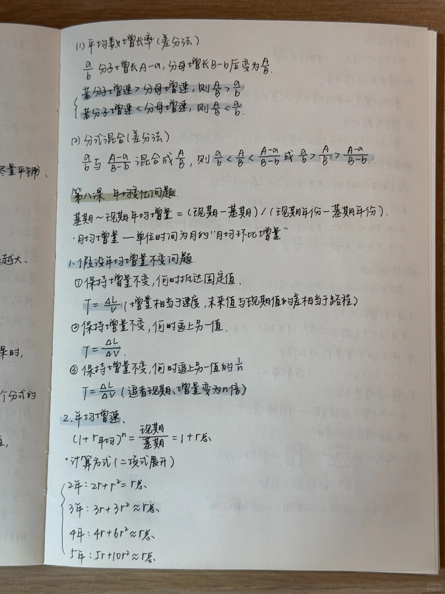

> 📝 本页要点（笔记1 第11页）：差分法两应用（平均数增长率判别、分式混合判别）→ 第八课「年均变化问题」开篇（年均增量、保持增量不变三问题，见第 10 章）。

> 📝 本页要点（笔记2 第5页）：平均数增速比较公式 → 分式混合比较 → 基准线法 → 相邻年份增速比较技巧 → A与非A型 → 九、比重特殊问题开篇（见第 09 章）。

---

# 09 比重特殊问题

## 9.1 比重直接计算

> **占比 = 部分量/整体量 ⟹ 部分量 = 整体量 × 部分占比**

> ⚠️ **利润率辨析**：
> - 营业收入利润率 = 利润额/收入
> - **资料分析中的利润率是收入利润率；数量关系中的利润率是成本利润率！**

## 9.2 相同整体、不同部分的比重差

1. A% − B% = A/C − B/C = **(A−B)/C**
2. A − B = **(A% − B%) × C**

## 9.3 不同整体的比重差计算

| 情景 | 方法 |
|---|---|
| 纵向分子、分母倍数关系明显 | 估算 a/A 与 b/B 的大小再作差 |
| 横向分母倍数关系明显 | 分母放缩至相同，先分子作差再估算结果 |

## 9.4 比重饼状图

1. 各部分**默认按题干名称顺序，从 12 点钟方向顺时针排布**
2. 注意 **1/4、1/3、1/2、2/3、3/4** 关键位置
3. 注意各部分之间的**倍数关系**

## 9.5 比重的比例关系

| 关系 | 条件 | 公式 |
|---|---|---|
| 正比关系 | 同一整体（分母相同）时，部分（分子）与比重成正比 | A%/B% = A/B |
| 反比关系（隔级比重） | 同一部分（分子相同）时，整体（分母）与比重成反比 | A/C = A/B × B/C |

## 9.6 两期比重关系

### ① 两期比重大小关系

> 现期 = 基期 × (1+r)
> - 当比重的增速 > 0（即平均数增长率 > 0），现期比重 > 基期比重，**比重提高**
> - 当比重的增速 < 0（即平均数增长率 < 0），现期比重 < 基期比重，**比重降低**

### ② 基期比重大小计算

> 基期 = 现期/(1+r)（r 为比重的增速）

### ③ 两期比重差 ⭐

> **增量 Δ = (r₁−r₂)/(1+r₁) × 现期比重**（一般来说小于 r₁−r₂）

**三步走**：
1. 算增速差 r₁−r₂，判断比重提高/下降
2. 乘现期比
3. 除以 (1+r₁)

## 9.7 比重的「乘积增长率」

> 部分 = 整体 × 比重 ⟹ **r部分 = r整体 + r比重 + r整体×r比重**

## 9.8 部分量两期差（部分增量问题）

> **部分Δ = 比重Δ × 整体现期 + 整体Δ × 基期比重**
> **部分Δ = 比重Δ × 整体基期 + 整体Δ × 现期比重**

**假设性思维推导**：

| 公式 | 推导 |
|---|---|
| 公式一 | ① 如果比重不变：部分Δ = 整体Δ × 基期比重；② 实际比重变化了：① + 比重Δ × 现期整体 |
| 公式二 | ① 如果基期、现期相等：部分Δ = 比重Δ × 整体基期；② 实际现期变了：① + 整体Δ × 现期比重 |

## 9.9 比重转化问题

> 比重 A%、比重 B%。比重 A 的分子是比重 B 分子的 C%，A% 的分母是 B% 的分母的 D%：
>
> **C% = D% × A%/B%**　　**D% = C% × B%/A%**

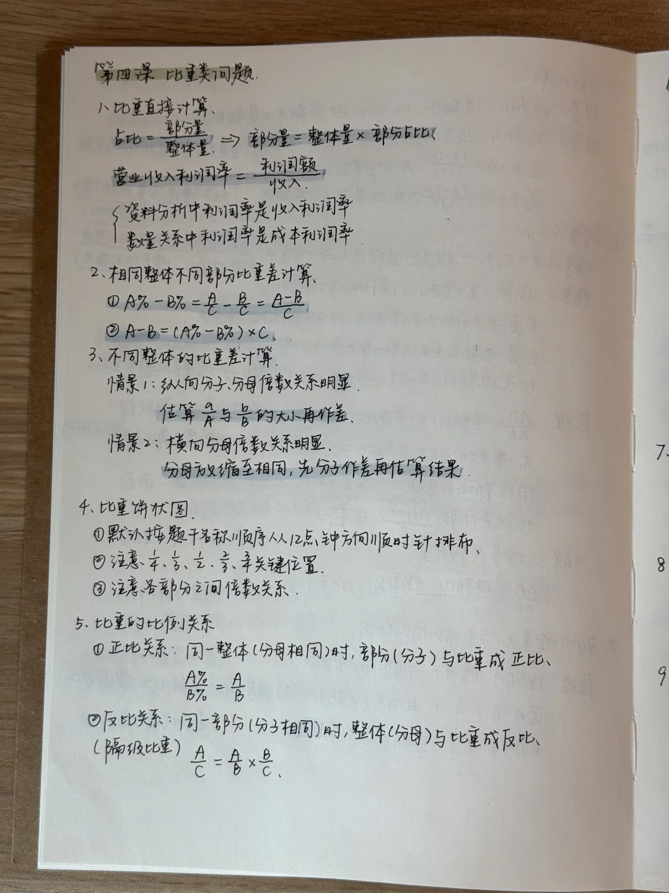

> 📝 本页要点（笔记1 第6页）：第四课「比重类问题」——比重直接计算与利润率辨析 → 相同/不同整体比重差 → 饼状图三要点 → 比重正比/反比关系。

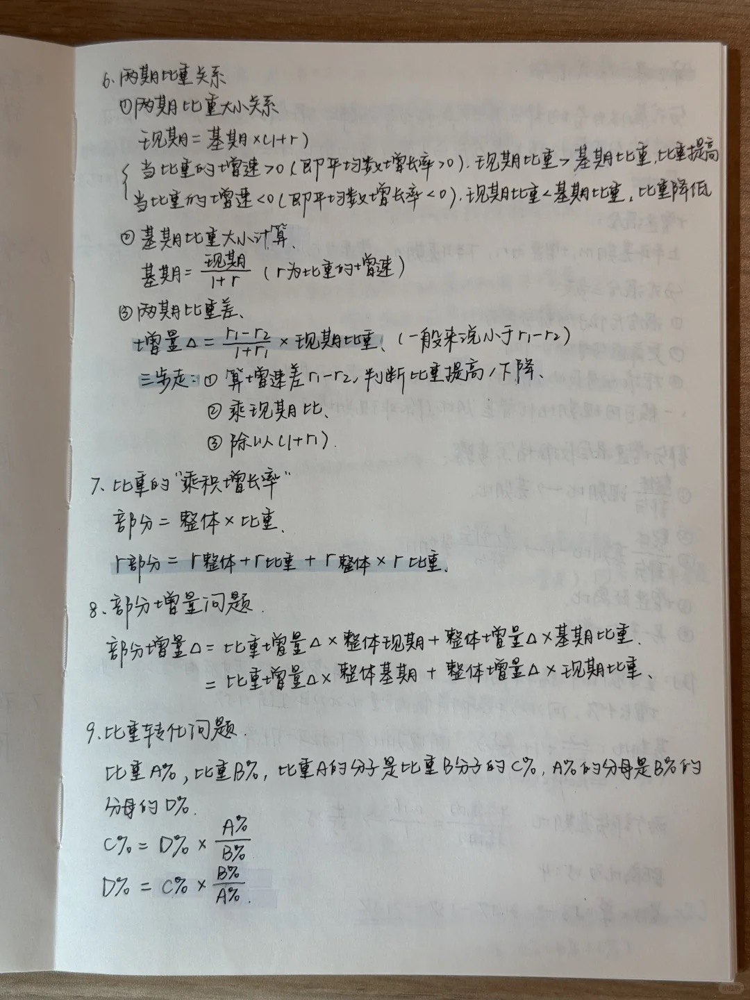

> 📝 本页要点（笔记1 第7页）：两期比重关系（大小判断/基期比重/比重差三步走）→ 比重乘积增长率 → 部分增量问题 → 比重转化问题。

---

# 10 年均变化问题

## 10.1 年均增量

> **基期~现期年均增量 = (现期 − 基期) / (现期年份 − 基期年份)**

- 月均增量：单位时间为月的「月均环比增量」。

> ⚠️ 江苏特色：2011年~2018年，年份差按 (2018−2010)/8，即基期前推一年（年均问题基期要往前算一年）。

## 10.2 保持增量不变问题

| 问题 | 公式 | 说明 |
|---|---|---|
| ① 何时抵达固定值 | T = ΔL/V | 增量相当于速度，未来值与现期值的差相当于路程 |
| ② 何时追上另一值 | T = ΔL/ΔV | 路程差 ÷ 速度差 |
| ③ 何时追上另一值的 1/n | T = ΔL/ΔV | 追者现期、增量变为 n 倍后同② |

## 10.3 年均增速

> **(1 + r年均)ⁿ = 现期/基期 = 1 + r总**

**计算方式（二项式展开）**：

| 年数 | 展开式 |
|---|---|
| 2 年 | 2r + r² = r总 |
| 3 年 | 3r + 3r² ≈ r总 |
| 4 年 | 4r + 6r² ≈ r总 |
| 5 年 | 5r + 10r² ≈ r总 |

### 五种算法

| 方法 | 内容 | 适用 |
|---|---|---|
| ① 最简版 | n×r年均 < r总，**r年均 < r总/n** | 快速放缩定上界 |
| ② 算术平均增长率 | 最低增速 < 年均增长率 < 算术平均增长率 < 最高增速 | 定性卡范围 |
| ③ 假设降次法 | 在 nr < r总 的基础上增加一项 C(n,2)·r² 提高精度 | 精算 |
| ④ 自身微调 | 当 r年均 < 20% 时，**r年均 ≈ r总/n − (r总/n)²** | 精算 |
| ⑤ 代入验证 | 当 r年均 > 20% 时，任何估算误差都较大 → 假设代入，演算 ①乘积增长率 ②倍数次方；选四个选项里偏中间的整数代入 | 高增速 |

### 自身微调的方向判定

| n | 条件 | r年均 与 r总/n − (r总/n)² 的关系 | 计算结果取法 |
|---|---|---|---|
| n=5 | r年均 < 20% | r年均 < r总/n − (r总/n)² | 向下取 |
| n=4 | r年均 < 17%~18% | r年均 < r总/n − (r总/n)²（17% 附近误差为 0） | 向下取 |
| n=3 | — | r年均 > r总/n − (r总/n)² | 向上取 |

> ⚠️ r年均在 [10%, 20%] 时，n=3 和 n=5 的情况下误差会相对大一点，甚至达到 1% 左右；n=4 时误差都很小。

## 10.4 年均增长比大小

> r年均 与 r总 成正比关系：**r总 越大，r年均 越大**（年份差相同时直接比 r总）。

## 10.5 两年年均增速特殊问题

> **r₁ = 2 × r年均 − r₂**（结果偏小）

## 10.6 保持增速不变

1. **一年增速延续多年** —— 间隔增长率（见 5.1）
2. **多年增速延续多年**：
   - 公式一：**远期/现期 = 现期/基期 = 倍数 = 1 + r总** ⟹ 远期 = 现期 × 倍数
   - 公式二：**远期Δ = 现期Δ + 现期Δ × r总**

> 💡 保持增速不变求远期值：① r 较大：现期×(1+r)ⁿ = 远期值；② r 不大：现期 + 增量×(1+r) = 远期值。

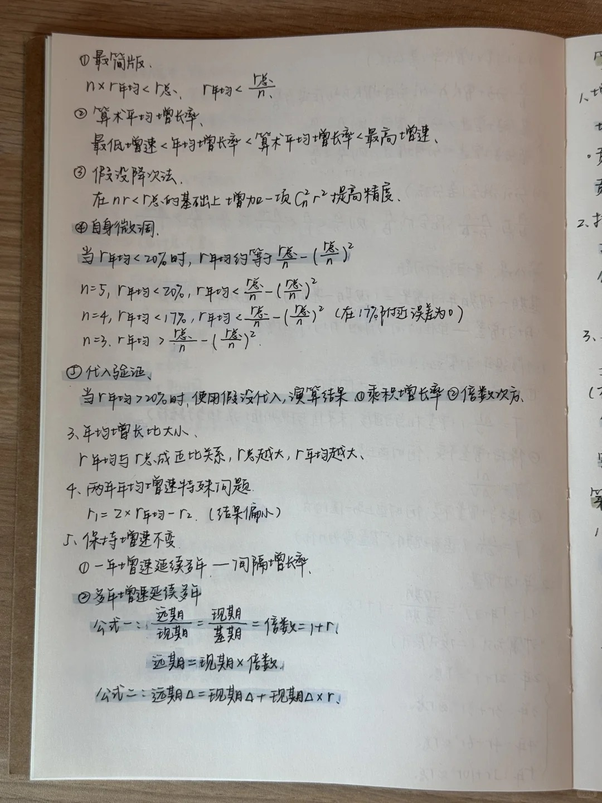

> 📝 本页要点（笔记1 第12页）：年均增速五种算法（最简版/算术平均/假设降次/自身微调/代入验证）→ 年均增长比大小 → 两年年均特殊问题 → 保持增速不变两公式。

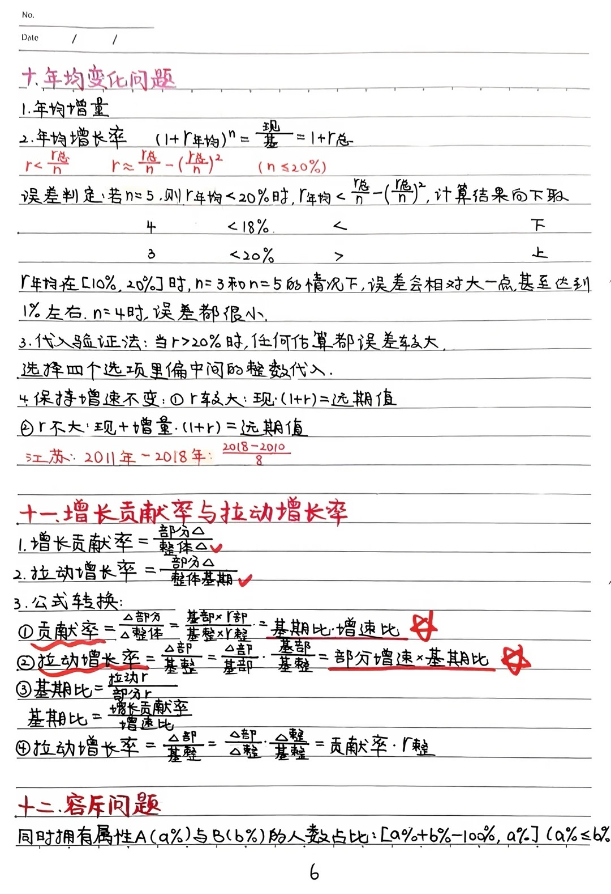

> 📝 本页要点（笔记2 第6页）：十、年均变化问题（年均增量/增速、误差判定表、代入验证、保持增速不变、江苏年份）→ 十一、增长贡献率与拉动增长率（定义与公式转换四条，见第 11 章）→ 十二、容斥问题开篇（见第 12 章）。

---

# 11 增长贡献率与拉动增长率

## 11.1 两大定义

| 概念 | 定义 | 公式 |
|---|---|---|
| 增长贡献率 | 部分增量占**整体增量**的比重 | 增长贡献率 = 部分增量/整体增量 |
| 拉动增长率 | 部分增量占**整体基期**的比重 | 拉动增长率 = 部分增量/整体基期 |

## 11.2 公式转换 ⭐

| 序号 | 公式 | 推导 |
|---|---|---|
| ① | **贡献率 = 基期比 × 增速比** | Δ部分/Δ整体 = (基部×r部)/(基整×r整) |
| ② | **拉动增长率 = 部分增速 × 基期比** | Δ部/基整 = (Δ部/基部)×(基部/基整) |
| ③ | 基期比 = 拉动r/部分r；基期比 = 增长贡献率/增速比 | 由①②反解 |
| ④ | **拉动增长率 = 贡献率 × r整** | Δ部/基整 = (Δ部/Δ整)×(Δ整/基整) |

> 💡 贡献率估算：贡献率 = Δ部分/Δ整体 = 现期比×增速比/(1+平均数增长率) = 基期比 × 增速比。

## 11.3 名义增长率与实际增长率

> **名义现期 = 名义基期 × (1 + 实际增速) × (1 + 价格因素)**（材料中给的现期是名义现期）

| 公式 | 说明 |
|---|---|
| 价格因素 r = (名义增速 − 实际增速)/(1 + 实际增速) | 名义与实际之间的「价格差」 |
| 实际现期 = 名义现期/(1 + r价格因素) | 剔除价格影响 |

> 📝 本页要点（笔记1 第13页）：第九课「增长贡献率与拉动增长」——两定义 → 公式转化 → 名义/实际增长率与价格因素 → 第十课「假设代入思想」开篇（增量验算，见第 13 章）。

---

# 12 容斥问题

## 12.1 交集范围公式 ⭐

> **同时拥有属性 A(a%) 与属性 B(b%) 的人数占比范围：[a% + b% − 100%, a%]**
> （注：a% ≤ b% 且 a% + b% > 100%）

> **同时拥有 A(a%)、B(b%)、C(c%) 的人数占比范围：[a% + b% + c% − 200%, a%]**
> （注：a% ≤ b% ≤ c%）

## 12.2 交集存在性判断

| 条件 | 结论 | 考点特征 |
|---|---|---|
| A + B > 100% | A、B**必然存在交集**（A/B 最小值 ≥ 交集 ≥ A+B−100%） | 「一定有」「至少有」「可能是」 |
| A + B ≤ 100% | A 与 B **可能不存在交集** | 一般见于综合题中判断正误 |

## 12.3 占比的换算（注意分母！）

- 在所有受访者中，既 A 也 B 的人占比**至少**为 A+B−100%，**至多**为 B（B < A 时）
- 在 A 中，也 B 的人占比**至少**为 (A+B−100%)/A，**至多**为 B/A

> ⚠️ 注意占比的分母是「全体」还是「A 中」，题目经常在这里设坑。

## 12.4 铺砖思维

> **人均属性 = 属性和/人数**
>
> - 人次 = 各种属性中「砖头」的总数
> - 人数 = 铺放「砖头」的格子数
> - 人均人次 = 人次和/人数

## 12.5 最值容斥问题 —— 按需「铺砖」

**步骤**：
1. **统计总个数**（统计总「砖头数」，确定总「人数」）
2. **满足最低限制**（按最低限制分配「砖头」）
3. **至多尽量集中，至少尽量平铺**（剩余「砖头」根据至多/至少尽情发挥）

> 📝 本页要点（笔记1 第10页）：既A也B占比的四种问法 → 铺砖思维 → 最值容斥三步骤 → 第七课「分式比大小」开篇（见第 08 章）。

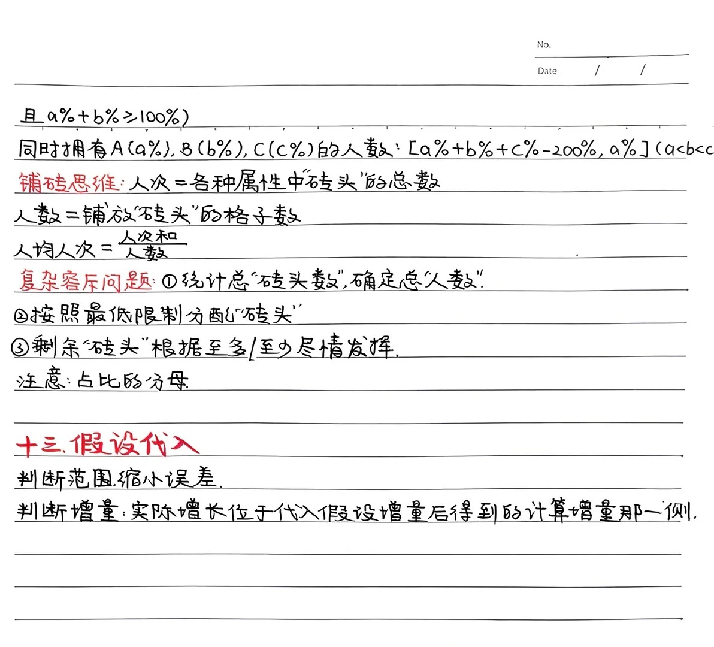

> 📝 本页要点（笔记2 第7页）：三属性交集范围 → 铺砖思维概念辨析（人次/人数/人均人次）→ 复杂容斥三步 → 注意占比分母 → 十三、假设代入（见第 13 章）。

---

# 13 假设代入

## 13.1 增量验算

> **核心规则：实际增量位于「代入假设增量后计算出的增量」那一侧，且更靠近计算值。**

| 情形 | 结论 |
|---|---|
| 若计算增量 < 假设增量 | 则实际增量 < 假设增量 |
| 若计算增量 > 假设增量 | 则实际增量 > 假设增量 |

**完整不等式链**：

| 增量方向 | 条件 | 排序 |
|---|---|---|
| 增量 > 0 | 实际增量 > 假设增量 | 计算增量 > 实际增量 > 假设增量 |
| 增量 > 0 | 实际增量 < 假设增量 | 计算增量 < 实际增量 < 假设增量 |
| 增量 < 0 | 实际增量 > 假设增量 | 实际增量 > 计算增量 > 假设增量 |
| 增量 < 0 | 实际增量 < 假设增量 | 假设增量 > 计算增量 > 实际增量 |

> 💡 作用：**判断范围、缩小误差** —— 判断增量：实际增长位于代入假设增量后得到的计算增量那一侧。

## 13.2 均值验算

> - 假设均值 × 实际分母 < 实际分子 ⟹ 假设均值 < 实际均值
> - 假设均值 × 实际分母 > 实际分子 ⟹ 假设均值 > 实际均值

## 13.3 实际增量 ≈ 代入计算增量

> 借助差距很小的选项确定假设基期，再借助增速将选项误差缩小，得到非常准确的增量。

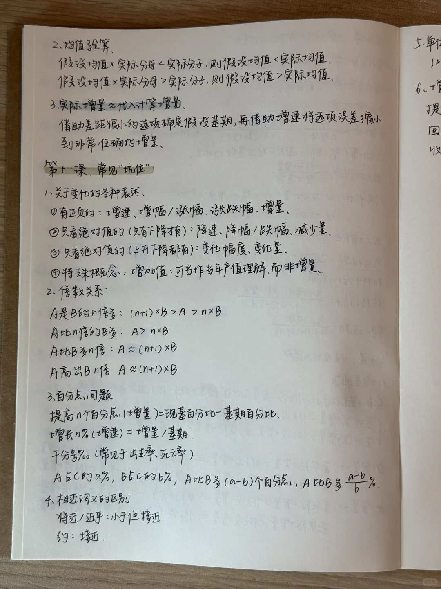

> 📝 本页要点（笔记1 第14页）：均值验算 → 实际增量≈代入计算增量 → 第十一课「常见坑位」开篇（变化表述/倍数关系/百分点/词义，见第 14 章）。

---

# 14 易错点总结（常见「坑位」）

## 14.1 关于变化的各种表述

| 类型 | 概念 | 说明 |
|---|---|---|
| ① 有正负的 | 增速、增幅/涨幅、涨跌幅、增量 | 带符号比较 |
| ② 只看绝对值（只有下降才有） | 降速、降幅/跌幅、减少量 | 绝对值 |
| ③ 只看绝对值（上升下降都有） | 变化幅度、变化量 | 绝对值 |
| ④ 特殊概念 | **增加值** | 可当作**当年产值**理解，而非增量！ |

## 14.2 倍数关系

| 表述 | 含义 |
|---|---|
| A 是 B 的 n 倍多 | (n+1)×B > A > n×B |
| A 比 n 倍的 B 多 | A > n×B |
| A 比 B 多 n 倍 | A ≈ (n+1)×B |
| A 高出 B n 倍 | A ≈ (n+1)×B |

## 14.3 百分点问题

- 提高 n 个百分点（增量）= 现期百分比 − 基期百分比
- 增长 n%（增速）= 增量/基期
- 千分号 ‰（常见于出生率、死亡率）

> ⭐ A 占 C 的 a%，B 占 C 的 b%：**A 比 B 多 (a−b) 个百分点；A 比 B 多 (a−b)/b %**。
> （「个百分点」是差，「%」是相对增速，分母不同！）

## 14.4 相近词义的区别

| 词 | 含义 |
|---|---|
| 将近 / 近乎 | **小于但接近** |
| 约 | 接近（可大可小） |

## 14.5 单位问题

> 1 吨 = 1000 kg；1 公顷 = 15 亩；1 平方千米 = 100 公顷

## 14.6 增速变化描述

| 表述 | 公式 |
|---|---|
| 提高 n 个点 | 现期增速 − 基期增速 = n% |
| 回落 / 下降 n 个点 | 基期增速 − 现期增速 = n% |
| 收窄 n 个点 | 基期增速绝对值 − 现期增速绝对值 = n% |

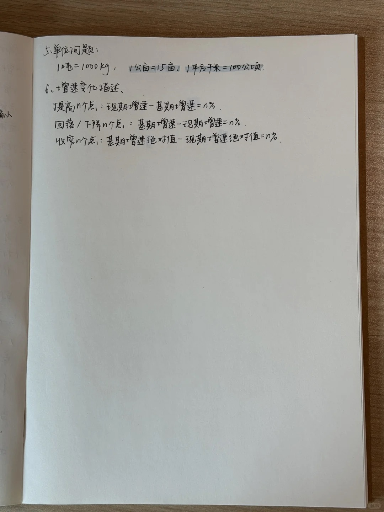

> 📝 本页要点（笔记1 第15页）：单位换算 → 增速变化三种描述（提高/回落/收窄）。坑位前四条（变化表述/倍数/百分点/词义）见第 13 章配图（笔记1 第14页）下半部分。

---

# 📌 附录：核心公式速查表

| 主题 | 公式 |
|---|---|
| 基本关系 | Δ = 现期−基期 = 基期×r；基期 = 现期/(1+r)；现期 = 基期×(1+r) |
| 化除为乘 | Δ ≈ 现期×r×(1−r)（−10%<r<10%） |
| 份数法 | r ≈ 1/n ⟹ Δ ≈ 现期/(n+1) |
| 乘积增长率 | r = r₁ + r₂ + r₁×r₂ |
| 平均数增长率 | r = (r₁−r₂)/(1+r₂) |
| 基期比 | 基期比 = 现期比/(1+r̄)，r̄ = (r₁−r₂)/(1+r₂) |
| 增量比 | ΔA/ΔB = 基期比 × 增速比 = 现期比 × 增速比 × (1+r̄) |
| 基期差 | 基期差 = 现期差 − Δ₁ + Δ₂ = 现期差/(1+r差) |
| 分式混合 | (r₂−r)/(r−r₁) = m/n（距离比 = 分母反比） |
| 两期比重差 | Δ = (r₁−r₂)/(1+r₁) × 现期比重 |
| 部分量两期差 | 部分Δ = 比重Δ×整体现期 + 整体Δ×基期比重 |
| 比重乘积 | r部分 = r整体 + r比重 + r整体×r比重 |
| 年均增速 | (1+r年均)ⁿ = 1+r总；r年均 ≈ r总/n − (r总/n)²（<20%） |
| 增长贡献率 | = 部分增量/整体增量 = 基期比 × 增速比 |
| 拉动增长率 | = 部分增量/整体基期 = 部分增速 × 基期比 = 贡献率 × r整 |
| 容斥交集 | [a%+b%−100%, a%]；三属性 [a%+b%+c%−200%, a%] |
| 假设代入 | 实际增量位于「假设增量代入后的计算增量」那一侧 |

---

> ✅ **使用建议**：本笔记为全课程总纲，覆盖小P资料分析全部理论点。各章更详细的例题演练请配合分章笔记（01~14 文件夹）使用；考前可只看「附录速查表」+ 各章 ⚠️ 易错点。

